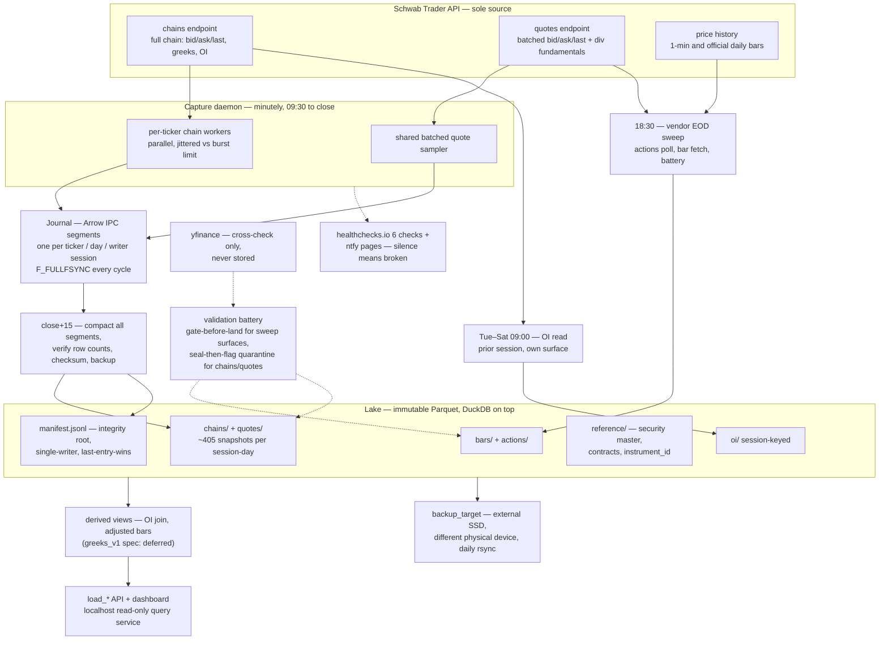

# Marketlake — design

A Schwab-first, capture-driven data lake recording full option chains and equity quotes — bid, ask, last — at one-minute cadence. Starting with SPY and QQQ, generic over any ticker, at zero marginal cost.

Status: DESIGN (2026-08-24). Tickers: SPY, QQQ + an open set. Cadence: 1-min.

## Contents

- [Premise: history you can't buy back](#premise-history-you-cant-buy-back)
- [Source: one vendor, one cross-check](#source-one-vendor-one-cross-check)
- [Auth: the seven-day token, engineered around](#auth-the-seven-day-token-engineered-around)
- [Storage: immutable Parquet, DuckDB on top](#storage-immutable-parquet-duckdb-on-top)
  - [The security master](#the-security-master)
- [Schedule: the capture clock](#schedule-the-capture-clock)
  - [Minutely mechanics](#minutely-mechanics)
  - [Failure handling](#failure-handling)
  - [The dashboard](#the-dashboard)
- [Derived: trust your own greeks](#derived-trust-your-own-greeks)
- [Corporate actions: actions as data, adjustment as a view](#corporate-actions-actions-as-data-adjustment-as-a-view)
  - [Backtesting across corporate actions](#backtesting-across-corporate-actions)
- [Validation: fail closed, quarantine loudly](#validation-fail-closed-quarantine-loudly)
- [Onboarding: any ticker, one command](#onboarding-any-ticker-one-command)
- [Sizing: storage estimates](#sizing-storage-estimates)
- [Deployment: laptop now, dedicated later](#deployment-laptop-now-dedicated-later)
- [Tradeoffs: prices, named](#tradeoffs-prices-named)
- [Build order: four slices](#build-order-four-slices)
- [Appendix: prior art (surveyed 2026-08-25)](#appendix-prior-art-surveyed-2026-08-25)
- [Appendix: verification sources](#appendix-verification-sources)

## Premise: history you can't buy back

Free historical option-chain data with greeks essentially does not exist. Free *forward* capture does: a Schwab brokerage account serves the complete chain — every expiration and strike, with bid/ask, volume, open interest, IV, and engine-computed greeks — in a single real-time API request, at no cost. So the architecture is **capture-first**: the option database begins the day the pipeline turns on and compounds daily from there. Every snapshot not taken is gone forever, which makes capture reliability the design's first-order concern — ahead of query speed, ahead of schema elegance.

The pipeline in one line:

Schwab Trader API → capture jobs (launchd, sequential, resumable) → raw lake (immutable Parquet partitions) → derived layer (greeks, adjustments, OI alignment) → DuckDB + loader API.

Raw stores what the vendor said, verbatim. Everything computed lives downstream and is regenerable.



*The data plane runs left of the battery, the trust machinery right of it: everything Schwab says lands verbatim in journal segments, is sealed immutable at close+15 with its checksum in the manifest, and is judged — never rewritten — by the battery. The control plane (launchd, pmset wakes, the caffeinate assertion, exchange_calendars session times) is omitted here; it schedules every box on the left.*

## Source: one vendor, one cross-check

| Source | Role | Verified limits |
| --- | --- | --- |
| **Schwab Trader API** (the data path) | Chain snapshots (full chain with bid/ask/last, greeks, OI — one request). Batched equity quotes (bid/ask/last for every ticker in one request). Equity bars: 1-min and official daily, fetched forward only — the \~48-day 1-min lookback matters solely as outage recovery. Dividend fields on quotes. | 120 req/min per app; refresh token expires every 7 days, manual browser re-auth only; free with account; real-time only if the account's exchange agreements grant it — asserted at onboarding and watched by the battery, never assumed |
| **yfinance** (cross-check only) | Nightly independent comparison of closes and corporate actions inside the validation battery. Never a data path into the lake — nothing it returns is stored as market data. | Unofficial; free; adequate for a once-a-day comparison |

Everything in the lake is Schwab-sourced, which keeps lineage trivial: one vendor, one auth, one set of quirks. All Schwab figures were re-verified Aug 2026 against maintained client libraries (sources at the end); the official portal gates its docs behind login.

## Auth: the seven-day token, engineered around

Schwab's refresh token dies every 7 days with no programmatic renewal — an interactive browser login is the only reset. The design treats this as a first-class subsystem, not an inconvenience:

- **Sunday-evening re-auth ritual.** Re-login every Sunday (\~1 minute with `schwab-py`, which auto-handles the 30-minute access-token refresh inside the week). The deadline lands on a non-trading day: a token minted Sunday covers the full Mon–Fri week, and a few hours' slip costs nothing because the market is closed.
- **Sunday 20:00 ET canary.** The scheduler makes one throwaway authenticated call after the re-auth window and alerts if it fails — a skipped Sunday is caught with a whole night of slack, not discovered as a hole in Monday's data.
- **Loud mid-week alerting.** Any 401/`invalid_client` during capture pages immediately. Silence is the failure mode: while Schwab is dark, nothing is being recorded.

The token file lives at `~/.config/marketlake/token.json`, `chmod 600` — outside the repo **and outside the synced lake tree**, so the backup sync never touches it. It is a full brokerage credential; the Schwab app is registered with the Market Data product only (the portal offers one or both), so the token cannot place trades even if exfiltrated. Two more auth rules: the re-auth reminder pages (same ntfy channel) **on Sunday only** — it fires until the week's re-login is done, and never mid-week. A full re-login on *any* day still mints a fresh 7-day token, so re-authing Friday evening before a trip covers through the following Friday. A trip that skips the ritual entirely means the token dies mid-week and capture gaps until you're back — an accepted phase-one cost, same family as the laptop being out the door.

## Storage: immutable Parquet, DuckDB on top

Hive-partitioned Parquet with DuckDB as the query engine: columnar (chains compress \~10×), append-friendly, plain SQL from Python, zero server administration.

```text
lake/
  bars/ticker=SPY/freq=1m/date=2026-08-24.parquet    # official trade bars, as-traded
  quotes/ticker=SPY/date=2026-08-24.parquet          # minutely bid/ask/last samples
  chains/ticker=SPY/date=2026-08-24.parquet          # ~405 minutely snapshots (session-length; fewer on half-days), snap_ts column
  journal/date=D/ticker=T/seg-<start_ts>.arrows       # today's open capture: one segment per writer session, compacted at close+15
  reference/security_master.parquet                   # instrument_id <-> ticker/FIGI/OCC symbol, date-ranged
  reference/contracts.parquet                         # instrument_id -> contract terms
  oi/ticker=SPY/session=2026-08-21.parquet            # morning OI read, keyed to the session it describes
  actions/corporate_actions.parquet                   # splits + dividends, all tickers
  manifest.jsonl                                      # partition, source, sha256, rows, fetched_at
```

Two rules make it durable. **Compacted partitions are immutable**: the close+15 compaction job writes each day's partition once, checksummed into the manifest; replacements are atomic or not at all, and only the journal segments — today's not-yet-compacted capture — are ever mutable. **Raw is vendor-verbatim** — including Schwab's greeks and IV, and including the chain-level header fields (`interestRate`, `underlyingPrice`, `dividendYield`), stored as columns on the chains rows — so bad vendor data is diagnosable forever rather than silently laundered.

**Manifest protocol** — the manifest is the integrity root, so its own rules are explicit. (1) *Single writer:* only the serialized daily jobs (compaction, the vendor sweep, the morning OI read) append to `manifest.jsonl`; capture workers write journals only. (2) *Atomic appends:* one entry = one line via a single `O_APPEND` write; readers and the scrub discard a torn trailing line, the same rule as a torn journal tail. (3) *Last entry wins*, keyed by partition path — which makes the sanctioned compaction re-run harmless by construction (a re-run legitimately appends a second entry, and its sha256 legitimately differs after a library upgrade, since Parquet footers embed the writer version; the scrub verifies only the last entry per partition). (4) *Two-way scrub:* Sunday's scrub checks both directions — every entry's file exists and matches its last sha, **and** every lake file has a manifest entry. The reverse pass is what catches a crash between a partition write and its manifest append, which for the journal-less surfaces (`bars/`, `actions/`, `oi/`) would otherwise be a permanently invisible orphan.

### The security master

Every symbol the market uses is mutable: tickers change (FB→META; the Nasdaq-100 ETF itself traded as QQQQ until 2011), and even OCC option symbols are reissued when the OCC adjusts contracts after a corporate action. So no external symbol is the primary key. The **security master** — the standard reference-data table for exactly this problem — assigns every instrument an internal `instrument_id` that never changes, and maps it to external identifiers with validity date ranges: ticker, [FIGI](https://www.openfigi.com/) (the one globally-standard security identifier that's free and openly licensed — CUSIP and ISIN are paid), and OCC symbol for contracts.

Raw rows store the vendor's symbol verbatim (raw is vendor-verbatim, always); the derived layer resolves symbols through the master as-of the row's date, and all joins run on `instrument_id`. A rename or an OCC re-symboling then adds a mapping row instead of orphaning history — the same instrument threads through under one key. Partition paths keep human-readable tickers purely as a filing convention; identity lives in the master, not the path.

CUSIP and ISIN are deliberately excluded from the master. Schwab's equity payloads include a CUSIP, and it stays in the raw rows under the vendor-verbatim rule — but it is never promoted to a join key and never published: CUSIP is licensed IP (ABA-owned, FactSet-operated), building a database keyed on it is the use its operator charges for, and a US ISIN embeds the CUSIP (`US` + CUSIP + check digit) so it inherits the problem while adding no information. Nothing in the lake may depend on an identifier that would owe fees to redistribute.

## Schedule: the capture clock

All jobs run from launchd/cron on the Mac, resumable, fail-closed to quarantine. **All intraday times are session-relative**, derived per day from `exchange_calendars`: *close* means the day's option close — session close + 15 minutes for these ETFs, so 16:15 on regular days and 13:15 on the 2–3 early-close days a year (day after Thanksgiving, Christmas Eve). The table shows regular-session times; nothing keys on a wall-clock 16:15. **Full holidays are the same mechanism one step further**: a holiday is simply not a session, so the loop never starts, there is no close to tag, and compaction and the sweep no-op on an empty journal — no gap rows, because a gap means "market open, capture missing." (Good Friday is why the library matters: a market holiday that is not a federal holiday.) Three holiday wrinkles are pinned: on a non-session day the daemon keeps sending dead-man pings *at the normal cadence*, tagged "market closed per calendar" in the ping body — healthchecks.io is a pure countdown timer with no content awareness, so the only way to not false-page every holiday while keeping silence-means-broken true around the clock is to keep the timer fed (the pause API was considered and rejected: a paused check that never receives its resume ping stays silent forever, removing the safety net exactly when nobody is looking). The ping's meaning is calendar-deterministic: on session days, a durable capture cycle; on non-session days, a daemon that is healthy and *correctly* idle; the inverse case, an **unscheduled closure** the static calendar can't know about, is guarded by the first cycle's vendor quote-time — not same-day fresh means the day is flagged *suspected unscheduled closure* rather than captured and trusted; and the morning OI read keys on "sessions not yet OI-read" rather than "yesterday," so the Tuesday after a Monday holiday resolves to Friday, finds it already covered by Saturday's read, and skips harmlessly. The dashboard renders non-session days as *no session*, never 0%. One provenance fact governs all of this: `exchange_calendars` is rules-plus-exceptions *source code*, not a feed — it learns about schedule changes only through package releases, so the Sunday maintenance run checks it for updates, and calendar errors get guards in **both** directions: says-open-but-closed is the freshness check above, and says-closed-but-open — the worse failure, a stale calendar idling the daemon through a real session — is caught by a single 09:35 probe quote on every weekday the calendar calls closed; a fresh vendor timestamp pages "calendar says closed, market looks open."

The capture loop is **parallel per ticker**: each ticker has its own worker firing at the top of the minute, staggered by a few tens of milliseconds so the concurrent volley stays clear of Schwab's burst rejection (429-005). Cycle wall-time stays flat as the roster grows *until local resources bind*: the 120 req/min cap is the **vendor** ceiling (\~115 minutely full-chain tickers by request arithmetic alone), while the **local** ceiling — aggregate payload bytes, JSON parse, and journal-append throughput, all scaling with the roster's total chain size — is measured, not assumed (slice 1's day-one measurements feed it), and the roster ceiling is whichever binds first. The cap is scoped to the **app's `client_id`** — the credentials, not the IP or machine — so the budget travels with the token on any future migration, and anything else using the same keys (a notebook, an ad-hoc curl) draws from the daemon's 120; the rule is that the daemon's app credentials are used by the daemon alone. One honesty note on provenance: Schwab's official docs throttle-document only *order* operations (0–120/min per account, GETs called "unthrottled" there); the 120/min on market-data GETs is the observed app-level limit every maintained client reports being enforced via 429 — real, but not contractual, so it could shift without notice. Multiplying the budget with extra accounts/apps is considered and rejected: registration is identity-tied so the vector barely exists, quota-farming stresses the one relationship the entire lake depends on (account standing is the real single point of failure, and lost capture is unrecoverable), and it buys headroom in the wrong dimension — the local parse budget binds before the vendor cap. A roster that truly outgrows 120/min graduates to paid data, not credential arithmetic. Sustained polling at the published cap is untested territory for a single retail app; the adaptive stagger and the 429 page are the tripwires. None of this binds at two tickers and 3 of 120 req/min. The equity-quote sampler is never the roster ceiling: the quotes endpoint batches a comma-separated symbol list (practical cap in the hundreds per request — URL-length bound; exact cap is a day-one measurement), so its cost grows as ⌈tickers / batch⌉ — one request for dozens of tickers, a handful for a thousand — with sub-second payloads throughout. The roster ceiling belongs entirely to the chains, which cost one request and megabytes per ticker per minute. Failure isolation comes free: skip-not-block applies per ticker, so one hung request drops that ticker's minute and touches nothing else.

| ET | Job | Detail |
| --- | --- | --- |
| Sun eve | **Re-auth ritual** | Manual browser login; new 7-day token. One human minute per week. |
| Sun 20:00 | **Canary + weekly maintenance** | Throwaway authenticated call, alert on failure. Then the checks too slow or pointless to run nightly: an integrity scrub re-verifying manifest checksums across the whole lake and the backup copy (bit-rot / partial-sync detection), a disk-runway check (free space ÷ trailing growth rate, alert under a few weeks of headroom), and log rotation. Nothing here touches data — journal compaction and the backup sync run daily at close+15. |
| Mon–Fri 09:30–close | **Minutely capture loop** | Every minute: one full-chain snapshot per ticker (bid/ask/last, greeks, OI per contract), fired by per-ticker workers in parallel, plus one shared batched equity-quote sample (bid/ask/last, all tickers in a single request) — 3 of 120 req/min for SPY+QQQ. Runs to the session's option close (16:15 regular days, 13:15 early closes). Skip-not-block, per ticker: a slow request drops that ticker's minute rather than shifting any later sample. |
| close | **Canonical tags** | Not separate fetches — two existing loop cycles get tags. The cycle at the *equity* close (16:00 regular days) is tagged `spot_close`: the spot-synchronous snapshot of record for anything joined to daily bars, NAV, or settlement — the underlying's official close is fixed there, so 16:15 option marks against a 16:00 close would mix moments. The loop's final cycle at the *option* close (16:15) is tagged `canonical`: the option market's close of record. At close+5, if the journal lacks either tagged cycle (daemon died late), one direct fetch fills it — written as its own journal segment, and **refused outright more than a few minutes after the actual close**: a dead market must never be crowned canonical. |
| close+15 | **Compact + backup** | Depends only on our own journals, final once the canonical guard passes — so it runs immediately: merge and compact all of the day's journal segments into each day's Parquet partition (sweeping every date present under `journal/`, so segments orphaned by an earlier failed compaction are recovered) → verify (re-read, row-count against the sum across segments) → manifest + checksums → backup sync. Running early shrinks the window where the day's capture exists in exactly one place. There is no reason to wait for the vendor sweep: chains and quotes are born final (no vendor keeps a history to revise them from), the sweep's outputs (`bars/`, `actions/`) land in their own partitions, and battery verdicts are metadata in the quarantine list — never a rewrite of sealed data. |
| 18:30 | **Vendor EOD sweep** | Waits for vendor end-of-day data to settle (auction prints and consolidated-tape corrections land in the hours after the bell). Corporate-actions poll first (so today's split flags before bars land) → official daily bar + 1-min bar top-up from Schwab → yfinance cross-check → validation battery. |
| Tue–Sat 09:00 | **Morning OI read** | OCC publishes open interest next morning; this read carries the OI that belongs to the *prior* session. It lands in its own raw surface — `oi/ticker=T/session=<prior_session>.parquet`, one row per contract, written temp-then-atomic-rename with its own manifest entry (small enough to need no journal; the session key resolves through the exchange calendar, so Saturday's read lands under Friday) — never as an append to the sealed chains partition. Hardening: the 08:25 weekday wake precedes this read, so it runs on time (launchd still fires a sleep-missed job on any late wake — harmless, OI is static all day); a Friday-evening `pmset schedule` one-shot covers the Saturday wake (`pmset repeat` holds only the weekday alarm); and the job pings its own healthchecks check so a skipped Saturday pages. One named loss: contracts that *expired* yesterday are absent from today's chain, so expiry-day final OI is unfetchable by construction — those rows are written as explicit absent-markers, not silently missing. |

The 48-day 1-minute window at Schwab means even a multi-week bar outage is recoverable; chain and quote snapshots are the things with no second chance, which is why they get the loudest alarms.

### Minutely mechanics

A minutely loop cannot write a Parquet file per fetch — 390 tiny files a day per surface is a lake full of gravel. Instead the loop is a **long-lived market-hours daemon** (launchd-managed with keep-alive, market-calendar aware) whose per-ticker workers append each cycle to **per-ticker, per-day, per-writer-session journal segments** (`journal/date=D/ticker=T/seg-<start_ts>.arrows`; Arrow IPC — Apache Arrow's append-friendly on-disk format: rows land as self-contained record batches, so a file torn mid-write stays readable up to the last complete batch, unlike Parquet, which is invalid until its footer is written at close). Each segment is created by exactly one writer session and **never re-opened for append** — an Arrow IPC stream cannot be resumed by a later writer: a clean close writes an end-of-stream marker readers stop at, and a naive re-append lands rows that standard readers silently never see (verified empirically against pyarrow). Parallel writers never share a write path, and the segments mirror the per-ticker partitions compaction produces. The close+15 job merges all of a ticker-day's segments into that day's final Parquet partition; immutability applies from compaction onward, and the segments are the only mutable surface in the lake — only ever for today.

**The durability point is defined, not assumed.** A capture cycle counts as successful only after its record batch is written, the writer flushed, and the journal segment made durable with `fcntl F_FULLFSYNC` — macOS-specific: plain `fsync` stops at the drive's write cache, per Apple's own `fsync(2)` man page, so data can still be lost on power failure or kernel panic. The dead-man ping and the per-cycle success accounting both sit *after* that point, so "successful" means "on disk" and power-loss exposure is exactly the in-flight batch — the case the Arrow torn-tail recovery already handles. Writers flush per cycle (never letting small quote batches sit in user-space buffers across cycles); the cost is one full flush per ticker per minute, negligible.

**Schema policy.** Each surface has a pinned capture schema with a `schema_version` stamped per file. The parser fails *open*: known fields land in typed columns, unrecognized vendor fields land in a normally-empty `extra` JSON overflow column — which makes vendor-verbatim structurally true even across payload drift. A populated `extra` flags the nightly report; a *missing or retyped known* field pages, since it can zero a downstream surface. A mid-day vendor change rotates the journal to a new segment rather than erroring the cycle (Arrow IPC fixes one schema per file), and all multi-day reads use `union_by_name` — DuckDB's default over drifted partitions either errors or silently drops the new column depending on which file binds first.

Each row carries two timestamps: the fetch time (the loop's clock) and the vendor quote time (Schwab's), so staleness is measurable per row — and it is *watched*, not merely recorded: per-row staleness drifting toward the 15-minute delayed-feed signature alerts the same day. A watchdog alerts if **any ticker's** rows-per-minute drops below expectation — the floor is per ticker, so a dead ticker on a healthy daemon still trips it, and a dead daemon must never be discovered at compaction time. If the daemon dies, keep-alive restarts it and a **fresh segment starts**; the minutes lost in between stay lost, tagged as gaps rather than papered over.

One honest boundary: polling captures a *sample* — the top of book at each minute's tick, not the tick history between samples. There is no bid/ask high/low within the minute. The official trade record (minute OHLCV bars) still comes from Schwab's price history nightly. Two related notes: equity-quote samples taken after the 16:00 equity close (the options trade on to 16:15) carry a session-phase tag — they are extended-hours quotes for the underlying, and daily-grain equity joins use the official close from `bars/`, never the final quote sample. And if day-one latency measurement shows the minute budget tight, the pre-identified fallback — not built until measurement says so — is chunking the chain fetch by expiration range (the endpoint's `fromDate`/`toDate` parameters), fired **in parallel with per-chunk jitter** — a few tens of milliseconds of stagger, the same discipline the per-ticker workers already use against the burst limit — which cuts wall-time to the slowest chunk and converts a failed chunk into a tagged partial snapshot instead of a full gap.

### Failure handling

The failure model rests on one fact: **samples are perishable**. A 10:31 snapshot that can't be taken by 10:31 is worthless at 10:32 — that cycle takes its own. So nothing ever retries across a minute boundary, and every failure resolves into exactly one of three outcomes: a recorded gap, a flagged row, or a page.

- **Transient request failure** (timeout, 5xx, reset): one immediate retry if the cycle has time left; otherwise that ticker's minute is dropped and journaled as a gap row carrying the error class. Gaps are data — queryable like everything else, never inferred from absence.
- **Rate-limit rejections**: any 429 skips the minute; when a sub-code is present it refines the response — burst (429-005) also widens the stagger, sustained (429-001) also pages, since at 3 req/min a sustained-rate rejection means something unexpected is eating the budget — and 429s persisting across consecutive cycles page regardless. The sub-codes are community-documented, not officially published, so the handler never *depends* on them.
- **Auth death**: a 401 that survives an access-token refresh means the refresh token is dead — page immediately, once, on the transition; subsequent auth-gap minutes journal quietly and ride a single escalating reminder rather than a page per minute. The daemon keeps cycling (it's cheap), so capture resumes the instant re-auth happens.
- **Suspicious 200s**: a chain response far under its trailing-median contract count is journaled anyway — the loop never discards data it received — but tagged suspect for the validation battery. The loop records; the battery judges.
- **Slow creep**: per-ticker consecutive-gap counters and the watchdog's rows-per-minute floor catch intermittent degradation the same day, not at the nightly battery.
- **Daemon death**: `KeepAlive` restarts it; one segment per incarnation makes restart seamless; downtime minutes are gaps. The dead-man ping fires only after a *successful* cycle, so a crash-looping zombie that captures nothing goes silent and trips the external alert rather than reporting liveness.
- **Torn journal tails** (power loss mid-append): Arrow IPC reads to the last complete record batch; compaction keeps what's valid and gap-tags the rest. This bound holds because every cycle ends in an `F_FULLFSYNC` (see the durability point in Minutely mechanics) — without it, "the last complete batch" could be minutes behind what the daemon believed it wrote.
- **Compaction failure**: journal segments are deleted only after the day's Parquet is written, re-read, row-counted against the sum across segments, and checksummed into the manifest — compaction merges every segment for the ticker-day and sweeps every date present under `journal/`, recovering segments orphaned by an earlier failed run; it is idempotent, and a failed run re-runs with nothing lost.

Alerting collapses to two tiers: **page now** (auth death, persistent 429s, a per-ticker watchdog floor breach or consecutive-gap streak past a few minutes — one dead ticker on a healthy daemon pages from inside via ntfy, since a daemon alive enough to skip a ticker is alive enough to POST — and a missed dead-man ping) and the **nightly report** (the gap summary broken out by time-of-day and error class, so load-correlated clustering at the open, the close, or volatility spikes shows up as a trend rather than staying invisible in day-level totals; battery quarantines; cross-check disagreements). "Page" means an alert that interrupts immediately — here, a phone push via ntfy.sh (the daemon POSTs one HTTP request to a free notification topic) with healthchecks.io email as the fallback channel. The tier test is whether waiting compounds the loss: capture failures do (every minute is unrecoverable), so they page; everything else rides the report.

### The dashboard

Failures push alerts; progress needs a pull surface. The dashboard queries the lake live rather than being re-rendered: a small **read-only query service on localhost** (DuckDB running natively over the manifest, journals, and partitions; launchd-managed with `KeepAlive` like the daemon) answers a fixed set of queries, and `status.html` runs them at view time. Nothing is pre-rendered and no summary state is maintained — the page always shows the artifacts as they stand, and freshness reads off the data's own timestamps (last journal append per ticker), a sharper staleness signal than any render clock. The service exists only because a page opened from disk can't read sibling files (browsers sandbox `file://`), so live pull needs something serving bytes; this something is read-only by construction and bound to localhost. Panels:

- **Now** — per-ticker last successful cycle and minutes-since; refresh-token age with a countdown to Sunday; last dead-man ping.
- **Today** — a per-ticker minute strip across the session's slots (denominated by the day's session length from the calendar — \~405 on a regular 09:30–16:15 day, fewer on half-days, so an early close never renders as a half-missing day), captured / gap / suspect, row counts, gap reasons.
- **History** — a 30-day completeness heatmap (percent of the session's minutes captured per ticker-day, session-length-denominated), open battery quarantines, cross-check disagreements.
- **Lake** — size by surface, growth rate, disk runway.

The price is one more resident process; `KeepAlive` covers it, a dead query service takes down only the view (never capture), and healthchecks.io remains the external complement — the one view that still works when the laptop itself is dark. Every alert links to the dashboard.

## Derived: trust your own greeks

**Deferred (owner call, 2026-08-24): this layer is spec, not build.** Raw captures quotes and vendor greeks verbatim, and derived layers are regenerable by definition — so everything below can be built whenever research first consumes the lake, and back-derive the full history with zero loss. The named interim cost is early detection: the vendor-greek cross-check isn't watching until then, so a vendor-side greeks defect would be caught late rather than early — with the quotes safely on disk to diagnose and repair it when it is.

Schwab's greeks are real (theoretical values from its pricing engine), and they're stored. But the **canonical greeks are computed**: back IV out of each quote midpoint, then derive delta/gamma/theta/vega from that IV in a versioned transform (`greeks_v1` — a model change re-derives everything rather than silently mixing vintages). The vendor-vs-computed difference becomes a standing validation signal instead of an invisible risk.

`greeks_v1` is **American-style, matching both the contracts and Schwab's engine**: IV backs out of each mid through a **compiled binomial tree** (CRR, fixed step count with even–odd averaging, escrowed-spot discrete-dividend treatment — price on spot minus the present value of projected dividends, keeping the lattice recombining — all pinned by the version tag). The tree was chosen over Bjerksund-Stensland's closed-form approximation for three reasons: it converges to the true American value rather than approximating it, so vendor-agreement tolerances stay tight instead of widening to absorb approximation error — tight tolerances being the entire point of computed greeks; it takes discrete dividends, which drive call-side early exercise, where B-S assumes a continuous yield and misprices exactly that corner; and it is pinnable — in the zero-dividend European limit the tree must match closed-form Black-Scholes to tolerance, an exact regression anchor. The price is a compiled dependency and convergence details to test; at nightly scale the speed difference is minutes.

Two more pinned inputs. The **spot** for each IV inversion is the same cycle as the quotes — the chain response's embedded `underlyingPrice` or the same-minute equity-quote sample — never a daily-bar close, so option marks and spot are always the same moment. The **risk-free rate** is the session's canonical snapshot's stored `interestRate` (a chain-level header field the raw layer keeps): deterministic from raw alone, and apples-to-apples with Schwab's engine by construction, eliminating rates as a tolerance-widening residual. The accepted approximation is one chain-level scalar rather than a tenor curve; tenor-matched rates from a public series (FRED, into `reference/rates.parquet`) are a designated `greeks_v2` upgrade if LEAPS-grade work ever needs them.

**The dividend input is a point-in-time projection, not the actions table.** For valuation date T, the pricer uses dividends *declared as of T* — read from Schwab's dividend quote fields, which the raw-verbatim quote capture already stores as dated observations — extended past the declared horizon by a pinned forecast rule (trailing quarterly amount rolled onto the projected ex-date schedule). The projection rule and its dated inputs are part of `greeks_v1`'s frozen definition, so regeneration is deterministic and lookahead-free by construction. The actions table cannot be the pricing input for two reasons: it records *realized*, cross-check-confirmed events, so at date T its forward visibility is roughly zero — omitting an imminent quarterly dividend biases a 30-DTE ATM call's IV by over a vol point — and it grows over time, so regenerating past greeks from it would silently change them, exactly the vintage-mixing the version tag exists to prevent. It remains the record for adjustment views and the early-assignment check, where the relevant dividend is already declared.

The kernel is written in-house (\~100 lines of numba) rather than taken from a library, for a reproducibility reason: `greeks_v1` is a frozen definition — same inputs, same greeks, forever — and no maintained library offers vectorized American IV inversion with discrete dividends whose numerics can be trusted not to drift under upgrades (QuantLib's per-option Python bindings are also far too slow for \~6M inversions a day). Libraries serve as **test-time oracles** instead: the suite pins the tree against QuantLib's American engines (independent reference implementation, with dividend-bearing test vectors spanning ex-dates — the zero-dividend anchor never exercises the dividend path) and against py_vollib's Jäckel inversion in the zero-dividend European limit (exact closed form) — both dev dependencies only, keeping the daemon's runtime footprint at numba + pyarrow + duckdb + schwab-py. The market calendar is likewise reused, not written: `exchange_calendars` supplies sessions, half-days, and unscheduled closures. What this buys: the exercise-style error regions vanish (deep-ITM puts at the intrinsic floor back out sensible IVs instead of degenerating), and the vendor-agreement check is apples-to-apples across the whole surface — a systematic Schwab-vs-computed gap now means differing rate or dividend inputs, or a data problem, never a known model mismatch, so tolerances stay tight. What it costs: inversion is no longer closed-form-cheap — \~6M inversions a day per ticker needs a vectorized or compiled pricer to stay a light nightly job — and the pricer is more code to test. Two tag classes are part of the frozen `greeks_v1` definition. Where a quote pins to intrinsic and vega ≈ 0, IV is unidentifiable under any model; those rows are tagged *indeterminate* rather than published. And rows failing a pinned **quote-quality gate** — bid = 0, ask = 0 or missing, crossed (bid > ask), or relative spread above a pinned cap — are tagged *unreliable_quote* and never published as canonical IV: backing IV out of ask/2 on a 0.00 × 0.05 far-OTM wing manufactures fake skew, which is why Cboe's VIX methodology excludes zero-bid options from vol extraction. Raw stays vendor-verbatim in both cases; the gates live in the version tag, so regeneration stays deterministic.

The rest of the derived layer: the OI view, which joins each session's true OI from the `oi/` surface rather than the stale intraday OI field riding the chain snapshots (falling back to the next session's first-cycle chain OI when a morning read was missed); split and total-return bar adjustments (next section); DuckDB views joining chains to underlying bars. All of it regenerable from raw at any time.

## Corporate actions: actions as data, adjustment as a view

No adjusted price is ever stored. Bars are as-traded; a small `corporate_actions` table (instrument, ex-date, type, ratio or amount, declared/as-of date) holds splits and dividends. Actions are read off Schwab's own evidence — the per-event dividend is `divPayAmount` + `divExDate` from the quote fundamentals, **never** `divAmount`, which is the annualized trailing figure the yield keys off (`divAmount` ≈ `divFreq` × `divPayAmount`; storing the wrong field would inflate every total-return factor \~4× for a quarterly payer) — and a split announces itself in the data (the strike-vs-spot scale guard trips, and the OCC re-symbols the chain). A factor then **lands only after the yfinance cross-check agrees**, the two-source rule that catches a vendor silently pre-adjusting. A disagreement holds the action out of the table (fail-closed), rides the nightly report, and resolves only by human sign-off — the landed value stays Schwab-sourced (fix the extraction), or, when Schwab's fundamentals are stale, a provenance-tagged manual row entered from the fund's own distribution announcement; the human is the data path, so "yfinance is never a data path" stands unbroken.

```text
load_bars(ticker, freq, adjust='none' | 'split' | 'total')
load_chain(ticker, date, snap=None)        # None -> the session's canonical close snapshot;
                                           # snap='10:31' -> the chain as of that minute — the
                                           # hygiene-aware door to the ~405 intraday snapshots
load_contract(occ_symbol | instrument_id)  # full life of one contract, threaded
                                           # through symbol changes via the master
```

`split` multiplies by the cumulative split factor after each bar (price-continuity view); `total` folds dividends in (total-return view). A newly discovered action instantly fixes all history, and no stored number ever changes meaning.

**Options are never rescaled in storage.** On a split, the OCC adjusts contracts and issues new symbols. Marketlake records the event, and the security master maps the new OCC symbol onto the same `instrument_id` — the contract's history threads through under one key with the adjustment visible beside it. Cross-event continuity is, like every adjustment, a derived view built from raw plus the actions table. It carries one honesty caveat the bar views don't need: option adjustment is not a scalar. A whole-ratio split maps exactly (strikes scale by the ratio, contract count absorbs the rest) and the view normalizes it; an uneven split or special dividend changes the deliverable itself — a "non-standard" contract delivering 150 shares plus cash has no multiplier that makes it comparable — so there the view surfaces the event instead of faking one. Rescaling historical strikes in place — storage mutation — is how option databases quietly corrupt.

### Backtesting across corporate actions

The consumer contract for any backtest engine reading the lake:

- **Select in scale-free coordinates** (delta, DTE, percent-moneyness). A dollar parameter, if unavoidable, is deflated by the cumulative split factor from the actions table.
- **Transform held positions on the ex-date** via the actions table and master mapping, exactly as the OCC did, and assert mark continuity — portfolio value just before ≈ just after; a jump at an adjustment event is a bug and halts the run.
- **A position that becomes non-standard** is either modeled deliverable-exactly or force-closed at the last pre-event mark, the choice pinned and reported — never marked as if still standard.
- **Exclude non-standard contracts from entry** by default (deliverable terms in `reference/contracts.parquet` make it a filter): their quotes look anomalously priced next to standard contracts because the deliverable differs, and a best-price rule will select them into phantom edge.
- **One scale rule**: same-date comparisons (moneyness) run in as-traded space, matching as-traded strikes; across-time comparisons (returns) run in the adjusted view. Mixing the two is the classic corruption.
- **Ordinary dividends adjust nothing** but drive early assignment: short ITM calls get assigned before ex-div when remaining extrinsic < the dividend — the actions table feeds that decision. The symmetric put clause: short deep-ITM puts are assigned early when interest on the strike (from the pinned session rate) exceeds remaining extrinsic.
- **Expiration settles against the 16:00 official close**, per the OCC's $0.01 exercise-by-exception — not the 16:15 option-close snapshot. Assignment and physical delivery transform the position (shares at strike) under the same mark-continuity assertion the ex-date rule gets, and the expiry-day 16:00–16:15 mark convention is pinned: settle at 16:00 intrinsic by default, with pin risk and contrary exercise either modeled deliberately or explicitly not at all — never implicitly.
- **Pin it with a synthetic-split fixture**: replay a fabricated 2:1 and an uneven 3:2 through the engine; assert position continuity, selection stability, and the non-standard exclusion.

## Validation: fail closed, quarantine loudly

The battery gates in two modes, matching the schedule. **Gate-before-land** for the vendor-sweep surfaces: bars and corporate actions are validated inside the sweep before their partitions are written — a failure means the partition never lands. **Seal-then-flag** for chains and quotes: their partitions compact immutable at close+15, and the battery's later failures write entries in the quarantine list — metadata beside the sealed partition, never a rewrite or removal. Quarantine has a consumer-side meaning: `load_chain`/`load_bars` exclude quarantined partitions by default, with an explicit opt-in to read them — that is what "fail closed" means for data already sealed. The checks:

- Trading-calendar coverage — no silently missing sessions.
- Quote sanity — bid ≤ mid ≤ ask rates within tolerance.
- Vendor-vs-computed greek agreement — the placeholder-greeks detector (arrives with the deferred greeks layer; until then vendor greeks ride unverified in raw).
- Strike-vs-spot scale guard — the split detector, run before bars land.
- Snapshot row count within a band of the trailing median — catches truncated fetches.
- Cross-check — Schwab closes and corporate actions vs yfinance within tolerance, nightly.
- Real-time entitlement — the vendor's own delayed-data flag (`isDelayed` on chain responses, the realtime boolean on quotes) must be false on every snapshot, and session-median staleness (fetch time − vendor quote time, already on every row) must sit within seconds; a median near 15 minutes is the delayed-entitlement signature. Unlike a gap, a delayed feed corrupts every row silently — quarantine the partition and page.
- Dividend self-consistency — `divAmount` ≈ `divFreq` × `divPayAmount` within tolerance, flagging stale or semantically drifted quote fundamentals (feeds the nightly report; real payloads violate it occasionally, so it never pages).
- Schema drift — each day's observed payload key set compared against the pinned capture schema; a populated `extra` column flags the nightly report, a missing or retyped known field pages.
- Quote-quality drift — zero-bid and wide-spread rates per moneyness bucket tracked against a trailing band, so a vendor-side quoting change surfaces as a trend in the nightly report instead of being silently absorbed into the IV surface.

## Onboarding: any ticker, one command

```yaml
# tickers.yaml
SPY: {options: true, chain_cadence: 1m, bars: [1m, 1d]}
QQQ: {options: true, chain_cadence: 1m, bars: [1m, 1d]}
```

`python -m lake.onboard TICKER` registers the instrument in the security master (assigns `instrument_id`, resolves the FIGI via OpenFIGI), fetches the corporate-actions history, takes the first chain snapshot — asserting the vendor's real-time flag before the ticker is trusted, because real-time entitlement is a verified precondition, not an assumption (delayed-entitled accounts get delayed API quotes, per schwab-py's own docs) — runs the battery, and prints a sign-off report. No backfill — capture starts at day one, per the premise. Going forward only 1-min and official daily bars are fetched; every other granularity is a DuckDB view over the 1-min data. No per-ticker code — the schedulers read the config. Every configured ticker rides the shared batched quote request at loop cadence, so there is no per-ticker quotes knob. For `options: false`, onboarding skips the chain snapshot, the capture loop includes the ticker only in the batched quote sample and the nightly bar fetch, and the battery runs its equity-only subset (calendar coverage, quote sanity, cross-check), skipping the options-only checks.

## Sizing: storage estimates

A full SPY chain runs roughly 10–25k contracts per snapshot (estimate — measure on day one, along with the fetch-latency distribution: p50/p99 across the session with the 9:30 open and the final 15 minutes broken out; the journal's per-row timestamps already carry this, so it is a query, not new instrumentation, and the measurement feeds the roster-ceiling claim in the schedule section). In compressed Parquet, per ticker-year:

| Surface | Rows / year | Parquet / year |
| --- | --- | --- |
| Chains, 1-minute (standing) | \~2B | \~25–75 GB |
| Chains, 5-minute (reduced mode) | \~400M | \~5–15 GB |
| Equity quote samples, 1-minute | \~100K | negligible |
| Equity 1-min bars | \~100K | negligible |

Two tickers at the standing 1-minute cadence is roughly 50–150 GB/year — external-SSD scale. The per-ticker `chain_cadence` knob exists for future tickers that don't earn minutely, not for SPY/QQQ.

## Deployment: laptop now, dedicated later

Phase one runs everything on the laptop, hardened so the common interruptions stop mattering. A locked screen is already harmless — background processes keep running. The rest is configuration:

- **LaunchDaemon, not user agent — running as the owner, not root.** The plist sets `UserName`/`GroupName` to the owner's account, so everything the daemon creates (journals, partitions, manifest appends, token rewrites) stays user-owned: root buys an HTTPS poller nothing, and root-owned files would break user-context operations like manual compaction re-runs. The honest rationale is `KeepAlive` supervision plus independence from a login session — *not* "starts before login": on a FileVault Mac (the default when set up with an Apple Account), a reboot parks at the pre-boot unlock screen with nothing running until a human unlocks; the dead-man ping catches the parked state, and a human unlock is the recovery. If the token file is ever re-created, do it as the user, never under `sudo`.
- **No sleeping through the session — with the operating posture stated as a hard requirement: lid open (or an external display attached), on AC power, every capture day.** Two built-in macOS tools split the job within that posture: the daemon holds a `caffeinate` power assertion while capturing — which prevents *idle* sleep only; **closing the lid forces sleep despite any assertion** (clamshell mode with an external display, or `sudo pmset disablesleep 1`, are the only overrides) — and `pmset` schedules a firmware wake alarm for **08:25 ET** each weekday (`pmset repeat wakeorpoweron`), covering the case no running process can: a machine already asleep overnight. The chain is wake alarm → `KeepAlive` starts the daemon → the assertion keeps an *open* laptop awake; a closed lid breaks the last link, which is why the posture is a requirement, not advice. Two sharp edges: the alarm fires at *local wall-clock* time, so pin the machine's timezone or regenerate the schedule at the Sunday maintenance run (an automatic timezone change while traveling silently shifts the wake by hours); and an **08:30 pre-open self-check** — its own healthchecks check verifying awake-and-daemon-up — turns a failed wake into a page a **full hour before the bell**, enough time to actually fix something, not just watch the open slip away.
All healthchecks.io checks in one place — six checks, well inside the free tier's 20. Two standing rules: a job that runs and correctly no-ops (holiday, nothing to do) still pings — silence always means *broken*, never *idle*; and every ping fires only after the job's success condition (durable capture, verified compaction), never on mere liveness.

| Check | Expected (ET) | Fed by | A missed ping means |
| --- | --- | --- | --- |
| Capture dead-man | Cron envelope, Mon–Fri \~09:25–16:20; grace a few min | Every durable capture cycle; tagged idle heartbeats on holiday mornings and early-close afternoons | Machine off/asleep, daemon dead or crash-looping, or capturing nothing — the whole-daemon failure family, paged within minutes |
| Pre-open self-check | Mon–Fri by 08:35 | One ping at 08:30 after verifying awake + daemon up | The 08:25 wake failed — paged with a full hour of repair buffer before the bell |
| Compaction + backup | Trading days by \~17:00 (half-day runs ping early — early is always fine) | One ping after compact → verify → manifest → backup sync completes | The day's capture is journaled but not yet sealed or backed up — single-copy window still open |
| Vendor EOD sweep | Trading days by \~19:00 | One ping after actions poll, bar fetch, cross-check, and battery complete | Official bars/actions for the day are missing; the battery didn't run |
| Morning OI read | Tue–Sat by \~09:30 | One ping after the OI surface lands (or the no-op skip on an already-covered session) | The prior session's true OI wasn't captured — including the Saturday read of Friday's OI |
| Sunday canary + scrub | Sun by \~21:00 | One ping after the throwaway authenticated call and the weekly integrity scrub finish | The fresh token was never minted (Monday's capture is at risk) or the scrub didn't run |

The Sunday re-auth *reminder* is deliberately not on this list — it's an ntfy push (the daemon paging you), not a dead-man check (you expecting pings). The two channels stay distinct: healthchecks catches what the machine can't report; ntfy carries what it can.

All `pmset` usage in one place — four commands, one deliberately unused:

| Command | Set by / when | Purpose | Notes |
| --- | --- | --- | --- |
| `sudo pmset repeat wakeorpoweron MTWRF 08:25:00` | Once at setup; re-verified (and regenerated if the timezone moved) at Sunday maintenance | The weekday firmware wake — machine is up an hour before the bell for the 08:30 pre-open self-check and the 09:00 OI read | Fires at *local wall-clock* time — pin the machine's timezone to ET or regenerate weekly. Fires on holidays too; harmless — the daemon checks the calendar and idles. `pmset repeat` holds only one repeating alarm. |
| `sudo pmset schedule wakeorpoweron "<sat-date> 08:55:00"` | The Friday-evening job, each week | One-shot Saturday wake for the 09:00 morning OI read (Friday's OI publishes Saturday) | Needed because the single `repeat` slot is spent on weekdays. Skipped-Saturday failure pages via the OI job's own healthchecks check. |
| `pmset -g sched` | Sunday maintenance | Verify both alarms exist as expected — drift detection for the two rows above | Read-only; a missing or wrong alarm rides the nightly report. |
| `pmset -g assertions` | Debugging only | Confirm the daemon's `caffeinate` assertion is actually held during a session | Read-only; the assertion itself comes from `caffeinate`, not `pmset`. |
| `sudo pmset disablesleep 1` | **Not used** | Would be the only way (besides clamshell mode) to keep a closed-lid MacBook awake | Rejected in favor of the lid-open-on-AC posture requirement — it disables sleep globally (root, thermal and battery-in-a-bag hazards). Documented so nobody "helpfully" adds it. |

- **External dead-man switch.** Alerting inverted: the daemon proves health by pinging a free healthchecks.io check after each successful capture cycle, and healthchecks.io — holding the timer externally — emails the moment pings stop arriving past a grace period. Silence *is* the alarm. Because the ping fires only on successful capture (not mere process liveness), every whole-daemon failure collapses into the same missed ping: laptop off, asleep, daemon crashed, crash-looping, or running but capturing nothing — all of them page you within minutes, including the ones the machine itself is in no condition to report. The shared ping is the *whole-daemon* guarantee; a single dead ticker on an otherwise-healthy daemon pages from inside instead (the per-ticker gap-streak trigger via ntfy) — a daemon alive enough to skip a ticker is alive enough to POST. The check carries a **cron schedule** bounding the expectation envelope to weekdays ~09:25–16:20 ET: inside it the timer is always fed (capture pings on session minutes; tagged idle heartbeats on holiday mornings and early-close afternoons, which cron can't encode), and outside it healthchecks expects nothing — so evening and weekend sleep is silent by design, not a special case. Each scheduled job (compaction, vendor sweep, morning OI, the pre-open self-check, the Sunday canary) gets its *own* check with its own daily or weekly schedule — one check per job, the standard healthchecks pattern, well inside the free tier's 20-check allowance. Overnight death is caught by the pre-open check's missed 08:30 ping — a page with a full hour of repair buffer before the bell, made possible by the 08:25 wake (the failure only becomes distinguishable from normal sleep once the machine is *supposed* to be awake, so the buffer is bought by waking earlier, not by checking harder).
- **Accepted gap:** if the laptop is off, lid-closed, or out the door during market hours, those minutes are lost — recorded as gap rows in the journals and partitions, never papered over, and caught by the dead-man page within minutes of 9:30. This is the known cost of phase one.

**Configuration, defined.** All machine-specific locations live in one file — `~/.config/marketlake/config.yaml`, next to the token, `chmod 600`, never committed and never inside the backup sync root (its healthchecks ping URLs are UUID-bearing secrets): `lake_root`, `backup_target`, the healthchecks URLs, the ntfy topic. Every path in code resolves through a single module reading this file — the `DATA_DIR` pattern — so relocating the lake or retargeting the backup is a one-line config edit, never a code change. The split with `tickers.yaml` is deliberate: `tickers.yaml` is *portable* config (what to capture — travels with the deployment); `config.yaml` is *machine-local* (where things live here, how to alert). The backup job verifies `backup_target` is mounted before syncing — an unplugged SSD fails the compaction check loudly rather than silently skipping — and setup asserts that `lake_root` and `backup_target` sit on **different physical devices**: a backup on the primary's own disk satisfies the sync while protecting against nothing.

**Backup, defined.** The target is an external SSD — the zero-cost constraint rules out cloud storage at 50–150 GB/year. The tool is `rsync` (or `rclone`) with checksum verification, matching the scrub's partial-sync detection; the sync root is `lake/` only, with an explicit exclusion list, and the token file is never in it. Accepted risk, named like the deployment gaps: backup and laptop share site loss (theft, fire, surge) — an off-site copy is a migration-phase upgrade, not a phase-one promise. An occasional restore test rides the Sunday scrub: a backup that has never been restored from is a hypothesis, not a backup.

Migration later is deliberately cheap: the entire deployment is the daemon, the token file (portable), `tickers.yaml` (portable), and a freshly written `config.yaml` for the new machine's paths — and the lake is plain files. Moving to a dedicated box or a free-tier VM means copying the portable pieces, writing the local one, and pointing the daily sync at wherever the lake lives. Nothing in the design assumes the laptop.

## Tradeoffs: prices, named

- *The price for free is no past:* the archive starts at day one, full stop. There is no backfill anywhere in the implementation — pre-capture history was judged not worth carrying, and every analysis works forward from capture start.
- *The price for Schwab is the weekly ritual:* one human minute every Sunday, forever, plus the canary that guards it.
- *The price for computed greeks is a pricer to maintain* — and the layer is deferred (spec retained), so the interim price runs the other way: no independent check watches vendor greeks until it's built. When built: American-style to match the contracts and Schwab's engine, one known versioned model, and an apples-to-apples check where a lying vendor flags itself with no model-mismatch excuse.
- *The price for adjust-at-read is per-query compute.* In exchange, stored history never silently changes meaning.
- *The price for minutely polling is sampling:* one top-of-book reading per minute, not the tick history between. Full-chain tick data isn't free anywhere; Schwab's WebSocket streamer could someday supply true tick capture for equities and a curated contract subset, but it is deliberately cut from the current scope.

## Build order: four slices

1. **Auth + the capture primitive + manifest.** The single-cycle function — auth → fetch chain + quotes → journal → manifest — run once daily from cron for now. The per-cycle manifest write exists only in this single-process cron phase; when the daemon lands, manifest appends move into the serialized compaction job per the manifest protocol. This is exactly what the daemon will call in a loop, and it starts the clock on the un-buy-backable dataset on day one. Nothing here is throwaway except the cron entry.
2. **The minutely daemon.** Wraps slice 1's primitive in the market-hours loop: launchd lifecycle, the close+15 compact + backup, watchdog, the close+5 canonical guard — plus the laptop hardening (power assertion, wake schedule, pre-open self-check, dead-man ping) and a minimal dashboard (the query service with the Now + Today panels). Two pinned fixtures ship with it: a **kill-restart test** (kill the daemon mid-day, restart, assert the compacted partition's row count equals rows captured across both writer sessions — the segment design's guarantee) and an **early-close-day fixture** (assert canonical = the 13:15 cycle, the guard refuses a late fetch, and the completeness strip denominates at the short session). Slice 1's cron entry is deleted when this lands.
3. **Bars + corporate actions.** The nightly 1-min and daily bar fetch, the actions table, adjusted views, and the yfinance cross-check.
4. **Validation battery + full dashboard.** Quarantine path and the dashboard's History and Lake panels (completeness heatmap, quarantines, cross-check disagreements, disk runway). The computed-greeks layer (CRR kernel, dividend projection, rate pin, quality tags, vendor-agreement check) is **deferred beyond the build** — spec retained in the Derived section, built when research first consumes the lake.

## Appendix: prior art (surveyed 2026-08-25)

A three-way survey (existing pipelines, storage components, buy-instead vendors) confirmed build-against-this-spec. Pinned so it isn't redone:

- The post-TDA-migration Schwab ecosystem is maintained client libraries (schwab-py — already this design's auth/endpoint layer) plus 0–3-star personal collectors (10-minute SQLite SPY loggers, SPX-0DTE JSON streamers, CSV appenders). They prove laptop Schwab capture is routine; none combines minutely full chains, durability discipline, validation, and monitoring. The niche's value is proven from the other side: ORATS sells exactly this data model (minutely full-chain snapshots with greeks/OI since 2020-08) at $1,500 one-off + $199/mo.
- **DuckLake** (DuckDB team, v1.0 2026-04) is the one component worth a slice-1 spike: keeps the Parquet + DuckDB substrate, upgrades the manifest/immutability layer to a specified catalog with ACID and time travel. Costs: four months old, catalog-managed layout instead of human-navigable paths, and the catalog is not a portable sha256 manifest. Adopt only if the spike shows it strictly dominates the manifest protocol — a testable bar, five drills, time-boxed to one day: (1) *crash-consistency*: kill compaction mid-write; an aborted transaction must leave zero visible state — and must close the journal-less-surface orphan window (`bars/`/`actions/`/`oi/` partition-write-then-manifest-append), turning the reverse-scrub's detectable failure into an impossible one; (2) *offline integrity*: the backup copy must stay verifiable on a bare disk (`shasum -c`-grade, no live catalog) — if a sha256 sidecar survives, DuckLake augments rather than replaces; (3) *backup-and-restore*: mid-transaction rsync of files + catalog must restore clean on another machine, or the plain-rsync backup property died; (4) *catalog loss*: delete the catalog; the archive must reconstitute from self-describing Parquet alone — catalog loss may cost metadata, never data; (5) *net code*: deletions (manifest writer, torn-line handling, verify-then-delete, reverse scrub) must exceed additions (catalog ops, version pinning, whatever drills 2–3 force you to keep). Any miss → keep the \~40-line manifest protocol; a replacement that needs coaxing past the time-box has already lost.
- Rejected with reasons: ArcticDB (BSL license + proprietary on-disk format — the lock-in Parquet avoids), KDB-X Community (KX revoked a free tier once already, 2022), marketstore (dead — repo gone), QuestDB (healthy but server-shaped for a two-ticker laptop), dlt/Dagster/Prefect (batch- and orchestrator-shaped; the minutely fsync loop and session-relative scheduling stay custom either way).
- **DoltHub `post-no-preference/options`** (free EOD chains — one snapshot per trading day, no intraday rows, a 405:1 resolution gap against this design — \~2,100 underlyings, 2019+, verified still updating daily) is the one free independent chains reference in existence — available if an external *daily-grain* cross-check is ever wanted; not adopted (vendor minimalism), noted so the option isn't re-derived. Volunteer dataset caveats apply: anonymous maintainer, no SLA, undisclosed collection method — even the daily snapshot's scrape time is unknown, so it could only ever be an approximate reference against the canonical close.
- Buy-instead baselines for the record (all conflict with the zero-cost / no-backfill rulings): Theta Data $80/mo (rented tick-level live + 8-yr history), OptionsDX ≤$50/ticker one-off minutely SPY/QQQ files, CBOE DataShop 1-min NBBO with greeks back to 2012 (cart-priced).

## Appendix: verification sources

Schwab limits re-verified 2026-08-24 (portal docs are login-gated; these are maintained client libraries tracking the live API):

- [schwab-py auth docs](https://schwab-py.readthedocs.io/en/latest/auth.html) — 30-min access token; 7-day refresh token, no programmatic renewal.
- [schwab-py client docs](https://schwab-py.readthedocs.io/en/latest/client.html) — \~48-day 1-min lookback ("currently appears to return up to 48 days"; community reports 30–35, plan on \~30); \~9-month 5–30-min; daily observed to 1985.
- [schwab-client-js config](https://github.com/slimandslam/schwab-client-js/blob/main/docs/SchwabConfig.md) — 120 calls/min overall; HTTP 429 semantics.
- [schwabr (CRAN, May 2026)](https://cran.r-project.org/web/packages/schwabr/schwabr.pdf) — 7-day policy current as of three months ago.
