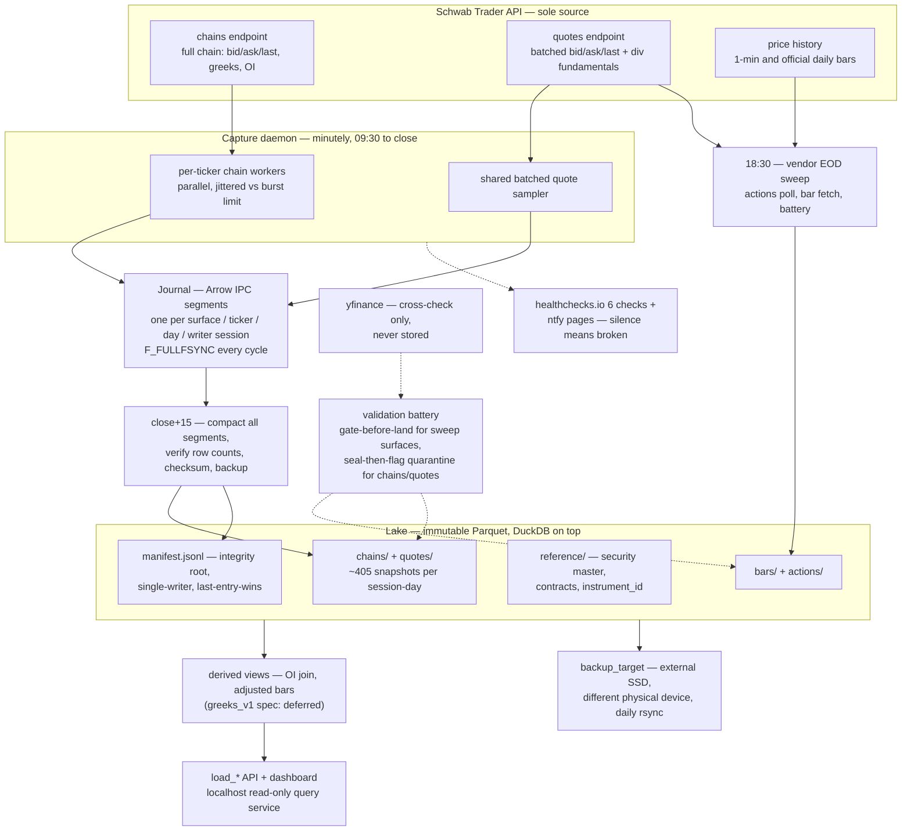

# Marketlake — design

A Schwab-first, capture-driven data lake. It records full option chains and equity quotes at one-minute cadence. Both carry bid, ask, and last. Capture starts with SPY and QQQ. The design is generic over any ticker. The marginal cost is zero.

Status: DESIGN, 2026-08-24. Tickers: SPY, QQQ, plus an open set. Cadence: 1-min.

## Contents

- [Premise: history you can't buy back](#premise-history-you-cant-buy-back)
- [Source: one vendor, one cross-check](#source-one-vendor-one-cross-check)
- [Auth: the seven-day token, engineered around](#auth-the-seven-day-token-engineered-around)
- [Storage: immutable Parquet, DuckDB on top](#storage-immutable-parquet-duckdb-on-top)
  - [The security master](#the-security-master)
- [Schedule: the capture clock](#schedule-the-capture-clock)
  - [Minutely mechanics](#minutely-mechanics)
  - [Failure handling](#failure-handling)
  - [The dashboard](#the-dashboard)
- [Derived: trust your own greeks](#derived-trust-your-own-greeks)
- [Corporate actions: actions as data, adjustment as a view](#corporate-actions-actions-as-data-adjustment-as-a-view)
  - [Backtesting across corporate actions](#backtesting-across-corporate-actions)
- [Validation: fail closed, quarantine loudly](#validation-fail-closed-quarantine-loudly)
- [Onboarding: any ticker, one command](#onboarding-any-ticker-one-command)
- [Sizing: storage estimates](#sizing-storage-estimates)
- [Deployment: laptop now, dedicated later](#deployment-laptop-now-dedicated-later)
- [Tradeoffs: prices, named](#tradeoffs-prices-named)
- [Build order: four slices](#build-order-four-slices)
- [Appendix: prior art (surveyed 2026-08-25)](#appendix-prior-art-surveyed-2026-08-25)
- [Appendix: verification sources](#appendix-verification-sources)

## Premise: history you can't buy back

Free historical option-chain data with greeks essentially does not exist. Free *forward* capture does. A Schwab brokerage account serves the complete chain in a single real-time API request, at no cost. The chain covers every expiration and strike. Each contract carries bid/ask, volume, open interest, IV, and engine-computed greeks. Three glosses at first use. Open interest, OI, is the count of contracts outstanding. IV, implied volatility, is the volatility a pricing model backs out of a quote. Greeks are the price sensitivities: delta, gamma, theta, vega, rho. So the architecture is **capture-first**. The option database begins the day the pipeline turns on. It compounds daily from there. Every snapshot not taken is gone forever. That makes capture reliability the design's first-order concern. It ranks ahead of query speed and ahead of schema elegance.

The pipeline in one line:

Schwab Trader API → capture jobs (launchd, sequential, resumable) → raw lake (immutable Parquet partitions) → derived layer (greeks, adjustments, OI alignment) → DuckDB + loader API.

Raw stores what the vendor said, verbatim. Everything computed lives downstream and is regenerable.



*The data plane runs left of the battery. The trust machinery runs right of it. Everything the capture loop hears from Schwab lands verbatim in journal segments and is sealed immutable at close+15, with its checksum in the manifest. The evening sweep's surfaces, `bars/` and `actions/`, are instead validated before they land. The battery judges both and never rewrites either. The control plane is omitted here: launchd, pmset wakes, the caffeinate assertion, and exchange_calendars session times. It schedules every box on the left.*

## Source: one vendor, one cross-check

| Source | Role | Verified limits |
| --- | --- | --- |
| **Schwab Trader API**, the data path | Chain snapshots: one request returns the full chain with bid/ask/last, greeks, and OI. Batched equity quotes: one request returns bid/ask/last for every ticker. Equity bars: 1-min and official daily, fetched forward only. The \~48-day 1-min lookback matters solely as outage recovery. Dividend fields on quotes. | 120 req/min per app. The refresh token expires every 7 days. Manual browser re-auth is the only renewal. Free with account. Real-time only if the account's exchange agreements grant it. That is asserted at onboarding and watched by the battery, never assumed. |
| **yfinance**, cross-check only | Nightly independent comparison of closes and corporate actions inside the validation battery. Never a data path into the lake. Nothing it returns is stored as market data. | Unofficial. Free. Adequate for a once-a-day comparison. |

Everything in the lake is Schwab-sourced. That keeps lineage trivial: one vendor, one auth, one set of quirks. All Schwab figures were re-verified Aug 2026 against maintained client libraries. Sources are listed at the end. The official portal gates its docs behind login.

## Auth: the seven-day token, engineered around

Schwab's refresh token dies every 7 days with no programmatic renewal. An interactive browser login is the only reset. The design treats this as a first-class subsystem, not an inconvenience:

- **Sunday-evening re-auth ritual.** Re-login every Sunday. It takes \~1 minute with `schwab-py`, which auto-handles the 30-minute access-token refresh inside the week. The deadline lands on a non-trading day. A token minted Sunday covers the full Mon–Fri week. A few hours' slip costs nothing because the market is closed.
- **Sunday 20:00 ET canary.** After the re-auth window the scheduler makes one throwaway authenticated call **plus a coverage assertion**. The assertion: the refresh token's mint time + 7 days must clear the coming Friday's option close. A still-valid leftover from a late prior-week re-auth therefore cannot pass for a fresh one. Validity is not freshness. Either failure alerts. The canary then **re-runs every 30 minutes until it passes or 23:00**. A ritual done any time Sunday evening clears it. A ritual done *after* the 20:00 run is not stranded as a false failure. The check's deadline is 23:00. That still leaves a whole night of slack rather than a hole in Monday's data. A Sunday 19:55 one-shot wake, set by the Friday vendor-sweep job, guarantees the machine is up to run it.
- **Loud mid-week alerting.** Any 401/`invalid_client` during capture pages immediately. Silence is the failure mode. While Schwab is dark, nothing is being recorded.

**The token handoff is a rule, not luck.** Two processes write `token.json`: the daemon's automatic access-token refresh, and the Sunday ritual's re-login. Three sentences coordinate them. The daemon checks `token.json` at the top of every capture cycle, the same per-cycle re-read `tickers.yaml` gets. If the file's mint time is newer than the in-memory token's, the daemon rebuilds its client from the file before fetching. That rule is what makes "capture resumes the instant re-auth happens" true. The daemon's token-write callback never overwrites a file whose mint time is newer than the token it is writing. That closes the race where a mid-session re-auth could be clobbered by a scheduled refresh. And the per-cycle journal mint stamp comes from the token object the client is actually using, never from a separate file read. The dashboard therefore shows the token capture actually runs on.

The token file lives at `~/.config/marketlake/token.json`, `chmod 600`. It sits outside the repo **and outside the synced lake tree**, so the backup sync never touches it. It is excluded from OS-level backups too, via `tmutil addexclusion` for Time Machine. A brokerage credential must not ride onto a stealable backup disk that lacks FileVault's protection. FileVault is macOS full-disk encryption. The token is a full brokerage credential. But the Schwab app is registered with the Market Data product only. The portal offers one or both products. So the token cannot place trades even if exfiltrated. Two more auth rules: the re-auth reminder pages on the same ntfy channel, **on Sunday only**. It fires until the week's re-login is done, and never mid-week. A full re-login on *any* day still mints a fresh 7-day token. Re-authing Friday evening before a trip therefore covers through the following Friday. A trip that skips the ritual entirely means the token dies mid-week and capture gaps until you're back. That is an accepted phase-one cost, same family as the laptop being out the door. One rule kills the phishing chain regardless of alert-channel security: **pages never carry actionable auth links**. The Sunday re-auth always starts from a bookmarked or typed Schwab URL, never from a notification.

## Storage: immutable Parquet, DuckDB on top

The lake is Hive-partitioned Parquet with DuckDB as the query engine. Hive partitioning means directory names carry key=value pairs, like `ticker=SPY/date=2026-08-24`, so query engines prune by path without opening files. The format is columnar, so chains compress \~10×. It is append-friendly, offers plain SQL from Python, and needs zero server administration. Each top-level directory below is a **surface**: one kind of measurement with its own pinned schema, partitioning, and capture path. The surfaces are the market's activity observed through distinct faces: what options quoted, what the stock quoted, what traded, what positions stood open, what corporate events occurred. "Surface" throughout this doc means exactly that unit. `reference/` is the one non-surface. It is identity, not measurement.

```text
lake/
  bars/ticker=SPY/freq=1m/date=2026-08-24.parquet    # official trade bars, as-traded
  quotes/ticker=SPY/date=2026-08-24.parquet          # minutely bid/ask/last samples
  chains/ticker=SPY/date=2026-08-24.parquet          # ~405 minutely snapshots (session-length; fewer on half-days), snap_ts column
  journal/date=D/surface={chains,quotes}/ticker=T/seg-<start_ts>-<pid>.arrows
                                                      # today's open capture: one segment per surface, ticker,
                                                      # and writer session, compacted at close+15
  quarantine.jsonl                                    # battery verdicts — append-only, restores with the lake
  reference/security_master.parquet                   # instrument_id <-> ticker/FIGI/OCC symbol, date-ranged
  reference/contracts.parquet                         # instrument_id -> contract terms
  actions/corporate_actions.parquet                   # splits + dividends, all tickers
  manifest.jsonl                                      # partition, source, sha256, rows, fetched_at
```

Two rules make it durable. **Compacted partitions are immutable**: the close+15 compaction job writes each day's partition once, checksummed into the manifest. Replacements are atomic or not at all. The only files ever written after creation are today's journal segments and the two append-only ledgers, `manifest.jsonl` and `quarantine.jsonl`. Each is written only by single-line `O_APPEND`. **Raw is vendor-verbatim**. That includes Schwab's greeks and IV. It also includes the chain-level header fields `interestRate`, `underlyingPrice`, and `dividendYield`, stored as columns on the chains rows. So bad vendor data is diagnosable forever rather than silently laundered.

**Manifest protocol.** The manifest is the integrity root, so its own rules are explicit. (1) *Single writer:* only the serialized daily jobs and the quarantine sign-off tool append to `manifest.jsonl`. The daily jobs are compaction and the vendor sweep. Capture workers write journals only. Serialization is a **lock, not a schedule**. Every lake-mutating job runs under one blocking advisory `flock` on a lake-root lockfile. That covers the daily jobs and any manual re-run. The `flock` is the kernel's file lock. *Blocking* means a second job waits its turn rather than racing. *Advisory* means the lock is a contract among our own cooperating jobs. The kernel releases the lock automatically when the holder dies. So a crash never strands a stale lock the way delete-a-lockfile schemes do. Under the lock, a launchd sleep-missed catch-up (a run launchd fires on wake for a scheduled time the machine slept through. The Build order defines this fully.) or a hand-invoked compaction cannot race a scheduled one. Two compactors over the same segments is the one dangerous pair. Compaction's sweep scope is bounded to ticker-days whose **option close + 5 has passed**. Close + 5 is the canonical-guard window. The close+5 fill fetch is a sanctioned post-close journal write. So no compactor may seal a day the daemon can still legitimately append to. The scheduled close+15 run is unaffected. A catch-up run firing mid-session likewise never sweeps the live day. Nor does it unlink a segment the daemon holds open. Capture workers stay deliberately outside the lock, since blocking a cycle behind compaction would drop perishable minutes. And recovery is **manifest-aware**. Before compacting a swept ticker-day, consult the manifest. If a last entry for that partition already exists, no automatic or catch-up run ever recompacts. Instead sha-verify the partition and finish the interrupted cleanup by deleting debris segments. Debris segments are the only reachable leftover state once the sweep bound is close+5. They come from a crash between the manifest append and the last segment unlink. Fail loudly to human review on any mismatch. The review's one repair tool is a deliberate, human-invoked recompaction. It runs under the lake-root flock, only while the day's segments still exist, and appends a superseding manifest entry. Standing invariant: **no automatic run ever replaces a manifested partition with fewer rows than its recorded count**. Without these rules, a late segment beside a sealed day would let the next sweep rebuild a full partition from one segment. Every integrity layer would bless it. The daily rsync would then propagate the loss over the good backup. (2) *Atomic appends:* one entry = one line via a single `O_APPEND` write. `O_APPEND` is the kernel's atomic append mode: concurrent writers cannot interleave within one write. Readers and the scrub discard a torn trailing line. That is the same rule as a torn journal tail. (3) *Last entry wins*, keyed by partition path. This makes that human-invoked recompaction harmless by construction. A re-run legitimately appends a second entry. Its sha256 legitimately differs after a library upgrade, since Parquet footers embed the writer version. The scrub verifies only the last entry per partition. (4) *Two-way scrub:* Sunday's scrub checks both directions. Every entry's file must exist and match its last sha, **and** every lake file must have a manifest entry. The reverse pass is what catches a crash between a partition write and its manifest append. For the journal-less surfaces, `bars/` and `actions/`, such a crash would otherwise leave a permanently invisible orphan. The scrub's exclusion set is enumerated, not implied: `{manifest.jsonl, journal/}`. The manifest cannot cover itself. Journal segments are manifest-less by rule 1. The one exception: a slice-1 cron run appends an entry keyed by its segment path. The scrub treats that entry as superseded once an entry exists for the matching compacted partition. So compaction's verify-then-delete never strands a slice-1 entry into a forward-pass failure.

**The quarantine list lives at `lake/quarantine.jsonl`**, inside the backup sync root by construction. So a disk-loss restore carries the verdicts *with* the data. A quarantine list left outside the backup would silently un-quarantine corrupted partitions on restore. That is the delayed-feed class the battery calls silent whole-row corruption. It follows the manifest's own line rules: one entry per single `O_APPEND` write, torn trailing line discarded, last entry per partition path wins. So un-quarantine is an explicit superseding entry, never a deletion. Its writers are the serialized nightly battery plus provenance-tagged human sign-off rows. The battery runs inside the vendor-sweep job, already a sanctioned manifest writer. It refreshes `quarantine.jsonl`'s own manifest entry after each run. Human sign-off rows land only via the **sign-off tool**. The tool runs under the lake-root `flock` like any manual lake-mutating job. It appends the quarantine row *plus the refreshed manifest entry in the same locked invocation*. So a weekend sign-off never leaves the Sunday scrub facing a sha the sweep hasn't caught up to. And human verdicts take **precedence over re-runs**. Before appending, the battery reads the partition's current last entry. If it is a human sign-off row, a verdict from the *same* check never supersedes it. The battery logs "re-observed, human precedence stands" to the nightly report. Quarantine rows cover only sealed-immutable partitions, so same check + same partition is deterministically the same finding. Only a different check's failure, or a new human row, may supersede.

### The security master

Every symbol the market uses is mutable. Tickers change: FB→META, and the Nasdaq-100 ETF itself traded as QQQQ until 2011. The OCC is the Options Clearing Corporation, the clearinghouse behind every US listed option. Its symbology names each contract. Even those OCC option symbols are reissued when the OCC adjusts contracts after a corporate action. So no external symbol is the primary key. The **security master** is the standard reference-data table for exactly this problem. It assigns every instrument an internal `instrument_id` that never changes. It maps that id to external identifiers with validity date ranges: ticker, [FIGI](https://www.openfigi.com/), and OCC symbol for contracts. FIGI is the one globally-standard security identifier that is free and openly licensed. CUSIP and ISIN are paid.

Raw rows store the vendor's symbol verbatim. Raw is vendor-verbatim, always. The derived layer resolves symbols through the master as-of the row's date. All joins run on `instrument_id`. A rename or an OCC re-symboling then adds a mapping row instead of orphaning history. The same instrument threads through under one key. Partition paths keep human-readable tickers purely as a filing convention. Identity lives in the master, not the path.

CUSIP and ISIN are deliberately excluded from the master. Schwab's equity payloads include a CUSIP. It stays in the raw rows under the vendor-verbatim rule. But it is never promoted to a join key and never published. CUSIP is licensed IP, ABA-owned and FactSet-operated. Building a database keyed on it is the use its operator charges for. A US ISIN embeds the CUSIP as `US` + CUSIP + check digit. So it inherits the problem while adding no information. Nothing in the lake may depend on an identifier that would owe fees to redistribute.

## Schedule: the capture clock

All jobs run from launchd on the Mac. launchd is macOS's built-in service manager and job scheduler. Two alerting words also recur before their full definitions later in the doc. To *page* is to push an immediate phone alert. The *dead-man check* is an external timer that alerts when expected pings stop. They are resumable and fail-closed to quarantine. **All intraday times are session-relative**, derived per day from `exchange_calendars`. *Close* means the day's option close. For these ETFs that is session close + 15 minutes: 16:15 on regular days and 13:15 on the 2–3 early-close days a year (day after Thanksgiving, Christmas Eve). The table shows regular-session times. Nothing keys on a wall-clock 16:15. **Full holidays are the same mechanism one step further**. A holiday is simply not a session. The loop never starts, there is no close to tag, and compaction and the sweep no-op on an empty journal. No gap rows are written, because a gap means "market open, capture missing." Good Friday is why the library matters: a market holiday that is not a federal holiday. Three holiday wrinkles are pinned. On a non-session day the daemon keeps sending dead-man pings *at the normal cadence*, tagged "market closed per calendar" in the ping body. healthchecks.io is a pure countdown timer with no content awareness. Keeping the timer fed is the only way to avoid false-paging every holiday while keeping silence-means-broken true around the clock. The pause API was considered and rejected. A paused check that never receives its resume ping stays silent forever. That removes the safety net exactly when nobody is looking. The ping's meaning is calendar-deterministic. On session days it means a durable capture cycle. On non-session days it means a daemon that is healthy and *correctly* idle. The inverse case is an **unscheduled closure** the static calendar can't know about. The first cycle's vendor quote-time guards it. If that quote-time is not same-day fresh, the day is flagged *suspected unscheduled closure* rather than captured and trusted. OI needs no holiday handling at all. It is a derived view over the next *captured* session's chains. A Monday holiday simply means Friday's OI derives from Tuesday's cycles. The dashboard renders non-session days as *no session*, never 0%. One provenance fact governs all of this: `exchange_calendars` is rules-plus-exceptions *source code*, not a feed. It learns about schedule changes only through package releases, so the Sunday maintenance run checks it for updates. Calendar errors get guards in **both** directions. Says-open-but-closed is the freshness check above. Says-closed-but-open is the worse failure: a stale calendar idling the daemon through a real session. It is caught by a single 09:35 probe quote on every weekday the calendar calls closed. A fresh vendor timestamp pages "calendar says closed, market looks open."

The capture loop is **parallel per ticker**. Each ticker has its own worker firing at the top of the minute. Workers are staggered by a few tens of milliseconds, so the concurrent volley stays clear of Schwab's burst rejection (429-005). Cycle wall-time stays flat as the roster grows *until local resources bind*. The 120 req/min cap is the **vendor** ceiling: \~115 minutely full-chain tickers by request arithmetic alone. The **local** ceiling is aggregate payload bytes, JSON parse, and journal-append throughput, all scaling with the roster's total chain size. That ceiling is measured, not assumed. Slice 1's day-one measurements feed it. The roster ceiling is whichever binds first. The cap is scoped to the **app's `client_id`**: the credentials, not the IP or machine. The budget therefore travels with the token on any future migration. Anything else using the same keys, such as a notebook or an ad-hoc curl, draws from the daemon's 120. The rule is that the daemon's app credentials are used by the daemon alone. One honesty note on provenance: Schwab's official docs throttle-document only *order* operations (0–120/min per account, GETs called "unthrottled" there). The 120/min on market-data GETs is the observed app-level limit every maintained client reports being enforced via 429. It is real but not contractual, so it could shift without notice. Multiplying the budget with extra accounts/apps is considered and rejected. Registration is identity-tied, so the vector barely exists. Quota-farming stresses the one relationship the entire lake depends on. Account standing is the real single point of failure, and lost capture is unrecoverable. Extra credentials also buy headroom in the wrong dimension, because the local parse budget binds before the vendor cap. A roster that truly outgrows 120/min graduates to paid data, not credential arithmetic. Sustained polling at the published cap is untested territory for a single retail app. The adaptive stagger and the 429 page are the tripwires. None of this binds at two tickers and 3 of 120 req/min. The equity-quote sampler is never the roster ceiling. The quotes endpoint batches a comma-separated symbol list. Its practical cap is in the hundreds per request, URL-length bound. The exact cap is a day-one measurement. The sampler's cost therefore grows as ⌈tickers / batch⌉: one request for dozens of tickers, a handful for a thousand. Payloads stay sub-second throughout. The roster ceiling belongs entirely to the chains, which cost one request and megabytes per ticker per minute. Failure isolation comes free on the chains surface. Skip-not-block applies per ticker, so one hung chain request drops that ticker's minute and touches nothing else. The quote sampler is the stated exception: it is one shared failure unit, and a hung batch drops every ticker's quotes minute, journaled as per-ticker gap rows.

| ET | Job | Detail |
| --- | --- | --- |
| Sun eve | **Re-auth ritual** | Manual browser login. New 7-day token. One human minute per week. |
| Sun 20:00 | **Canary + weekly maintenance** | Throwaway authenticated call, alert on failure. Then the checks too slow or pointless to run nightly: an integrity scrub re-verifying manifest checksums across the whole lake and the backup copy (bit-rot / partial-sync detection), a disk-runway check (free space ÷ trailing growth rate, alert under a few weeks of headroom), and log rotation. Nothing here touches data. Journal compaction and the backup sync run daily at close+15. |
| Mon–Fri 09:30–close | **Minutely capture loop** | Every minute: one full-chain snapshot per ticker (bid/ask/last, greeks, OI per contract), plus one shared batched equity-quote sample (bid/ask/last, all tickers in a single request). The chain snapshots are fired by per-ticker workers in parallel. That is 3 of 120 req/min for SPY+QQQ. Runs to the session's option close: 16:15 regular days, 13:15 early closes. Skip-not-block, per ticker: a slow request drops that ticker's minute rather than shifting any later sample. |
| close | **Canonical tags** | Not separate fetches. Two existing loop cycles get tags. The cycle at the *equity* close (16:00 regular days) is tagged `spot_close`. It is the last regular-session-synchronous cycle: option marks and underlying top-of-book at the same *pre-auction* moment. It does **not** contain the official close. The closing-auction print disseminates seconds after 16:00:00 and lands in `bars/` via the sweep. The tagged cycle supplies the moment-matched option marks to sit *beside* that close. 16:15 option marks against a 16:00 close would mix moments. The loop's final cycle at the *option* close (16:15) is tagged `canonical`: the option market's close of record. The close+5 guard is **per-tag and asymmetric**. If the journal lacks the `canonical` cycle because the daemon died late, one direct fetch fills it. That is legitimate only because option quotes freeze at the option close, so a close+5 fetch still observes the closing marks. The fill is written as its own journal segment. It is refused outright more than **five minutes** after the actual close. That limit is pinned here, not in config, because it defines canonical-close semantics, not alerting. The fill also carries a membership guard. Its expiration set is compared against the day's last loop-captured cycle. Every expiration seen intraday but absent from the fill gets explicit absent-marker rows. The fill stays canonical for the series it does contain. Any shortfall flags the nightly report. If no same-day cycle exists as a baseline, the fill is tagged baseline-less and flags the report. This guards the unverified case where Schwab stops serving same-day-expired series by close+5. A missing `spot_close` cycle is **unrecoverable by construction**. The 16:00 moment cannot be re-observed at 16:20. A post-close fetch carries frozen option marks and an extended-hours underlying, the exact moment-mixing the tag exists to prevent. So a missing `spot_close` is recorded as an explicit absent-marker and flags the nightly report. Daily-grain consumers fall back to the official close in `bars/`. |
| close+15 | **Compact + backup** | Depends only on our own journals, and those are final once the canonical guard passes. So it runs immediately: merge and compact all of the day's journal segments into each day's Parquet partition (sweeping every date present under `journal/`, so segments orphaned by an earlier failed compaction are recovered) → verify (re-read, row-count against the sum across segments) → manifest + checksums → backup sync. Running early shrinks the window where the day's capture exists in exactly one place. There is no reason to wait for the vendor sweep: chains and quotes are born final (no vendor keeps a history to revise them from), the sweep's outputs (`bars/`, `actions/`) land in their own partitions, and battery verdicts are metadata in the quarantine list, never a rewrite of sealed data. |
| 18:30 | **Vendor EOD sweep** | Waits for vendor end-of-day data to settle. Auction prints and consolidated-tape corrections land in the hours after the bell. Corporate-actions poll first (so today's split flags before bars land) → official daily bar + 1-min bar top-up from Schwab → yfinance cross-check → validation battery → (Fridays only) set the Sunday 19:55 wake and read it back. |

The 48-day 1-minute window at Schwab means even a multi-week bar outage is recoverable. Chain and quote snapshots are the things with no second chance. That is why they get the loudest alarms.

### Minutely mechanics

A minutely loop cannot write a Parquet file per fetch. 390 tiny files a day per surface is a lake full of gravel. Instead the loop is a **long-lived market-hours daemon**, launchd-managed with keep-alive and market-calendar aware. Its per-ticker workers append each cycle to **per-ticker, per-day, per-writer-session journal segments** at `journal/date=D/surface={chains,quotes}/ticker=T/seg-<start_ts>-<pid>.arrows`. The **surface axis is load-bearing**. Chains and quotes carry different pinned schemas, and Arrow IPC fixes one schema per file, so one segment can never hold both. Arrow IPC is Apache Arrow's append-friendly on-disk format. Rows land as self-contained record batches, so a file torn mid-write stays readable up to the last complete batch. Parquet, by contrast, is invalid until its footer is written at close. Segments are created with `O_CREAT|O_EXCL` and named with second-or-finer `start_ts` plus the writer's pid. Any path collision therefore **errors loudly** instead of truncating durable rows or shadow-appending past an end-of-stream marker. Exclusivity is mechanism, not convention. launchd's one-instance-per-label already precludes a second managed daemon. The pid suffix guards manual runs and crash-loops. Each segment is created by exactly one writer session and **never re-opened for append**. An Arrow IPC stream cannot be resumed by a later writer. A clean close writes an end-of-stream marker readers stop at. A naive re-append lands rows that standard readers silently never see (verified empirically against pyarrow). Parallel writers never share a write path. Each chain worker owns its ticker's `chains` segment. The shared quote sampler splits each batched response per ticker. It is the **sole writer of every `quotes` segment**: one open segment per (ticker, day, writer session), with the surface axis keeping its names disjoint from the chain workers'. The close+15 job merges each (surface, ticker, day)'s segments into that surface's final Parquet partition. Immutability applies from compaction onward. The segments, plus the two append-only ledgers, are the only files written after creation. The segments are only ever written for today, with one exception: startup marker segments land under the missed dates they mark.

**The daemon is a permanent resident process**. It never exits on its own. Under `KeepAlive`, launchd relaunches any exiting process within seconds, so an exit-at-close design would relaunch-loop all night. Outside sessions it idles, emitting the calendar-tagged heartbeats. Everything session-relative is dispatched *internally* from `exchange_calendars`. That covers capture start and stop, the close tags, the close+5 guard, and the close+15 compaction. The dispatch is internal because launchd's `StartCalendarInterval` is fixed wall-clock and cannot express close-relative times. Only the fixed-time jobs are separate launchd calendar jobs: the 18:30 sweep, the 08:30 self-check, the Sunday canary/scrub.

**The durability point is defined, not assumed.** A capture cycle counts as successful only after its record batch is written, the writer flushed, and the journal segment made durable with `fcntl F_FULLFSYNC`. That call is macOS-specific. Plain `fsync` stops at the drive's write cache, per Apple's own `fsync(2)` man page, so data can still be lost on power failure or kernel panic. The dead-man ping and the per-cycle success accounting both sit *after* that point. "Successful" therefore means "on disk," and power-loss exposure is exactly the in-flight batch. That is the case the Arrow torn-tail recovery already handles. Writers flush per cycle, never letting small quote batches sit in user-space buffers across cycles. The cost is one full flush per ticker per minute, which is negligible.

**Schema policy.** Each surface has a pinned capture schema with a `schema_version` stamped per file. The vendor columns' full list is fixed by the first day's payload and recorded as `schema_version=1`. Besides the vendor columns and the two timestamps, every row carries the provenance columns: `row_kind` (`data`|`gap`), `error_class` (null on data rows), `suspect` (bool), `close_tag` (`canonical`|`spot_close`|null, stamped on every row of the tagged cycle, fill-fetch segments included), and `session_phase` on post-equity-close rows. A gap row is the surface schema with all vendor columns null. Every row also carries `snap_ts`. It is the minute slot the cycle fired for, assigned by the loop at the top of the minute. It is neither the fetch time nor the vendor quote time. A jittered or retried fetch still belongs to its own slot. Gap rows carry their missed minute in `snap_ts`. The close+5 canonical fill carries the close slot, not its fetch minute. `load_chain(snap='10:31')` resolves against `snap_ts`, never fetch-time arithmetic. `load_chain(snap=None)` resolves via `close_tag`, never timestamp arithmetic. On a day with no canonical-tagged cycle it fails loudly with an explicit no-canonical marker. It never silently substitutes the last available snapshot. The parser fails *open*. Known fields land in typed columns. Unrecognized vendor fields land in a normally-empty `extra` JSON overflow column, which makes vendor-verbatim structurally true even across payload drift. A populated `extra` flags the nightly report. A *missing or retyped known* field pages, since it can zero a downstream surface. A mid-day vendor change rotates the journal to a new segment rather than erroring the cycle, because Arrow IPC fixes one schema per file. All multi-day reads use `union_by_name`. DuckDB's default over drifted partitions either errors or silently drops the new column, depending on which file binds first.

Each row carries two timestamps: the fetch time (the loop's clock) and the vendor quote time (Schwab's). Staleness is therefore measurable per row. It is also *watched*, not merely recorded. Per-row staleness drifting toward the 15-minute delayed-feed signature alerts the same day. The watchdog pages when any of its counters reaches 3 consecutive session minutes without a durable data cycle. The counters are per ticker and per surface, so a dead ticker on a healthy daemon still trips it, and a dead chain worker trips it even while that ticker's quotes flow. A dead daemon must never be discovered at compaction time. If the daemon dies, keep-alive restarts it and a **fresh segment starts**. The gap rows have a named writer. On startup, before its first live cycle, the new incarnation writes gap rows (`error_class=daemon_dead`) into its fresh segment. This is **gap-marking, not recovery**. One marker row per missed minute. A gap row holds no market data. The missed samples are gone forever, per the premise. The marker records the absence and its reason, so completeness is counted from rows and never inferred from holes. The gap-marking is **calendar-driven, not segment-driven**. On start, the daemon enumerates `exchange_calendars` sessions from the last manifested partition through today, per surface and ticker, clamped to `capture_start`. Dates the manifest already seals are skipped. Each missed session-date gets a dedicated marker segment under that date's own journal path. Only that date's session-minute markers land there. A partially captured date gets markers from its last durable batch to its option close. A fully dark date gets a full session of markers. Today's live segment carries only today's markers, from the prior segment's last durable batch to the first live cycle, clipped to the option close on a post-close restart. The close+5 guard remains the sole writer of the `spot_close` absent-marker, written as its own segment, like the canonical fill. Compaction synthesizes nothing, so partition rows always equal the sum across segments. Any catch-up compaction of an unsealed day is ordered *after* the daemon's startup gap-marking.

One honest boundary: polling captures a *sample*. It is the top of book at each minute's tick, not the tick history between samples. There is no bid/ask high/low within the minute. The official trade record (minute OHLCV bars) still comes from Schwab's price history nightly. Two related notes follow. Every row observed after the 16:00 equity close carries a session-phase tag (the options trade on to 16:15). The standalone equity-quote samples *and* the underlying price embedded in the 16:00–16:15 chain cycles are extended-hours readings of the underlying. Daily-grain equity joins use the official close from `bars/`, never a quote sample. And if day-one latency measurement shows the minute budget tight, the pre-identified fallback is chunking the chain fetch by expiration range (the endpoint's `fromDate`/`toDate` parameters). The fallback is not built until measurement says so. The chunks are fired **in parallel with per-chunk jitter**: a few tens of milliseconds of stagger, the same discipline the per-ticker workers already use against the burst limit. Parallel firing cuts wall-time to the slowest chunk and converts a failed chunk into a tagged partial snapshot instead of a full gap.

### Failure handling

The failure model rests on one fact: **samples are perishable**. A 10:31 snapshot that can't be taken by 10:31 is worthless at 10:32. That cycle takes its own. So nothing ever retries across a minute boundary. Every failure resolves into exactly one of three outcomes: a recorded gap, a flagged row, or a page.

- **Transient request failure** (timeout, 5xx, reset): one immediate retry if the cycle has time left. Otherwise that ticker's minute is dropped and journaled as a gap row carrying the error class. Gaps are data. They are queryable like everything else and never inferred from absence.
- **Rate-limit rejections**: any 429 skips the minute. When a sub-code is present, it refines the response. A burst sub-code (429-005) also widens the stagger. A sustained sub-code (429-001) also pages, since at 3 req/min a sustained-rate rejection means something unexpected is eating the budget. 429s persisting across consecutive cycles page regardless. The sub-codes are community-documented, not officially published, so the handler never *depends* on them.
- **Auth death**: a 401 that survives an access-token refresh means the refresh token is dead. Page immediately, once, on the transition. Subsequent auth-gap minutes journal quietly. They ride a single escalating reminder rather than a page per minute. The daemon keeps cycling, since cycling is cheap. Capture resumes the instant re-auth happens.
- **Suspicious 200s**: a chain response far under its trailing-median contract count is journaled anyway. The loop never discards data it received. The response is tagged suspect for the validation battery. The loop records. The battery judges.
- **Slow creep**: the per-ticker watchdog fires after 3 session minutes without a durable data cycle. It catches whole-ticker outages within minutes. Intermittent sub-threshold degradation surfaces the same day through the dashboard's minute strip. It surfaces again that night through the gap summary's time-of-day breakout.
- **Daemon death**: `KeepAlive` restarts it. One segment per incarnation makes restart seamless. Downtime minutes are gaps. The dead-man ping fires only after a *successful* cycle. A crash-looping zombie that captures nothing therefore goes silent. It trips the external alert rather than reporting liveness.
- **Torn journal tails** (power loss mid-append): Arrow IPC reads to the last complete record batch. Compaction discards the torn tail. The torn tail's minutes fall inside the successor incarnation's startup gap-marking window, because the torn batch is by construction after the last durable batch. So compaction itself never gap-tags. This bound holds because every cycle ends in an `F_FULLFSYNC` (see the durability point in Minutely mechanics). Without that fsync, "the last complete batch" could be minutes behind what the daemon believed it wrote.
- **Compaction failure**: journal segments are deleted only after the day's Parquet is written, re-read, row-counted against the sum across segments, and checksummed into the manifest. Compaction merges every segment for the ticker-day. It sweeps every date present under `journal/`, recovering segments orphaned by an earlier failed run. It is idempotent. A failed run re-runs with nothing lost. The verify step also asserts that any end-of-stream marker is a segment's final bytes. Bytes *after* an EOS fail the run loudly. They are a shadow-append signature. A torn tail with no EOS remains the already-handled gap-tag case.

Alerting collapses to two tiers: **page now** and the **nightly report**. The page-now tier covers auth death, persistent 429s, the per-ticker watchdog, and a missed dead-man ping. The watchdog trigger is 3 session minutes without a durable data cycle. One dead ticker on a healthy daemon pages from inside via ntfy. A daemon alive enough to skip a ticker is alive enough to POST. The nightly report carries the gap summary broken out by time-of-day and error class, battery quarantines, and cross-check disagreements. The breakout matters because load-correlated clustering at the open, the close, or volatility spikes shows up as a trend. In day-level totals it would stay invisible. "Page" means an alert that interrupts immediately: a phone push via ntfy.sh. The daemon POSTs directly for the failures it can see. For the failures it cannot see, healthchecks.io's native ntfy integration pushes to the same topic. Email rides behind both as fallback. The two channels stay distinct in *detection*, since healthchecks catches what the machine cannot report. They deliver on one push channel. The tier test is whether waiting compounds the loss. Capture failures do, because every minute is unrecoverable, so they page. Everything else rides the report.

### The dashboard

Failures push alerts. Progress needs a pull surface. The dashboard queries the lake live rather than being re-rendered. A small **read-only query service on localhost** answers a fixed set of queries. It is DuckDB running natively over the manifest, journals, and partitions, launchd-managed with `KeepAlive` like the daemon. `status.html` runs the queries at view time. Nothing is pre-rendered and no summary state is maintained. The page always shows the artifacts as they stand. Freshness reads off the data's own timestamps: the last journal append per ticker. That is a sharper staleness signal than any render clock. A pre-rendered static `status.html` was considered and rejected. That was an owner call: live pull. A static page is fail-plausible. A dead renderer leaves a page asserting an old "now." That page is ambiguous between capture-dead and renderer-dead. A live query is current or visibly down. And rendering inside the daemon would put view queries in the capture loop's minute budget. The service exists only because a page opened from disk can't read sibling files. Browsers sandbox `file://`. Live pull therefore needs something serving bytes. This something is read-only by construction and bound to localhost. The residual surface is named. With the loopback bind, fixed queries, and the DuckDB sandbox, an attacker who can reach the port but cannot read the filesystem learns only lake status. The token and alerting secrets sit outside `allowed_directories` and outside the lake tree. **The fixed-query contract is a security invariant, not a convenience**: the service accepts only its enumerated named queries. Client-supplied SQL never crosses the boundary. DuckDB SQL is arbitrary local file read as the owning user, via `read_text` and `read_csv`, per DuckDB's own hardening guide. The readable set is everything the owning user can read. That includes `token.json` and the alerting secrets in `~/.config/marketlake/`. `chmod 600` is no defense here: it blocks other users, and this process runs as the owner. Belt-and-suspenders at the connection: DuckDB opens with `enable_external_access=false` and `allowed_directories` set to exactly one entry, `lake_root`. Everything the panels need lives under it: the surface directories, `journal/`, `manifest.jsonl`, `quarantine.jsonl`, and `reference/`. The configuration is then locked with `lock_configuration=true`. No later SQL can flip the sandbox back off. That is DuckDB's built-in sandbox for exactly this. Even a drifted query surface cannot read outside it. And the service rejects requests whose `Host` header is not localhost. DNS rebinding is the trick where a malicious page re-points its own domain at 127.0.0.1, reaching localhost services through your browser. The Host check is the standard guard against it, and the one layer that doesn't depend on which browser the owner uses. Panels:

- **Now** — per-ticker last successful cycle and minutes-since, refresh-token age with a countdown to Sunday, and last dead-man ping. The token age comes from the lake, not the token: the daemon stamps the mint time (a timestamp, no secret content) into its journal metadata each cycle. Idle heartbeat cycles carry the stamp too. The machine is awake Sunday evening for the canary window, so the fresh Sunday mint reaches the panel that night, not Monday. The dashboard never reads `~/.config`.
- **Today** — a per-ticker minute strip across the session's slots: captured / gap / suspect, row counts, gap reasons. The strip is denominated by the day's session length from the calendar. That is \~405 on a regular 09:30–16:15 day and fewer on half-days. An early close therefore never renders as a half-missing day.
- **History** — a 30-day completeness heatmap, open battery quarantines, and cross-check disagreements. The heatmap shows the percent of the session's minutes captured per ticker-day, session-length-denominated.
- **Lake** — size by surface, growth rate, disk runway.

The price is one more resident process. `KeepAlive` covers it. A dead query service takes down only the view, never capture. healthchecks.io remains the external complement. It is the one view that still works when the laptop itself is dark. Every alert links to the dashboard.

## Derived: trust your own greeks

**Deferred (owner call, 2026-08-24): this layer is spec, not build.** Raw captures quotes and vendor greeks verbatim. Derived layers are regenerable by definition. So everything below can be built whenever research first consumes the lake. It can back-derive the full history with zero loss. The named interim cost is early detection. The vendor-greek cross-check isn't watching until then. A vendor-side greeks defect would therefore be caught late rather than early. The quotes stay safely on disk to diagnose and repair the defect when it is caught.

Schwab's greeks are real. They are theoretical values from its pricing engine, and they're stored. But the **canonical greeks are computed**: back IV out of each quote midpoint, then derive delta/gamma/theta/vega from that IV in a versioned transform. The transform is `greeks_v1`. A model change re-derives everything rather than silently mixing vintages. The vendor-vs-computed difference becomes a standing validation signal instead of an invisible risk.

`greeks_v1` is **American-style, matching both the contracts and Schwab's engine**: IV backs out of each mid through a **compiled binomial tree**. The tree is CRR, the Cox-Ross-Rubinstein lattice, with a fixed step count and even–odd averaging. Dividends get the escrowed-spot discrete-dividend treatment: price on spot minus the present value of projected dividends, which keeps the lattice recombining. All of this is pinned by the version tag. The tree was chosen over Bjerksund-Stensland's closed-form approximation for three reasons. First, it converges to the true American value rather than approximating it. Vendor-agreement tolerances therefore stay tight instead of widening to absorb approximation error. Tight tolerances are the entire point of computed greeks. Second, it takes discrete dividends, which drive call-side early exercise. B-S assumes a continuous yield and misprices exactly that corner. Third, it is pinnable. In the zero-dividend European limit the tree must match closed-form Black-Scholes to tolerance, an exact regression anchor. The price is a compiled dependency and convergence details to test. At nightly scale the speed difference is minutes.

Two more pinned inputs. The **spot** for each IV inversion is the same cycle as the quotes: the chain response's embedded `underlyingPrice` or the same-minute equity-quote sample. It is never a daily-bar close. Option marks and spot are therefore always the same moment. The **risk-free rate** is the session's canonical snapshot's stored `interestRate`, a chain-level header field the raw layer keeps. It is deterministic from raw alone. It is apples-to-apples with Schwab's engine by construction, eliminating rates as a tolerance-widening residual. The accepted approximation is one chain-level scalar rather than a tenor curve. Tenor-matched rates from a public series (FRED, into `reference/rates.parquet`) are a designated `greeks_v2` upgrade if LEAPS-grade work ever needs them.

**The dividend input is a point-in-time projection, not the actions table.** For valuation date T, the pricer uses the dividend fields *as observed at T* from the raw-verbatim quote capture, with honest semantics. Schwab's `divExDate`/`divPayAmount`/`declarationDate` describe the *last* dividend. Its `nextDiv*` fields are undocumented vendor projections, and they empirically mismatch actually-declared dates. So a one-declaration-cycle observation classifies each field as declaration-vs-projection before any is admitted as "declared." That observation runs over already-captured quote history *whenever this deferred layer is built*, not as a slice-1 task. The fields are stored verbatim from day one, so the study is a query over history, never a race. Beyond the observed horizon, a pinned per-instrument projection rule extends the schedule. The rule is session-anchored from the trailing pattern. For SPY that is the quarterly expiration Friday of Mar/Jun/Sep/Dec. For QQQ it is its own trailing four-ex-date convention. It is never "trailing date + 3 calendar months," which lands on non-sessions. Two boundary conventions are pinned, one per end of the pricing window. A dividend whose ex-date equals an option's *expiry* is *inside* that option's window. Ex happens at the open and settlement at the close. SPY hits that collision every quarter. Symmetrically, only dividends with ex-date *strictly after the valuation date* are escrowed. Every capture timestamp is post-open and ex happens at the open. An ex-date-equal dividend is therefore already out of the observed spot, and escrowing it would double-count it. The projection rule and its dated inputs are part of `greeks_v1`'s frozen definition. Regeneration is therefore deterministic and lookahead-free by construction. The actions table cannot be the pricing input for two reasons. First, it records *realized*, cross-check-confirmed events, so at date T its forward visibility is roughly zero. Omitting an imminent quarterly dividend biases a 30-DTE ATM call's IV by over a vol point. Second, it grows over time, so regenerating past greeks from it would silently change them. That is exactly the vintage-mixing the version tag exists to prevent. The actions table remains the record for adjustment views and the early-assignment check, where the relevant dividend is already declared.

The kernel is written in-house, \~100 lines of numba, rather than taken from a library. The reason is reproducibility. `greeks_v1` is a frozen definition: same inputs, same greeks, forever. No maintained library offers vectorized American IV inversion with discrete dividends whose numerics can be trusted not to drift under upgrades. QuantLib's per-option Python bindings are also far too slow for \~6M inversions a day per ticker. Libraries serve as **test-time oracles** instead. The suite pins the tree against QuantLib's American engines, an independent reference implementation, with dividend-bearing test vectors spanning ex-dates. One vector's valuation date *equals* an ex-date, with spot already ex and the dividend excluded. The boundary is therefore pinned by fixture rather than by whichever same-date convention the oracle's defaults apply. The zero-dividend anchor never exercises the dividend path. The suite also pins against py_vollib's Jäckel inversion in the zero-dividend European limit, an exact closed form. Both oracles are dev dependencies only, keeping the daemon's runtime footprint at numba + pyarrow + duckdb + schwab-py. The market calendar is likewise reused, not written. `exchange_calendars` supplies sessions and half-days. It knows unscheduled closures only retroactively. The Schedule section's freshness check and probe guard that gap in both directions. What this buys: the exercise-style error regions vanish, and the vendor-agreement check is apples-to-apples across the whole surface. Deep-ITM puts at the intrinsic floor back out sensible IVs instead of degenerating. A systematic Schwab-vs-computed gap now means differing rate or dividend inputs, or a data problem, never a known model mismatch. Tolerances therefore stay tight. What it costs: inversion is no longer closed-form-cheap, and the pricer is more code to test. \~6M inversions a day per ticker needs a vectorized or compiled pricer to stay a light nightly job. Three tag classes are part of the frozen `greeks_v1` definition. Rows whose fetch time exceeds the session's option close never invert against their embedded `underlyingPrice`. These rows are the canonical fill segments, already identifiable by their own segment and `close_tag`. Their embedded `underlyingPrice` is a post-close extended-hours reading, non-synchronous with the frozen marks. They are tagged *nonsync_spot* and excluded from canonical IV. The fill stays fully legitimate as the marks-of-record. Only the marks-spot *pair* claim needs the carve-out. The same-moment rule therefore reads: option marks and spot are the same moment on every loop-captured cycle, and fill-fetch rows are the pinned, tagged exception. Where a quote pins to intrinsic and vega ≈ 0, IV is unidentifiable under any model. Those rows are tagged *indeterminate* rather than published. And rows failing a pinned **quote-quality gate** are tagged *unreliable_quote* and never published as canonical IV. The gate catches bid = 0, ask = 0 or missing, crossed quotes (bid > ask), and relative spread above a pinned cap. Backing IV out of ask/2 on a 0.00 × 0.05 far-OTM wing manufactures fake skew. That is why Cboe's VIX methodology excludes zero-bid options from vol extraction. Raw stays vendor-verbatim in both cases. The gates live in the version tag, so regeneration stays deterministic.

The rest of the derived layer: the **OI view — pure derivation, no capture job**. The chain snapshots' vendor OI field is the only source. A dedicated morning-read job was designed, hardened through two review rounds, then cut on one observation: it fetched the *same chains endpoint* with no source advantage. Everything it could see, the next session's stored cycles see \~30 minutes later. The decision is pinned here so the job is never re-added. The price is that a session's OI settles one session later, \~48–72 hours across weekends and holidays. That is consistent with the already-accepted weekend delta. Session S's OI = the calendar-next session's first stored cycle whose OI *differs* from the baseline across the **comparable set**. The comparison baseline is raw, never a prior verdict. The baseline is the OI columns of session S's own last stored cycle, read over the comparable set. That equals the resolved prior view whenever one exists. It stays defined when the prior verdict was absent or indeterminate, and on the capture epoch's first session. A session with no stored cycles yields absent-markers for its own view and leaves no later session's test undefined. The comparable set is S's top-volume contracts with expiration strictly after S, present in both cycles. Identity across the set is the pre-refresh signature. "Differs" is a quorum, not a single tick. A refresh is declared only when at least a pinned fraction of the comparable set shows changed OI. The fraction is a guard constant beside the minimum-set-size floor. One changed contract is noise, not a refresh. The selected cycle must also hold: its OI stays unchanged for k subsequent stored cycles, k a guard constant. A snapshot straddling the vendor's load then loses to the settled cycle a minute later. The view is derived, so the plateau costs nothing at read time. The nightly report flags any session whose comparable-set OI changes more than once intra-session. Slice 1's refresh-moment measurement also records whether the refresh lands atomically. That measurement calibrates the quorum fraction and k. Absent-marker rows are never evidence. The test also needs enough voters: a comparable set smaller than the minimum-set-size floor (a guard constant in `config.yaml`) makes the verdict *indeterminate* — too few contracts to distinguish a stale feed from quiet contracts. Expiry days shrink the set by construction, since the session's top-volume contracts expire out of the next chain. If no cycle that day passes, the view yields an explicit absent-marker, never a silently mislabeled value. Two pins survive from the job era. "Session S's OI" means OI *as of S's close*, the OCC's next-business-night figure. Intraday ΔOI signals read the chain field directly at its own timestamps. The view is not point-in-time. One named loss is true under any design: contracts that expire on session S leave the chain, so expiry-day final OI is unobservable. It gets explicit absent-markers. Then come split and total-return bar adjustments, covered in the next section, and DuckDB views joining chains to underlying bars. All of it is regenerable from raw at any time.

## Corporate actions: actions as data, adjustment as a view

No adjusted price is ever stored. Bars are as-traded. A small `corporate_actions` table holds splits and dividends. Its columns are instrument, ex-date, type, ratio or amount, and declared/as-of date. Actions are read off Schwab's own evidence. The per-event dividend is `divPayAmount` + `divExDate` from the quote fundamentals. It is **never** `divAmount`. That field is the annualized trailing figure the yield keys off: `divAmount` ≈ `divFreq` × `divPayAmount`. Storing the wrong field would inflate every total-return factor \~4× for a quarterly payer. A split announces itself in the data: the strike-vs-spot scale guard trips, and the OCC re-symbols the chain. A factor then **lands only after the yfinance cross-check agrees**. That is the two-source rule that catches a vendor silently pre-adjusting. A disagreement holds the action out of the table (fail-closed). It rides the nightly report. It resolves only by human sign-off. Resolution keeps the landed value Schwab-sourced by fixing the extraction. When Schwab's fundamentals are stale, resolution is a provenance-tagged manual row entered from the fund's own distribution announcement. The human is the data path, so "yfinance is never a data path" stands unbroken.

```text
load_bars(ticker, freq, adjust='none' | 'split' | 'total')
load_chain(ticker, date, snap=None)        # None -> the session's canonical close snapshot;
                                           # snap='10:31' -> the chain as of that minute — the
                                           # hygiene-aware door to the ~405 intraday snapshots
load_contract(occ_symbol | instrument_id)  # full life of one contract, threaded
                                           # through symbol changes via the master
```

`split` multiplies by the cumulative split factor after each bar (price-continuity view). `total` folds dividends in (total-return view). A newly discovered action instantly fixes all history. No stored number ever changes meaning.

**Options are never rescaled in storage.** On a split, the OCC adjusts contracts and issues new symbols. Marketlake records the event. The security master maps the new OCC symbol onto the same `instrument_id`. The contract's history threads through under one key with the adjustment visible beside it. Like every adjustment, cross-event continuity is a derived view built from raw plus the actions table. It carries one honesty caveat the bar views don't need: option adjustment is not a scalar. A whole-ratio split maps exactly. Strikes scale by the ratio, and the contract count absorbs the rest. The view normalizes it. An uneven split or special dividend changes the deliverable itself. A "non-standard" contract delivering 150 shares plus cash has no multiplier that makes it comparable. There the view surfaces the event instead of faking one. Rescaling historical strikes in place is storage mutation. That is how option databases quietly corrupt.

### Backtesting across corporate actions

The consumer contract for any backtest engine reading the lake:

- **Select in scale-free coordinates** (delta, DTE, percent-moneyness). A dollar parameter, if unavoidable, is deflated by the cumulative split factor from the actions table.
- **Transform held positions on the ex-date** via the actions table and master mapping, exactly as the OCC did. Assert mark continuity: portfolio value just before ≈ just after. A jump at an adjustment event is a bug and halts the run.
- **A position that becomes non-standard** is either modeled deliverable-exactly or force-closed at the last pre-event mark. The choice is pinned and reported. The position is never marked as if still standard.
- **Exclude non-standard contracts from entry** by default. Deliverable terms in `reference/contracts.parquet` make it a filter. Their quotes look anomalously priced next to standard contracts because the deliverable differs. A best-price rule will select them into phantom edge.
- **One scale rule**: same-date comparisons (moneyness) run in as-traded space, matching as-traded strikes. Across-time comparisons (returns) run in the adjusted view. Mixing the two is the classic corruption.
- **Ordinary dividends adjust nothing** but drive early assignment. Short ITM calls get assigned before ex-div when remaining extrinsic < the dividend. The actions table feeds that decision. The symmetric put clause: short deep-ITM puts are assigned early when interest on the strike (from the pinned session rate) exceeds remaining extrinsic.
- **Expiration settles against the *session's* official equity close from `bars/`**, per the OCC's $0.01 exercise-by-exception. Exercise-by-exception is the OCC's automatic exercise of any option finishing $0.01 or more in the money, absent contrary instructions. That close is the closing-auction print, at 16:00 on regular days and 13:00 on early closes. Early closes are expiry sessions too. It is never the option-close snapshot. It is never `spot_close`, which is the pre-auction book, not the auction print. Assignment and physical delivery transform the position (shares at strike). They run under the same mark-continuity assertion the ex-date rule gets. The equity-close-to-option-close mark convention is pinned: settle at official-close intrinsic by default. Pin risk and contrary exercise are either modeled deliberately or explicitly not at all, never implicitly.
- **Pin it with a synthetic-split fixture**: replay a fabricated 2:1 and an uneven 3:2 through the engine. Assert position continuity, selection stability, and the non-standard exclusion.

## Validation: fail closed, quarantine loudly

The battery gates in two modes, matching the schedule. **Gate-before-land** covers the vendor-sweep surfaces: bars and corporate actions are validated inside the sweep before their partitions are written. A failure means the partition never lands. **Seal-then-flag** covers chains and quotes: their partitions compact immutable at close+15. The battery's later failures write entries in the quarantine list. Those entries are metadata beside the sealed partition, never a rewrite or removal. Quarantine has a consumer-side meaning. `load_chain`/`load_bars` exclude quarantined partitions by default, with an explicit opt-in to read them. That is what "fail closed" means for data already sealed. The checks:

- Trading-calendar coverage: no silently missing sessions, clamped per ticker to its `capture_start` epoch.
- Quote sanity: bid ≤ mid ≤ ask rates within tolerance.
- Vendor-vs-computed greek agreement: the placeholder-greeks detector. It arrives with the deferred greeks layer. Until then, vendor greeks ride unverified in raw.
- Strike-vs-spot scale guard: the split detector, run before bars land.
- Snapshot row count within a band of the trailing median: catches truncated fetches.
- Cross-check: Schwab closes and corporate actions vs yfinance within tolerance, nightly.
- Real-time entitlement: the vendor's own entitlement flags must show real-time on every snapshot. On chain responses, `isDelayed` must be false. On quotes, the `realtime` boolean must be true. Session-median staleness must sit within seconds. Staleness is fetch time − vendor quote time, already on every row. A median near 15 minutes is the delayed-entitlement signature. Unlike a gap, a delayed feed corrupts every row silently. Quarantine the partition and page.
- Dividend self-consistency: `divAmount` ≈ `divFreq` × `divPayAmount` within tolerance. This flags stale or semantically drifted quote fundamentals. It feeds the nightly report. Real payloads violate it occasionally, so it never pages.
- Schema drift: each day's observed payload key set is compared against the pinned capture schema. A populated `extra` column flags the nightly report. A missing or retyped known field pages.
- Quote-quality drift: zero-bid and wide-spread rates per moneyness bucket are tracked against a trailing band. A vendor-side quoting change then surfaces as a trend in the nightly report instead of being silently absorbed into the IV surface.

## Onboarding: any ticker, one command

```yaml
# tickers.yaml
SPY: {options: true, chain_cadence: 1m, bars: [1m, 1d]}
QQQ: {options: true, chain_cadence: 1m, bars: [1m, 1d]}
```

`python -m lake.onboard TICKER` registers the instrument in the security master. Registration assigns `instrument_id`, resolves the FIGI via OpenFIGI, and stamps a **`capture_start` epoch**. The epoch is a master column. All session-slot denominators, coverage checks, and gap accounting clamp to it. Sessions and minutes before it are *out of scope*, never gaps. Onboarding day renders "onboarded 11:00," not 40% missing. SPY and QQQ need the same clamp, since a no-backfill lake has an epoch by construction. The command then fetches the corporate-actions history and takes the first chain snapshot. The snapshot step asserts the vendor's real-time flag before the ticker is trusted. Real-time entitlement is a verified precondition, not an assumption. Delayed-entitled accounts get delayed API quotes, per schwab-py's own docs. The command **writes the `tickers.yaml` entry itself**, runs the battery, and prints a sign-off report. The report pins the first snapshot's contract count as the day-one plausibility anchor. The median-relative checks lack that anchor until history accrues. The daemon re-reads `tickers.yaml` at the top of every capture cycle. The three daemon-internal consumers read that same snapshot: the chain workers, the shared quote batch, and the per-ticker watchdog counters. The daemon also stamps the cycle's roster into its journal metadata. That is the same mechanism that carries the token mint time. The dashboard's ticker list reads that stamp from under `lake_root`. It never reads `tickers.yaml`. So a new ticker goes live everywhere on the next cycle with no restart, and the dashboard can even show an expected ticker that journaled nothing. There is no backfill. Capture starts at day one, per the premise. Going forward, only 1-min and official daily bars are fetched. Every other granularity is a DuckDB view over the 1-min data. There is no per-ticker code. The schedulers read the config. Every configured ticker rides the shared batched quote request at loop cadence, so there is no per-ticker quotes knob. For `options: false`, onboarding skips the chain snapshot. The capture loop includes the ticker only in the batched quote sample and the nightly bar fetch. The battery runs its equity-only subset: calendar coverage, quote sanity, cross-check. It skips the options-only checks.

## Sizing: storage estimates

A full SPY chain runs roughly 10–25k contracts per snapshot. That figure is an estimate. Measure it on day one, along with the fetch-latency distribution: p50/p99 across the session, with the 9:30 open and the final 15 minutes broken out. One more day-one measurement: fetch one chain at close+5 and record whether same-day-expired series are still served. Every SPY/QQQ session lists a same-day expiration, so any session works. The answer calibrates the canonical fill's membership guard. The journal's per-row timestamps already carry this, so it is a query, not new instrumentation. The measurement feeds the roster-ceiling claim in the schedule section. In compressed Parquet, per ticker-year:

| Surface | Rows / year | Parquet / year |
| --- | --- | --- |
| Chains, 1-minute (standing) | \~2B | \~25–75 GB |
| Chains, 5-minute (reduced mode) | \~400M | \~5–15 GB |
| Equity quote samples, 1-minute | \~100K | negligible |
| Equity 1-min bars | \~100K | negligible |

Two tickers at the standing 1-minute cadence is roughly 50–150 GB/year. That is external-SSD scale. The per-ticker `chain_cadence` knob exists for future tickers that don't earn minutely. It is not for SPY/QQQ.

## Deployment: laptop now, dedicated later

Phase one runs everything on the laptop, hardened so the common interruptions stop mattering. A locked screen is already harmless. Background processes keep running. The rest is configuration:

- **LaunchDaemon, not user agent, running as the owner, not root.** The plist sets `UserName`/`GroupName` to the owner's account, so everything the daemon creates stays user-owned: journals, partitions, manifest appends, token rewrites. One exception is pinned. The two `pmset` writes require root. Setup installs a sudoers drop-in granting the owner NOPASSWD for exactly two commands: the weekday repeat alarm and `pmset schedule wakeorpoweron *`. The date argument changes weekly, so the schedule rule wildcards it. Nothing else runs under sudo. Root buys an HTTPS poller nothing. Root-owned files would break user-context operations like manual compaction re-runs. The honest rationale is `KeepAlive` supervision plus independence from a login session. It is *not* "starts before login." On a FileVault Mac, which is the default when set up with an Apple Account, a reboot parks at the pre-boot unlock screen. Nothing runs until a human unlocks. The dead-man ping catches the parked state, and a human unlock is the recovery. If the token file is ever re-created, do it as the user, never under `sudo`.
- **No sleeping while anything is owed. The operating posture is stated as a hard requirement: lid open or an external display attached, on AC power, every weekday plus Sunday evening.** Two built-in macOS tools split the job within that posture. The daemon holds a `caffeinate` power assertion **whenever any healthchecks expectation window is open**. On weekdays that window runs from the 08:25 wake until the vendor sweep's ping lands, \~18:45, *session or not*. Holidays and early-close afternoons are exactly when the idle heartbeats must keep flowing. The evening jobs' checks expect pings hours after the last capture cycle. On Sunday the window runs from the 19:55 wake until the canary ping. On a non-session weekday, compaction and the sweep run and no-op-ping at their regular wall-clock times, \~16:30 and \~18:30. Close+15 does not exist without a session. The assertion prevents *idle* sleep only. **Closing the lid forces sleep despite any assertion.** The only overrides are clamshell mode with an external display or `sudo pmset disablesleep 1`. `pmset` also schedules a firmware wake alarm for **08:25 ET** each weekday, via `pmset repeat wakeorpoweron`. The alarm covers the case no running process can: a machine already asleep overnight. The chain is wake alarm → `KeepAlive` starts the daemon → the assertion keeps an *open* laptop awake. A closed lid breaks the last link. That is why the posture is a requirement, not advice. Two sharp edges remain. First, the alarm fires at *local wall-clock* time, so pin the machine's timezone or regenerate the schedule at the Sunday maintenance run. An automatic timezone change while traveling silently shifts the wake by hours. Second, an **08:30 pre-open self-check** turns a failed wake into a page a **full hour before the bell**. The self-check is its own healthchecks check verifying awake-and-daemon-up. That hour is enough time to actually fix something, not just watch the open slip away.

All healthchecks.io checks sit in one place: six checks, well inside the free tier's 20. Two standing rules apply. First, a job that runs and correctly no-ops, such as on a holiday with nothing to do, still pings. Silence always means *broken*, never *idle*. Second, every ping fires only after the job's success condition, such as durable capture or verified compaction. No ping ever fires on mere liveness.

| Check | Expected (ET) | Fed by | A missed ping means |
| --- | --- | --- | --- |
| Capture dead-man | Cron envelope, Mon–Fri \~09:25–16:20. Grace is a few minutes | Every durable capture cycle. Tagged idle heartbeats on holiday mornings and early-close afternoons | Machine off/asleep, daemon dead or crash-looping, or capturing nothing. That is the whole-daemon failure family, paged within minutes |
| Pre-open self-check | Mon–Fri by 08:35 | One ping at 08:30 after verifying awake + daemon up | The 08:25 wake failed. The page lands with a full hour of repair buffer before the bell |
| Compaction + backup | Weekdays by \~17:00. Half-day runs ping early, and early is always fine. Holiday no-ops ping at the regular \~16:30 run time | One ping after compact → verify → manifest → backup sync completes | The day's capture is journaled but not yet sealed or backed up. The single-copy window is still open |
| Vendor EOD sweep | Weekdays by \~19:00. Holiday no-ops ping at the regular \~18:30 run time | One ping after actions poll, bar fetch, cross-check, and battery complete. On Fridays this includes the Sunday wake set and read back | Official bars/actions for the day are missing. The battery didn't run |
| Calendar probe | Mon–Fri by \~09:40 | The 09:35 probe result on calendar-closed days. A tagged "session day, probe n/a" no-op on session days | The says-closed-but-open guard didn't run. A stale calendar could be silently skipping a real session |
| Sunday canary + scrub | Sun by 23:00 | One ping after the canary passes and the weekly integrity scrub finishes. The canary is a throwaway authenticated call **plus a coverage assertion**: the token's mint time + 7 days must clear the coming Friday's option close. A failing canary re-runs every 30 min until pass or 23:00, so a post-20:00 ritual still clears it | No token covering the coming week exists, which puts Monday's capture at risk. Or the scrub didn't run. The coverage assertion catches a *skipped* ritual when last week's late-minted token is still technically valid. Validity is not freshness |

The Sunday re-auth *reminder* is deliberately not on this list. It's an ntfy push: the daemon paging you. It is not a dead-man check, where you expect pings. The two channels stay distinct. Healthchecks catches what the machine can't report. ntfy carries what it can.

All `pmset` usage is collected in one place. Four commands, one deliberately unused:

| Command | Set by / when | Purpose | Notes |
| --- | --- | --- | --- |
| `sudo pmset repeat wakeorpoweron MTWRF 08:25:00` | Once at setup. Re-verified at Sunday maintenance, and regenerated if the timezone moved | The weekday firmware wake. The machine is up an hour before the bell for the 08:30 pre-open self-check | Fires at *local wall-clock* time. Pin the machine's timezone to ET or regenerate weekly. Fires on holidays too, by design. The daemon idles that day while holding its assertion and heartbeating, which keeps the dead-man timer fed. `pmset repeat` holds only one repeating alarm. |
| `sudo pmset schedule wakeorpoweron "<sun-date> 19:55:00"` | A step of the Friday 18:30 vendor sweep. Anchored there so it rides the sweep's own healthchecks check, with no unmonitored setter job | One one-shot: the Sunday wake for the 20:00 canary + scrub | Needed because the single `repeat` slot is spent on weekdays. DST transitions happen Sunday 02:00, *before* the 19:55 firing. The slice-2 fixture verifies once whether pmset one-shots are wall-clock or epoch-based across a DST weekend. The canary's retry window absorbs an hour of skew either way. A skipped Sunday pages via the canary's check. Root path, pinned: setup installs a sudoers drop-in of `<owner> ALL=(root) NOPASSWD: /usr/bin/pmset schedule wakeorpoweron *`. It permits scheduling wakes and nothing else. `disablesleep` stays password-gated. The sweep verifies the alarm landed with `pmset -g sched`, which needs no root. Friday is the only read-back that works. By Sunday a fired one-shot and a never-set one look the same. The setter step runs in *every* Friday sweep invocation, holiday no-ops included. It touches no market data, so the no-op contract is unaffected. Backstop if the wake is ever missing: launchd's sleep-missed coalescing fires the missed canary at the Monday 08:25 wake, after the Sunday 23:00 missed-check page. |
| `pmset -g sched` | Sunday maintenance | Verify both alarms exist as expected. This is drift detection for the two rows above | Read-only. A missing or wrong alarm rides the nightly report. |
| `pmset -g assertions` | Debugging only | Confirm the daemon's `caffeinate` assertion is actually held during a session | Read-only. The assertion itself comes from `caffeinate`, not `pmset`. |
| `sudo pmset disablesleep 1` | **Not used** | Would be the only way, besides clamshell mode, to keep a closed-lid MacBook awake | Rejected in favor of the lid-open-on-AC posture requirement. It disables sleep globally: root, thermal, and battery-in-a-bag hazards. Documented so nobody "helpfully" adds it. |

- **External dead-man switch.** Alerting is inverted. The daemon proves health by pinging a free healthchecks.io check after each successful capture cycle. healthchecks.io holds the timer externally. It **pushes to the same ntfy topic via its native ntfy integration** the moment pings stop arriving past a grace period, with email riding behind as fallback. So a missed ping *pages* under the doc's own definition instead of waiting in an inbox. Silence *is* the alarm. The ping fires only on successful capture, not mere process liveness. So every whole-daemon failure collapses into the same missed ping: laptop off, asleep, daemon crashed, crash-looping, or running but capturing nothing. All of them page you within minutes, including the ones the machine itself is in no condition to report. The shared ping is the *whole-daemon* guarantee. A single dead ticker on an otherwise-healthy daemon pages from inside instead, through the per-ticker watchdog via ntfy. A daemon alive enough to skip a ticker is alive enough to POST. The check carries a **cron schedule** bounding the expectation envelope to weekdays \~09:25–16:20 ET. Inside it the timer is always fed: capture pings on session minutes, and tagged idle heartbeats on holiday mornings and early-close afternoons, which cron can't encode. Outside it healthchecks expects nothing. So sleep *outside the expectation windows* is silent by design, not a special case. That covers weeknights after the sweep ping and weekends outside Sunday evening's canary window. Each scheduled job gets its *own* check with its own daily or weekly schedule: compaction, the vendor sweep, the calendar probe, the pre-open self-check, and the Sunday canary. One check per job is the standard healthchecks pattern, well inside the free tier's 20-check allowance. Overnight death is caught by the pre-open check's missed 08:30 ping. That page carries a full hour of repair buffer before the bell, made possible by the 08:25 wake. The failure only becomes distinguishable from normal sleep once the machine is *supposed* to be awake. So the buffer is bought by waking earlier, not by checking harder.
- **Accepted gap:** if the laptop is off, lid-closed, or out the door during market hours, those minutes are lost. They are recorded as gap rows in the journals and partitions, never papered over. The dead-man page catches the outage within minutes of 9:30. This is the known cost of phase one.

**Configuration, defined.** All machine-specific locations live in one file: `~/.config/marketlake/config.yaml`. It sits next to the token, `chmod 600`, never committed and never inside the backup sync root. Its healthchecks ping URLs **and the ntfy topic** are secrets. An ntfy topic is unauthenticated read/write, "essentially a password" per ntfy's own docs. Anyone holding the name can read pages and send spoofed ones. The topic is generated random, never printed or committed, and rotated if exposed. An authenticated channel is a migration-phase upgrade, same family as the off-site backup. The options there are self-hosted ntfy ACLs or ntfy Pro reserved topics. Keys: `lake_root`, `backup_target`, the healthchecks ping key, the ntfy topic. Healthchecks pings go **by slug**, in the form `hc-ping.com/<ping-key>/<slug>`. The config therefore holds one rotatable secret, the project ping key, instead of six immutable UUID URLs. On suspected exposure, revoke and regenerate the key in the healthchecks project settings. That is a one-minute rotation. Ping URLs never appear in logs, the dashboard, or the nightly report. Log the slug. Residual, named: pings are unauthenticated by design, so the control is ping-key secrecy plus cheap rotation. Deliberate spoofed-success sabotage is accepted as outside the phase-one threat model. It is the same family as physical access to the laptop.

**Guard constants live in `config.yaml` with pinned defaults**, recalibrated against slice 1's measured distributions. The watchdog keeps one counter per ticker *and* surface: SPY-chains, SPY-quotes, and so on. A durable *data* cycle on a surface resets that surface's counter to zero. A session minute without one increments it. Any counter reaching 3 pages, once, and does not re-page until a durable data cycle resets it. That matches the auth path's once-on-transition rule. All quotes counters tripping in the same minute means the shared sampler died. That case sends one page saying "quote sampler dead," never N ticker pages. The counters are per surface so a dead chain worker pages even while that ticker's quotes still flow. Gap rows are durably journaled but are not data. One detector, one constant: this subsumes the former separate gap-streak counter, whose 5-minute threshold overlapped and whose "durable" ambiguity it resolves. Suspect tag = contract count below 70% of the 20-session trailing median. Battery row-count band = ±30% of the same median. Staleness page = session-median over 60 seconds. Dead-man grace = 5 minutes. That grace is explicit because healthchecks' *default* grace is an hour, which would silently convert "paged within minutes" into "paged within an hour". It is deliberately looser than the watchdog's 3. The two count different things. The watchdog counts verified missing data, detected locally with no network in the path. The grace counts missing network reports, and a wifi blip drops pings while capture keeps journaling locally. Matching the two would page on connectivity noise that loses no data. The price of the slack is two extra minutes of detection latency on whole-daemon death only, the one case the watchdog cannot cover. Tighten toward 3 if slice 1 measures ping delivery as ultra-reliable. The last constant is the minimum comparable-contract floor for the OI view's freshness test. Median-relative checks compute over whatever trailing sessions exist. All sessions enter the window, and the median's robustness is the outlier defense. With fewer than 5 trailing sessions the checks still run and report, tagging rows `insufficient_history` instead of clean. There is never a silent pass. Session 1 has no baseline and is judged only by the onboarding anchor. Every path in code resolves through a single module reading this file, the `DATA_DIR` pattern. Relocating the lake or retargeting the backup is therefore a one-line config edit, never a code change. The split with `tickers.yaml` is deliberate. `tickers.yaml` lives beside `config.yaml` in `~/.config/marketlake/`. It is *portable* config: what to capture, copied on migration. `config.yaml` is *machine-local*: where things live here and how to alert, rewritten per machine. The backup job verifies `backup_target` is mounted before syncing. An unplugged SSD fails the compaction check loudly rather than silently skipping. Setup asserts that `lake_root` and `backup_target` sit on **different physical devices**. A backup on the primary's own disk satisfies the sync while protecting against nothing.

**Backup, defined.** The target is an external SSD. The zero-cost constraint rules out cloud storage at 50–150 GB/year. The tool is `rsync` or `rclone` with checksum verification, matching the scrub's partial-sync detection. The sync root is `lake/` only, with an explicit exclusion list. The token file is never in it. Accepted risk, named like the deployment gaps: backup and laptop share site loss from theft, fire, or surge. An off-site copy is a migration-phase upgrade, not a phase-one promise. An occasional restore test rides the Sunday scrub. A backup that has never been restored from is a hypothesis, not a backup.

Migration later is deliberately cheap. The entire deployment is the daemon, the token file, `tickers.yaml`, and a freshly written `config.yaml` for the new machine's paths. The token file and `tickers.yaml` are portable. The lake is plain files. Moving to a dedicated box or a free-tier VM means copying the portable pieces, writing the local one, and pointing the daily sync at wherever the lake lives. Nothing in the *data plane* assumes the laptop. The lake is plain Parquet and append-only ledgers any host can serve. The *control plane* is launchd, `pmset`, `caffeinate`, and `F_FULLFSYNC`. It is macOS-specific by construction and is rewritten per host. The migration cost is the control plane, never the data.

## Tradeoffs: prices, named

- *The price for free is no past:* the archive starts at day one, full stop. There is no backfill anywhere in the implementation. Pre-capture history was judged not worth carrying. Every analysis works forward from capture start.
- *The price for Schwab is the weekly ritual:* one human minute every Sunday, forever, plus the canary that guards it.
- *The price for computed greeks is a pricer to maintain.* The layer is deferred, with the spec retained. So the interim price runs the other way: no independent check watches vendor greeks until it's built. When built: American-style to match the contracts and Schwab's engine, one known versioned model, and an apples-to-apples check where a lying vendor flags itself with no model-mismatch excuse.
- *The price for adjust-at-read is per-query compute.* In exchange, stored history never silently changes meaning.
- *The price for minutely polling is sampling:* one top-of-book reading per minute, not the tick history between. Full-chain tick data isn't free anywhere. Schwab's WebSocket streamer could someday supply true tick capture for equities and a curated contract subset. It is deliberately cut from the current scope.

## Build order: four slices

1. **Auth + the capture primitive + manifest.** The single-cycle function is auth → fetch chain + quotes → journal → manifest. It runs from a launchd `StartCalendarInterval` job, not literal cron. The difference is what happens when the machine sleeps through a scheduled time. cron skips that run silently. launchd remembers it and fires the job on wake, coalescing multiple missed occurrences into one run. That per-`launchd.plist` behavior is what "sleep-missed job" means throughout this doc. launchd cannot wake the machine, though. Waking is the `pmset` alarm's job. It runs once daily as the standing clock-starter. The daily run is pinned near the option close, always after the measured OI-refresh moment. Two reasons. A pre-refresh cycle stores the prior session's OI, so the slice-1 era's OI view would resolve absent or silently one session stale. And a near-close run gives the volume ranking a full session, so the OI view's comparable set is meaningful. Coalesced sleep-missed runs fire later than scheduled, never earlier, so the pin holds on catch-up days. The same primitive also serves one bounded measurement schedule: minutely across the first few sessions. Those runs produce the fetch-latency and sizing distributions the Sizing section and the guard-constant recalibration read. The stored cycles also timestamp Schwab's OI-refresh moment for the OI view's freshness test, as a query, not a job. The manifest supersession rule already absorbs the resulting segment-keyed entries. Each daily run pings its own healthchecks check on success and ends with the `lake/` → SSD rsync. That is the same sync the close+15 job inherits in slice 2. So even slice 1 never runs the un-buy-backable capture dark or single-copy. That check retires with the launchd entry when the per-cycle dead-man check supersedes it, keeping the steady-state six-check count honest. The per-cycle manifest write exists only in this single-process phase. When the daemon lands, manifest appends move into the serialized compaction job per the manifest protocol. This is exactly what the daemon will call in a loop. It starts the clock on the un-buy-backable dataset on day one. Nothing here is throwaway except the launchd entry.
2. **The minutely daemon.** Wraps slice 1's primitive in the market-hours loop: launchd lifecycle, the close+15 compact + backup, watchdog, the close+5 canonical guard. It adds the laptop hardening: power assertion, wake schedule, pre-open self-check, dead-man ping. It also adds a minimal dashboard: the query service with the Now + Today panels. Two pinned fixtures ship with it: a **kill-restart test** and an **early-close-day fixture**. The kill-restart test kills the daemon mid-day, restarts, and asserts the compacted partition's row count equals rows captured across both writer sessions. That is the segment design's guarantee. It then kills *compaction* between its manifest append and segment deletion, restarts, and asserts the sealed partition survives byte-identical. The leftover segments are cleaned or flagged, never recompacted into a smaller partition. The early-close-day fixture asserts canonical = the 13:15 cycle and spot_close = the 13:00 cycle. It asserts the guard refuses a canonical fetch past close+5 and never writes a spot_close fill, writing an absent-marker instead. It asserts compaction fires at 13:30 rather than any wall-clock 16:30. It asserts settlement reads the 13:00 `bars/` close with no wall-clock-16:00 lookup. It asserts the completeness strip denominates at the short session. Three more fixture cases ship beside the pair. An overnight death restarting next morning, and a fully dark session: both assert markers land under each missed date's own journal path, and each missed day compacts with the correct session-length denominator. And a DST-transition weekend: it verifies the Friday-set Sunday one-shot fires at wall-clock 19:55, per the pmset table's promise. Slice 1's launchd entry is deleted when this lands.
3. **Bars + corporate actions.** The nightly 1-min and daily bar fetch, the actions table, adjusted views, and the yfinance cross-check.
4. **Validation battery + full dashboard.** Quarantine path and the dashboard's History and Lake panels: completeness heatmap, quarantines, cross-check disagreements, disk runway. The computed-greeks layer covers the CRR kernel, dividend projection, rate pin, quality tags, and vendor-agreement check. It is **deferred beyond the build**. The spec is retained in the Derived section. The layer is built when research first consumes the lake.

## Appendix: prior art (surveyed 2026-08-25)

A three-way survey confirmed build-against-this-spec. It covered existing pipelines, storage components, and buy-instead vendors. Pinned so it isn't redone:

- The post-TDA-migration Schwab ecosystem is maintained client libraries plus a tail of personal collectors with essentially no users. Each carried zero to three GitHub stars, the site's rough popularity signal. schwab-py is the maintained library, and it is already this design's auth/endpoint layer. The collectors are 10-minute SQLite SPY loggers, SPX-0DTE JSON streamers, and CSV appenders. They prove laptop Schwab capture is routine. None combines minutely full chains, durability discipline, validation, and monitoring. The niche's value is proven from the other side. ORATS sells exactly this data model: minutely full-chain snapshots with greeks/OI since 2020-08. The price is $1,500 one-off + $199/mo.
- **DuckLake** (DuckDB team, v1.0 2026-04) is the one component worth a slice-1 spike. It keeps the Parquet + DuckDB substrate. It upgrades the manifest/immutability layer to a specified catalog with ACID and time travel. The costs: it is four months old, the layout is catalog-managed instead of human-navigable paths, and the catalog is not a portable sha256 manifest. Adopt only if the spike shows it strictly dominates the manifest protocol. The bar is testable: five drills, time-boxed to one day. (1) *crash-consistency*: kill compaction mid-write. An aborted transaction must leave zero visible state. It must also close the journal-less-surface orphan window, the `bars/`/`actions/` partition-write-then-manifest-append. Closing it turns the reverse-scrub's detectable failure into an impossible one. (2) *offline integrity*: the backup copy must stay verifiable on a bare disk. That means `shasum -c`-grade, with no live catalog. If a sha256 sidecar survives, DuckLake augments rather than replaces. (3) *backup-and-restore*: a mid-transaction rsync of files + catalog must restore clean on another machine. Otherwise the plain-rsync backup property died. (4) *catalog loss*: delete the catalog. The archive must reconstitute from self-describing Parquet alone. Catalog loss may cost metadata, never data. (5) *net code*: deletions must exceed additions. The deletions are the manifest writer, torn-line handling, verify-then-delete, and the reverse scrub. The additions are catalog ops, version pinning, and whatever drills 2–3 force you to keep. Any miss means keeping the \~40-line manifest protocol. A replacement that needs coaxing past the time-box has already lost.
- Rejected with reasons: ArcticDB has a BSL license and a proprietary on-disk format. That is the lock-in Parquet avoids. KDB-X Community is out because KX revoked a free tier once already, in 2022. marketstore is dead. Its repo is gone. QuestDB is healthy but server-shaped for a two-ticker laptop. dlt/Dagster/Prefect are batch- and orchestrator-shaped. The minutely fsync loop and session-relative scheduling stay custom either way.
- **DoltHub `post-no-preference/options`** is the one free independent chains reference in existence. The data is EOD chains: one snapshot per trading day, no intraday rows. That is a 405:1 resolution gap against this design. Coverage is \~2,100 underlyings since 2019, verified still updating daily. The database is available if an external *daily-grain* cross-check is ever wanted. Vendor minimalism keeps it out of the design. This note exists so the option isn't re-derived. Volunteer dataset caveats apply: anonymous maintainer, no SLA, undisclosed collection method. Even the daily snapshot's scrape time is unknown. So it could only ever be an approximate reference against the canonical close.
- Buy-instead baselines, for the record. All conflict with the zero-cost / no-backfill rulings. Theta Data is $80/mo for rented tick-level live plus 8-yr history. OptionsDX is ≤$50/ticker, one-off, for minutely SPY/QQQ files. CBOE DataShop sells 1-min NBBO with greeks back to 2012, cart-priced.

## Appendix: verification sources

Schwab limits were re-verified 2026-08-24. The portal docs are login-gated. These are maintained client libraries tracking the live API:

- [schwab-py auth docs](https://schwab-py.readthedocs.io/en/latest/auth.html) document the 30-min access token. The refresh token lasts 7 days, with no programmatic renewal.
- [schwab-py client docs](https://schwab-py.readthedocs.io/en/latest/client.html) report a \~48-day 1-min lookback. The docs say it "currently appears to return up to 48 days". Community reports 30–35 days, so plan on \~30. The 5–30-min lookback is \~9 months. Daily data is observed back to 1985.
- [schwab-client-js config](https://github.com/slimandslam/schwab-client-js/blob/main/docs/SchwabConfig.md) documents 120 calls/min overall. It also documents the HTTP 429 semantics.
- [schwabr (CRAN, May 2026)](https://cran.r-project.org/web/packages/schwabr/schwabr.pdf) confirms the 7-day policy was current as of three months ago.
