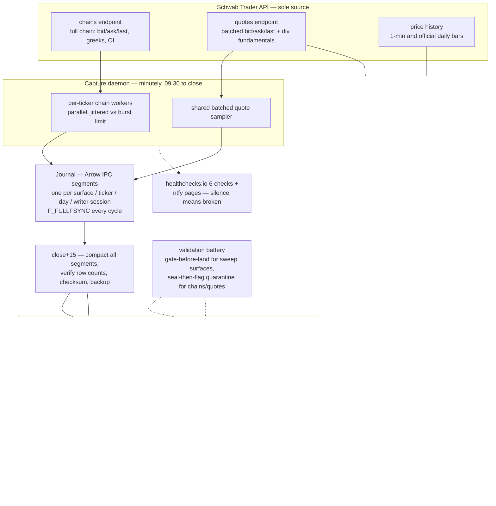

# Marketlake — design

A Schwab-first, capture-driven data lake. It records full option chains and equity quotes at one-minute cadence. Both carry bid, ask, and last. Capture starts with SPY and QQQ. The design is generic over any ticker. The marginal cost is zero.

Status: DESIGN, 2026-08-24. Tickers: SPY, QQQ, plus an open set. Cadence: 1-min.

## Contents

- [Premise: history you can't buy back](#premise-history-you-cant-buy-back)
- [Source: one vendor, one cross-check](#source-one-vendor-one-cross-check)
- [Auth: the seven-day token, engineered around](#auth-the-seven-day-token-engineered-around)
- [Storage: immutable Parquet, DuckDB on top](#storage-immutable-parquet-duckdb-on-top)
  - [The security master](#the-security-master)
- [Schedule: the capture clock](#schedule-the-capture-clock)
  - [Minutely mechanics](#minutely-mechanics)
  - [Failure handling](#failure-handling)
  - [The dashboard](#the-dashboard)
- [Derived: trust your own greeks](#derived-trust-your-own-greeks)
- [Corporate actions: actions as data, adjustment as a view](#corporate-actions-actions-as-data-adjustment-as-a-view)
  - [Backtesting across corporate actions](#backtesting-across-corporate-actions)
- [Validation: fail closed, quarantine loudly](#validation-fail-closed-quarantine-loudly)
- [Onboarding: any ticker, one command](#onboarding-any-ticker-one-command)
- [Sizing: storage estimates](#sizing-storage-estimates)
- [Deployment: laptop now, dedicated later](#deployment-laptop-now-dedicated-later)
- [Tradeoffs: prices, named](#tradeoffs-prices-named)
- [Build order: five slices, then MVP milestones](#build-order-five-slices-then-mvp-milestones)
- [Appendix: prior art (surveyed 2026-08-25)](#appendix-prior-art-surveyed-2026-08-25)
- [Appendix: verification sources](#appendix-verification-sources)

## Premise: history you can't buy back

Free historical option-chain data with greeks essentially does not exist. Free *forward* capture does. A Schwab brokerage account serves the complete chain in a single real-time API request, at no cost. The chain covers every expiration and strike. Each contract carries bid/ask, volume, open interest, IV, and engine-computed greeks. Three glosses at first use. Open interest, OI, is the count of contracts outstanding. IV, implied volatility, is the volatility a pricing model backs out of a quote. Greeks are the price sensitivities: delta, gamma, theta, vega, rho. So the architecture is **capture-first**. The option database begins the day the pipeline turns on. It compounds daily from there. Every snapshot not taken is gone forever. That makes capture reliability the design's first-order concern. It ranks ahead of query speed and ahead of schema elegance.

The pipeline in one line:

Schwab Trader API → capture jobs (launchd on the Mac or systemd on a Linux VM, sequential, resumable) → raw lake (immutable Parquet partitions) → derived layer (greeks, adjustments, OI alignment) → DuckDB + loader API.

Raw stores what the vendor said, verbatim. Everything computed lives downstream and is regenerable.


```mermaid
flowchart TB
  subgraph SCHWAB["Schwab Trader API — sole source"]
    CH["chains endpoint<br/>full chain: bid/ask/last, greeks, OI"]
    QT["quotes endpoint<br/>batched bid/ask/last + div fundamentals"]
    PH["price history<br/>1-min and official daily bars"]
  end

  subgraph CAP["Capture daemon — minutely, 09:30 to close"]
    W["per-ticker chain workers<br/>parallel, jittered vs burst limit"]
    QS["shared batched quote sampler"]
  end

  J["Journal — Arrow IPC segments<br/>one per surface / ticker / day / writer session<br/>F_FULLFSYNC every cycle"]

  CMP["close+15 — compact all segments,<br/>verify row counts, checksum, backup"]
  SWP["18:30 — vendor EOD sweep<br/>actions poll, bar fetch, battery"]

  subgraph LAKE["Lake — immutable Parquet, DuckDB on top"]
    CP["chains/ + quotes/<br/>406 snapshots per session-day"]
    BP["bars/ + actions/"]
    RP["reference/ — security master,<br/>contracts, instrument_id"]
    MF["manifest.jsonl — integrity root,<br/>single-writer, last-entry-wins"]
  end

  BAT["validation battery<br/>gate-before-land for sweep surfaces,<br/>seal-then-flag quarantine for chains/quotes"]
  BK["backup_target — external SSD over rsync,<br/>or a versioned S3 bucket, daily"]
  DV["derived views — OI join, adjusted bars<br/>(greeks_v1 spec: deferred)"]
  RD["load_* API + dashboard<br/>localhost read-only query service"]
  MON["healthchecks.io 6 checks +<br/>ntfy pages — silence means broken"]

  CH --> W
  QT --> QS
  W --> J
  QS --> J
  J --> CMP
  CMP --> CP
  CMP --> MF
  PH --> SWP
  QT --> SWP
  SWP --> BP
  BAT -.-> BP
  BAT -.-> CP
  LAKE --> DV
  DV --> RD
  LAKE --> BK
  CAP -.-> MON
```

*The data plane runs left of the battery. The trust machinery runs right of it. Everything the capture loop hears from Schwab lands verbatim in journal segments and is sealed immutable at close+15, with its checksum in the manifest. The evening sweep's surfaces, `bars/` and `actions/`, are instead validated before they land. The battery judges both and never rewrites either. The control plane is omitted here: launchd or systemd, pmset wakes, the caffeinate assertion, and exchange_calendars session times. It schedules every box on the left.*

## Source: one vendor, one cross-check

| Source | Role | Verified limits |
| --- | --- | --- |
| **Schwab Trader API**, the data path | Chain snapshots: one request returns the full chain with bid/ask/last, greeks, and OI. Batched equity quotes: one request returns bid/ask/last for every ticker. Equity bars: 1-min and official daily, fetched forward only. The \~30-day 1-min lookback matters solely as outage recovery. Dividend fields on quotes. | 120 req/min per app. The refresh token expires every 7 days. Manual browser re-auth is the only renewal. Free with account. Real-time only if the account's exchange agreements grant it. That is asserted at onboarding and watched by the battery, never assumed. |

Everything in the lake is Schwab-sourced. That keeps lineage trivial: one vendor, one auth, one set of quirks. All Schwab figures were re-verified Aug 2026 against maintained client libraries. Sources are listed at the end. The official portal gates its docs behind login.

## Auth: the seven-day token, engineered around

Schwab's refresh token dies every 7 days with no programmatic renewal. An interactive browser login is the only reset. The design treats this as a first-class subsystem, not an inconvenience:

- **Sunday-evening re-auth ritual.** Re-login every Sunday. It takes \~1 minute with `schwab-py`, which auto-handles the 30-minute access-token refresh inside the week. The deadline lands on a non-trading day. A token minted Sunday covers the full Mon–Fri week. A few hours' slip costs nothing because the market is closed. The ritual has a command: `python -m lake.reauth`, rendered beside the install files as `reauth.sh`. It reads the two app credentials and `schwab_callback_url` from `config.yaml`, runs schwab-py's browser login, and writes the token through a temp file and one rename. schwab-py's own writer truncates the token file before the new contents exist, so a failure part-way through would destroy a working credential at the one path capture cannot start without. The atomic write leaves the working token where it was instead. Because the write cannot tear, re-authing over a still-valid token is allowed and wanted. It costs one login and mints a fresher one, which is what the coverage assertion below tests for. The command refuses when stdin is not a terminal. A login flow needs a person and a browser, and an unattended job pointed at it would otherwise wait out schwab-py's five-minute callback timeout and then fail, which reads as a broken job rather than a misuse of one.
- **Sunday 20:00 ET canary.** After the re-auth window the scheduler makes one throwaway authenticated call **plus a coverage assertion**. The assertion: the refresh token's mint time + 7 days must clear the coming Friday's option close. A still-valid leftover from a late prior-week re-auth therefore cannot pass for a fresh one. Validity is not freshness. Either failure alerts. The canary then **re-runs every 30 minutes until it passes or 23:00**. A ritual done any time Sunday evening clears it. A ritual done *after* the 20:00 run is not stranded as a false failure. The check's deadline is 23:30, not 23:00. The last retry *starts* at 23:00, so the deadline carries it half an hour to finish. The retry cutoff and the check's deadline are different moments, and a deadline set to the cutoff pages on a canary that passed. That still leaves a whole night of slack rather than a hole in Monday's data. A Sunday 19:55 one-shot wake, set by the Friday vendor-sweep job, guarantees the machine is up to run it.
- **Loud mid-week alerting.** Any 401/`invalid_client` during capture pages immediately. Silence is the failure mode. While Schwab is dark, nothing is being recorded.

**The token handoff is a rule, not luck.** Every process that builds a client from `token.json` can write it. The daemon, onboarding, the close+5 fill and the Sunday canary refresh the access token. The Sunday ritual's re-login replaces the token whole, and so does the token pull below, on a host with no browser, when the token parameter holds a later mint. Every one of those writes goes to a temp file at mode 0600 and lands by one rename, so a reader meets the old token or the new one, never part of either (marketlake [#564](https://github.com/l3a0/marketlake/issues/564)). Three sentences coordinate them. The daemon checks `token.json` at the top of every capture cycle, the same per-cycle re-read `tickers.yaml` gets. If the file's mint time is newer than the in-memory token's, the daemon rebuilds its client from the file before fetching. That rule is what makes "capture resumes the instant re-auth happens" true. Refreshes run one at a time in a process, and a client whose token has expired first adopts the file's token and its mint time, refreshing only if that token has expired too. So a refresh writes back the mint time of the file it read moments before, not the one the client was built with. That narrows the race where a mid-session re-auth could be clobbered by a scheduled refresh to the length of one token request, since a re-login is a separate process and takes no lock. And the per-cycle journal mint stamp comes from the token object the client is actually using, never from a separate file read. The dashboard therefore shows the token capture actually runs on.

The token file lives at `~/.config/marketlake/token.json`, `chmod 600`. It sits outside the repo **and outside the synced lake tree**, so the backup sync never touches it. Its whole directory, `~/.config/marketlake/`, is excluded from OS-level backups too, via `tmutil addexclusion` for Time Machine. A brokerage credential must not ride onto a stealable backup disk that lacks FileVault's protection. The directory rather than the file, for two reasons. `config.yaml` sits beside the token and holds four secrets of its own, up to eight once the bucket's access key and the token store's put key are added, so excluding the token alone left those on the disk. And a sticky exclusion is an attribute on the item, so it dies when the item is deleted and re-created. That is how most editors save `config.yaml` and how a re-login rewrites `token.json`. A directory's inode survives its files being rewritten. The fixed-path form survives too, but `man tmutil` requires root and Full Disk Access for it, and this step runs as the owner. Nothing in the directory is restored from a backup in any case: `config.yaml` is rewritten per machine, the token reaches a second host through the token parameter below, and `tickers.yaml` is copied from the repository's tracked `config/tickers.yaml` (see Deployment). The Sunday maintenance run reads the exclusion back with `tmutil isexcluded`, which needs no root, and a lost exclusion rides the nightly report. FileVault is macOS full-disk encryption. The token is a full brokerage credential. But the Schwab app is registered with the Market Data product only. The portal offers one or both products. So the token cannot place trades even if exfiltrated. Two more auth rules: the re-auth reminder pages on the same ntfy channel, **on Sunday only**. It fires on the failing 20:00, 21:00, and 22:00 canary runs, stops once the week's re-login is done, and never fires mid-week. A full re-login on *any* day still mints a fresh 7-day token. Re-authing Friday evening before a trip therefore covers through the following Friday. A trip that skips the ritual entirely means the token dies mid-week and capture gaps until you're back. That is an accepted phase-one cost, same family as the laptop being out the door. One rule kills the phishing chain regardless of alert-channel security: **pages never carry actionable auth links**. The Sunday re-auth always starts from a bookmarked or typed Schwab URL, never from a notification.

**The token parameter carries the token to a host with no browser** ([#636](https://github.com/l3a0/marketlake/issues/636)). The hosted VM captures on a token it cannot mint, because the login needs a browser and the VM has none. So the laptop's weekly re-auth also puts the token into one SSM Parameter Store parameter, the `SecureString` `/marketlake/config/schwab-oauth-token`, whose value is the JSON text of `token.json`. The VM copies it into its own `token.json` with `python -m lake.token_store pull`. One token on two hosts is safe because of a measurement. [#633](https://github.com/l3a0/marketlake/issues/633)'s token test on 2026-10-05 found that a refresh issues a new access token and leaves the refresh token unchanged, and that a refresh on one host does not revoke the other. So each host refreshes its own access token locally, the parameter only ever holds what a re-auth minted, and the VM never writes back. Not measured: whether a new login revokes the previous refresh token.

A per-host `config.yaml` key, `token_store`, says what each host does with the token. `file`, the default when the key is absent, is today's laptop: the re-auth writes `token.json` and nothing else. `both` writes the file and then the parameter, which is the laptop once the VM exists. `store` does the same and marks a host whose scheduled pulls run, which is the VM ([#702](https://github.com/l3a0/marketlake/issues/702) adds those pulls). Any other value prints one line naming it, writes the file, puts the parameter when the credentials allow, and lets the pulls run, so a mistyped value never costs a week's token. The loader refuses nothing for the key, because it runs every capture cycle. `role` cannot carry the same meaning, because the laptop is `primary` both before and after the VM exists and its re-auth must write differently in the two states.

The re-auth writes the file first, so the token is on disk whatever the put does next. Under `both` and `store` it checks the put's three keys before the browser opens and refuses with exit 2 when one is missing. It puts only a token this run wrote, and it sends the JSON text it wrote rather than reading the file back, because a refresh that read the old file could land in between, the race named above. The put is `PutParameter` with `Type=SecureString`, `Tier=Standard` and `Overwrite`, no `Tags` and no `KeyId`, so the AWS-managed key encrypts it and an account whose default tier is Advanced creates no billed parameter. A value over the standard tier's 4,096 bytes is refused before the call. A successful put prints the parameter's version number, which is the operator's only proof at the terminal, because the laptop holds no grant to read the parameter. Exit 3 means `token.json` was written and the parameter was not. Its one line names the token's path, the AWS error code and the fix. A refused or unknown key is fixed in the `token_store_*` keys, and any other code by running `reauth.sh` again. An AWS error is reported by its code alone and a botocore error by its type name alone, because both can carry the value that was sent.

The pull writes `token.json` in three cases only.

1. The local file is absent.
2. The local file cannot be read or holds no mint time.
3. The parameter's mint time is strictly later than the local file's.

schwab-py writes the original `creation_timestamp` back unchanged on every refresh, so the comparison is between re-auths, and an equal mint time writes nothing. A parameter whose mint time is more than an hour past the VM's clock is refused as unreadable and writes nothing, even over an absent file. A forged put with a far-future mint time would otherwise outrank every later re-auth. The price is that the comparison now reads the VM's clock, and the hour absorbs any skew between it and the laptop that stamped the mint. The pull follows `bucket_credentials`, which is the instance profile on the VM, and reads no `token_store` and no `role`, so it runs on a shadow host as the VM's first boot does. It exits with one of four codes.

1. 0 when it wrote the file or found it current.
2. 1 when the parameter is older or unusable, or `token.json` could not be written.
3. 2 for a config problem.
4. 3 when the instance profile is not yet serving credentials, the one case worth retrying.

Reads are eventually consistent, so a pull right after a put can report `current` and the next one finds the new token.

The parameter is an off-host copy of a brokerage credential, and two rules above keep that credential off a stealable copy.

1. The config directory is excluded from backups.
2. The token never sits in the sync root.

The parameter keeps to both reasons. Neither rule is about where the token may live. Both stop it riding onto a copy that a thief can read without the owner's keys. The parameter is encrypted under KMS, and only two principals reach it.

1. The VM's instance role reads it.
2. A separate IAM user, which [#699](https://github.com/l3a0/marketlake/issues/699) creates, may only put it.

Both CI roles are denied any read of the path. A stolen backup disk or bucket copy holds none of it. The rejection of keeping a previous token beside the new one, in the Deployment section below, turned on a restore path that can itself be got wrong. The pull is such a path, and it answers that risk two ways.

1. It never writes over a later mint time, so a stale parameter cannot replace a live token.
2. Over an absent file the worst it can write is a dead token, which reaches the operator as the auth-death page rather than as a silent restart.

The put signs with its own three keys, `token_store_access_key_id`, `token_store_secret_access_key` and `token_store_region`, which hold the put-only user's key. They never fall back to the `bucket_*` keys, and the client is built by the same code as the bucket's, so the isolation rule under Configuration, defined, below covers it. That user's key outlives the cutover, unlike `marketlake-backup`'s, so the reason given below for rejecting IAM Roles Anywhere or SSO for the laptop does not carry over to it. A different reason does. Both deliver credentials through `~/.aws` or a `credential_process`, which that rule forbids for every AWS client, and changing the rule for one weekly put costs more than a key whose worst case is one overwritten parameter. The owner chose the key on 2026-10-06.

Eight alternatives are **considered and rejected**.

1. *Reading and writing the token through the store from the daemon on every cycle*, with schwab-py's `client_from_access_functions`. That puts the store on the healthy capture path: 390 reads a session and a write on every 30-minute refresh. A store outage would then cost captured minutes, and the daemon, the eod-sweep and the Sunday job would all write one remote token with nothing ordering them.
2. *A pull on its own timer.* [#634](https://github.com/l3a0/marketlake/issues/634) gives both hosts one job roster, so the laptop would carry the job too, and its schedule type expresses one time a day, not an interval.
3. *Using `role` as the topology.* The laptop is `primary` before and during the shadow day, and its re-auth must write differently once the VM exists.
4. *A `--push` retry with no browser.* It has run zero times, and re-running `reauth.sh` is a one-minute login the ritual already treats as the repair. The laptop's move to `both` fills the parameter the first time.
5. *A page when the parameter is older than the VM's file.* The VM's file can carry a later mint time only after a login on the VM, which has no browser and no put grant. The pull still refuses to write in that case.
6. *`client_from_manual_flow` over SSH every Sunday.* It needs no store, but it turns the weekly ritual into an SSH session and a pasted redirect URL. It stays the deferred headless variant.
7. *Falling back to the `bucket_*` keys for the put.* `marketlake-backup` holds no grant to put the parameter, so a fallback could only ever end in `AccessDenied` after a good login.
8. *A named `~/.aws` profile for the put.* Every AWS client here is built from `config.yaml` alone, so a development run cannot reach a real parameter on credentials it happened to find.

## Storage: immutable Parquet, DuckDB on top

The quarantine ledger has two writers and its rules are split between them. [#406](https://github.com/l3a0/marketlake/issues/406) built `lake.battery`, which writes the verdicts, and it pins the entry's five fields, the `clean` and `quarantined` vocabulary, the append-on-transition rule, and the rule that a pass never clears a verdict another check wrote. [#426](https://github.com/l3a0/marketlake/issues/426) made that last rule structural rather than a writer-side guard, by keying the ledger's resolution on `(partition, check)`. [#139](https://github.com/l3a0/marketlake/issues/139) is the sign-off tool and is authoritative for the human half, including the precedence rule `lake.battery` implements on its behalf.

The lake is Hive-partitioned Parquet with DuckDB as the query engine. Hive partitioning means directory names carry key=value pairs, like `ticker=SPY/date=2026-08-24`, so query engines prune by path without opening files. The format is columnar, so chains compress \~10×. It is append-friendly, offers plain SQL from Python, and needs zero server administration. Each top-level directory below is a **surface**: one kind of measurement with its own pinned schema, partitioning, and capture path. The surfaces are the market's activity observed through distinct faces: what options quoted, what the stock quoted, what traded, what positions stood open, what corporate events occurred. "Surface" throughout this doc means exactly that unit. `reference/` is the one non-surface. It is identity, not measurement.

```text
lake/
  bars/ticker=SPY/freq=1m/date=2026-08-24.parquet    # official trade bars, as-traded
  quotes/ticker=SPY/date=2026-08-24.parquet          # minutely bid/ask/last samples
  chains/ticker=SPY/date=2026-08-24.parquet          # 406 minutely snapshots (session-length, or 226 on a half-day), snap_ts column
  journal/date=D/surface={chains,quotes}/ticker=T/seg-<start_ts>-<pid>.arrows
                                                      # today's open capture: one segment per surface, ticker,
                                                      # and writer session, compacted at close+15
  journal/timing/date=D.jsonl                         # one line per request a capture cycle, close+5 fill or onboarding
                                                      # makes: sent, answered, finished (#531), and one per capture
                                                      # cycle: landed, lock waited and held, ended (#537)
  journal/outbox/date=D.jsonl                         # shadow host only: one line per ping or page recorded
                                                      # rather than sent (Shadow role, defined)
  quarantine.jsonl                                    # battery verdicts — append-only, restores with the lake
  reference/security_master.parquet                   # instrument_id <-> ticker/FIGI/OCC symbol, date-ranged
  reference/contracts.parquet                         # instrument_id -> contract terms
  reference/schema_versions.parquet                   # schema_version -> each surface's column shape
  actions/corporate_actions.jsonl                     # splits + dividends, all tickers — append-only
  manifest.jsonl                                      # partition, source, sha256, rows, fetched_at
```

Two rules make it durable. **Compacted partitions are immutable**: the close+15 compaction job writes each day's partition once, checksummed into the manifest. Replacements are atomic or not at all. The only files ever written after creation are today's journal segments, the three append-only ledgers, `manifest.jsonl`, `quarantine.jsonl`, and `actions/corporate_actions.jsonl`, each written only by single-line `O_APPEND`, the request timing files under `journal/timing/` and, on a shadow host, the outbox files under `journal/outbox/`, both appended the same way, the journal metadata stamp `journal/metadata.json`, rewritten each minute by one rename, and the reference tables under `reference/`. A reference table is rewritten rather than appended because Parquet has no in-place append, and each rewrite goes to a temporary path and renames, so the atomic-or-not-at-all rule above covers it. **Raw is vendor-verbatim**. That includes Schwab's greeks and IV. It also includes the chain-level header fields `interestRate`, `underlyingPrice`, and `dividendYield`, stored as columns on the chains rows. The equity quote is captured the same way. Every field Schwab returns across its `quote`, `fundamental`, `regular`, and `extended` blocks lands in a typed column, the dividend fundamentals included. So bad vendor data is diagnosable forever rather than silently laundered.

**Manifest protocol.** The manifest is the integrity root, so its own rules are explicit. (1) *Single writer:* only the serialized daily jobs and the quarantine sign-off tool append to `manifest.jsonl`. The daily jobs are compaction and the vendor sweep. Capture workers write journals only. Serialization is a **lock, not a schedule**. Every job that appends to the manifest or seals a partition runs under one blocking advisory `flock` on `manifest.jsonl`, the lake-root lockfile. That covers the daily jobs, any manual re-run, and each capture cycle's manifest append. Gap marking takes it too, except for a pass over today's minutes run at or before today's option close, which no compactor may seal under ([#644](https://github.com/l3a0/marketlake/issues/644)). The `flock` is the kernel's file lock, held on the open descriptor rather than written into the file. So locking the manifest adds no bytes and no new file to exclude from the scrub. *Blocking* means a second job waits its turn rather than racing. *Advisory* means the lock is a contract among our own cooperating jobs. The kernel releases the lock automatically when the holder dies. So a crash never strands a stale lock the way delete-a-lockfile schemes do. Under the lock, a launchd sleep-missed catch-up (a run launchd fires on wake for a scheduled time the machine slept through. The Build order defines this fully.) or a hand-invoked compaction cannot race a scheduled one. Two compactors over the same segments is the one dangerous pair. Compaction's sweep scope is bounded to ticker-days whose **option close + 5 has passed**. Close + 5 is the option-close guard window. The close+5 fill fetch is a sanctioned post-close journal write. So no compactor may seal a day the daemon can still legitimately append to. The scheduled close+15 run is unaffected. A catch-up run firing mid-session likewise never sweeps the live day. Nor does it unlink a segment the daemon holds open. Capture fetches and writes its segments outside the lock, since blocking a fetch behind compaction would drop perishable minutes. A cycle takes the lock once, after its segments are durable, for its manifest append. And recovery is **manifest-aware**. Before compacting a swept ticker-day, consult the manifest. If a last entry for that partition already exists, no automatic or catch-up run ever recompacts. Instead sha-verify the partition and finish the interrupted cleanup by deleting debris segments. Debris segments are the only reachable leftover state once the sweep bound is close+5. They come from a crash between the manifest append and the last segment unlink. Fail loudly to human review on any mismatch. The review's one repair tool is a deliberate, human-invoked recompaction. It runs under the lake-root flock, only while the day's segments still exist, and appends a superseding manifest entry. Standing invariant: **no automatic run ever replaces a manifested partition with fewer rows than its recorded count**. Without these rules, a late segment beside a sealed day would let the next sweep rebuild a full partition from one segment. Every integrity layer would bless it. The nightly backup would then propagate the loss. A path target's `rsync` would copy it over the good backup, and a bucket upload would make it the current version, leaving the good one recoverable only as an older version. (2) *Atomic appends:* one entry = one line via a single `O_APPEND` write. `O_APPEND` is the kernel's atomic append mode: concurrent writers cannot interleave within one write. Readers and the scrub discard a torn trailing line. That is the same rule as a torn journal tail. (3) *Last entry wins*, keyed by partition path. This makes that human-invoked recompaction harmless by construction. A re-run legitimately appends a second entry. Its sha256 legitimately differs after a library upgrade, since Parquet footers embed the writer version. The scrub verifies only the last entry per partition. (4) *Two-way scrub:* Sunday's scrub checks both directions. Every entry's file must exist and match its last sha, **and** every lake file must have a manifest entry. The reverse pass is what catches a crash between a partition write and its manifest append. For the journal-less surfaces, `bars/` and `actions/`, such a crash would otherwise leave a permanently invisible orphan. The scrub's exclusion set is enumerated, not implied: `{manifest.jsonl, journal/, reports/}`. The manifest cannot cover itself. Journal segments are manifest-less by rule 1. And the nightly report is not a measurement, so it never gets an entry, which is the same reason the orphan sweep skips `reports/` by name below. The quarantine ledger is deliberately not on this list. The battery refreshes its manifest entry after each run, so the scrub checks its sha like any sealed file. The one exception: a slice-1 cron run appends an entry keyed by its segment path. The scrub treats that entry as superseded once an entry exists for the matching compacted partition. So compaction's verify-then-delete never strands a slice-1 entry into a forward-pass failure.

**The quarantine list lives at `lake/quarantine.jsonl`**, inside the backup sync root by construction. So a disk-loss restore carries the verdicts *with* the data. A quarantine list left outside the backup would silently un-quarantine corrupted partitions on restore. That is the delayed-feed class the battery calls silent whole-row corruption. It follows the manifest's own line rules, apart from what a reader does about a torn line, which [#469](https://github.com/l3a0/marketlake/issues/469) below parts from: one entry per single `O_APPEND` write, torn trailing line discarded, last entry wins. So un-quarantine is an explicit superseding entry, never a deletion. The key is `(partition, check)` rather than the partition alone, because several checks judge one partition and each keeps its own current verdict. A partition is withheld while any check withholds it. Resolving on the partition alone kept whichever line landed last, so one check's `clean` buried another check's quarantine and the partition read with the fault standing, which is [#426](https://github.com/l3a0/marketlake/issues/426). The composite key is the same rule `actions` already resolves on, where the key is `(instrument_id, ex_date, type)`. Its writers are the serialized nightly battery plus provenance-tagged human sign-off rows. The battery runs inside the vendor-sweep job, already a sanctioned manifest writer. It refreshes `quarantine.jsonl`'s own manifest entry after each run. Human sign-off rows land only via the **sign-off tool**. The tool runs under the lake-root `flock` like any manual lake-mutating job. It appends the quarantine row *plus the refreshed manifest entry in the same locked invocation*. So a weekend sign-off never leaves the Sunday scrub facing a sha the sweep hasn't caught up to. And human verdicts take **precedence over re-runs**. Before appending, the battery reads that check's own current entry for the partition. If it is a human sign-off row, a verdict from the *same* check never supersedes it. Reading the check's own entry rather than the partition's last line is what keeps a later entry from any other check hiding the sign-off. The battery logs "re-observed, human precedence stands" to the nightly report. Quarantine rows cover only sealed-immutable partitions, so same check + same partition is deterministically the same finding. Only a different check's failure, or a new human row, may supersede.

### The security master

Every symbol the market uses is mutable. Tickers change: FB→META, and the Nasdaq-100 ETF itself traded as QQQQ until 2011. The OCC is the Options Clearing Corporation, the clearinghouse behind every US listed option. Its symbology names each contract. Even those OCC option symbols are reissued when the OCC adjusts contracts after a corporate action. So no external symbol is the primary key. The **security master** is the standard reference-data table for exactly this problem. It assigns every instrument an internal `instrument_id` that never changes. It maps that id to external identifiers with validity date ranges: ticker, [FIGI](https://www.openfigi.com/), and OCC symbol for contracts. FIGI is the one globally-standard security identifier that is free and openly licensed. CUSIP and ISIN are paid.

Raw rows store the vendor's symbol verbatim. Raw is vendor-verbatim, always. The derived layer resolves symbols through the master as-of the row's date. All joins run on `instrument_id`. A rename or an OCC re-symboling then adds a mapping row instead of orphaning history. The same instrument threads through under one key. [#353](https://github.com/l3a0/marketlake/issues/353) built the writer, in `lake.occ_mapping`, which the split detector calls once a boundary is confirmed, meaning one it has dated to a single session and can read both deliverables across. It pairs a re-symboled contract's old symbol to its new one on `ssid`, Schwab's own contract identifier, since the symbol moves and the contract behind it does not, and it registers the contract before remapping it because `remap` closes an open mapping and nothing had ever opened one. Only a contract a re-symboling touched gets an instrument, so an ordinary contract's symbol resolves to nothing and a reader keys on the `instrument_id` where there is one and on the symbol where there is not. Partition paths keep human-readable tickers purely as a filing convention. Identity lives in the master, not the path.

CUSIP and ISIN are deliberately excluded from the master. Schwab's equity payloads include a CUSIP. It stays in the raw rows under the vendor-verbatim rule, in a `cusip` column on the equity quotes. But it is never promoted to a join key and never published. It has one internal use. The deferred FIGI backfill resolves each instrument's FIGI from its captured CUSIP, because a CUSIP is an unambiguous OpenFIGI lookup key. That resolution is private, never a published key. CUSIP is licensed IP, ABA-owned and FactSet-operated. Building a database keyed on it is the use its operator charges for. A US ISIN embeds the CUSIP as `US` + CUSIP + check digit. So it inherits the problem while adding no information. Nothing in the lake may depend on an identifier that would owe fees to redistribute.

## Schedule: the capture clock

All jobs run from launchd on the Mac and from systemd on a Linux VM. launchd is macOS's built-in service manager and job scheduler, and systemd is Linux's. Two alerting words also recur before their full definitions later in the doc. To *page* is to push an immediate phone alert. The *dead-man check* is an external timer that alerts when expected pings stop. They are resumable and fail-closed to quarantine. **All intraday times are session-relative**, derived per day from `exchange_calendars`. *Close* means the day's option close. For these ETFs that is session close + 15 minutes: 16:15 on regular days and 13:15 on the 2–3 early-close days a year (day after Thanksgiving, Christmas Eve). The table shows regular-session times. Nothing keys on a wall-clock 16:15. **Full holidays are the same mechanism one step further**. A holiday is simply not a session. The loop never starts, there is no close to tag, and compaction and the sweep no-op on an empty journal. No gap rows are written, because a gap means "market open, capture missing." Good Friday is why the library matters: a market holiday that is not a federal holiday. Three holiday wrinkles are pinned. On a non-session day the daemon keeps sending dead-man pings *at the normal cadence*, tagged "market closed per calendar" in the ping body. healthchecks.io is a pure countdown timer with no content awareness. Keeping the timer fed is the only way to avoid false-paging every holiday while keeping silence-means-broken true around the clock. The pause API was considered and rejected. A paused check that never receives its resume ping stays silent forever. That removes the safety net exactly when nobody is looking. The ping's meaning is calendar-deterministic. On session days it means a durable capture cycle. On non-session days it means a daemon that is healthy and *correctly* idle. The inverse case is an **unscheduled closure** the static calendar can't know about. The first cycle's vendor quote-time guards it. If that quote-time is not same-day fresh, the day is flagged *suspected unscheduled closure* rather than captured and trusted. OI needs no holiday handling at all. It is a derived view over the next *captured* session's chains. A Monday holiday simply means Friday's OI derives from Tuesday's cycles. The dashboard renders non-session days as *no session*, never 0%. One provenance fact governs all of this: `exchange_calendars` is rules-plus-exceptions *source code*, not a feed. It learns about schedule changes only through package releases, so the Sunday maintenance run checks it for updates. Calendar errors get guards in **both** directions. Says-open-but-closed is the freshness check above. Says-closed-but-open is the worse failure: a stale calendar idling the daemon through a real session. It is caught by a single 09:35 probe request over the roster on every weekday the calendar calls closed. A fresh vendor timestamp pages "Calendar says closed, market looks open." A stamp the shared epoch transform refuses is not a fresh one, and it is counted rather than dropped. Counting it as fresh would page on every closed day a vendor sends junk, and a page that fires on ordinary holidays is a page nobody reads. Dropping it silently fails the other way. A batch reads as quiet when nothing in it was readable, and that looks exactly like a market that is genuinely shut. So a batch carrying a refused stamp and no readable one reports a problem rather than a quiet day. That is already the answer an unreachable vendor gets, and it pages no more than an unreachable vendor does. A batch of nothing but absent stamps is not this. The vendor staying quiet about a symbol is the ordinary case, and reporting a problem on it would fire on every quiet day. That is [#229](https://github.com/l3a0/marketlake/issues/229). All of that reads a batch of quotes, and the reply carrying the batch is checked before any of it. The vendor answers with a status, a body, and headers, and the probe read neither of the first two. It handed the whole reply to the batch reader, which asked it for symbols and raised, so a probe that reached the vendor would have died before it pinged, while the check read green on every weekday the probe returned early. The status is read first, because Schwab reports a dead token and a throttle as a status on a returned reply rather than as a raise, and a probe that never looks reads a dead token as the calendar being right. The Sunday canary checks the status for the same reason. The body must then be a mapping of symbol to envelope, and what the reader sees is narrowed to the symbols the probe asked about. A reply naming none of them, and a reply naming some of them and carrying a quote envelope for none, each report a problem rather than a quiet day. Otherwise they are indistinguishable from a reply naming the whole roster with every stamp absent, which is the ordinary quiet day the paragraph above protects. Narrowing is what keeps a symbol nobody asked about out of the answer, and it keeps Schwab's own errors block from counting as one more symbol the vendor stayed quiet about. Each of these reports a problem and pages nobody, the same as an unreachable vendor. That is [#253](https://github.com/l3a0/marketlake/issues/253).

The capture loop is **parallel per ticker**. Each ticker has its own worker firing at the top of the minute. Workers are staggered by a few tens of milliseconds, so the concurrent volley stays clear of Schwab's burst rejection (429-005). Cycle wall-time stays flat as the roster grows *until local resources bind*. The 120 req/min cap is the **vendor** ceiling: \~115 minutely full-chain tickers by request arithmetic alone. The **local** ceiling is aggregate payload bytes, JSON parse, and journal-append throughput, all scaling with the roster's total chain size. That ceiling is measured, not assumed. Slice 1's day-one measurements feed it. The roster ceiling is whichever binds first. The cap is scoped to the **app's `client_id`**: the credentials, not the IP or machine. The budget therefore travels with the token on any future migration. Anything else using the same keys, such as a notebook or an ad-hoc curl, draws from the daemon's 120. The rule is that the daemon's app credentials are used by the daemon alone. One honesty note on provenance: Schwab's official docs throttle-document only *order* operations (0–120/min per account, GETs called "unthrottled" there). The 120/min on market-data GETs is the observed app-level limit every maintained client reports being enforced via 429. It is real but not contractual, so it could shift without notice. Multiplying the budget with extra accounts/apps is considered and rejected. Registration is identity-tied, so the vector barely exists. Quota-farming stresses the one relationship the entire lake depends on. Account standing is the real single point of failure, and lost capture is unrecoverable. Extra credentials also buy headroom in the wrong dimension, because the local parse budget binds before the vendor cap. A roster that truly outgrows 120/min graduates to paid data, not credential arithmetic. Sustained polling at the published cap is untested territory for a single retail app. The adaptive stagger and the 429 page are the tripwires. None of this binds at two tickers and 3 of 120 req/min. The equity-quote sampler is never the roster ceiling. The quotes endpoint batches a comma-separated symbol list. Its practical cap is in the hundreds per request, URL-length bound. The exact cap is a day-one measurement. The sampler's cost therefore grows as ⌈tickers / batch⌉: one request for dozens of tickers, a handful for a thousand. Payloads stay sub-second throughout. The roster ceiling belongs entirely to the chains, which cost one request and megabytes per ticker per minute. Failure isolation comes free on the chains surface. Skip-not-block applies per ticker, so one hung chain request drops that ticker's minute and touches nothing else. The quote sampler is the stated exception: it is one shared failure unit, and a hung batch drops every ticker's quotes minute, journaled as per-ticker gap rows.

| ET | Job | Detail |
| --- | --- | --- |
| Sun eve | **Re-auth ritual** | Manual browser login. New 7-day token. One human minute per week. |
| Sun 20:00 | **Canary + weekly maintenance** | Throwaway authenticated call, alert on failure. Then the checks too slow or pointless to run nightly: an integrity scrub re-verifying manifest checksums across the whole lake and, except on a shadow host, the backup copy (bit-rot / partial-sync detection), a restore test that reads the week's share of the target back and verifies it, a disk-runway check (free space ÷ trailing growth rate, flags the nightly report under a few weeks of headroom), and log rotation. Nothing here touches data. Journal compaction and the backup sync run daily at close+15. |
| Mon–Fri 09:30–close | **Minutely capture loop** | Every minute: one full-chain snapshot per ticker (bid/ask/last, greeks, OI per contract), plus one shared batched equity-quote sample (bid/ask/last, all tickers in a single request). The chain snapshots are fired by per-ticker workers in parallel. That is 3 of 120 req/min for SPY+QQQ. Runs to the session's option close: 16:15 regular days, 13:15 early closes. Skip-not-block, per ticker: a slow request drops that ticker's minute rather than shifting any later sample. |
| close | **Close tags** | Not separate fetches. Two existing loop cycles get tags. The cycle at the *equity* close (16:00 regular days) is tagged `spot_close`. It is the last regular-session-synchronous cycle: option marks and underlying top-of-book at the same *pre-auction* moment. It does **not** contain the official close. The closing-auction print disseminates seconds after 16:00:00 and lands in `bars/` via the sweep. The tagged cycle supplies the moment-matched option marks to sit *beside* that close. 16:15 option marks against a 16:00 close would mix moments. The loop's final cycle at the *option* close (16:15) is tagged `option_close`: the option market's close of record. The close+5 guard is **per-tag and asymmetric**. If the journal lacks the `option_close` cycle because the daemon died late, a direct fetch fills it. That is legitimate only because option quotes freeze at the option close, so a close+5 fetch still observes the closing marks. The fetch runs the chain chunk plan, the same date windows a loop cycle fetches a chain by, because a whole chain in one request trips the gateway body limit and the biggest chains are both the likeliest to trip it and the likeliest to need rescuing. The fill is written as its own journal segment, carrying the close slot in `snap_ts` and its own fetch minute in `fetch_ts`. A fill that captured nothing writes no row at all. The day already holds the gap row from the cycle that failed at the close, and a second row for that one minute would double-count it in every per-slot completeness read, so the refused attempt flags the nightly report instead. It is refused outright more than **five minutes** after the actual close. That limit is pinned here, not in config, because it defines option-close semantics, not alerting. The fill also carries a membership guard. Its expiration set is compared against the day's last loop-captured cycle. Every expiration seen intraday but absent from the fill gets an explicit absent-marker row, one per series, carrying `option_close_series_absent`. Only the series whose date window was fetched successfully get that reason. A series inside a window the fetch gave up on was missed rather than withdrawn, and the fill already marked it with that window's own error class, so marking it again here would both duplicate the row and call a fetch failure a delisting. The two reasons are what let a reader tell a series the vendor stopped offering from one this lake failed to collect. The fill still stands as the option close for the series it does contain. Any shortfall flags the nightly report. If no same-day cycle exists as a baseline, the fill is tagged baseline-less and flags the report. This guards the unverified case where Schwab stops serving same-day-expired series by close+5. A missing `spot_close` cycle is **unrecoverable by construction**. The 16:00 moment cannot be re-observed at 16:20. A post-close fetch carries frozen option marks and an extended-hours underlying, the exact moment-mixing the tag exists to prevent. So a missing `spot_close` is recorded as an explicit absent-marker and flags the nightly report. When gap marking has already recorded the minute, its row is the record and the guard adds none. Daily-grain consumers fall back to the official close in `bars/`. |
| close+15 | **Compact + backup** | Depends only on our own journals, and those are final once the option-close guard passes. So it runs immediately: merge and compact all of the day's journal segments into each day's Parquet partition (sweeping every date present under `journal/`, so segments orphaned by an earlier failed compaction are recovered) → verify (re-read, row-count against the sum across segments) → manifest + checksums → backup sync, which a shadow host skips. Running early shrinks the window where the day's capture exists in exactly one place. There is no reason to wait for the vendor sweep: chains and quotes are born final (no vendor keeps a history to revise them from), the sweep's outputs (`bars/`, `actions/`) land in their own partitions, and battery verdicts are metadata in the quarantine list, never a rewrite of sealed data. |
| 18:30 | **Vendor EOD sweep** | Waits for vendor end-of-day data to settle. Auction prints and consolidated-tape corrections land in the hours after the bell. Corporate-actions poll first (so today's split flags before bars land) → official daily bar + 1-min bar top-up from Schwab, walking every session the capture spans still hold unlanded rather than only the one the clock is in, because a daily bar is fetched only once the *next* session has sealed, which on the night of its own session the lake has not captured ([#422](https://github.com/l3a0/marketlake/issues/422), with the comparison itself moved onto the session's own 16:15 quote by [#618](https://github.com/l3a0/marketlake/issues/618)), and that night's daily ticker-day is now skipped rather than fetched and held ([#434](https://github.com/l3a0/marketlake/issues/434)). **The walk is bounded at `guards.bars_request_budget` requests, pinned at 100** ([#478](https://github.com/l3a0/marketlake/issues/478)). Nothing paces it, so a lake whose manifest was rebuilt or restored skips nothing, asks for every session the spans cover back to back, and crosses the 120/min ceiling inside its first minute. One run spends at most its budget and this job fires once a day, so the budget is also the most that can reach the vendor in any rolling minute, which makes the crossing arithmetically impossible however fast the run fires. A ticker-day the budget did not reach was never fetched and so was never manifested, so the next evening's plan still holds it and no new persistent state carries the remainder. The nightly report counts it on one `bars deferred:` line. The budget is spent **newest session first** for the same reason the window asymmetry exists: Schwab serves a \~30-day 1-min lookback and daily bars indefinitely, so a recent session is the one that stops being fetchable, and a budget spent oldest-first would go entirely on 1-min sessions past that lookback, which can never land, are never manifested, and are therefore re-asked on every later run. Simulated over a 259-session rebuilt manifest, oldest-first reaches today's bars on no run at all. **Considered and rejected: pacing the walk against the ceiling.** A cap at or under the ceiling already makes the crossing impossible, so a pacer buys nothing the cap does not while spending wall-time inside a window that owes a ping by \~19:00. **Considered and rejected: stopping on consecutive 429s.** It is a circuit breaker rather than a bound: it fires only after the ceiling has already been crossed, so it cannot stop the crossing it detects. The cap does not reach full convergence and no cap can, because a permanently-unlandable ticker-day is re-attempted every run wherever it sits in the queue; [#485](https://github.com/l3a0/marketlake/issues/485) owns that half, and the two together land all 560 landable ticker-days of that simulation in 12 runs without one crossing → validation battery → (Fridays only) set the Sunday 19:55 wake and read it back. |

The \~30-day 1-minute window at Schwab means even a multi-week bar outage is recoverable. Chain and quote snapshots are the things with no second chance. That is why they get the loudest alarms.

### Minutely mechanics

A minutely loop cannot write a Parquet file per fetch. 390 tiny files a day per surface is a lake full of gravel. Instead the loop is a **long-lived market-hours daemon**, kept alive by the host's service manager and market-calendar aware. Its per-ticker workers append each cycle to **per-ticker, per-day, per-writer-session journal segments** at `journal/date=D/surface={chains,quotes}/ticker=T/seg-<start_ts>-<pid>.arrows`. The **surface axis is load-bearing**. Chains and quotes carry different pinned schemas, and Arrow IPC fixes one schema per file, so one segment can never hold both. Arrow IPC is Apache Arrow's append-friendly on-disk format. Rows land as self-contained record batches, so a file torn mid-write stays readable up to the last complete batch. Parquet, by contrast, is invalid until its footer is written at close. Segments are created with `O_CREAT|O_EXCL` and named with second-or-finer `start_ts` plus the writer's pid. Any path collision therefore **errors loudly** instead of truncating durable rows or shadow-appending past an end-of-stream marker. Exclusivity is mechanism, not convention. launchd's one instance per label, and systemd's one per unit, already preclude a second managed daemon. The pid suffix guards manual runs and crash-loops. Each segment is created by exactly one writer session and **never re-opened for append**. An Arrow IPC stream cannot be resumed by a later writer. A clean close writes an end-of-stream marker readers stop at. A naive re-append lands rows that standard readers silently never see (verified empirically against pyarrow). Parallel writers never share a write path. Each chain worker owns its ticker's `chains` segment. The shared quote sampler splits each batched response per ticker. It is the **sole writer of every `quotes` segment**: one open segment per (ticker, day, writer session), with the surface axis keeping its names disjoint from the chain workers'. The close+15 job merges each (surface, ticker, day)'s segments into that surface's final Parquet partition. Immutability applies from compaction onward. Apart from the segments, every file written after creation is named in the Storage section's list. The segments are only ever written for today, with one exception: startup marker segments land under the missed dates they mark.

**The daemon is a permanent resident process**. It never exits on its own. Under launchd's `KeepAlive` or systemd's `Restart=always`, the service manager relaunches any exiting process within seconds, so an exit-at-close design would relaunch-loop all night. Outside sessions it idles, emitting the calendar-tagged heartbeats. Everything session-relative is dispatched *internally* from `exchange_calendars`. That covers capture start and stop, the close tags, the close+5 guard, and the close+15 compaction. The dispatch is internal because launchd's `StartCalendarInterval` and systemd's `OnCalendar=` are fixed wall-clock and cannot express close-relative times. Only the fixed-time jobs are separate calendar jobs, launchd calendar entries on the Mac and systemd timers on Linux: the 18:30 sweep, the 08:30 self-check, the 09:35 calendar probe, the Sunday canary/scrub.

**The durability point is defined, not assumed.** A capture cycle counts as successful only after its record batch is written, the writer flushed, and the journal segment made durable with `fcntl F_FULLFSYNC`. That call is macOS-specific. Plain `fsync` stops at the drive's write cache, per Apple's own `fsync(2)` man page, so data can still be lost on power failure or kernel panic. On Linux, plain `fsync` already flushes the device cache on mainstream filesystems, so `journal.py` falls back to `os.fsync` there as the equivalent rather than a weaker stand-in. The dead-man ping and the per-cycle success accounting both sit *after* that point. "Successful" therefore means "on disk," and power-loss exposure is exactly the in-flight batch. That is the case the Arrow torn-tail recovery already handles. Writers flush per cycle, never letting small quote batches sit in user-space buffers across cycles. The cost is one full flush per ticker per minute, which is negligible.

**Schema policy.** Three surfaces have a pinned capture schema with a `schema_version` stamped per row: `chains`, `quotes`, and `bars`. `actions` has none, because it is a single append-only ledger rather than a measurement. Pinned is not the same as journaled. Chains and quotes are pinned and journaled. Bars are pinned and never journaled, because the evening sweep lands them straight in a Parquet partition. The chains and quotes vendor columns' full list was fixed by the first day's payload and recorded as `schema_version=1`. Pinning bars recorded a third surface's shape and moved the running version to 2, which left both older surfaces' columns exactly as version 1 had them. Besides the vendor columns and the four timestamps, every journaled row carries seven provenance columns: `row_kind` (`data`|`gap`), `error_class` (null on data rows), `suspect` (bool), `close_tag` (`option_close`|`spot_close`|null, stamped on every row of the tagged cycle, fill-fetch segments included), `session_phase` (`post_equity_close`|null, on rows past the equity close), `schema_version` (the integer above), and `extra` (the overflow described below). Chain rows carry two more, `window_start` and `window_end`, the date window that fetched the row. They are fetch provenance, not vendor fields, so vendor-verbatim holds. A bars row carries two of the seven, `schema_version` and `extra`, plus fetch provenance of its own: the `window_start` and `window_end` the request asked for and the `extended_hours` flag it set. Those three are what keep a `freq=1m` partition's meaning readable off its own rows, since `schema_version` reads columns and types off the pinned schema and a fetch parameter is neither. The other five have no work to do on a bars row. `row_kind` and `error_class` mark an absence, and gap rows exist because a missed sample is gone forever, where a missed bar is a re-fetch inside Schwab's \~30-day one-minute window. `suspect` flags a response for the battery to judge after it lands, and the battery judges bars before they land. `close_tag` names the cycle a row was captured in, and a bar has no cycle. `session_phase` tags a row observed after the equity close, and a bar's session is decided by its own timestamp rather than by when the sweep fetched it. **Considered and rejected: recording the bars shape under the version that came before it.** That version described two surfaces because two existed. Adding a third to its entry would make every row already sealed at it say the code that wrote it knew a surface that did not exist, and the entry is read back off nothing, so nothing in the lake could tell afterwards that it had happened. Pinning a surface is a shape change, and a shape change mints a version. **Considered and rejected: a version line of bars' own.** The ledger has one version column, and the row's other version field describes the ledger's own format rather than a surface's. So a separate line is either a change to the ledger's own schema, which bumps that format version and has to carry the live file past its own refusal to read an unknown one, or bars rows written under an integer that is not a journal version at all, which leaves the ledger reporting a sequence whose gap reads as a bump whose tool run never happened. One line costs neither, because the integer names the code shape that wrote a row rather than the file it landed in. A gap row is the surface schema with all vendor columns null. The `snap_ts` among those four timestamps is the minute slot the cycle fired for, assigned by the loop at the top of the minute. It is neither the fetch time nor the vendor quote time. A jittered or retried fetch still belongs to its own slot. Gap rows carry their missed minute in `snap_ts`. The close+5 option-close fill carries the close slot, not its fetch minute. `load_chain(snap='10:31')` resolves against `snap_ts`, never fetch-time arithmetic. `load_chain(snap=None)` resolves via `close_tag`, never timestamp arithmetic. On a day with no option-close-tagged cycle it fails loudly with an explicit no-option-close marker. It never silently substitutes the last available snapshot. The parser fails *open*. Known fields land in typed columns. Unrecognized vendor fields land in a normally-empty `extra` JSON overflow column, which makes vendor-verbatim structurally true even across payload drift. A populated `extra` flags the nightly report. A *missing or retyped known* field pages, since it can zero a downstream surface. A retype no longer costs the cycle on top of that. When a known field's value will not fit its column, the parser writes the raw value into `extra` and leaves the typed column null rather than failing the row, which is the same trick it already plays for an unrecognized field extended to a known one that changed shape. Before that, a vendor holding a new shape lost every minute for as long as it held it, and threw the offending value away on top, so even a later repair had nothing to work from. Minutes cannot be bought back and a nulled field can, which is what makes the trade worth taking. The cost is real and is named rather than glossed. A field that moves into `extra` is a field every consumer stops seeing in its column, so the failure becomes softer and more pervasive instead of sharp and local. It reaches the identity columns too. `occ_symbol`, `strike_price`, `expiration_date`, and `put_call` are ordinary vendor fields the parser copies verbatim, so a retype of one routes like any other and the row lands as data with nothing left to join it on, while every completeness counter reads the minute as captured. That is still the better half of the trade, because the raw values sit in `extra` and the alternative is losing the minute for every contract in the chain. The routing is narrow in two directions. Only the columns `journal.extra_paths` names can route, which are exactly the columns whose value the parser copies verbatim from one named vendor field, so the overflow has a key for the value and the reader knows where to look for it. A stamp and a column this code computes, transforms, or recomputes have no such key, which on the chains surface is the contract count and the truncation flag the row builder derives from the captured rows. Every level a verbatim value arrives on is covered, not just the level each surface's overflow was first built from. The chain-level fields repeated onto every contract row nest in `extra` under `chain`, and the quotes envelope's `realtime` and `cusip` nest under `envelope`, since both sit outside every captured block. **Considered and rejected: writing a chain-level key flat beside the contract fields.** Nothing in a flat overflow says which level a key came from, so a vendor that added a contract field named `underlyingPrice` would land it on the key the chain-level price uses and the two measurements would merge, with no reader able to tell them apart. Nesting takes that merge away, and it is the shape the quotes overflow already carried for the same reason. What it leaves is one key rather than four names. The chains fail-open writes an unrecognized contract field flat, so a contract field named `chain` lands where the chain-level values nest. A row that routes into it refuses by name and the cycle gaps, which is loud. A row that routes nothing cannot, and that residual is [#156](https://github.com/l3a0/marketlake/issues/156), which is authoritative for it. The quotes surface has no equivalent, because only a captured block's leftovers reach the top of its overflow, so no vendor field can land under `envelope`. And only a data row can route. A gap row carries no vendor observation, so a value on one came from this code, and the two builders that write one write the `expiration_date` an absence marker exists to name. Routing that would delete the marker's only fact and stamp a data row's drift signature on a gap. A value either rule excludes still fails the row, and the ticker still gaps under the exception's own class, which is `arrow_invalid` or `arrow_type_error` rather than `chain_schema_drift`. That class belongs to the fetch, where a window body the merge cannot read is given up, and the row build runs well past it. What surfaces a routed value is the overflow itself. The parser builds `extra` from the fields its vendor maps do *not* name, so a known field's name can never otherwise appear there, and its presence is the signature that the column refused that row's value. No marker and no new machinery are needed. That signature is what `extra_projection.project_extra` refuses on at read time, and it is what keeps a routed null distinguishable from a genuine vendor null. Without it an operator would reasonably read the column as a field the vendor stopped sending. One field reaches `extra` by a second door. The vendor quote time is consumed into `vendor_quote_ts` rather than copied, and consumed means successfully transformed, so a row whose stamp the epoch transform refused stops counting it as consumed and overflows it under its own vendor name. That is [#223](https://github.com/l3a0/marketlake/issues/223), and it is why a refused quote time costs the stamp rather than the minute. The signature reads the same way to a human, and `project_extra` cannot see it, because a column with no `extra_paths` key is never looked at and this stamp deliberately has none. So for this one column the routed null is not yet machine-distinguishable from an absent one, which is [#230](https://github.com/l3a0/marketlake/issues/230), authoritative for it. The by-hand tool `python -m lake.inspect_cassette <path>` reads a saved vendor response offline and dumps each field's name and type per surface, so a drifted or retyped field is visible without a live call. It also prints a gateway fault plainly, such as the `TooBigBody` 502 Schwab returns when one response body is too big. A mid-day vendor change rotates the journal to a new segment rather than erroring the cycle, because Arrow IPC fixes one schema per file. All multi-day reads use `union_by_name`. DuckDB's default over drifted partitions either errors or silently drops the new column, depending on which file binds first. The bump is enforced rather than remembered. `journal.schema_fingerprint` reads each surface's column names and types straight off the pinned schema, so the recorded shape cannot go stale, and a test compares that derived fingerprint against the shape recorded for the current `schema_version`. A column added, dropped, or retyped without a bump fails the suite, and the failure names the columns that moved. Column order is left out of the fingerprint, because what a version records is which values it captured and a reorder captures the same values. Whether a reorder is safe to ship is a separate question. Compaction, the dashboard's multi-day read, and the dashboard's per-segment read all absorb one, while `measure.read_surface_cycles` calls `pa.concat_tables` plain and refuses a reordered schema. That is [#143](https://github.com/l3a0/marketlake/issues/143), which is authoritative for that scope. Compaction checks its own merge against the pinned schema on the way past. Two segments in one ticker-day can disagree about columns only when the daemon restarts onto different code mid-session, because every production segment takes its schema from `journal.schema_for` and a vendor that stops sending a known field yields a null column rather than a dropped one. So the check guards this project's own release process rather than the vendor. It runs at the merge because that is the last moment the segments still exist. What motivates checking there is a column dropped mid-day. The merge fills the missing column with nulls, the sealed partition then holds that column with nulls on the post-rotation rows, and nothing afterwards can tell that apart from a vendor that stopped sending the field. Compaction runs the code that dropped the column, so the evidence is the merged table carrying a column the pinned schema no longer names. The merged table goes back into the pinned column order first, which is what keeps a legitimate column addition quiet. Promotion appends, so the added column arrives at the end of the merged table and an order-sensitive comparison would otherwise file a finding on every schema bump. What moved is written to `reports/schema_drift/` and never raised. One page per run carries it to a phone, which is what makes the policy's "a missing or retyped known field pages" true for a drift only the merge can see. The nightly battery's check cannot substitute, because it runs over the vendor payload and over sealed partitions, and after the seal the evidence is gone. Compaction's sweep catches two names out of its seal and nothing else, so any other raise costs the rest of the sweep, the window re-tune, the backup, and the ping. Trading a null column on one ticker for a lake-wide backup outage is a bad trade. The same trade decides the one drift that does not survive the merge. A column two segments hold at different types is refused by `pa.concat_tables` before the comparison runs, so that ticker-day has no merged schema to compare and no partition to write. The refusal is named `SegmentSchemaConflict` where it happens, the sweep catches that name, files the same kind of finding with the column and both its types, and carries on to the next ticker-day. Everything healthy still seals, the backup still runs, and the run's page still goes out carrying the refusal. Nothing in the trade above turns on which kind of drift it is, and the retype path simply predates the check. Until [#184](https://github.com/l3a0/marketlake/issues/184) that refusal raised and cost the whole run, nightly, over a failure nobody had a repair for. The prices are named rather than hidden. The refused ticker-day stays unsealed, so every sweep refuses it again and files again, which is the cadence a reader needs, because a refusal leaves no manifest entry to make a later silence readable. And it has no terminal state until a human clears it. What clears it is `recompact_ticker_day(allow_retype=True)`, which is [#189](https://github.com/l3a0/marketlake/issues/189). An ordinary rebuild cannot stand in, because it reaches the same `pa.concat_tables` and is refused the same way, and either way a hand-run repair lets the failure out rather than containing it, since one ticker-day is the whole of what the operator asked for. The check is a detector and secondary to `schema_version` enforcement, which is the durable remedy and is [#128](https://github.com/l3a0/marketlake/issues/128). The flag is what makes the widening a deliberate act rather than a silent default. It takes the shape `allow_shrink` already carries: a human who has established a fact the machine cannot supersedes the machine's refusal on their own authority, and the superseding manifest entry records that they did. The authorization is narrow in two directions. It reaches one ticker-day and is an argument to one call rather than a setting the lake remembers, so no automatic run can pass it and the nightly sweep still merges by name alone and still refuses. Widening on the sweep would trade a contained, reported failure for silent coercion across every ticker-day in flight, which is what the schema policy exists to prevent. And within that day it covers only a promotion that returns every value unchanged, decided by casting each column to the promoted type and straight back and comparing. **Considered and rejected: handing the repair Arrow's `promote_options="permissive"` as it stands.** Permissive is safer than it looks and not safe enough to stand alone. It refuses a bool against a number and a string against a number outright, which is the family with no lossless direction, and its safe cast refuses an int64 past 2^53 and an unsigned value past the signed range. What it does not refuse is a `decimal128(38, 0)` promoted to a double: the cast succeeds and returns a value with eighteen of its digits rewritten. A repair that blessed that would manufacture observations under a human's signature, which is the one thing the flag's premise excludes. The value check is also what keeps the rule honest at the pair level, because `int64 -> double` is exact below 2^53, so the values and not the types are what decide. What the repair leaves behind is a finding of its own. The merged schema is compared to the pinned one as usual, so a promotion past the pinned type files a finding naming the column and both types. That comparison cannot carry the whole of it. A promotion onto the pinned type, which is the likelier case once a human has corrected the schema, leaves the two equal and has no difference left to report, and the superseding manifest entry would then be the only trace, whose `source` reads `compaction` like every other seal's. What the comparison is missing is the shape of the disagreement. It is between two segments, and the merged schema against the pinned one is a different comparison, so the finding carries a fourth column list, `widened`, filled from the merge itself rather than from that comparison. It renders `segment -> promoted` once per type a segment held the column at, so a reader sees every type that was merged into one column. A finding is filed whenever that list is non-empty, whether or not the two schemas differ, which is what keeps a repaired partition distinguishable from an ordinary seal. A null-typed column is left out, because the scheduled merge promotes one too, so it is not what the flag authorized and naming it would point a reader at the wrong column. This finding pages nobody, and no suppression is what makes that so. Widening is reachable from `recompact_ticker_day` alone, which takes no publisher, so it reaches the operator's terminal and the file under `reports/schema_drift/` and has no route to a phone. Paging a human for an act they are performing would be noise, and what this record is for is the audit a year later. **Considered and rejected: quarantining a drifted ticker-day rather than sealing it.** Nothing read the quarantine ledger when this was decided, so a verdict would have changed nothing anywhere. That objection is spent, because `load_chain` has refused a quarantined partition on every default read since [PR #241](https://github.com/l3a0/marketlake/pull/241). There is no repair either, because the values were never written and re-running the same merge over the same segments yields the identical partition. And refusing to seal has no terminal state, so the day would sit unsealed while every sweep retried it. Two of those objections transfer to a merge the types refused as costs, and neither transfers as a reason. `pa.concat_tables` writes no table there, so declining to seal is not a choice the design gets to make and the ticker-day sits unsealed whether or not the run also ends. So the day does sit unsealed while every sweep retries it, and there is no repair, exactly as the two objections say. Both are the prices named above, and [#189](https://github.com/l3a0/marketlake/issues/189) is where the second one ends. The version itself stays hand-set. It has to be orderable, because a reader asks whether a row sits below the version that promoted a field out of `extra` into its own column, and that is an inequality a digest cannot answer. A change that leaves the columns alone also needs a version, as when the vendor keeps `open_interest` an int64 and changes what it counts. Only a human knows that. The version-to-shape record lives in two places, and each does what the other cannot. In the repo it is a literal the fingerprint test compares against, which is what forces a human to notice a shape change, because a test cannot read the machine-local lake. In the lake it is `reference/schema_versions.parquet`, one row per version, surface, and column, so a reader asks in plain SQL whether version N+1 carried a `bid` column and tells a value never captured from a vendor null. Both read the shape off the same derivation, so neither restates a column set. The ledger sits inside the backup sync root, so it restores beside the data, the same reason the quarantine list does. A map outside the lake would lose the ability to interpret the lake, exactly as a verdict list outside the backup would silently un-quarantine on restore. `python -m lake.schema_versions` writes it by hand, beside the deliberate bump. It takes the lake-root `flock` like every other lake-mutating command, records its own manifest entry so the reverse scrub covers the file, and refuses rather than overwriting when the running version is already recorded under a different shape. What makes the run happen is a check, not a habit. `schema_versions.check_running_version` reads the ledger and compares the running version against it, the daemon asks it once at startup and pages, and the vendor sweep asks it every evening and files a line on the nightly report until the run happens. It reports and never refuses to start, because a daemon that will not start captures nothing and under `KeepAlive` the successor refuses again, so a missing row in a reference table would cost a session. Three verdicts page and each earns the tier on the usual test. A version recorded under a different shape cannot be told apart afterwards from rows written under the true one. An unreadable ledger is copied over the last good one by the next close+15 backup to a path target. A bucket target keeps its good copy, because the upload re-sends a manifested file only under a new manifest entry and S3 refuses bytes that do not match one, and the page still stands for the lake's own copy. A ledger the daemon is refused permission to open is the exception, and it is reported without a page. A path backup cannot open it either, so it copies nothing and fails, and the `compaction` check's silence pages for a refusal that lasts. A bucket upload opens it only on a night its manifest entry is new, so for a bucket target the sweep's nightly report is what carries a lasting refusal. That split is on `PermissionError` alone, because pyarrow reports most corruption as a bare `OSError` (marketlake [#536](https://github.com/l3a0/marketlake/issues/536)). And an unrecorded version loses its shape permanently once a second bump lands, since a run records the running version alone. **Considered and rejected: calling the recorder automatically.** A recorded entry is never replaced, so an automatic record writes an unreplaceable description of whatever tree happened to be checked out on an unattended restart, and a wrong one could never be corrected. The check's worst failure is a page nobody reads. The sweep's line covers three of the four verdicts today, a refused ledger among them, since the walks refuse on it and the report is still written. The fourth is a ledger this code cannot read, which raises out of the walks before the report is written, which is [#494](https://github.com/l3a0/marketlake/issues/494), and the daemon's startup check reports it in the meantime. What the check cannot see at either site is a version that reached the lake and is no longer the running one, which a rollback leaves behind. Reading a promoted field back out is `extra_projection.project_extra`. A row whose recorded version had no column for a field still holds that value in `extra`, so the projection lifts it out and presents it as the column, and a partition spanning the promotion reads as one shape. It happens at read time because a compacted partition is immutable, and that immutability is what the manifest protocol, the integrity scrub, and the backup all rest on. It asks the ledger which columns a version carried, through `lake.schema_versions` rather than a second reader of the same file, and it asks `journal.extra_paths` which overflow key feeds which column, derived from the parser's own vendor maps so the writer and the reader cannot disagree about where a value sits. It is opt-in, so no current reader's output moves, and slice 4's loader reads through it rather than reimplementing it. It fills a column at the type the table already holds it at, so a rebuild never retypes a row it was asked to leave alone. A version the ledger has no shape for on the surface being read leaves its rows exactly as written and is named in the result. Refusing to read would make those rows unreadable through the one path meant to investigate them, and treating the version as carrying nothing would fill every column off the overflow. A value the promoted column refuses is reported the same way and stays in `extra`, because a promotion cannot decide what the vendor was sending before it. A refused value is one of three things the projection reports rather than raises, and a retype is another. A row whose recorded version carries the column has nothing lifted into it, so a value sitting under that column's overflow key is the signature above, and the projection names it rather than presenting it. The report carries the column, the version whose rows routed the value, and the type that version recorded, which is the type the vendor stopped sending. **Considered and rejected: casting the routed values into the running column's type.** Raw is vendor-verbatim, so a cast manufactures values that were never observed and hands them to a downstream computation with no marker, which is the one outcome nobody can detect afterwards. It also has no defensible direction, because the running type is the one the vendor stopped honouring, and some retypes have no cast at all. The reader that hands back both representations waits until a caller asks for it. A retype pages at severity 5, so it is a thing a human fixes by correcting the schema and bumping the version, rather than a condition a reader copes with forever, and nobody has yet needed to read a retype window. A retype on one version's rows never withholds a lift another version's rows earned, because that lifted value is not in dispute and the report is what says the column is partial. Every reported thing makes the read incomplete, so a caller that checks the one completeness flag sees all three. The residual [#156](https://github.com/l3a0/marketlake/issues/156) names reaches this reader as a false report. A contract field called `chain` lands on the key the chain-level fields nest under, so a row that routed nothing reads as a retype and the projection calls the read partial with nothing missing from it.

Each captured row carries four timestamps. `snap_ts` is the minute slot. `fetch_ts` and `fetch_end_ts` are the loop's clock either side of the vendor call. `vendor_quote_ts` is Schwab's own quote time. Staleness is `fetch_ts` minus `vendor_quote_ts`, measurable per row, and the request round-trip is `fetch_end_ts` minus `fetch_ts`. A bars row carries three: `bar_ts`, the candle's own instant, and the same `fetch_ts` and `fetch_end_ts` pair. Staleness is also *watched*, not merely recorded. Per-row staleness drifting toward the 15-minute delayed-feed signature alerts the same day. The watchdog pages when any of its counters reaches 3 consecutive session minutes without a durable data cycle. The counters are per ticker and per surface, so a dead ticker on a healthy daemon still trips it, and a dead chain worker trips it even while that ticker's quotes flow. A dead daemon must never be discovered at compaction time. If the daemon dies, keep-alive restarts it and a **fresh segment starts**. The gap rows have a named writer. On startup, before its first live cycle, the new incarnation writes gap rows (`error_class=daemon_dead`) into its fresh segment. This is **gap-marking, not recovery**. One marker row per missed minute. A gap row holds no market data. The missed samples are gone forever, per the premise. The marker records the absence and its reason, so completeness is counted from rows and never inferred from holes. The gap-marking is **calendar-driven, not segment-driven**. On start, the daemon walks back from today, per surface and ticker. For each session day it takes the minutes that day owed, the capture-window minutes the ticker was in scope for, and marks the ones no row already records. So a stray row near the close, such as the close guard's own marker, counts as one recorded minute inside the owed set rather than a frontier that hides the morning below it. That is the fix for the collapse where a dark session showed 16 of its 406 minutes recorded and the old walk left the other 390 unmarked. The walk is bounded at 90 sessions. Dates the manifest already seals are skipped individually, across the whole span. **Considered and rejected: anchoring the walk at the last manifested partition.** A fully dark date never seals, so a sealed date sitting above an unsealed dark one would end the walk early and the dark date would never be marked, which is the case gap-marking exists for. This walk has no such hole. It skips a sealed date and keeps walking past it, so a sealed date above a dark one never ends it early. It counts marker rows as well as data rows when it decides what a day is missing, so a daemon restarted repeatedly under `KeepAlive` treats a minute it already marked as recorded instead of writing a second row for it. The walk stops before the 90-session cap at the first prior day with nothing missing, a day either fully captured or wholly out of scope. Stopping at a fully captured day is safe, because the incarnation that completed it also handled every day below it. Stopping at an out-of-scope day bounds a normal restart to the recent past, since the day before a ticker's first span is out of scope and nothing is owed below it. **Considered and rejected: walking past an out-of-scope day to reach an earlier closed span.** Reading spans stops the walk from manufacturing false gaps across a rejoin's away period, but it does not reconstruct real gaps inside the earlier span. A ticker retired and rejoined opens a second span with an away gap between the two, and the walk stops at that gap, so a dark in-scope day in the earlier span below the gap is left unmarked. That day is only ever unmarked under a rare compound failure, where the daemon died during the earlier span and stayed dead until after the rejoin, so no restart in that span's own life marked it. Walking past the gap to catch it would send every ordinary single-span restart toward the 90-session cap, because the day before a ticker's first span is out of scope the same way. The recent-past bound is worth more than that one edge. Each missed session-date gets a dedicated marker segment under that date's own journal path. Only that date's session-minute markers land there. A partially captured date gets a marker for every owed minute it is missing, not only the tail after its last recorded minute. A fully dark date gets a full session of markers. Today's live segment carries only today's markers, the owed minutes through the minute the daemon started in that no row records, clipped to the option close on a post-close restart. The loop reads that minute once, hands it to startup marking, and keeps it as the previous slot its first tick counts from, so the two writers meet at that minute without both claiming it ([#586](https://github.com/l3a0/marketlake/issues/586)). A pass that outlives its minute leaves the minutes up to the first live cycle to the loop's skipped-slot marking, which is true to what happened because the daemon was alive. The loop fires each capture minute's cycle at its minute top on a thread of its own and does not wait for it, so a slow request costs no later minute ([#565](https://github.com/l3a0/marketlake/issues/565)). Results reach the watchdog and the dead-man in slot order, as each cycle finishes. What the loop can still miss is a minute its own thread was not awake for, such as a machine asleep mid-session. It then yields the missed slots rather than shifting them. Within one incarnation the loop hands every capture slot it slept through to the same gap-marking writer, so a stall leaves no hole, and a restart hands off to the startup marking instead so the two writers never overlap. Both writers mark the roster as it stands when they run, rather than one frozen at daemon start. A ticker's scope has two ends. `capture_start` opens it, the epoch before which nothing is owed. Leaving the roster closes it, whether the entry is removed outright or left in place with its `enabled` switch turned off, and gap-marking reads only the enabled entries, so either way is the same boundary to it. **Considered and rejected: freezing gap-marking's roster at daemon start.** A frozen roster would disagree with capture in both directions. A ticker onboarded mid-session is captured from the next cycle, so freezing would leave the minutes the loop then sleeps through unmarked, and that is the absence gap-marking exists to record. A ticker retired mid-session would keep collecting `slot_overrun` markers on a surface no cycle writes to again, manufacturing holes that were never owed. The one argument for freezing is that startup marking walks minutes the daemon was dead for and has no historical roster to consult. That argument is empty. The startup pass runs seconds after the daemon starts, so reading `tickers.yaml` then yields the roster a frozen copy would have held. One limit on the closing end used to be named rather than hidden: no epoch recorded where a ticker's capture ended, so a ticker that left the roster and later returned had its whole absence walked back as `daemon_dead` gaps by the next startup pass. That epoch now exists. A ticker's capture scope is recorded as a list of **capture spans**, one per instrument, each a `[start, end)` window that `python -m lake.onboard` opens and `python -m lake.retire` closes. Spans live in their own reference table, `reference/capture_spans.parquet`, kept apart from the security master's identity rows, because a rename is a dated event on one mapping and a capture window is a different kind of fact entirely. The startup walk reads these spans, so it owes a minute only when a span covers it. Minutes before the first span, after a closed span, and between two spans are out of scope, not gaps. That closes the rejoin gap named above. A ticker retired and later brought back opens a second span, and its away period sits in no span, so the walk owes nothing there and marks nothing, rather than walking the whole absence back as `daemon_dead` gaps. The close+5 guard remains the sole writer of the `spot_close` absent-marker, written as its own segment, like the option-close fill. It writes that marker only for a close minute no row records. Gap marking writes its rows untagged, so a restart or a stall across the equity close leaves 16:00 marked `daemon_dead` or `slot_overrun`, and a marker beside it would be a second row for one minute. The guard still reports the close as unobserved. On a tick that wakes from a stall across the equity close, the guard runs after that tick's overrun markers rather than before them, so it finds 16:00 recorded whichever side of close+5 the stall ends. The alternatives to that rule were **considered and rejected** in [#593](https://github.com/l3a0/marketlake/issues/593). Tagging gap marking's close-minute rows makes seven written rules false, among them `NoSpotClose` reading a tagged gap row as a cycle that ran and failed, and it stops the guard reporting the close. Removing the guard's marker loses the one case only it records, a live 16:00 cycle whose segment write failed and left no row. A journal read inside `on_skipped` before it marks a close minute costs 2.19s to 3.61s on a chain day the size of the lake's largest, paid in front of a live capture. Calling `on_skipped` before `on_tick` would move every hook's order to fix one writer's. Compaction synthesizes nothing, so partition rows always equal the sum across segments. Any catch-up compaction of an unsealed day is ordered *after* the daemon's startup gap-marking, and after the loop's own overrun marking too. The second is the harder half. The loop reports the slots it slept through on the tick *after* the stall, so a compaction dispatched from the tick it woke on would seal the day a minute before those markers were written, and the next run would find the partition already manifested and delete them as debris. A lid closed at 16:10 and opened at 17:00 is that case, and it is an ordinary laptop day. So the rule is the seal follows every writer of the day: the last capture cycle, the close+5 guard, startup marking, and the overrun markers alike. How a dispatcher arranges that is the build plan's.

One honest boundary: polling captures a *sample*. It is the top of book at each minute's tick, not the tick history between samples. There is no bid/ask high/low within the minute. The official trade record (minute OHLCV bars) still comes from Schwab's price history nightly. Two related notes follow. Every row observed after the 16:00 equity close carries a session-phase tag (the options trade on to 16:15). The standalone equity-quote samples *and* the underlying price embedded in the 16:00–16:15 chain cycles are extended-hours readings of the underlying. Daily-grain equity joins use the official close from `bars/`, never a quote sample. And if day-one latency measurement shows the minute budget tight, the pre-identified fallback is chunking the chain fetch by expiration range (the endpoint's `fromDate`/`toDate` parameters). It is also forced on its own. A full option chain in one request exceeds Schwab's gateway body limit, the `502` `TooBigBody` fault, so the chunked fetch is built regardless of the latency budget. The by-hand tool `python -m lake.probe SPY` makes real Schwab calls and prints the response byte size and contract count for a widening window of expirations. So it shows exactly where one whole-chain request grows too big. That reading sizes the chunk plan. The plan is a set of date windows, each one a `fromDate`/`toDate` fetch sized so its slice of the chain stays under the body limit. Dense near-term expirations get narrow windows, sparse far-dated ones get wide windows. One plan serves the whole roster. The splitter handles a ticker denser than the plan, and a sparser one only spends a few extra requests, so per-ticker plans are not needed. The windows are date-relative, day offsets from today rather than fixed dates. So they never go stale as the calendar rolls, and a newly listed expiration falls inside an existing window and is captured without a lookup. The last window is open-ended, so a new far-dated series is caught too. The plan is computed off the hot path. The nightly job groups the day's captured rows by `window_start` and `window_end`, compares each window's contract count to the body limit, and rewrites the plan when the profile drifts. It rewrites nothing from a profile it knows is partial. A window with no rows counts zero, so a chains ticker-day compaction refused, for a type conflict or a damaged segment, would read as a ticker that fetched nothing, and its windows would merge into their neighbours on the strength of rows that are only unmerged. A wider window is a wider request, which is the body limit the plan exists to stay under, and the ticker most likely to be refused is the one carrying the widest chain. So a refusal on the profiled day reports a reason and leaves the file alone. It lives in its own machine-owned file, `chain_plan.json`, beside `token.json` in the config dir, never mixed into the hand-owned `config.yaml`. A built-in default seeded from the day-one measurement carries the load when the file is absent or unreadable, so a fresh machine needs no plan file and a corrupt one fails safe. The daemon reads the plan and fetches each window directly, with no discovery request on the hot path. A window that still comes back too big is split at its date midpoint and refetched, the same adaptive fallback the chunker always had, now bounded by date rather than by an expiration count. The chunks are fired **in parallel with per-chunk jitter**: a few tens of milliseconds of stagger, the same discipline the per-ticker workers already use against the burst limit. Parallel firing cuts wall-time to the slowest chunk and converts a failed chunk into a tagged partial snapshot instead of a full gap. That partial snapshot is one chains segment. It carries the captured contracts as data rows, plus absence markers for the given-up chunk. The markers name expirations without a live lookup. Every successful fetch already returns the full expiration set, so the daemon reads the ticker's latest prior durable chains batch from the journal. It keeps the expirations inside the failed chunk's date window and writes one marker per expiration. That window starts no earlier than the session date, so an expired series in yesterday's batch is never marked. That read happens only on the failure path, never per minute. Startup gap-marking needs a different read, the recorded minutes of each day it examines, counting marker rows too. The per-expiration marker is the single exception to the all-columns-null gap row. It sets `expiration_date` to name the missing expiration, with every other vendor column null. A failed window gets one per-window marker instead when there is no prior batch, as on a ticker's first-ever cycle, when that batch names no expiration inside the failed range, or when reading it raises. That marker sets `window_start` and `window_end` to the failed range and leaves every vendor column null. The daemon holds no expiration state. It re-reads the plan each cycle, so a nightly rewrite takes effect the next minute. The chain's contract count and truncation flag are recomputed from the captured rows, never read from one response. So the count is the contracts actually stored, and the truncation flag is true whenever a chunk was given up.

### Failure handling

The failure model rests on one fact: **samples are perishable**. A 10:31 snapshot that can't be taken by 10:31 is worthless at 10:32. That cycle takes its own. So nothing ever retries across a minute boundary, with one exception. The option close's bound runs to close+5 less the ordinary margin, so its retry can go out after 16:16. Option marks freeze at the close, which is the rule the close+5 fill rests on, so a later attempt reads the same marks. Every failure resolves into exactly one of three outcomes: a recorded gap, a flagged row, or a page.

- **Transient request failure** (timeout, 5xx, reset): one immediate retry if the cycle has time left ([#558](https://github.com/l3a0/marketlake/issues/558)). A timeout, a 5xx and a reset are httpx's timeout, network and remote-protocol errors, read through any wrapper that keeps the original as its cause, and any status from 500 to 599 but the `TooBigBody` 502, which splits instead. Nothing else is sent again. A 429 is the burst the stagger exists to avoid, and a 401, a 403 and a body of the wrong shape answer the same way twice. Time left means the cycle's bound has not passed, and a fetch with no bound, the close+5 fill and onboarding, always has time left. No full transport timeout has to fit, since after a 30s timeout one never does inside an ordinary minute's bound. The retry runs inside the request's own task, and a retry is never itself retried. Otherwise that ticker's minute is dropped and journaled as a gap row carrying the error class. The class is the last attempt's that went out: the retry's when both fail, the first attempt's when the bound refuses the retry, and `request_abandoned` when the bound cuts a retry still running. Each attempt has its own line in the timing file, and a retried unit's `fetch_ts` and `fetch_end_ts` span both attempts, so its staleness reads low by up to the first attempt's length. Gaps are data. They are queryable like everything else and never inferred from absence.
- **Rate-limit rejections**: any 429 skips the minute. When a sub-code is present, it refines the response. A burst sub-code (429-005) also widens the stagger. A sustained sub-code (429-001) also pages, since at 3 req/min a sustained-rate rejection means something unexpected is eating the budget. 429s persisting across consecutive cycles page regardless. The sub-codes are community-documented, not officially published, so the handler never *depends* on them.
- **Auth death**: a 401 that survives an access-token refresh means the refresh token is dead. Page immediately, once, on the transition. Subsequent auth-gap minutes journal quietly and send nothing. The daemon keeps cycling, since cycling is cheap. **Considered and rejected: an auth-gap reminder**, re-sent 15 minutes after the page and then hourly with the lost-minute count. It was specified here and built before the premise behind it was checked. The premise was that a token dying mid-session pages once and is then silent for the rest of the outage. That is true within a session and false across days, because the watchdog drops every counter and every paged cause at the session-date change, so the page re-arms each morning. Measured against the 2026-09-09 to 2026-09-11 outage, the watchdog sent one page per morning, three mornings running. The `capture` dead-man has no ping to give inside the capture window when no cycle lands data, so it went unfed through each of those sessions too and its own page is owed on top. What the outage shows is not an operator who was never told. It is an operator who was told and did not re-authenticate until Sunday, and more messages do not reach that. The reminder would have spent 7 of the 40-a-day cap to restate what the morning page already said. Capture resumes the instant re-auth happens.
- **Suspicious 200s**: a chain response far under its trailing-median contract count is journaled anyway. The loop never discards data it received. The response is tagged suspect for the validation battery. The loop records. The battery judges.
- **Slow creep**: the per-ticker watchdog fires after 3 session minutes without a durable data cycle. It catches whole-ticker outages within minutes. Intermittent sub-threshold degradation surfaces the same day through the dashboard's minute strip. It surfaces again that night through the gap summary's time-of-day breakout.
- **Daemon death**: `KeepAlive` restarts it. One segment per incarnation makes restart seamless. Downtime minutes are gaps. The dead-man ping fires only after a *successful* cycle. A crash-looping zombie that captures nothing therefore goes silent. It trips the external alert rather than reporting liveness. The one empty cycle that feeds it is a roster with no enabled ticker left, which is a daemon idle by design. A roster the capture spans emptied while its tickers are still enabled does not feed it, since those tickers owe their minutes, and the daemon prints one `capture:` line naming them when the set changes and once a session while it stands (marketlake [#554](https://github.com/l3a0/marketlake/issues/554)). **Considered and rejected: a daemon page of its own for that state.** It would name the cause on the phone, and it costs a message-table row, a once-on-transition state to keep in step, and a share of the 40-a-day cap for a state never observed. The dead-man's silence pages within its grace already, and the line names the cause. The rejection covers only the case where the spans leave out every enabled ticker. When they leave out some, the tickers still captured keep the dead-man fed, so that reason fails, and the watchdog pages `Capture down: tickers outside every capture span` once they have been out for its threshold (marketlake [#570](https://github.com/l3a0/marketlake/issues/570)). That page is held while every enabled ticker is left out, so this case still pages through the dead-man alone. A retire stopped midway on a ticker that is not the last therefore pages every session until it is re-run, the same price the last ticker pays.
- **Torn journal tails** (power loss mid-append): Arrow IPC reads to the last complete record batch. Compaction discards the torn tail. The torn tail's minutes fall inside the successor incarnation's startup gap-marking window, because the torn batch is by construction after the last durable batch. So compaction itself never gap-tags. This bound holds because every cycle ends in an `F_FULLFSYNC` (see the durability point in Minutely mechanics). Without that fsync, "the last complete batch" could be minutes behind what the daemon believed it wrote. A tear is told from damage by the file's last eight bytes. A power loss cuts the file before its end-of-stream marker lands, and the writer leaves the marker off after a write that raised, so a file that still ends in it was finished whole. A stream that stops inside such a file was damaged after it was written, and every reader refuses it as damage rather than reading the batches before the stop. Every batch is also validated in full before it is read, because a damaged batch can decode and then crash the process when a column is read ([#552](https://github.com/l3a0/marketlake/issues/552)).
- **A dispatched job's failure**: every session-relative job runs from inside the loop, which wraps no hook in a try. A job that raises therefore exits the process, and the `KeepAlive` successor reaches the same minute and raises again. So the close+5 guard and the close+15 compaction are both dispatched through one wrapper that records the failure and lets the loop keep ticking. What that buys is capture. A guard that could not run costs markers for minutes already gone, a compaction that never started costs a seal the next run sweeps up, and a crash loop costs every minute the daemon is down. The day is marked served before the job runs, so a failure is not retried that day. That is right for a deterministic failure, which would only fail again, and it spends a transient one's single chance. The rule stops at these two jobs. **Guarding every hook is considered and rejected**: the watchdog and the dead-man ride the same per-minute hooks, and swallowing there would silence the reporter rather than protect capture.
- **Compaction failure**: journal segments are deleted only after the day's Parquet is written, re-read, row-counted against the sum across segments, and checksummed into the manifest. That count cannot see a segment whose bytes changed on disk, because the sum is taken from the same reads, and one flipped bit can make a segment read as no rows or decode with a wrong value. So before any segment is read, each one with a manifest entry is compared to the sha256 that entry recorded when the capture closed it. A segment that no longer matches refuses its whole ticker-day, the way a column type conflict does. Every segment stays on disk byte-identical, a finding naming the segment and both digests is filed under `reports/damaged_segments/`, one page per run names it, and the rest of the sweep, the backup and the ping still run. The refusal repeats every night until a human repairs the day ([#557](https://github.com/l3a0/marketlake/issues/557)). A segment with no manifest entry has no digest to compare, so the read is its check. An access failure on that read, a file that is denied, missing or not a regular file, ends the run the way the hash check's read does, and nothing is sealed or unlinked ([#591](https://github.com/l3a0/marketlake/issues/591)). When the read proves the bytes damaged, a batch that fails validation or a stream that stops inside a file still ending in its end-of-stream marker, the ticker-day is refused the way a digest mismatch is, and the finding carries the read's failure where a recorded digest would be ([#552](https://github.com/l3a0/marketlake/issues/552)). Compaction merges every segment for the ticker-day. It sweeps every date present under `journal/`, recovering segments orphaned by an earlier failed run. It is idempotent. A failed run re-runs with nothing lost. The verify step also asserts that any end-of-stream marker is a segment's final bytes. Bytes *after* an EOS fail the run loudly for a segment with no manifest entry. They are a shadow-append signature. A segment with an entry no longer matches its digest, so the check refuses its ticker-day first. A torn tail with no EOS remains the already-handled gap-tag case.

Alerting collapses to two tiers: **page now** and the **nightly report**. The page-now tier covers auth death, persistent 429s, the per-ticker watchdog, a `caffeinate` assertion the daemon could not take, and a missed dead-man ping. The assertion earns the tier on a second test beside the usual one, and it is the only failure here that does: losing it costs the daemon its own voice. Idle sleep follows within the machine's sleep setting, and a sleeping machine sends nothing, this page and the dead-man's ping alike. So the page goes out in the minute the spawn failed, which is the only minute it is certain to still be able to. The watchdog trigger is 3 session minutes without a durable data cycle. One dead ticker on a healthy daemon pages from inside via ntfy. A daemon alive enough to skip a ticker is alive enough to POST. The nightly report carries the gap summary broken out by time-of-day and error class, battery quarantines, cross-check disagreements, and pages that failed to send. The breakout matters because load-correlated clustering at the open, the close, or volatility spikes shows up as a trend. In day-level totals it would stay invisible. "Page" means an alert that interrupts immediately: a phone push via ntfy.sh. The daemon POSTs directly for the failures it can see. For the failures it cannot see, healthchecks.io's native ntfy integration pushes to the same topic. Email rides behind healthchecks.io as fallback. A daemon page has email behind it only when the same failure also starves the dead-man, about 5 minutes on. The two channels stay distinct in *detection*, since healthchecks catches what the machine cannot report. They deliver on one push channel. The tier test is whether waiting compounds the loss. Capture failures do, because every minute is unrecoverable, so they page. Everything else rides the report.

### The dashboard

The History and Lake panels below are [#138](https://github.com/l3a0/marketlake/issues/138), which is authoritative for their scope.

Failures push alerts. Progress needs a pull surface. The dashboard queries the lake live rather than being re-rendered. A small **read-only query service on localhost** answers a fixed set of queries. It is DuckDB running natively over the manifest, journals, and partitions, kept running by the host's service manager like the daemon, under launchd's `KeepAlive` on the Mac and systemd's `Restart=always` on Linux. `status.html` runs the queries at view time. Nothing is pre-rendered and no summary state is maintained, except the dated report files under `reports/`, which `lake.sweep` writes on every run and the History panel reads. The daemon writes there too, one file per page that never reached the phone, under `reports/alerts/date=D/`, so a page lost to a failed POST or to the daily cap is counted rather than invisible. On a shadow host no page reaches the phone by design, and the outbox under `journal/outbox/` records each one instead. It writes one file per close+5 guard run as well, under `reports/close_guard/date=D/`, on a day with findings and on a clean day alike, so an absent file means the guard never ran rather than that it found nothing. The file also names the tickers that owed each close, because the file's findings say what went wrong and none of them says what was examined, so an empty file would mean "every close landed" and "no ticker was ever checked" alike. A run that owed nobody counts as reportable on that strength alone, since a guard checking nothing is worth more attention than a clean day. Compaction is the third producer, writing one file under `reports/schema_drift/date=D/` per drifted ticker-day. A ticker-day whose merged segments did not carry the pinned schema files once, when it seals, and the manifest entry is what makes its later silence readable. A ticker-day the merge refused files on every run the conflict survives, because it has no entry and so no such disambiguator. A ticker-day an authorized repair widened files once as well, on the same entry's strength, and it files whether or not its merged schema differed from the pinned one. No other merge files at all. The first two page once per run on top of that, so a finding reaches a human on the evening it lands rather than waiting for a reader. The third pages nobody, because widening is reachable only from the hand-run repair and that call takes no publisher, so it reaches the operator's own terminal instead. Compaction also writes one file under `reports/damaged_segments/date=D/` per ticker-day it refused because a segment no longer matched the sha256 recorded when it closed or its read proved it damaged, on every run the damage survives, and pages once per run for it under its own title. The page names the columns and the count, and the files under it carry the ticker-day detail. The vendor sweep is the fourth producer, writing one file under `reports/withheld/date=D/` per finding one of its gates refused to land. A gate fails closed, so it holds a row out of its ledger, and a decision that leaves no record reads exactly like never having seen the event. It files on a finding alone and has no manifest entry to make a later silence readable, because a held finding appends nothing. What carries that ambiguity is the sweep's own ping, which says the run happened whether or not it found anything. A held finding never reaches its ledger, so the next night re-derives the same disagreement from the same sealed rows and files it again, and nothing under `reports/` is ever pruned. That repetition is the record rather than a defect, and it is the shape a refused ticker-day already has above. One file says a finding was held at some point and thirty say it was held again last night, which is the difference between a live condition and a historical one. A ledger collapses a repeat because its resolution reads the last entry, and a reports directory has no such resolution, so every file there is one run's verdict. Reading the pile is the nightly digest's job. Its names carry a subject and a sequence as well as the stamp and the pid, because one run files several findings at one instant and an injected clock does not advance between them. The day in the path is the ticker-day whose rows produced the finding, never the date the event itself happened, which for a dividend can precede the lake's first captured session by months. Each producer gets a subdirectory of its own, because the lost-page count is taken by globbing one of them and a second producer's files in that directory would inflate it. The page always shows the artifacts as they stand. Freshness reads off the data's own timestamps: the last journal append per ticker. That is a sharper staleness signal than any render clock. A pre-rendered static `status.html` was considered and rejected. That was an owner call: live pull. A static page is fail-plausible. A dead renderer leaves a page asserting an old "now." That page is ambiguous between capture-dead and renderer-dead. A live query is current or visibly down. And rendering inside the daemon would put view queries in the capture loop's minute budget. The service exists only because a page opened from disk can't read sibling files. Browsers sandbox `file://`. Live pull therefore needs something serving bytes. This something is read-only by construction and bound to localhost. The residual surface is named. With the loopback bind, fixed queries, and the DuckDB sandbox, an attacker who can reach the port but cannot read the filesystem learns lake status and the size of the disk it sits on. Paths are named relative to the lake root everywhere the panels report one, so the root's own location is not among what they learn. The token and alerting secrets sit outside `allowed_directories` and outside the lake tree. **The fixed-query contract is a security invariant, not a convenience**: the service accepts only its enumerated named queries. Client-supplied SQL never crosses the boundary. DuckDB SQL is arbitrary local file read as the owning user, via `read_text` and `read_csv`, per DuckDB's own hardening guide. The readable set is everything the owning user can read. That includes `token.json` and the alerting secrets in `~/.config/marketlake/`. `chmod 600` is no defense here: it blocks other users, and this process runs as the owner. Belt-and-suspenders at the connection: DuckDB opens with `enable_external_access=false` and `allowed_directories` set to exactly one entry, `lake_root`. Almost everything the panels need lives under it: the surface directories, `journal/`, `manifest.jsonl`, `quarantine.jsonl`, `reference/`, and `reports/`. The Lake panel's free-space figure is the one exception, and it is two integers rather than a path. It is read with `shutil.disk_usage` outside the connection entirely, because the sandbox refuses every path outside the root, so no file outside the root is ever opened and the sandbox is not relaxed to get it. The configuration is then locked with `lock_configuration=true`. No later SQL can flip the sandbox back off. That is DuckDB's built-in sandbox for exactly this. Even a drifted query surface cannot read outside it. And the service rejects requests whose `Host` header is not localhost. DNS rebinding is the trick where a malicious page re-points its own domain at 127.0.0.1, reaching localhost services through your browser. The Host check is the standard guard against it, and the one layer that doesn't depend on which browser the owner uses. On a hosted VM the service runs under a systemd unit in place of launchd ([#634](https://github.com/l3a0/marketlake/issues/634)) and stays bound to the VM's loopback. The owner reaches it from the laptop through an SSH local forward, a port on the laptop that ssh carries through its session to an address on the VM, which hands the request to the VM's loopback carrying the `Host` from the laptop's address bar, `127.0.0.1:8766`. The check serves it, because it never compares the port with the one it bound. [The README](../README.md#reach-the-dashboard-on-a-hosted-vm) carries the command ([#637](https://github.com/l3a0/marketlake/issues/637)). **Considered and rejected: `tailscale serve` in front of the dashboard.** Tailscale's proxy passes the VM's Tailscale hostname through as the `Host`, so the check refuses it with a 403. Serving it would mean adding that name to an allowlist a setting could change. The check is built from fixed values so that no setting can widen it. The forward uses the SSH port the VM already opens, and Tailscale can still carry that SSH connection with no change here. Panels:

- **Now** — per-ticker last successful cycle and minutes-since, refresh-token age with a countdown to Sunday, last dead-man ping, and the count of pages that failed to send. The token age comes from the lake, not the token: the daemon stamps the mint time (a timestamp, no secret content) into its journal metadata each cycle. That file carries one fact the panel does not show, the pid of the `caffeinate` the daemon is holding, which the 08:30 self-check reads for the same reason the panel reads the mint time: it runs in another process and the lake is the only thing both can see. Idle heartbeat cycles carry the stamp too. The machine is awake Sunday evening for the canary window, so the fresh Sunday mint reaches the panel that night, not Monday. The dashboard never reads `~/.config`. The panel reads the dead-man line against the check's own 5-minute grace. The query makes that judgement rather than the page, because it needs the expectation window, and a second copy of that window on the page is one more thing to keep in step. A ping is owed from the 08:25 firmware wake plus one grace, which is 08:30, the minute healthchecks itself starts expecting one, through the window's close at 18:45. The wake buys that morning slack. The daemon's first heartbeat lands a moment after the wake, so arming at the wake itself would go loud every morning on a daemon starting exactly as designed, and a line that is loud every morning is one the reader learns to skip. Outside that span nothing pings, so the line judges the ping against the last minute one was owed rather than against the current minute. A healthy day feeds the check through its own close, which keeps the night and the weekend quiet. A check that starved at 17:00 stays loud until something feeds it, which is what healthchecks does too. The stamp line beside it says the loop ran and never that capture worked, because the stamp rides the end of every cycle whether or not the cycle produced rows. Through the 2026-09-09 auth outage that stamp read zero minutes old on three days that captured nothing, while the dead-man ping starved because inside the capture window only a durable data cycle feeds it. Past the option close the idle heartbeat resumes and feeds the check on a day that captured nothing, so the dead-man line says which of the two is feeding it and the stamp line points nowhere for an answer neither can give in those hours. The Today strip carries the day's capture. **Considered and rejected: pairing the stamp line with a day-level count of rows landed.** The dead-man ping already carries that signal for the hours capture runs, and a day-level measurement in the daemon block would restate the Today strip one panel over. The Now table's minutes-since column reads the same way the dead-man line does, against the last minute a cycle was owed rather than against now. Inside the capture window that minute is now. Outside it that minute is the last option close that has passed, so a ticker that captured through its own close reads clean all evening while its age climbs, and a session that captured nothing reads stale from the close onward. The earlier reading painted the column only inside the capture window, which switched it off in the hours the day gets reviewed in and left the Today strip as the one red thing on the page. A ticker whose `capture_start` epoch falls after that minute was never owed a cycle by it, so onboarding late in the day reads clean rather than late. The column's verdict is the query's, like the dead-man line's, because it needs the calendar and the page must not carry a second copy of it. The threshold itself does not move. It stays the `watchdog_page_minutes` the watchdog pages at, because the column reports the same failure the watchdog counts, and only the instant it reads against changes. **Considered and rejected: replacing the threshold outside the session with a sentence and no colour.** A sentence has to be read one row at a time. The panel's job in those hours is to answer at a glance, and a column that says nothing at a glance is the failure this change undoes.
- **Today** — a per-ticker minute strip across the session's slots, with row counts and gap reasons. A slot names every reason its rows carried, ordered by name, rather than one representative. Ordering by name is what makes a given set render the same way every time, and it says nothing about severity, since `chain_chunk_failed` sorts above `vendor_auth_error` and is the milder of the two. Picking a representative by counting rows let the per-series absence markers outvote the one row recording why a cycle failed, so a close that failed on a vendor error reported the rescue attempt's benign class instead. How many reasons one slot can hold follows from how many of its windows failed, because each window given up carries the class its own failure saw. The close slot holds the most, since the close+5 fill's classes and `option_close_series_absent` for a series the vendor withdrew land there on top of the cycle's own. The chunk plan's window count and the split depth bound that, so the set stays a handful of strings and the panel renders it whole. **Considered and rejected: ranking the classes by severity.** `capture._error_class` snake-cases the exception type name, so the class set is open by construction and no enumeration of it is exhaustive, which leaves an override list to maintain forever. The rank would also still be a guess, because `chain_chunk_failed` on the one expiry an operator cares about can matter more to them than a transient vendor fault. **Considered and rejected: taking the representative over the per-cycle rows alone.** A null `expiration_date` does not separate them, because a failed window with no prior expiration inside it writes a per-window marker carrying null. Frequency would also still stand in for severity in a smaller pool. The aggregate already runs per surface and ticker, so a slot's per-cycle rows are the cycle's own gap row and possibly the close+5 fill's, and a vote between two rows holding different classes is a coin flip. Each slot renders as one of six states:
  1. *captured*: a data cycle landed.
  2. *suspect*: a data cycle landed, flagged for the validation battery to judge.
  3. *gap*: a gap row records the missed minute and its reason.
  4. *missing*: a slot whose verdict grace has run out with no row at all, not even a gap marker. A recorded gap and a hole are different failures, so they get different cells. The grace is what separates this from the entry below, so a slot the clock has merely passed is not yet one of these.
  5. *pending*: a slot whose cycle may still be running, so it is not judged yet. A slot ahead of the clock is pending, and so is one the clock has just passed, because the cycle owing a minute starts at the top of that minute and has to fetch, journal and fsync before any row exists. Judging a slot at the instant it names would call the minute being captured right now missing for the whole of it. The verdict waits until the slot's own minute has ended and one further minute has passed, which is the span the page already allows a stale stamp. A tighter boundary would flap, flipping a slow cycle's slot from missing to captured on the next refresh.
  6. *out_of_scope*: a slot before the ticker's `capture_start` epoch, the instant capture began for that ticker. Sessions and minutes before it are out of scope, never gaps.

  The strip is denominated by the day's session length from the calendar. That is 406 slots on a regular 09:30–16:15 day and 226 on a half-day. Slots count both endpoints, so the 405 elapsed minutes from 09:30 to 16:15 hold 406 of them. An early close therefore never renders as a half-missing day.
- **History** — a 30-day completeness heatmap, open battery quarantines, cross-check disagreements, and each night's report. Each heatmap cell carries the ticker-day's slot counts across the six statuses, and a percent over the minutes actually judged, which is the day's slots less the out-of-scope ones and the pending ones. A day that owed nothing carries no percent at all. **Considered and rejected: a percent alone, denominated by session length.** Measured over the live lake's 30-day window, 71 of 84 cells read zero percent and they are three different answers: nothing was owed, every owed minute was missed, or the onboarding day which is part of each. A percent collapses them, which is the reading the `capture_start` clamp exists to prevent one level down. **Considered and rejected: showing each open quarantine's exact sign-off command.** The original reason was that the sign-off tool owned its own entry shape and was unbuilt, so a command printed here would invent an interface on its behalf and the two would meet at different spellings. [#139](https://github.com/l3a0/marketlake/issues/139) shipped the tool as `lake.signoff` and spent that reason, and [#445](https://github.com/l3a0/marketlake/issues/445) carries the command now that the panel names every withholding check. The panel shows the partition path and every check currently withholding it, each with its own verdict, and names the tool. One check's sign-off can leave another standing, so a row naming one of them would send an operator to a sign-off that changes nothing they can see. The panel stays read-only. Signing off runs the separate sign-off tool, which is the only writer.
- **Lake** — size by surface, growth rate, disk runway. The computation is `lake.runway`'s rather than the dashboard's, because the Sunday run's disk-runway duty reads the same answer and two independent computations would drift. It is a leaf module for a mechanical reason: `lake.dashboard` already imports `lake.control_plane`, so a Sunday duty reading back into the dashboard would close a cycle. The bytes are allocated blocks rather than file sizes, because what fills a disk is blocks: the `reports/` tree is 6,275 bytes of content in 155,648 bytes of blocks across 38 files, and it is also the tree with no pruning step, since a held finding files again every night it survives. The panel lists every top-level entry rather than the four surfaces, because `manifest.jsonl` is four times the whole `quotes` surface and a list of surfaces would hide it, and it names the surfaces never written rather than omitting them, because `actions/` has never been written and `bars/` appeared only after the panel was specified. The runway's unit is capture days, so the exhaustion date is a walk over sessions rather than a division by 365: 2,059 capture days is 8.2 years over a 252-session year and not 5.6. A runway past the calendar's roughly one-year horizon reports no date, which costs the headroom test nothing, since a runway longer than a year is not a few weeks. A window that measured no growth reports no runway at all rather than an unbounded one, because a runway goes unbounded exactly when capture has stopped and a panel painting that as healthy would go quiet at the one moment something is wrong. **Considered and rejected: the manifest as the growth source.** A manifest line carries `fetched_at`, `partition`, `rows` and `sha256`, and no byte count, so growth from it would mean stat-ing every partition it names, and compaction rewrites a partition, so an old day's bytes would land on the day it was resealed. The partition path already carries its own `date=`. **Considered and rejected: a rate denominated by calendar days.** Measured over the live lake, the same 1,699,654,392 bytes give a runway from 2,059 days to 20,647 depending only on the denominator, because capture began partway through the window. Every such error lengthens the runway, and a check that flags short headroom never fires if its rate is too low, so the rate is the window's busiest day and the mean rides beside it. The price is that one anomalous day can flag early, which costs a line in a report that sends no message of its own, against a missed flag that costs the disk. **Considered and rejected: the backup device's free space.** A path backup target is on a different device by configuration rule, a bucket target has no free space to run out of, and the backup scrub is what watches either. A second free-space figure on this panel would invite the reading that the two runways are comparable when only one of them stops capture.

The price is one more resident process. `KeepAlive` covers it. A dead query service takes down only the view, never capture. healthchecks.io remains the external complement. It is the one view that still works when the laptop itself is dark. Every alert names the dashboard panel to open.

## Derived: trust your own greeks

**Deferred (owner call, 2026-08-24): this layer is spec, not build.** Raw captures quotes and vendor greeks verbatim. Derived layers are regenerable by definition. So everything below can be built whenever research first consumes the lake. It can back-derive the full history with zero loss. The named interim cost is early detection. The vendor-greek cross-check isn't watching until then. A vendor-side greeks defect would therefore be caught late rather than early. The quotes stay safely on disk to diagnose and repair the defect when it is caught.

Schwab's greeks are real. They are theoretical values from its pricing engine, and they're stored. But the **canonical greeks are computed**: back IV out of each quote midpoint, then derive delta/gamma/theta/vega from that IV in a versioned transform. The transform is `greeks_v1`. A model change re-derives everything rather than silently mixing vintages. The vendor-vs-computed difference becomes a standing validation signal instead of an invisible risk.

`greeks_v1` is **American-style, matching both the contracts and Schwab's engine**: IV backs out of each mid through a **compiled binomial tree**. The tree is CRR, the Cox-Ross-Rubinstein lattice, with a fixed step count and even–odd averaging. Dividends get the escrowed-spot discrete-dividend treatment: price on spot minus the present value of projected dividends, which keeps the lattice recombining. All of this is pinned by the version tag. The tree was chosen over Bjerksund-Stensland's closed-form approximation for three reasons. First, it converges to the true American value rather than approximating it. Vendor-agreement tolerances therefore stay tight instead of widening to absorb approximation error. Tight tolerances are the entire point of computed greeks. Second, it takes discrete dividends, which drive call-side early exercise. B-S assumes a continuous yield and misprices exactly that corner. Third, it is testable. In the zero-dividend European limit the tree must match closed-form Black-Scholes to tolerance, an exact regression anchor. The price is a compiled dependency and convergence details to test. At nightly scale the speed difference is minutes.

Two more pinned inputs. The **spot** for each IV inversion is the same cycle as the quotes: the chain response's embedded `underlyingPrice` or the same-minute equity-quote sample. It is never a daily-bar close. Option marks and spot are therefore always the same moment. The **risk-free rate** is the session's option-close snapshot's stored `interestRate`, a chain-level header field the raw layer keeps. It is deterministic from raw alone. It is apples-to-apples with Schwab's engine by construction, eliminating rates as a tolerance-widening residual. The accepted approximation is one chain-level scalar rather than a tenor curve. Tenor-matched rates from a public series (FRED, into `reference/rates.parquet`) are a designated `greeks_v2` upgrade if LEAPS-grade work ever needs them.

**The dividend input is a point-in-time projection, not the actions ledger.** For valuation date T, the pricer uses the dividend fields *as observed at T* from the raw-verbatim quote capture, with honest semantics. Schwab's `divExDate`/`divPayAmount`/`declarationDate` describe the *last* dividend. Its `nextDiv*` fields are undocumented vendor projections, and they empirically mismatch actually-declared dates. So a one-declaration-cycle observation classifies each field as declaration-vs-projection before any is admitted as "declared." That observation runs over already-captured quote history *whenever this deferred layer is built*, not as a slice-1 task. The fields are stored verbatim from day one, so the study is a query over history, never a race. Beyond the observed horizon, a pinned per-instrument projection rule extends the schedule. The rule is session-anchored from the trailing pattern. For SPY that is the quarterly expiration Friday of Mar/Jun/Sep/Dec. For QQQ it is its own trailing four-ex-date convention. It is never "trailing date + 3 calendar months," which lands on non-sessions. Two boundary conventions are pinned, one per end of the pricing window. A dividend whose ex-date equals an option's *expiry* is *inside* that option's window. Ex happens at the open and settlement at the close. SPY hits that collision every quarter. Symmetrically, only dividends with ex-date *strictly after the valuation date* are escrowed. Every capture timestamp is post-open and ex happens at the open. An ex-date-equal dividend is therefore already out of the observed spot, and escrowing it would double-count it. The projection rule and its dated inputs are part of `greeks_v1`'s frozen definition. Regeneration is therefore deterministic and lookahead-free by construction. The actions ledger cannot be the pricing input for two reasons. First, it records *realized*, cross-check-confirmed events, so at date T its forward visibility is roughly zero. Omitting an imminent quarterly dividend biases a 30-DTE ATM call's IV by over a vol point. Second, it grows over time, so regenerating past greeks from it would silently change them. That is exactly the vintage-mixing the version tag exists to prevent. The actions ledger remains the record for adjustment views and the early-assignment check, where the relevant dividend is already declared.

The kernel is written in-house, \~100 lines of numba, rather than taken from a library. The reason is reproducibility. `greeks_v1` is a frozen definition: same inputs, same greeks, forever. No maintained library offers vectorized American IV inversion with discrete dividends whose numerics can be trusted not to drift under upgrades. QuantLib's per-option Python bindings are also far too slow for \~6M inversions a day per ticker. Libraries serve as **test-time oracles** instead. The suite checks the tree against QuantLib's American engines, an independent reference implementation, with dividend-bearing test vectors spanning ex-dates. One vector's valuation date *equals* an ex-date, with spot already ex and the dividend excluded. The fixture therefore forces the boundary rather than whichever same-date convention the oracle's defaults apply. The zero-dividend anchor never exercises the dividend path. The suite also checks against py_vollib's Jäckel inversion in the zero-dividend European limit, an exact closed form. Both oracles are dev dependencies only, keeping the daemon's runtime footprint at numba + pyarrow + duckdb + schwab-py. The market calendar is likewise reused, not written. `exchange_calendars` supplies sessions and half-days. It knows unscheduled closures only retroactively. The Schedule section's freshness check and probe guard that gap in both directions. What this buys: the exercise-style error regions vanish, and the vendor-agreement check is apples-to-apples across the whole surface. Deep-ITM puts at the intrinsic floor back out sensible IVs instead of degenerating. A systematic Schwab-vs-computed gap now means differing rate or dividend inputs, or a data problem, never a known model mismatch. Tolerances therefore stay tight. What it costs: inversion is no longer closed-form-cheap, and the pricer is more code to test. \~6M inversions a day per ticker needs a vectorized or compiled pricer to stay a light nightly job. Three tag classes are part of the frozen `greeks_v1` definition. Rows whose fetch time exceeds the session's option close never invert against their embedded `underlyingPrice`. These rows are the option-close fill segments, already identifiable by their own segment and `close_tag`. Their embedded `underlyingPrice` is a post-close extended-hours reading, non-synchronous with the frozen marks. They are tagged *nonsync_spot* and excluded from canonical IV. The fill stays fully legitimate as the marks-of-record. Only the marks-spot *pair* claim needs the carve-out. The same-moment rule therefore reads: option marks and spot are the same moment on every loop-captured cycle, and fill-fetch rows are the pinned, tagged exception. Where a quote pins to intrinsic and vega ≈ 0, IV is unidentifiable under any model. Those rows are tagged *indeterminate* rather than published. And rows failing a pinned **quote-quality gate** are tagged *unreliable_quote* and never published as canonical IV. The gate catches bid = 0, ask = 0 or missing, crossed quotes (bid > ask), and relative spread above a pinned cap. Backing IV out of ask/2 on a 0.00 × 0.05 far-OTM wing manufactures fake skew. That is why Cboe's VIX methodology excludes zero-bid options from vol extraction. Raw stays vendor-verbatim in both cases. The gates live in the version tag, so regeneration stays deterministic.

The rest of the derived layer: the **OI view — pure derivation, no capture job**. The chain snapshots' vendor OI field is the only source. A dedicated morning-read job was designed, hardened through two review rounds, then cut on one observation: it fetched the *same chains endpoint* with no source advantage. Everything it could see, the next session's stored cycles see \~30 minutes later. The decision is pinned here so the job is never re-added. The price is that a session's OI settles one session later, \~48–72 hours across weekends and holidays. That is consistent with the already-accepted weekend delta. Session S's OI = the calendar-next session's first stored cycle whose OI *differs* from the baseline across the **comparable set**. The comparison baseline is raw, never a prior verdict. The baseline is session S's close of record, read over the comparable set, which is what `load_chain(ticker, S)` returns with `snap=None`. It resolves against the `close_tag` column and never against the largest `snap_ts`. The two pick the same cycle on every session the lake holds and they come apart on a session that stored a cycle after its own close, which onboarding produces by journalling its first chain snapshot under the session date at whatever hour it runs. Such a cycle carries no close tag, so a tag resolution cannot take it and a largest-`snap_ts` resolution would. The baseline equals the resolved prior view whenever one exists. It stays defined when the prior verdict was absent or indeterminate, and on the capture epoch's first session. A session whose own close of record cannot be read has no roster to mark, so the view refuses it rather than returning rows, and it leaves no later session's test undefined either way, since each session baselines on its own close. The comparable set is S's top-volume contracts with expiration strictly after S. It is fixed at S and never re-ranked, and a candidate cycle's voters are the set members that cycle carries, so a cycle listing part of the set votes with what it has. Equal volumes break on the OCC symbol, so the set is the same set on every run. Identity across the set is the pre-refresh signature. "Differs" is a quorum, not a single tick. A refresh is declared only when at least a pinned fraction of the voters shows changed OI, the voters rather than the whole set. The fraction is a guard constant beside the minimum-set-size floor. One changed contract is noise, not a refresh. The selected cycle must also hold: its OI stays unchanged for k subsequent stored cycles, k a guard constant. A snapshot straddling the vendor's load then loses to the settled cycle a minute later. The view is derived, so the plateau costs nothing at read time. The nightly report flags any session whose comparable-set OI changes more than once intra-session, and that flag is [#131](https://github.com/l3a0/marketlake/issues/131) rather than part of the view, since it waits on a nightly report to write into. Slice 1's refresh-moment measurement records whether the refresh lands atomically, and it calibrates neither guard constant. It looks for a later cycle in a session that differs from that session's first, and OI does not move inside a stored session: across all 406 cycles of each of the four sealed ticker-sessions the lake held with data on 2026-09-16, no cycle differed from its session's first on any contract they shared. It also reads journal segments, which sealing removes, so it can only ever run on the in-flight day. The quorum fraction and k therefore ship as provisional placeholders in `config.yaml`, waiting on a calibration that has to come from somewhere other than that measurement. Absent-marker rows are never evidence. The test also needs enough voters: a comparable set smaller than the minimum-set-size floor (a guard constant in `config.yaml`) makes the verdict *indeterminate* — too few contracts to distinguish a stale feed from quiet contracts. Expiry days shrink the set by construction, since the session's top-volume contracts expire out of the next chain. If no cycle that day passes, the view yields an explicit absent-marker, never a silently mislabeled value. Two pins survive from the job era. "Session S's OI" means OI *as of S's close*, the OCC's next-business-night figure. Intraday ΔOI signals read the chain field directly at its own timestamps. The view is not point-in-time. One named loss is true under any design: contracts that expire on session S leave the chain, so expiry-day final OI is unobservable. It gets explicit absent-markers. Then come split and total-return bar adjustments, covered in the next section, and the views joining chains to underlying bars. Both of those shipped: expiration settlement as `lake.settle.settlement_view`, and option continuity across an adjustment as `lake.continuity.continuity_view`. They are functions over the loader's reads rather than DuckDB views of their own, because a read-layer view that opened sealed partitions itself would skip the quarantine exclusion the loader owns. The rule is about this slice's reads of sealed data, not about DuckDB: the dashboard's queries are specified below with their own sandbox. All of it is regenerable from raw at any time. The OI view and those join views both land in the read-layer slice. The build order places them.

## Corporate actions: actions as data, adjustment as a view

Actions and the cross-check that gates them are [#134](https://github.com/l3a0/marketlake/issues/134). The loader and the adjusted views are [#135](https://github.com/l3a0/marketlake/issues/135), and the option-side continuity views are [#136](https://github.com/l3a0/marketlake/issues/136). The OI view named just above is [#137](https://github.com/l3a0/marketlake/issues/137), which holds its refresh rule in full.

No adjusted price is ever stored. Bars are as-traded. A small `corporate_actions` ledger holds splits and dividends. Its columns and its append-only rule are [#282](https://github.com/l3a0/marketlake/issues/282)'s, which is authoritative for them. Actions are read off Schwab's own evidence. The per-event dividend is `divPayAmount` + `divExDate` from the quote fundamentals. It is **never** `divAmount`. That field is the annualized trailing figure the yield keys off: `divAmount` ≈ `divFreq` × `divPayAmount`. Storing the wrong field would inflate every total-return factor \~4× for a quarterly payer. A split announces itself in the data: the strike-vs-spot scale guard trips, and the OCC re-symbols the chain. A factor then **lands only after validation agrees**. A disagreement holds the action out of the ledger (fail-closed). It rides the nightly report. It resolves only by human sign-off. [#284](https://github.com/l3a0/marketlake/issues/284) built the dividend half of that. [#279](https://github.com/l3a0/marketlake/issues/279) built the re-symboling half, in `lake.splits`, running as `python -m lake.actions splits`. Its signal is `optionRoot`, the vendor's own column, and the boundary is the first session carrying a root the previous one did not. A root change alone cannot tell a split from a rename, so what separates them is the deliverable: a rename carries the same one under a new symbol and a split changes it. The ratio is `deliverableUnits` off `optionDeliverablesList`, the vendor's typed statement of what a contract now delivers, and **its gate is the vendor against itself**. The same fact is written down twice, as that typed count and as `deliverableNote`'s free text, and the two have to produce the same ratio. A note that moved while the typed count did not is the drifted payload that would otherwise land a wrong ratio looking well-formed, which is the shape the dividend rule catches on its own two fields. Two refusals ride beside it. An adjustment no single float describes, such as a contract delivering shares plus cash, is held rather than flattened, per [#136](https://github.com/l3a0/marketlake/issues/136)'s rule that option adjustment is not a scalar. And a boundary the walk cannot date to one session is held rather than landed, which is one with any session between it and the session before it that the walk did not read, because `ex_date` sits in the ledger's key: a corrected ratio supersedes cleanly and a corrected date lands under a second key that every adjusted price then applies on top of the first. Which sessions sit between the two is the exchange calendar's answer rather than the manifest's, because a session the lake never captured has no manifest entry to be counted from and the walk would otherwise read the sessions either side of it as consecutive. [#431](https://github.com/l3a0/marketlake/issues/431) carries that correction. Three other things change a root set and are not splits, and each is counted rather than recorded: a newly listed standard series, since an adjustment turns standard contracts into non-standard ones; a root returning to the chain after its contracts expired out of it, since a set difference has no direction and the ratio would be computed backwards; and a mini option listing, since a mini contract is a tenth-size contract under its own root. [#408](https://github.com/l3a0/marketlake/issues/408) built the scale half beside it, and the two are not one signal seen twice. The re-symboling signal lands an entry only when the deliverable moved, and a whole-ratio split moves no part of it, so a 2:1 reads as a rename there and appends nothing. Everything smaller than a whole ratio changes what a contract delivers and is already the re-symboling signal's, which leaves the whole-ratio family to the scale guard alone. It reads `spot_prev / spot_now`, rounds it to a single whole ratio when it names one at all, and confirms it by asking what fraction of the previous session's strike ladder is listed today at that rescaling. Both numbers are measured rather than chosen: a real adjustment confirms at 1.000000, since dividing every open contract's strike is what the adjustment does, while a stationary ladder confirms at most 0.287785 when spot moves by a whole ratio anyway, which is the crash it must not read as a split. The guard holds a finding and lands nothing, because a whole-ratio split moves no `deliverableUnits` for a gate to read, so the ratio a reader records comes from the manual entry. It is suppressed where the ledger already describes the split, which is what lets a manual entry clear a finding that otherwise never would. **Considered and rejected: ladder survival, and pairing on `ssid`.** Survival, the fraction of yesterday's rungs still listed, reads 1.000000 on every clean pair the lake holds and is blind to new listings, but a standard series listing at the new scale relists old grid points and only pushes it up: a modelled 1-for-2 reverse leaves SPY at 0.9793, which is a miss rather than a false alarm. The half that needed survival, a ladder rescaling while spot holds still, is [#418](https://github.com/l3a0/marketlake/issues/418). Pairing contracts on `ssid` would make the test exact, and `lake.occ_mapping` already records that whether the vendor carries that identifier through an adjustment cannot be measured, so a guard keyed on it would go silent on the boundary it exists for. The extraction reads the fundamentals off sealed quote rows the lake already holds, so nothing in it fetches, and it runs as `python -m lake.actions` until [#281](https://github.com/l3a0/marketlake/issues/281) builds the nightly job that calls it. The self-consistency tolerance is relative rather than absolute, and it is measured from what the vendor's own arithmetic does rather than guessed, with the measurement and the figure it produced kept beside the constant in `lake.actions`. The gate lands ahead of the validation battery on purpose. A ledger entry is derived from rows already on disk, so a wrong one held today can land tomorrow at no cost, while deferring the gate would land ungated entries for two slices. D20 subsumes the check later. Resolution keeps the landed value Schwab-sourced by fixing the extraction. When Schwab's fundamentals are stale, resolution is a provenance-tagged manual row entered from the fund's own distribution announcement. **Considered and rejected: a second vendor as the cross-check.** The two-source rule originally read Schwab's closes and actions against yfinance, to catch a vendor silently pre-adjusting. The lake already holds its own second observation. Capture seals minutely quotes in real time, and a retroactive adjustment cannot change what is already sealed, so a vendor that starts serving adjusted prices disagrees with the lake's own unadjusted history, and a split-sized discontinuity is 2x or 50% rather than subtle. Two internal checks cover it: the dividend self-consistency rule above, and the official daily close against the session's own captured quotes. Splits never needed a second vendor at all, since the OCC re-symboling is visible in the sealed chain. What keeping it would have cost is an unofficial scraped dependency on an API that breaks between releases, a live check to record its replies by hand, a "never a data path" rule stated in several places and enforced in none, and a failure mode where an outage silently freezes every factor from landing. [#283](https://github.com/l3a0/marketlake/issues/283) carries the cut.

```text
load_bars(ticker, freq, start=None, end=None, *, adjust='none' | 'split' | 'total',
          as_of=None)                      # a bar series over a range of sessions, in one of
                                           # three views; both ends default to open
load_chain(ticker, day, snap=None)         # None -> the session's option-close snapshot;
                                           # snap='10:31' -> the chain as of that minute — the
                                           # hygiene-aware door to the 406 intraday snapshots
load_quotes(ticker, day, snap=None)        # the same, pointed at the underlying's quote, whose
                                           # close of record is spot_close rather than
                                           # option_close
load_contract(occ_symbol, day)             # one contract's whole session, under every symbol
                                           # the master says it has worn
load_contract_life(occ_symbol, start=None, end=None)
                                           # one contract's whole life, the same way over a
                                           # range; both ends default to open
```

A sixth door, `list_chain_cycles(ticker, day)`, answers the ET minutes a session's stored chains cycles sit at, which is what lets a caller walk them rather than guess. Every door takes a keyword-only `lake_root` and `include_quarantined` besides, and both contract doors a keyword-only `ticker` that overrides the root they derive from the OCC symbol. **The two contract doors thread the symbol through the security master**, which is [#135](https://github.com/l3a0/marketlake/issues/135)'s last piece. An OCC re-symboling gives one contract a new spelling, so which spelling a session's rows carry is a property of the session rather than of the contract. A caller holding either spelling reads the whole life. Three rules come out of the master's rows. The entry is the whole-table question `occ_mapping.instruments_holding` answers rather than a dated `resolve`, since a caller holds one spelling and no date while each spelling is invisible on the far side of its own boundary. The ticker is settled once from the thread's earliest symbol, because an option instrument carries an `occ_symbol` mapping and nothing else, so it names no underlying, and an adjusted root like `SPY1` is not a ticker. And **the master's validity ranges widen the selection rather than replace it**: the read looks for every spelling the contract has worn, the caller's among them, rather than the one the master places on each session. Those ranges are drawn by a walk that skips sessions for seven reasons and dates a boundary to the session it happened to read, so using one to *exclude* a row the vendor actually wrote is how a read returns less than the lake holds while reading as whole. `lake.occ_mapping` records that state in its own words, a boundary dated two ways leaving `resolve` answering the old symbol on a day the sealed chains already carried the new one. The price is named: a spelling the market re-issued to a different contract would match that contract's rows too, which nothing this lake holds and which the master's forward guard refuses to write. Where the master says nothing, which is every contract no re-symboling has touched and every lake with no master, both doors read as they did, and an absent master threads nothing and raises nothing. A damaged one refuses every call at these two doors rather than only a threaded one, since nothing can ask whether the master holds a symbol without reading it, and a symbol naming two instruments is refused rather than resolved to one. An underlying's *ticker* rename is a different gap, under every door here rather than inside these two, and it is [#388](https://github.com/l3a0/marketlake/issues/388). Every `load_bars` answer carries an `adjust` column naming the view that produced it, so an as-traded read and an adjusted one cannot be stitched into a table that reads as one thing. `split` divides each bar by the cumulative split ratio of every split whose ex-date falls after it, and multiplies its volume by the same, which is the price-continuity view. `total` folds the dividends in on top of that, each one as `1 - amount / close`, where the close is the last daily one before the ex-date, which is the total-return view. A newly discovered action instantly fixes all history. No stored number ever changes meaning. [#368](https://github.com/l3a0/marketlake/issues/368) is authoritative for both views and states the arithmetic in full.

**Options are never rescaled in storage.** On a split, the OCC adjusts contracts and issues new symbols. Marketlake records the event. The security master maps the new OCC symbol onto the same `instrument_id`, which is `lake.occ_mapping`'s write above. The contract's history threads through under one key with the adjustment visible beside it. The two writes share a trigger and nothing else: the ledger records a ratio and the master records which contract is which. So a rename writes mapping rows and appends no ledger entry, and every boundary the ledger holds out is mapped anyway, whether what held it was an adjustment no single float describes, a ratio the gate refuses, or two tickers the master resolves to one instrument. A boundary the detector cannot date to one session is the case neither writes, since `effective` would be the guess. Like every adjustment, cross-event continuity is a derived view built from raw plus the actions ledger, and it is `lake.continuity.continuity_view`, one row per session the contract was observed on, ordered by session. It carries one honesty caveat the bar views don't need: option adjustment is not a scalar. A whole-ratio split maps exactly. Strikes scale by the ratio, and the contract count absorbs the rest. The view normalizes it, by one cumulative ratio it reads out of `load_bars`'s own two answers rather than out of the ledger a second time, since the split view's price factor is `1 / ratio` and nothing else. The contract's own `mark` is not normalized, because nothing here writes down a rule for carrying an option's price across an adjustment, and the answer's column names carry that: a column with an `adjusted_` twin has a rule behind it and a column without one does not. An uneven split or special dividend changes the deliverable itself. A "non-standard" contract delivering 150 shares plus cash has no multiplier that makes it comparable. There the view surfaces the event instead of faking one. Rescaling historical strikes in place is storage mutation. That is how option databases quietly corrupt.

**Two Parquet formats for the actions store were considered and rejected**, and the second was decided by arithmetic. A table rewritten whole each night is not in the enumerated set of files writable after creation above, which grants a whole-file rewrite to the reference tables and to nothing else, and it erases what append-only is for: a dividend corrected in August would silently rewrite June's factor, and nothing could then say what the lake knew on the day a backtest is standing on. One immutable Parquet file per run keeps typed columns and structural immutability, and it does not scale. At the \~115-ticker roster ceiling, four to twelve events a ticker a year is 460 to 1,380 a year, which saturates the trading calendar, so the file count caps near 252 a year. That is about 2,520 files holding two to five rows each after a decade, opened on every query that joins an adjusted view. It is the same gravel the minutely loop's journal exists to avoid, and compaction is the wrong medicine here because compaction rewrites. One ledger at that scale is a single file of 4,600 to 13,800 lines, against `manifest.jsonl` at 8,903 lines and 2.3 MB after six days of capture, read whole on every scrub. The price paid for the ledger is the loss of typed columns, so the type discipline moves into `lake.actions`: keyword-only typed fields on write, and a resolution that raises at the offending entry rather than stepping over it.

### Backtesting across corporate actions

The consumer contract for any backtest engine reading the lake:

- **Select in scale-free coordinates** (delta, DTE, percent-moneyness). A dollar parameter, if unavoidable, is deflated by the cumulative split factor from the actions ledger.
- **Transform held positions on the ex-date** via the actions ledger and master mapping, exactly as the OCC did. Assert mark continuity: portfolio value just before ≈ just after. A jump at an adjustment event is a bug and halts the run.
- **A position that becomes non-standard** is either modeled deliverable-exactly or force-closed at the last pre-event mark. The choice is pinned and reported. The position is never marked as if still standard.
- **Exclude non-standard contracts from entry** by default. Deliverable terms in `reference/contracts.parquet` make it a filter. Their quotes look anomalously priced next to standard contracts because the deliverable differs. A best-price rule will select them into phantom edge.
- **One scale rule**: same-date comparisons (moneyness) run in as-traded space, matching as-traded strikes. Across-time comparisons (returns) run in the adjusted view. Mixing the two is the classic corruption.
- **Ordinary dividends adjust nothing** but drive early assignment. Short ITM calls get assigned before ex-div when remaining extrinsic < the dividend. The actions ledger feeds that decision. The symmetric put clause: short deep-ITM puts are assigned early when interest on the strike (from the pinned session rate) exceeds remaining extrinsic.
- **Expiration settles against the *session's* official equity close from `bars/`**, per the OCC's $0.01 exercise-by-exception. Exercise-by-exception is the OCC's automatic exercise of any option finishing $0.01 or more in the money, absent contrary instructions. That close is the closing-auction print, at 16:00 on regular days and 13:00 on early closes. Early closes are expiry sessions too. It is never the option-close snapshot. It is never `spot_close`, which is the pre-auction book, not the auction print. Assignment and physical delivery transform the position (shares at strike). They run under the same mark-continuity assertion the ex-date rule gets. The equity-close-to-option-close mark convention is pinned: settle at official-close intrinsic by default. Pin risk and contrary exercise are either modeled deliberately or explicitly not at all, never implicitly.
- **Cover it with a synthetic-split fixture**: replay a fabricated 2:1 and an uneven 3:2 through the engine. Assert position continuity, selection stability, and the non-standard exclusion.

## Validation: fail closed, quarantine loudly

The battery and its panels are [#138](https://github.com/l3a0/marketlake/issues/138), and the sign-off tool is [#139](https://github.com/l3a0/marketlake/issues/139). Both are authoritative for their own scope. [#138](https://github.com/l3a0/marketlake/issues/138) split into six sub-issues, each authoritative for its own piece, and [#406](https://github.com/l3a0/marketlake/issues/406) built the first: `lake.battery`, which carries the quarantine ledger's writer, the verdict record every other check writes through, and the real-time entitlement check. [#407](https://github.com/l3a0/marketlake/issues/407) added the other three seal-then-flag checks to it, which is what makes the per-check resolution [#426](https://github.com/l3a0/marketlake/issues/426) shipped do any work: until a second check existed, no partition could be withheld by two. It runs inside the 18:30 sweep between the bar fetch and the Friday branch, which is where the schedule table below already placed it. [#139](https://github.com/l3a0/marketlake/issues/139) built the sign-off tool beside it, `lake.signoff`, run as `python -m lake.signoff`. It is the ledger's second writer and the only way a human clears a verdict, and `--revoke` is the way back, because the precedence rule stops the battery's own check re-quarantining what a human cleared. The check token is not the tool's to choose: a sign-off is written under the check the ledger already names, since one carrying any other token is invisible to the precedence rule and undone by that same night's run.
Three things the writer settles, because the reader shipped first in [PR #241](https://github.com/l3a0/marketlake/pull/241) and fails closed.

1. The entry carries `partition`, `verdict`, `check`, `provenance` and `observed_at`, and only `clean` and `quarantined` ever reach the `verdict` field.
2. `insufficient_history` is a per-check finding that rides the nightly report, because writing it as a verdict would withhold every partition a thin-history check touched.
3. A verdict is appended only when it changes *that check's* verdict on the partition, so a nightly run over immutable data does not grow the ledger forever, and a pass never clears a verdict another check wrote. The per-check wording is [#426](https://github.com/l3a0/marketlake/issues/426): a check that passes while another still withholds records its pass, and the partition stays withheld on the other check's verdict. Measuring the transition against the partition's readability instead would either lose that pass, stranding the partition once the other check cleared, or read it as a release.

**Fail closed covers the ledger itself, not only a verdict in it.** `manifest.is_quarantined` says an entry whose shape a reader does not recognise withholds its partition, because an unreadable verdict refuses rather than admits. The same rule at file scope is [#469](https://github.com/l3a0/marketlake/issues/469) and [#495](https://github.com/l3a0/marketlake/issues/495). A torn write leaves no terminating newline, so the next append fuses onto the fragment and every entry behind that line is invisible while the file still holds them. Read that way the ledger cannot say what it withholds, so `load_chain` and `load_bars` admit the partitions whose verdicts sit behind the tear, and the battery's delayed-feed page re-finds those verdicts as fresh transitions and pages again each night. That consequence is the delayed-feed page's alone, because its transition rides the ledger. The schema-drift page of [#427](https://github.com/l3a0/marketlake/issues/427) will read a transition that is the previous judged day's sealed partitions re-read, which carries no ledger state, so no damage to this file can make it page again. A tear on the first line leaves it withholding nothing at all. A second shape damages the whole file rather than a line in it, and it is [#495](https://github.com/l3a0/marketlake/issues/495): bytes that do not decode as UTF-8, which leave the reader no entries. Decoding those with a replacement character is worse than refusing, because a replacement inside a JSON string leaves the line valid JSON with one field silently rewritten, so a verdict files under a mangled partition name, the partition it withholds reads clean, and the count still reports one quarantine standing. That is `is_quarantined`'s rule inverted on data already sealed. A third shape decodes cleanly and still cannot be read past, and it is [#506](https://github.com/l3a0/marketlake/issues/506): a byte-order mark, `EF BB BF`, which is valid UTF-8 and decodes to one zero-width character. In front of the ledger's last line it makes that line unparseable, so `parse_jsonl` stops there with nothing behind it and the verdict is discarded as the torn tail the reader accepts. A one-entry ledger's line 1 is always its last line, and one entry is what the file holds from the battery's first verdict on. Inside a value the line parses and the verdict files under a partition name no reader asks about, which is the same inversion the replacement character produces. Stripping the mark reaches only a leading one. That is the shape an editor writes, so it would fix the one-entry case and leave both of the others exactly as they are, and it is fail open on what the character's presence says about the rest of the file. `manifest.read_quarantine` therefore raises `TornLedger` when whole lines sit behind the point its read stopped at, `LedgerNotUtf8` when a byte will not decode, and `LedgerHasByteOrderMark` when the decoded text holds that character anywhere, and every reader that resolves a verdict funnels through it. Nothing in the lake can write those bytes, which is the argument for containing the shape rather than guarding against a cause that does not exist: `manifest.append_line` is the only writer, its `json.dumps` leaves `ensure_ascii` at the default, and every prefix of a written line is itself valid UTF-8, so not even a torn `os.write` can make one. The same `ensure_ascii` is what makes refusing the byte-order mark anywhere in the file safe rather than only at its front: the character is emitted as its six-character ASCII escape even when a field literally holds it, so no writer-produced ledger can carry the raw bytes at any position. What remains is a hand edit in another encoding, bit rot, or a filesystem fault. `battery.entry_line_count` reads the file directly and sits outside that deliberately, because it counts lines for the manifest row count and resolves nothing, and a count on the write path must not refuse. That sentence was written about a torn ledger, where a direct read still answers, and a file that will not decode breaks its premise: `read_text` gives the count no text to count, so the count raised where it was told not to. It pins the encoding and decodes with a replacement instead, which answers it on its own terms rather than reversing it. The count still resolves nothing, and a replacement substitutes inside a line and never changes how many lines there are, so the number is the one this count always returned on every file that used to decode. `actions.entry_line_count` is the same function on the corporate-actions ledger and gets the same answer. That ledger's reader refuses in step with the other two: `actions.read` raises `actions.LedgerNotUtf8`, a new `ActionsError` sibling rather than a reuse of `LedgerLineError`, whose signature names an entry position a whole undecodable file does not have. It needs no containment work, because `_LEDGER_REFUSALS` and `_BARS_REFUSALS` both name `ActionsError` as the class, which is the payoff [PR #505](https://github.com/l3a0/marketlake/pull/505) recorded in advance. The command is the one surface that did need a line, since `actions.main` catches no general `ActionsError` and the refusal arrived as a stack. Counting over the raw bytes instead was considered and rejected: `bytes.splitlines` splits on fewer separators than `str.splitlines`, so the count can *fall*, and a count that falls is exactly what `manifest.guard_row_count` raises on. What the count raising cost is [#523](https://github.com/l3a0/marketlake/issues/523), because the raise landed after `append_line` had already written the line the manifest entry was going to describe. The one entry a fragment fuses with is not counted, because that is the cost `manifest.append_line` states and accepts and `lake.signoff` guards for a hand write. The fused line is permanent, so the refusal takes hold on the write after it: a verdict torn on night one costs night two's to the fusion and night three's to the body, and every read from night four on refuses.

The price is named rather than hidden. A damaged ledger now refuses the reads it governs instead of answering wrongly, and repair stays a human's job under the lock. Two things bound what that costs. `include_quarantined=True` never reads the ledger at all, so the sanctioned way past the guard still works. And an append in flight can only ever leave a partial last line, which is the tail this does not count, so an unsynchronised reader cannot refuse a ledger nothing is wrong with. The manifest ledger keeps the old truncating read **for a torn tail**, because `scrub` resolves through it and a Sunday scrub that raised on the file it exists to report would be the worse trade, and the entries in front of a tear are real and are what the scrub reads. [#447](https://github.com/l3a0/marketlake/issues/447) carries that half. It refuses `LedgerNotUtf8` alongside the quarantine ledger, and [#499](https://github.com/l3a0/marketlake/issues/499) is why: that argument protects a read that still answers, and a manifest ledger whose bytes will not decode answers nothing, so the scrub had nothing to lose. Measured before the change, `read_manifest`, `latest_entries`, `scrub`, `would_shrink` and `guard_row_count` every one already raised `UnicodeDecodeError` on such a file, which is a `ValueError` and so reached no containment at all. What the refusal changes is the class and not yet the run. `sweep._LEDGER_REFUSALS` names `ManifestError`, so the dividend and split walks now collect a refused piece where they used to end the job, and those pieces are then discarded, because `_BARS_REFUSALS` names no `ManifestError` and the bar walk reads the manifest after them. Executed end to end on the sweep fixture with one damaged byte: the run raises out of `sweep` and writes zero report files, which is what it did before. So the named class reaches a traceback and nothing reaches the record until [#517](https://github.com/l3a0/marketlake/issues/517) lands, which is what that issue is for. `backup_scrub` is deliberately outside the refusal: it reads the manifest's bytes itself and decodes them with a replacement, so the function still answers on a file every other reader refuses. That is the function and not yet the alarm. `control_plane.sunday_maintenance` calls `scrub` uncontained eight lines before it reaches `backup_scrub`, so the Sunday run never gets there, which is what it did before this change too and is the same containment gap [#517](https://github.com/l3a0/marketlake/issues/517) carries. What the manifest does about a byte-order mark is a separate question and is [#519](https://github.com/l3a0/marketlake/issues/519).

Two classes of partition are out of scope for every check rather than passing it.

1. One whose day lies outside every capture span, because capture was not running.
2. One holding no data row inside the session, because a day of gap rows is a correctly-recorded outage and a day of overnight cycles recorded no session.

Both exist in the lake today, and judging either would have quarantined correct data on the first run. A reference file that cannot be read is a third answer again, and it is reported rather than being spelled as either of these. Scope is answered once for the partition rather than once per check, because every check would answer it from the same two facts. The second class is "no data row *inside the session*" rather than "no data row at all", which is what an overnight-only partition turns on: a closed options book is where a vendor is most likely to quote a zero bid against a zero ask with the mark at the last trade, so a quote-sanity check allowed to judge it would quarantine a partition nothing should judge.

A partition's findings are decided in one call, because the decision carries the ledger state forward as lines land: two checks clearing in one walk both change what withholds the partition, and deciding each on its own would report the second as still held by the first and never report the release. The delayed-feed page is filtered to the entitlement check for the same reason the split matters. Without that filter a crossed quote would reach a phone titled `Delayed feed` with its rate rendered as a staleness in seconds. The battery has two pages and the other is its nightly schema drift, which `lake.battery_drift` sends, so the other three checks report and never page.

The battery gates in two modes, matching the schedule. **Gate-before-land** covers the vendor-sweep surfaces: bars and corporate actions are validated inside the sweep before their partitions are written. A failure means the partition never lands. **Seal-then-flag** covers chains and quotes: their partitions compact immutable at close+15. The battery's later failures write entries in the quarantine list. Those entries are metadata beside the sealed partition, never a rewrite or removal. Quarantine has a consumer-side meaning. `load_chain`/`load_bars` exclude quarantined partitions by default, with an explicit opt-in to read them. That is what "fail closed" means for data already sealed. The checks:

- Trading-calendar coverage: no silently missing sessions, clamped per ticker to its capture spans. It is the odd one of the four, because it judges the sessions that have *no* partition. Three things follow from that.
  1. It writes no ledger line, since `loader` raises `PartitionAbsent` before it consults the ledger and there is no backfill that could ever supersede such a line.
  2. It ignores the run's session and walks the whole span, since a session with no partition is a session on which nothing ran.
  3. It enumerates instruments rather than the `ticker=` directories on disk, since a ticker that captured nothing at all has no directory.

  A session is owed a partition where a span covers part of the *session*, not part of the calendar day, and only once close+15 has passed. An instrument the spans and the master disagree about is reported and counted rather than raised, since it owns no partition and taking the run down over it would cost every other ticker its verdict. The report line carries counts and dates and names no partition, because the nightly report is what the ntfy digest is built from and that digest carries counts and never a list of findings. `python -m lake.battery` names them.
- Quote sanity: bid ≤ mid ≤ ask rates within tolerance. One predicate covers both orderings, because a crossed quote's interval is empty and admits no mark, and the lake says the two sets are identical in both directions across all thirteen of its partitions holding data rows. The tolerance is measured and kept beside the constant in `lake.battery`. It is the partition's rate rather than a snapshot's, and that is what the measurement decided: crossed quotes are real, the worst healthy session measured is 0.149 percent, and its worst single minute is 13.4 percent, so any per-snapshot threshold under that quarantines a session nothing is wrong with. Crossing concentrates at the close, so a partition holding only the last minutes of a session carries a much higher rate, and the constant's own comment prices that against an afternoon onboarding. A row missing any of the three is unordered rather than skipped.
- Vendor-vs-computed greek agreement: the placeholder-greeks detector. It arrives with the deferred greeks layer. Until then, vendor greeks ride unverified in raw.
- Strike-vs-spot scale guard: run before bars land. This one is not the battery's either. [#408](https://github.com/l3a0/marketlake/issues/408) took it into `lake.splits`, beside the re-symboling signal, because both read one surface off one walk and the sweep already runs that walk ahead of the bar fetch. It is `splits.check_strike_scale`, and it holds a finding under `reports/withheld/` rather than writing a quarantine entry.
- Snapshot row count within a band of the trailing median: catches truncated fetches. The window is the `trailing_median_sessions` sessions before the judged one, and all of them enter it, per the rule above. A session that contributed no snapshot occupies its slot and adds nothing to the median rather than entering as a zero, and the window does not reach past it for a replacement. After an outage the contributing count therefore falls under `min_trailing_sessions` and the check reports `insufficient_history`, which fails open, where reaching back would measure the first returning sessions against a months-old roster and quarantine them. The threshold is one snapshot rather than a rate, because a truncated fetch is one cycle. The judged session's snapshots that carry an absence marker are left out of its counts. A marker is the gap row a windowed fetch writes for a window it gave up, so that snapshot's loss is already recorded. The band is for a short fetch nothing else noticed. Judging marked snapshots quarantined SPY and QQQ for 2026-10-02 over a single 12:00 ET cycle, withholding 402 good minutes on each ([#623](https://github.com/l3a0/marketlake/issues/623)). A trailing session still counts every snapshot, because leaving its marked ones out too would let a run of sessions that each gave up a window leave no median, and the band would then fail open on an unmarked short snapshot. The vendor's own truncation flag on a one-shot chain writes no marker and stays judged. The price is a marked snapshot that also came back silently short on a window it kept, which goes unjudged. A per-window count could catch it, and it waits for a case: all 13 marked snapshots in the lake came back whole on every window they kept ([#625](https://github.com/l3a0/marketlake/issues/625)). A day the calendar calls no session is out of scope for this check, since there is neither a session to count snapshots over nor a comparable median to count them against, while the entitlement check's flag half still runs there. Overnight cycles are outside it, for the reason the entitlement check's session filter already gives. This is the options-only one of the four. It is not the *suspect* tag, which is [#340](https://github.com/l3a0/marketlake/issues/340) and which nothing computes yet: that tag would be written on the row as it lands at 0.70 of the trailing median, and this band is 0.30 at seal time.
- Close cross-check: the official daily close against the session's own captured quotes, within tolerance, nightly. A pre-adjusted bar disagrees with minutely quotes the lake sealed before any adjustment could reach them. This one is not the battery's. [#280](https://github.com/l3a0/marketlake/issues/280) took it into the bar fetch's own gate, where it runs before a bars partition is written rather than after, because the fetch is the first thing that can run it and a bar that never lands needs no quarantine entry. The tolerance is relative and measured rather than guessed, kept beside the constant in `lake.bars`. The figure it compares against is the session's own `regular_market_last_price` on its 16:15 `option_close` row, which equalled the vendor's close on all 16 daily partitions that carried one ([#618](https://github.com/l3a0/marketlake/issues/618)). **Considered and rejected: the next session's `close_price` as the reference.** It was chosen because the session's own `spot_close` is the pre-auction book and is still moving after 16:00. On an ex-dividend date, though, that field is the previous close less the dividend, so the gate held the correct bar before both of the lake's ex-dates and would pass a bar retroactively adjusted for a split. The 16:15 row is not the 16:00 one: on QQQ 2026-09-14 the two carry the same closing-print timestamp and different prices, so the print was revised in place and only the later row saw it. A daily bar still waits for the next session to seal before it is fetched, which gives the vendor's candle a full session to take corrections, so each bar lands on the evening after its session. The close of record the gate compares against is read before the request rather than after it, so a daily ticker-day whose session offers none is skipped rather than fetched and held: the reference lives in this lake, and spending a vendor request on a gate that cannot pass costs one call and one withheld file on every run for ever, because a bar that is held is never manifested and so is never skipped. [#434](https://github.com/l3a0/marketlake/issues/434) measured eight of those a night, six of them left by the 2026-09-08 outage and unrepairable, and two of them the newest session's own half, which no outage is needed to produce. The two are reported apart, since a close the lake has not sealed yet is right every night by construction while one it sealed that offers nothing is a ticker-day the lake has given up on, and the second is the one an operator has to be able to find. The manifest is what separates them, because a quotes partition and its manifest entry are written under one lock hold, so an entry is the lake's own evidence that it sealed that session. Asking the clock instead, against compaction's scheduled time, would read a compaction the machine slept through as a permanent loss. The nightly line counts the reasons rather than naming a ticker-day, because `report.redacted` keeps two colon-separated fields and the walk takes its sessions oldest first, so a named entry would be cut short and would belong to the outage for ever. The verdict is derived on every run and nothing is written down, so a quarantine signed off or a partition repaired makes the bar fetchable again with nothing to clear. The minute half is untouched, because it runs no close cross-check and is the half the roughly 30-day lookback puts a deadline on. The same gate carries the span check [#333](https://github.com/l3a0/marketlake/issues/333) asked for, which refuses a price-history response that does not cover the window it was asked for.
- Real-time entitlement: the vendor's own entitlement flags must show real-time on every snapshot. On chain responses, `isDelayed` must be false. On quotes, the `realtime` boolean must be true. Session-median staleness must sit within seconds. Staleness is fetch time − vendor quote time, already on every row. A median near 15 minutes is the delayed-entitlement signature. Unlike a gap, a delayed feed corrupts every row silently. Quarantine the partition and page.
- Dividend self-consistency: `divAmount` ≈ `divFreq` × `divPayAmount` within tolerance. This flags stale or semantically drifted quote fundamentals. It feeds the nightly report. Real payloads violate it occasionally, so it never pages.
- Split self-consistency: the ratio `deliverableUnits` gives against the ratio `deliverableNote`'s share counts give, within tolerance. This flags the same drift on the chains surface, where one of the vendor's two spellings of a contract's deliverable moved and the other did not. It gates the split detector rather than the battery, for the reason the ledger gates before the battery exists, and it feeds the nightly report.
- Schema drift: each day's observed payload key set is compared against the pinned capture schema. A populated `extra` column flags the nightly report. A missing or retyped known field pages.
- Quote-quality drift: zero-bid and wide-spread rates per moneyness bucket are tracked against a trailing band. A vendor-side quoting change then surfaces as a trend in the nightly report instead of being silently absorbed into the IV surface.

## Onboarding: any ticker, one command

```yaml
# tickers.yaml
SPY: {options: true, chain_cadence: 1m, bars: [1m, 1d]}
QQQ: {options: true, chain_cadence: 1m, bars: [1m, 1d]}
```

`python -m lake.onboard TICKER` registers the instrument in the security master. Registration assigns `instrument_id` and stamps a **`capture_start` epoch**. It does not resolve the FIGI. The FIGI is not capture-critical, and Schwab's own CUSIP is captured raw, so the FIGI backfills later from that CUSIP in a deferred enrichment pass. Deferring it keeps day-one onboarding to the two facts that cannot be redone later, the `instrument_id` and the `capture_start` epoch. The epoch is a master column. All session-slot denominators, coverage checks, and gap accounting clamp to it. Sessions and minutes before it are *out of scope*, never gaps. Onboarding day renders "onboarded 11:00," not 40% missing. SPY and QQQ need the same clamp, since a no-backfill lake has an epoch by construction. The epoch defaults to the moment the command runs, and `--capture-start` supplies it outright, which is what lets a lake captured before its master existed be seeded at the instant capture actually began. The option reaches three places and nothing else: the master's `capture_start`, the ticker mapping's `valid_from`, and the capture span's start. The stamps that record when the command ran keep reading the clock. Those are the journaled snapshot's own cycle stamps and the `fetched_at` on each manifest entry the run appends. Threading the epoch into one of them would write today's chain into a backdated partition and corrupt captured data that can never be captured again. **Considered and rejected: handing onboarding a fake clock wound back to the epoch.** One clock cannot separate the epoch from the run stamps, because the same read feeds both, so the epoch is its own parameter. Three refusals guard it, all of them ahead of the vendor call and ahead of every write. An instant after now is refused, because a span starting in the future reports out of scope and the ticker is not captured until that instant arrives, with nothing said about it. A naive instant is refused, and the refusal names the fix, because `datetime.fromisoformat` reads a bare date as a naive midnight and a bare date is what a person types first. Both of those are `argparse`'s, raised from the option's own type hook, so the operator gets one named line and exit 2 rather than a stack. The third needs the master, and so needs the lake root from config, so it raises from the command itself, and the command's entry turns that into the same named line and the same exit 2: an explicit epoch is refused outright when the master already maps the ticker on any date. The idempotence check resolves the ticker as of the epoch, so an epoch earlier than a previous run's finds no mapping, registers a second instrument for the same ticker, and leaves every date the two share resolving to two ids. Running the command again with a corrected epoch is exactly what a person does on noticing the first one was wrong, so the refusal is what forces a deliberate repair instead. It names the epoch the master already holds, so an operator whose value matches it re-runs without the option and takes the idempotent path. The price is named rather than hidden: retiring a ticker closes its span and leaves its mapping open, so a ticker rejoining after retirement cannot carry an epoch either, and its fresh span opens at the moment the command runs. The command then fetches the corporate-actions history and takes the first chain snapshot. That fetch runs the chain chunk plan, the same date windows a loop cycle fetches a chain by, because a whole chain in one request trips the gateway body limit and an anchor ticker's chain is far past it. The snapshot step asserts the vendor's real-time flag before the ticker is trusted. Real-time entitlement is a verified precondition, not an assumption. Delayed-entitled accounts get delayed API quotes, per schwab-py's own docs. The command **writes the entry into the host's `tickers.yaml` itself**, runs the battery, and prints a sign-off report. The report pins the first snapshot's contract count as the day-one plausibility anchor. The median-relative checks lack that anchor until history accrues. A windowed fetch can come back partial, so onboarding owes that anchor two answers the bare fetch never had to give. A chain missing some windows still proves the entitlement, because one successful window carries the flag, and the report marks the anchor as partial rather than letting a count taken off part of a chain read as a whole one. The report is also where a drift finding on that snapshot goes. The journaled snapshot is a captured cycle, so it carries the same schema-drift signature a loop cycle's segment carries, and the command names any column the vendor sent at a type its column refused. It is the report rather than a page because this command runs in its own process with no alarm behind it, and giving a hand run a pager would mean a second place that reveals the values a page must never carry and a page nothing counts against the daemon's session cap. A chain that answers and carries no contract at all is refused outright, because an anchor of zero is worse than no anchor when every later check measures against it. Every window failing is refused too, naming the fetch's error class, since no single response is left to carry a status. Every one of these refusals reaches the operator as one named line and exit 2, the shape a bad operator file already uses, because a refused onboarding is a normal outcome of the command rather than a crash, and one of the lines names the command to run next. **Considered and rejected: giving the lake-state errors the same treatment.** A master that cannot be read, a spans file that will not parse, and a manifest that refuses an append are a bug or a corrupt lake rather than an operator mistake, so the stack is what a reader needs and it names where the corruption was found. The daemon re-reads `tickers.yaml` at the top of every capture cycle. The command writes that file through a temp file and one rename, because the command writes on its own schedule and the daemon reads on its own. A truncating write would let a cycle read a torn roster, and where the cut lands decides which way that fails. Roughly a third of a roster's prefixes parse. Each of those loads as the tickers the cut kept, with the keys it cut silently defaulted, so an `options: true` ticker can come back equity-only. An empty file used to parse the same way, as a roster of no tickers. The cycle then captures only what it read and writes no gap row for the rest, so the minute leaves no trace. The rest raise, and the loader turns every such failure into one `TickersError`. That is not a recoverable minute. It ends the daemon with one named line and exit 2, and the dead-man switch reports the silence. Loud and stopped beats running on a roster that is not the one on disk. The rename removes the silent prefixes from what the command can expose. The rule binds the command and `python -m lake.roster apply`, which writes through the same rename. A hand edit of a host's file is outside it. A roster naming no tickers at all was refused outright, on the grounds it left nothing to charge and nothing to mark. That refusal is gone. Capture scope now lives in the capture-spans table below, not in the roster's presence, so a roster naming no tickers is a real, supported state: a fully retired lake. The loader accepts it, and the daemon keeps running its health and watchdog reporting over it, capturing nothing. The three daemon-internal consumers read that same snapshot: the chain workers, the shared quote batch, and the per-ticker watchdog counters, each skipping a ticker whose entry is turned off as readily as one that is gone. Gap-marking is a roster consumer too, and it never rides a cycle, so each marking pass reads `tickers.yaml` itself, the same enabled entries the cycle reads. The watchdog counters read it themselves too on a slot the loop slept through, where no cycle ran to take a snapshot.

The close+5 guard no longer reads the roster at all. What it writes is a claim that a named ticker owed a close and nothing observed it, and absence cannot be read off the lake, because a ticker that captured nothing looks the same as one that owed nothing. So it reads the capture-spans table for every instrument whose span covers the close's own moment, and clamps each close against that span rather than against one shared roster read. A ticker onboarded between the two closes owes the option close and not the equity close. A ticker retired between them owes the equity close alone, and still gets it, because its span still covered that moment even though it has already left the roster. **Considered and rejected: deriving the guard's ticker list from what the lake recorded that day.** A dark session records nothing for anyone, and that is exactly the session where every ticker owes a marker and the guard is the sole writer of one. The guard withholds the marker entirely when a segment under the ticker-day will not read, for every reason it will not read. **Considered and rejected: withholding only when the segment's schema drifted, and marking anyway when its bytes will not open.** The marker claims nothing observed the close, so the only question a damaged file has to answer is whether it could be hiding the row that refutes the claim, and an unopenable file can be. A whole segment holding the close reads back exactly like a torn header when a permission or an I/O error stops the open, and the reader has no way to separate them. A segment that vanished under the read is worse than ambiguous: compaction unlinked it on sealing the day, so its rows are in the partition and a marker written beside them is both false and debris the next run deletes. The minute that goes unrecorded as a result is a real loss, and it is tracked as a problem of its own rather than accepted as the price of a narrower rule.

Retiring a ticker is `python -m lake.retire TICKER`, the inverse of onboarding. It closes the instrument's open capture span at the retire instant, under the same lake-root lock onboarding uses, then either turns the roster entry's `enabled` switch off, keeping the entry for an easy return, or deletes it outright with `--remove`. The span closes first, the roster change second. Capture only ever runs inside an open span, so a crash between the two writes leaves a stale roster entry that captures nothing, never a ticker missing its recorded end. The daemon still names that entry on stderr as enabled and left out by the spans, and when it was the last enabled ticker the `capture` dead-man goes unfed and pages every session until the retire is re-run. The files cannot tell that state from an onboard or a rejoin that stopped after writing its roster entry, which owes every minute, so both page (marketlake [#554](https://github.com/l3a0/marketlake/issues/554)). Bringing a ticker back is ordinary re-onboarding. It opens a fresh span under the same `instrument_id`, the way a rename threads the same id through a new mapping row, so the ticker's identity and its deferred FIGI carry across the gap. The time away between the two spans is out of scope, not a run of gaps, once the startup walk reads spans the same way the guard does. **Considered and rejected: storing capture scope on the security master's identity rows.** A capture span is a fact about the pipeline's own schedule. It is not a fact about which symbol names an instrument, which is what the master's `valid_from`/`valid_to` range already tracks for a rename. Folding a span's two ends onto those rows would tangle a schedule fact onto an identity fact, and force every rename to reason about spans that have nothing to do with it. The separate table keeps a rename a rename and a retirement a retirement.

The reviewed roster is the repository's `config/tickers.yaml`, and `python -m lake.roster apply` copies it onto each host (see Deployment). Onboarding and retiring still write the host's copy, so a roster change is two steps, and their order matters. To onboard, the roster pull request merges and deploys after the close, and `lake.onboard` runs the same evening. The capture cycle keeps an enabled ticker the master cannot resolve, so a forgotten onboard loses no minute. The reverse order opens a span the tracked roster does not capture. The daemon pages on nothing there, so the lake check in `apply` ([#692](https://github.com/l3a0/marketlake/issues/692)) refuses the next deploy instead. To retire, `lake.retire` runs after the close, and its pull request then merges before 09:30. A retire pull request merged before `lake.retire` runs is refused by the same check, because the ticker's span is still open. A host that already has a roster keeps it, and keeps capturing the ticker until `lake.retire` runs and the deploy runs again. A host with no roster yet, such as a rebuilt instance, gets nothing written, so its daemon stays down until the capture dead-man pages. Run first and left unmerged, the next apply puts the entry back, and the daemon pages during a session that an enabled ticker sits outside every span, so that mistake is loud. The commands keep their code for now, because onboard has run once and retire never. Whatever either writes on a host, the next deploy overwrites with the reviewed roster once the lake check passes it. Moving both into the deploy is [#689](https://github.com/l3a0/marketlake/issues/689).

A master from before capture spans existed has no spans table yet. `python -m lake.seed_spans` builds one, once: one open span per instrument, starting at its existing `capture_start`, so the conversion changes nothing about what is currently captured. The master keeps its own `capture_start` column through this, so a rollback to the prior code still finds what it expects. A later, separate change drops that column once the spans table is proven in production. Onboarding and retiring both refuse to run against a master that already has instruments but no spans table, naming the seed command as the fix, because silently opening an empty one there would read an existing instrument as never having been captured at all. The daemon also stamps the cycle's roster into its journal metadata. That is the same mechanism that carries the token mint time. The dashboard's ticker list reads that stamp from under `lake_root`. It never reads `tickers.yaml`. So a new ticker goes live everywhere on the next cycle with no restart, and the dashboard can even show an expected ticker that journaled nothing. There is no backfill. Capture starts at day one, per the premise. Going forward, only 1-min and official daily bars are fetched. Every other granularity is a DuckDB view over the 1-min data. There is no per-ticker code. The schedulers read the config. Every configured ticker rides the shared batched quote request at loop cadence, so there is no per-ticker quotes knob. For `options: false`, onboarding skips the chain snapshot. The capture loop includes the ticker only in the batched quote sample and the nightly bar fetch. The battery runs its equity-only subset: calendar coverage, quote sanity, cross-check. It skips the options-only checks.

## Sizing: storage estimates

A full SPY chain runs roughly 10–25k contracts per snapshot. That figure is an estimate. Measure it on day one, along with the fetch-latency distribution: p50/p99 across the session, with the 9:30 open and the final 15 minutes broken out. One more day-one measurement: fetch one chain at close+5 and record whether same-day-expired series are still served. Every SPY/QQQ session lists a same-day expiration, so any session works. The answer calibrates the option-close fill's membership guard. The journal's per-row timestamps already carry this, so it is a query, not new instrumentation. The measurement feeds the roster-ceiling claim in the schedule section. In compressed Parquet, per ticker-year:

| Surface | Rows / year | Parquet / year |
| --- | --- | --- |
| Chains, 1-minute (standing) | \~2B | \~25–75 GB |
| Chains, 5-minute (reduced mode) | \~400M | \~5–15 GB |
| Equity quote samples, 1-minute | \~100K | negligible |
| Equity 1-min bars | \~100K | negligible |

Two tickers at the standing 1-minute cadence is roughly 50–150 GB/year. That is external-SSD scale. The per-ticker `chain_cadence` knob exists for future tickers that don't earn minutely. It is not for SPY/QQQ.

## Deployment: laptop now, dedicated later

Phase one runs everything on the laptop, hardened so the common interruptions stop mattering. A locked screen is already harmless. Background processes keep running. The rest is configuration:

- **LaunchDaemon, not user agent, running as the owner, not root.** The plist sets `UserName`/`GroupName` to the owner's account, so everything the daemon creates stays user-owned: journals, partitions, manifest appends, token rewrites. On a Linux VM the systemd units set `User=` to the owner and no `Group=`, for the same reason, and systemd then takes the owner's primary group. One exception is pinned on the Mac. The two `pmset` writes require root. Setup installs a sudoers drop-in granting the owner NOPASSWD for exactly two commands: the weekday repeat alarm and the Sunday one-shot. Neither rule wildcards its argument. `sudo` joins a command's arguments into one string before matching, so a `*` there spans whitespace and admits whatever follows the wake. The repeat alarm's argument never changes, so its rule spells it out. The one-shot's date changes weekly, so its rule pins the argument's shape with an anchored regular expression instead. Nothing else runs under sudo on the Mac. On Linux the install entry point, `deploy/linux-install.sh`, runs as root, because systemd units live in `/etc/systemd/system`. Every step of it that writes under the owner's home or the checkout runs as the owner through `sudo -u`, so no root-owned file lands in the owner's tree. Root then runs a script and copies units that the owner's account wrote, so that account can reach root through the install. That is a trust decision, stated rather than hidden: the owner account is trusted with root on the VM. Root buys an HTTPS poller nothing. Root-owned files would break user-context operations like manual compaction re-runs. The honest rationale is `KeepAlive` supervision plus independence from a login session. It is *not* "starts before login." On a FileVault Mac, which is the default when set up with an Apple Account, a reboot parks at the pre-boot unlock screen. Nothing runs until a human unlocks. The dead-man ping catches the parked state, and a human unlock is the recovery. After the unlock, the daemon can start a few seconds ahead of the login session, as it did on the one reboot observed. On 2026-09-19 it started at 22:09:43 and the session was created at 22:09:48, and its first read of the lake in that window came back `EPERM`. The evening sweep read the same file every night after, and the daemon's later reads of the other two reference files worked (marketlake [#536](https://github.com/l3a0/marketlake/issues/536)). So the daemon's reads of `reference/` tell a refused file from an absent one and print a line for it rather than hiding it, and the schema-version check reports a refused ledger without paging. If the token file is ever re-created, do it as the user, never under `sudo`.
- **No sleeping while anything is owed. On the Mac the operating posture is stated as a hard requirement: lid open or an external display attached, on AC power, every weekday plus Sunday evening.** A Linux VM meets the requirement by itself. It has no lid, and logind's `IdleAction` defaults to `ignore`, so it never idles to sleep. Everything in this bullet about assertions, wake alarms and lids is the Mac's. Two built-in macOS tools split the job within that posture. The daemon holds a `caffeinate` power assertion **whenever any healthchecks expectation window is open**. On weekdays that window runs from the 08:25 wake until the vendor sweep's ping lands, \~18:45, *session or not*. Holidays and early-close afternoons are exactly when the idle heartbeats must keep flowing. The evening jobs' checks expect pings hours after the last capture cycle. On Sunday the window runs from the 19:55 wake until 23:30, the `sunday` check's deadline rather than the canary's 23:00 retry cutoff. The hold has to outlast the last retry, not stop when it starts. On a non-session weekday, compaction and the sweep run and no-op-ping at their regular wall-clock times, \~16:30 and \~18:30. Close+15 does not exist without a session. The assertion prevents *idle* sleep only. **Closing the lid forces sleep despite any assertion.** The only overrides are clamshell mode with an external display or `sudo pmset disablesleep 1`. `pmset` also schedules a firmware wake alarm for **08:25 ET** each weekday, via `pmset repeat wakeorpoweron`. The alarm covers the case no running process can: a machine already asleep overnight. The chain is wake alarm → `KeepAlive` starts the daemon → the assertion keeps an *open* laptop awake. A closed lid breaks the last link. That is why the posture is a requirement, not advice. Two sharp edges remain. First, the alarm fires at *local wall-clock* time, so pin the machine's timezone or regenerate the schedule at the Sunday maintenance run. An automatic timezone change while traveling silently shifts the wake by hours. Second, an **08:30 pre-open self-check** turns a failed wake into a page a **full hour before the bell**. The self-check is its own healthchecks check. On the Mac its ping means awake, daemon up, and the assertion actually held. On Linux it means daemon up and clock synchronized, per the next bullet. The Mac's third condition is checked because a daemon that is up is not the same as a machine that will stay awake. What it catches, stated exactly, is the machine still awake at 08:30 that the daemon's own `caffeinate` is not what is keeping awake: an operator at the keyboard, a hand-run `caffeinate`, a video call. That machine looks healthy on every other signal and sleeps the moment the other holder stops, usually before the bell. Telling the daemon's `caffeinate` from anyone's needs the owning pid, because the check runs as its own process and cannot see the daemon's handle on its child. So the daemon stamps that child's pid into the journal metadata beside the token mint and the dead-man ping, and the check matches it against the owner `pmset` names. The pid is stamped while the window is open and cleared once it closes, so a number in the file is always a claim about now. A stamp the check cannot match fails it, and so does a stamp that is missing. On a healthy machine in steady state it is never missing, because the daemon stamps within a minute of a window opening and restamps every tick after. The spawn and the stamp ride one hook, so a failed spawn and a daemon that has not yet ticked have no `caffeinate` either and fail on the holder regardless. That leaves the cases the rule really decides. One is a deploy that did not restart the daemon, which is a `KeepAlive` resident holding the Python it imported at start while the check is a calendar job that execs fresh. The other is a stamp the daemon could not write, where the machine really is held awake and the page really is spurious. That second one is the accepted cost of the rule, because a lake root that will not take a two-hundred-byte write will not take capture segments either. The page on the deploy is not a false alarm. It says the deploy is half-done, which is what `restart.sh` exists for, and it says so in those words rather than naming a missing pid. An absent pid is read beside the stamp's own `stamped_at`, which the idle heartbeat has written every minute since long before the pid field existed, so a daemon running old code writes it too. A fresh `stamped_at` with no pid beside it means a daemon is writing and stamped no pid, which is the half-done deploy or a `caffeinate` that would not spawn, so the page names both and sends the operator to the daemon. A stamp nothing wrote recently sends them to the stamp instead of to power assertions. **Considered and rejected: falling back to the old any-`caffeinate` check when no pid is stamped.** That is the only alternative that preserves the previous behaviour exactly, and it is refused because a lake with no pid would go on accepting a hand-run `caffeinate` forever with nothing ever saying so. **Considered and rejected: parsing the assertion's timer off the `Details:` continuation line.** The timer is what makes a holder at 08:30 mean something about 15:59, and reading it would still not say whose holder it is. Identity answers both. The daemon spawns `caffeinate -i -t` running to the window's end and nothing else, and it reports the pid only inside that window, so a line that is the daemon's child is a line whose timer runs to the window's end. The neighbouring phrasings do not survive the timings and are not what this catches. A daemon down when the window opened fails the daemon probe first. Nothing is owed between 18:45 and 08:25, so no assertion can be lost overnight. And a spawn that keeps failing puts the machine to sleep before 08:30, so the missed ping is what pages. That hour is enough time to actually fix something, not just watch the open slip away.
- **On Linux the pre-open self-check asks whether the clock is synchronized.** The loop fires at each minute's top by the system clock, so a clock that is off misplaces every slot. The validation battery already pages when a session's median staleness passes `staleness_page_seconds`, 60 s, but only after the close and labelled `Delayed feed`. The self-check does not measure the offset. It runs `timedatectl show --property=NTPSynchronized --value` and names lost sync, the cause, long before the drift reaches 60 s, which takes about 14 days at an assumed 50 ppm. In systemd v255 `NTPSynchronized` reads `yes` when the kernel's maximum-error estimate is under 16 s (`ntp_synced` in `timedated.c`). chrony and `systemd-timesyncd` both write that estimate on every update, so a healthy VM reads `yes`. Between updates the kernel adds 500 µs a second to the estimate, capped at 16 s, which is also its value at boot (`second_overflow` in Linux 6.8's `kernel/time/ntp.c`). So `no` means one of three things:
  1. The time service has not synchronized since boot.
  2. It declared itself unsynchronized.
  3. It stopped updating, by exiting or losing every source, about 8.9 hours ago.

  A clock the service is still steering reads `yes` even when it is off, so the check names lost sync rather than drift. A loss late in the evening first shows at the next weekday's 08:30. `no` withholds the ping with `clock not synchronized (NTPSynchronized=no)`, and any other answer withholds it with a line naming what `timedatectl` printed and its exit. The check runs after the daemon probe and at any hour, since lost sync is wrong at any hour. A down daemon therefore hides lost sync until the next run, which is accepted because the down daemon pages anyway. The daemon probe is `systemctl is-active --quiet com.marketlake.daemon`, read by its exit code. systemd completes the label to `com.marketlake.daemon.service`, and `is-active` exits 0 only for its good states. Both commands are read-only and need no root. `timedatectl` reaches `systemd-timedated` over D-Bus, so the self-check's unit must not sandbox D-Bus away. The shadow day in [#638](https://github.com/l3a0/marketlake/issues/638) confirms both readings on the real image, since a failing check shows as a `pre-open` ping missing from `journal/outbox/`.
- **The Sunday evening window has no self-check of its own, so the job already awake in it watches instead.** The dead-man's weekend exclusion is deliberate, so nothing there reads a heartbeat as a session running. The daemon's own re-take heals a lost assertion within a minute, so a stray `pkill` or a closed terminal recovers before anyone could see it. What is left unwatched is the daemon being gone entirely through the window, since its own absence is the one thing it cannot report. `sunday_maintenance` closes that gap with the same two seams the pre-open self-check takes. On the Mac they are a launchd probe for the daemon and a `pmset` probe for its stamped `caffeinate`, matched by pid the same way. On Linux the daemon probe is the systemd one and there is no assertion probe, since a VM holds no assertion. A dead daemon pages naming its label, since there is no pid to check against. On Linux that page names `systemctl status <label>`, which prints the unit's state and the daemon's last log lines. On Linux the job also skips the `pmset -g sched` and `tmutil isexcluded` read-backs, which have nothing to read there. A live daemon holding nothing pages naming the pid it stamped, the same identity the self-check matches. A live daemon that stamped no pid at all has none to name, so it pages naming where to look, on the same reading of `stamped_at` the pre-open check uses. The two stay apart because they send an operator to different repairs, and folding them would send someone to the wrong one. The finding rides the run's report rather than withholding its ping. The page already went out by the time the ping would fire, and turning the `sunday` check red for a fact outside its own ritual would make a red check ambiguous, the outcome the message table below exists to prevent. It pages once for the whole evening rather than once per half-hour retry, held in a flag local to the one process the retry loop runs in.

All healthchecks.io checks sit in one place: six checks in steady state, well inside the free tier's 20. Two standing rules apply. First, a job that runs and correctly no-ops, such as on a holiday with nothing to do, still pings. Silence always means *broken*, never *idle*. Second, every ping fires only after the job's success condition, such as durable capture or verified compaction. No ping ever fires on mere liveness. On a shadow host each ping is recorded in the outbox rather than sent, and compaction's condition drops the backup it does not run (Shadow role, defined).

| Check | Slug | Expected (ET) | Fed by | A missed ping means |
| --- | --- | --- | --- | --- |
| Capture dead-man | `capture` | `OnCalendar` envelope, Mon–Fri 08:30–18:44. Grace 5 minutes | Every durable capture cycle. Tagged idle heartbeats on the whole weekday envelope, holidays and early-close afternoons included | Machine off/asleep, daemon dead or crash-looping, or capturing nothing. That is the whole-daemon failure family, paged within minutes |
| Pre-open self-check | `pre-open` | Mon–Fri by 08:35 | One ping at 08:30 after verifying awake, daemon up, and the daemon's own `caffeinate` assertion held on the Mac, or daemon up and clock synchronized on Linux | On the Mac, the 08:25 wake failed, the daemon is down, nothing the daemon spawned is holding the machine awake, or the daemon stamped no pid for the check to match. On Linux, the daemon is down or the clock lost sync. There `TZ=America/New_York journalctl -u com.marketlake.self-check` shows the run's lines, since the VM's journal stamps UTC, and a `daemon down` line is followed by `systemctl status com.marketlake.daemon`. The page lands with a full hour of repair buffer before the bell |
| Compaction + backup | `compaction` | Weekdays by \~17:00. Half-day runs ping early, and early is always fine. Holiday no-ops ping at the regular \~16:30 run time | One ping after compact → verify → manifest → backup sync completes. On a shadow host the sync is skipped and the ping is recorded rather than sent | The day's capture is journaled but not yet sealed or backed up. The single-copy window is still open |
| Vendor EOD sweep | `eod-sweep` | Weekdays by \~19:00. Holiday no-ops ping at the regular \~18:30 run time | One ping after the actions poll and the bar fetch complete. On Fridays on the Mac this includes the Sunday wake set and read back. Linux sets no wake | Official bars or actions for the day are missing. A battery that could not run leaves the day unjudged rather than the data missing, so it rides the nightly report and withholds no ping |
| Calendar probe | `calendar-probe` | Mon–Fri by \~09:40 | The 09:35 probe result on calendar-closed days. A tagged "session day, probe n/a" no-op on session days | The says-closed-but-open guard didn't run. A stale calendar could be silently skipping a real session |
| Sunday canary + scrub | `sunday` | Sun by 23:30 | One ping after the canary passes, the weekly integrity scrub finishes, and the restore test reads the week's backup files back clean. The canary is a throwaway authenticated call **plus a coverage assertion**: the token's mint time + 7 days must clear the coming Friday's option close. A failing canary re-runs every 30 min until pass or 23:00, so a post-20:00 ritual still clears it. The 23:30 deadline is the 23:00 cutoff plus room for that last attempt to finish | No token covering the coming week exists, which puts Monday's capture at risk. Or the scrub didn't run. Or the restore test read a backup file back wrong, or could not read one. The coverage assertion catches a *skipped* ritual when last week's late-minted token is still technically valid. Validity is not freshness |

The **slug** is a check's wire identity, the last path segment of `hc-ping.com/<ping-key>/<slug>`. It is pinned in the table because it lives outside this repo. A slug that does not match the row created in healthchecks.io pings nothing at all. Silence is already defined here as broken, so a mistyped slug reads exactly like a dead machine, and no check can ever report it because there is no check. That happened. The `compaction` row did not exist, so the close+15 job's ping went nowhere on every run it ever made. The first run to reach it sealed 21 partitions and 9.8 million rows, and reported `pinged=False` on one line among 21 successful seals. Each job names its slug in one constant and logs the slug, never the URL, which carries the secret ping key.

What catches it is the difference between two ways a ping fails, which the producer already had and threw away. healthchecks answers a ping it cannot resolve with a status, and `urlopen` raises that as `urllib.error.HTTPError`, a `URLError` subclass carrying `.code`. That is why the compaction run printed `ping failed: HTTPError` rather than a transport error name. So a status says the request was read, and three of them say healthchecks would not record it: a 404 for a slug with no row, a 409 for a slug matching more than one, and a 400 for a malformed ping URL. None of the three feeds a check and none clears on its own. Every live producer pages on one, through the same ntfy publisher every other page goes out on, naming the slug and the status and never the URL. The body states the effect rather than a repair, because those three repairs differ and a page reading "create the row" would be wrong on the 409. The page fires once and re-arms when a ping to that slug lands, the same transition rule every other page follows.

The guard is spent by a page that reached the phone rather than by one that was only raised. ntfy is down for a moment far more often than a row is missing, and the capture dead-man re-arms only on a ping that lands, which by construction never happens while its row is missing. So a page lost to a blip would take the alarm out for the daemon's whole life. The price is a producer that retries every minute while ntfy is down, writing one record file each time, which is loud rather than silent and stops the moment ntfy comes back.

Three failures deliberately page nobody.

1. A socket error is the wifi blip this design already answers by setting the dead-man's grace looser than the watchdog's. Capture keeps journaling locally while pings drop, and if the outage lasts, the check goes down on its own and healthchecks pages from outside. A page raised from the laptop would fail in the same outage that dropped the ping.
2. A 5xx is healthchecks failing rather than refusing. The row may well exist and the next run reaches it.
3. A 429 is healthchecks' documented rate limit, which it sets at five pings a minute for one check. It says the row exists and is being fed too fast, which is the opposite of the failure here, and it clears on its own.

Seven places in the code ping a check today, and six of them page when the ping is refused.

1. The close+15 compaction job, `compaction`.
2. The 09:35 calendar probe, `calendar-probe`.
3. The 08:30 pre-open self-check, `pre-open`.
4. The Sunday maintenance job, `sunday`.
5. The capture dead-man, `capture`.
6. The 18:30 vendor sweep, `eod-sweep`. It runs once per process, so it pages at most once per run by construction and keeps no guard at all.

The seventh place in the code is `slice1-capture` below, and it is excluded on purpose. Its row was deleted when the slice-2 checks superseded it, so a refusal there is the expected answer, and paging would announce on every run that a retired check is missing.

Where the once-per-slug guard lives follows from how long its site lives. A site that runs once per process pages at most once per run by construction and needs no state at all, which is compaction, the calendar probe, the pre-open self-check, and the vendor sweep. Two sites outlive a single ping, and each keeps a guard of its own.

1. The capture dead-man pings roughly 390 times a session inside a daemon that outlives every one-shot job, so it keeps the guard in memory keyed by slug for as long as it lives.
2. The Sunday job's own retry loop re-runs it every half hour until the canary deadline, which is seven attempts on an evening that starts at 20:00. So its guard lives in the loop, beside the reminder's own once-an-hour state, rather than inside the attempt.

**Considered and rejected: reading the check list from the healthchecks.io management API.** It buys a new credential and a new external read to catch a class the failure already names. **Considered and rejected: verifying each slug by hand at setup.** That is what already failed.

A seventh check exists during slice 1 only, `slice1-capture`. Its name on healthchecks.io is `Slice-1 capture`, so its pushes read `Slice-1 capture is DOWN` and `is UP`. The slice-1 runner is a cron-driven single cycle with no daemon, so it needs an envelope of its own. It retires when the per-cycle dead-man takes over the `capture` slug. Delete its row from healthchecks.io at that point. A retired check left in place goes silent and pages for a job that no longer exists.

The Sunday re-auth *reminder* is deliberately not on this list. It's an ntfy push: the Sunday canary job paging you. It is not a dead-man check, where you expect pings. The two channels stay distinct. Healthchecks catches what the machine can't report. ntfy carries what it can.

Three producers push to one ntfy topic, the daemon, healthchecks.io, and the operator by hand, so the shape of every message is pinned here for the same reason the slugs are. The reader tells the producers apart by title and tag. A locked phone tells the tier by priority alone. Every message sets a title, because ntfy's default title is the topic's short URL and the topic is a secret. ntfy documents five priority levels. The design uses three:

- 5, urgent: "really long vibration bursts" and a pop-over, the on-screen banner.
- 3, default: a short vibration and the default sound.
- 2, low: silent, visible only when the notification drawer, the pull-down list, is opened.

ntfy documents that behavior for Android. The phone here is an iPhone, and the per-level effect on iOS is undocumented. So the D8 test push is the evidence that a priority-5 page interrupts a locked iPhone, The ntfy app's pass through Focus, the iPhone's do-not-disturb modes, is a setting made by hand in each Focus. The same session confirms it with the same push.

| Message | Producer, and when | Priority | Title | Body carries |
| --- | --- | --- | --- | --- |
| Auth death | The daemon, once on the transition | 5 | `Capture down: token dead` | Since when, in ET, and the class it is failing with, which says which shape of the death arrived. Then how many surfaces it folded, because a folded page says how much it folded. Ends with the dead-man follow-on line pinned below |
| Sustained 429 | The daemon, once on the transition | 5 | `Capture down: rate limited` | Since when, the sub-code if one came, and the class, which the title already names. Then how many surfaces it folded, the same as the row above. Ends with the dead-man follow-on line pinned below |
| Watchdog | The daemon, once per counter | 5 | `Capture down: SPY chains`, the ticker and surface | Minutes since the last durable data cycle, and the class it is failing with when one was recorded. A chain that answered with no contract pages `contracts_absent`, which the watchdog derives from a data segment holding no data row. It lands nowhere in the lake or on the dashboard, where the minute reads `missing` or `gap` |
| Quote sampler | The daemon, once | 5 | `Capture down: quote sampler dead` | The same, and what N was. One page, never N. It counts tickers where the two rows above count surfaces, because the collapse is one surface on every ticker. The names are left out, since the collapse means all of them. The class only when every collapsed ticker reports the same one |
| Loop stall | The daemon, once, until a durable data cycle or the session date re-arms it | 5 | `Capture down: loop stalled` | The minutes without a durable cycle the stall is reporting, which for a stall from a healthy roster is the run of slots the loop slept through. Then how many surfaces it charged, folded the way the rows above fold and left out when it charged one. No class, because nothing was attempted in a slept slot. The stall spends no surface's own page, so a surface still dead is heard under its own title on the first cycle after the loop resumes |
| Tickers outside every span | The daemon, once per ticker entering the set, until a cycle stops naming it or the session date re-arms it. Held while every enabled ticker is left out, which the dead-man pages | 5 | `Capture down: tickers outside every capture span` | How many enabled tickers the capture spans leave out, the minutes the longest has been out, slots the loop slept through included, and the tickers, up to four and then a count. It points at the daemon log's `capture:` lines, which name every ticker and when the set changed. Then the possible causes: a retire, onboard or rejoin that stopped midway, or a spans file that no longer matches the lake. No class, since nothing was attempted for them, and no repair, since re-running a command is the wrong repair for some causes. No dead-man follow-on line, since the tickers still captured keep it fed |
| Power assertion lost | The daemon, once per expectation window | 5 | `Capture at risk: power assertion not held` | When the spawn failed, the window it was owed for, and the error class. The daemon keeps retrying every minute of the window. Never fires on Linux, where the daemon spawns no `caffeinate` |
| Sunday daemon watch | The Sunday job, once per evening | 5 | `Capture at risk: Sunday daemon down`, or `Sunday assertion not held` | A dead daemon names the launchd label on the Mac, and the systemd unit with `systemctl status` on Linux. A live daemon holding nothing names the pid it stamped. `Sunday assertion not held` never fires on Linux |
| Schema drift | The parser mid-day, once when a column starts drifting and again if it stops and returns. It catches a retype today, and a field that stops arriving once [#265](https://github.com/l3a0/marketlake/issues/265) lands. The close+5 fill at about 16:20, on the same transition rule and through the same page, for the one ticker it refetched. The battery at night, once per field per day. Compaction at the merge, once per run | 5 | The parser's reads `Schema drift in the vendor payload`. The battery's reads `Schema drift: <field> missing`, or `retyped`. Compaction's reads `Schema drift at the merge` | The parser's names each surface, the columns that started drifting, and how many tickers carried each, with the per-ticker detail on stderr and on the nightly report's own populated-`extra` flag rather than on the phone, because one vendor change reaches every ticker on the same cycle. The close+5 fill's carries the same title and names the columns with no count at all, then says which ticker it read, because it read one ticker rather than a roster and a count of one would read as a retype that reached one ticker. The battery's names the surface, the field, and the first cycle that saw it. Compaction's names the ticker-day count, the dates, and every column that moved |
| Damaged segment | Compaction at the merge, once per run, every night the damage survives | 5 | `Damaged segment at the merge` | How many ticker-days were refused, over which dates, and how many segments no longer match the sha256 taken when they closed or failed to read as damaged. It names the segments and the dates up to four each and counts the rest, because a disk going bad damages many at once. It says the segments are kept and points at `reports/damaged_segments/`, where each file carries both digests, or the read's failure for a segment that has no recorded digest |
| Delayed feed | The battery in the vendor sweep | 5 | `Delayed feed: partitions quarantined` | The session-median staleness and the partitions quarantined |
| Calendar probe | The 09:35 probe job | 5 | `Calendar says closed, market looks open` | How many quoted of the symbols the vendor answered, how many it asked, and the latest stamp among those quoting, in ET. The names are left out, since a market that is open quotes all of them |
| Refused ping | Any of the six live ping jobs, once per slug, until a ping to that slug lands and re-arms it | 5 | `Health check ping refused` | The slug and the status healthchecks answered with. Never the URL, which carries the ping key |
| Test push | The operator by hand, `python -m lake.alert --test-push`, never a job. It refuses with exit 2 on a shadow host, where the page would be recorded rather than sent | 5 | `Test push` | The send time in ET, and that nothing is wrong. It is the one message whose body says outright that it reports no failure, because it arrives at the page tier carrying a page's tag and possibly in the night |
| Sunday re-auth reminder | The Sunday canary job, on its 20:00, 21:00, and 22:00 runs only, while the throwaway call or the coverage assertion still fails. The canary itself keeps its 30-minute re-run | 3 | `Sunday re-auth due` | Which of the two failed, and the token's mint date |
| Missed ping, any check | healthchecks.io, once on the transition to down | 5 | `<Check> is DOWN`, composed by the integration | Composed by healthchecks.io. The check's name is the Check column above, verbatim, because the slug never appears in the push |
| Ping resumed | healthchecks.io, once on the transition to up | 2 | `<Check> is UP` | Composed by healthchecks.io |
| Nightly summary | The vendor sweep, every weekday including holiday no-ops, after its own ping lands | 2 | `Nightly <date>`, like `Nightly 2026-08-24` | Gap count, quarantines, cross-check disagreements, and pages that failed to send. A holiday no-op sends the one line `Holiday, no session`. One screen, under 1,000 bytes |

The two healthchecks.io rows are composed by the integration, not by the lake. That push is a Markdown body carrying the project name, the period, the ping counts, and a `View on healthchecks.io` action button. It is the one message on the topic that carries a link, and the link goes to healthchecks.io, never to Schwab.

Report-tier findings send no message of their own. That covers the disk runway, pmset drift, and a suspected unscheduled closure. They ride the nightly report, one dated file per run under `reports/` in the lake root, named by the day it is about and then by the stamp and the writing process's id. Two runs on one night are two verdicts rather than a correction, because that directory has no resolution step and every file in it is one run's answer. `pmset` drift is the one of the three with a producer today: the Friday sweep's own read-back files it. It sits inside the backup sync root and outside the manifest, so the scrub's checksum pass never sees it, and the scrub's orphan sweep skips `reports/` by name. The History panel renders it through one named query. It is the one pre-written thing the dashboard shows, and it is dated, so a stale one never reads as now. A run whose `problems` list is empty and whose ping went out renders the line "Nothing withheld the ping." An empty list draws nothing, and nothing cannot be told from a section that was never drawn. The line never calls the night clean, because a run can ping with gaps above zero. Each report line carries a kind, written beside the line in a `report_kinds` list the same length as `report`. `action` means a human has something to do, `info` means the line is true and worth knowing with nothing to do, and `healthy` means a check ran and found nothing. The producer sets the kind where it composes the line, because some kinds depend on a value only the writer holds: a calendar-coverage census is `healthy` with no misses and `info` with some. A line nobody classified is `action`, so a new producer that forgets the kind reads loud rather than quiet. The same holds for the whole list: when the kinds do not match the lines one for one, every line is `action`. `report` stays a list of plain strings, so the digest, the job's output and a dashboard started before the kinds existed all read it unchanged. The panel weights each line by its kind and never hides a `healthy` one. An `action` line whose quarantine the live ledger has since released is drawn struck through and tagged "released since". The report is the record of its night and is never rewritten, and the ledger is what says the action is done. Two lines can be traced that way. The battery's line that a partition "stays quarantined" is released when no check withholds that partition now. The battery's census line names no partition, so the panel finds the run's own ledger lines by the instant the sweep stamps on both the report's `at` and each line's `observed_at`, and releases the census once every partition it withheld reads. A night whose writes were all releases withheld nothing, so its census line stays as filed ([#626](https://github.com/l3a0/marketlake/issues/626)). Above the nightly list, the panel names each finding the newest report's gates held, once, led by its walk, with the first night it was held and how many nights since, as in `bars held SPY 2026-09-17 bar_close, on 6 nights since 2026-09-18`. So a `disagreements` count says which findings it counts. A walk that did not finish on the newest night keeps the findings it held on the last night it did, marked as not re-checked since then, and those sit outside the newest night's count. Under each night, the panel names the findings new that night, the ones whose count moved, and the ones a finished walk no longer held, and counts the rest. A walk that did not run neither extends nor ends a finding, and a finding that stops and returns counts again from its return. The panel says "no longer held" and never "settled", because the file does not say why a finding left. An `info` line that reads exactly as it did in the report before folds into one count, except on the newest report. An `action` line never folds, because the same text on two nights can be two things to do. A `healthy` line and a line nobody classified never fold either. The oldest report read is drawn in full, since nothing before it can say what changed. The grouping is computed per request from the report files and kept nowhere. A name carries no kind, because it is not a `report` line and the file gives it none. **Considered and rejected: a History panel that computes nothing across nights.** It drew each night's held findings in full, so every finding the sweep held again appeared under every night that held it, and the list grew by one line per finding per night. The owner removed the rule on 2026-09-28 ([#617](https://github.com/l3a0/marketlake/issues/617)). The summary row is that report's one-screen digest, and the digest is only half its job. A topic quiet for weeks because nothing broke looks identical to a dead subscription, and ntfy's known-issues page lists the iOS app not receiving notifications anymore as a known failure, with no warning on the phone. Removing and re-adding the subscription usually clears it. One silent message every weekday is what tells the two apart. The price is a habit: pull the notification drawer each evening and expect to find it. A missing digest is caught the next weekday evening. Over a weekend that is up to three days, and the Sunday reminder falls inside that blind window. That gap is accepted, and the Sunday ritual sets its floor: glance for Friday's digest. That habit already exists and the coverage assertion already enforces it, so a dead subscription is found within a week at worst. So the alert channel gets a liveness signal of its own, read by eye rather than by a timer.

Rules that hold for every message the lake's own code composes, whether a job or a hand run raised it:

- **Priority carries the tier and nothing else.** 5 is page now. 3 is a reminder. 2 is information that waits: a healthchecks.io recovery, or the nightly summary. 4 and 1 are unused, so the phone never has to learn a fourth meaning.
- **One tag marks a page from the lake's own jobs**, `rotating_light`. A tag is ntfy's per-message label. A tag that matches an emoji shortcode, one of the names on ntfy's emoji list, renders as that emoji beside the title. A reminder and the summary carry none. healthchecks.io fixes its own, `red_circle` and `green_circle`. So the emoji names the producer at a glance.
- **Bodies are plain text under 1,000 bytes.** ntfy documents Markdown rendering for the web app only for now, and says nothing about the iPhone app. A body carries facts: what is lost, since when in ET, and the number that tripped the guard. It names the dashboard panel to open, by panel name and never by URL, because the dashboard is a localhost service the phone cannot reach.
- **A body or title never carries the topic, the ping key, any URL, or any value from `~/.config/marketlake`.** The one permitted fact from there is the token's mint date, which is already journal metadata. The topic is unauthenticated read and write, so a page must be worthless as a phishing hop.
- **The daemon publishes as JSON to the ntfy root**, with the topic in the request body and never in the URL, so no client log or stack trace can carry it. The secret is revealed at the publish call site only.
- **Once on the transition, then silence until the path's own reset clears it.** The auth path and the watchdog already carry this rule. It extends to sustained 429s, the parser's and the battery's schema drift, and the delayed feed. The parser's reset is per column, and the evidence for it is per ticker. A column re-arms only once every ticker that was drifting it has landed a data row that did not, so a vendor change that is fixed and returns pages twice. A ticker that gapped is no evidence about the vendor's payload and leaves the column where it stood, which is what keeps one transient gap on a drifting ticker from reading as a fix and its return as a fresh drift. Counting that evidence per surface instead is what would break it, because a roster stays healthy while the one ticker that could speak is the one that gapped. Compaction's merge-time drift page is once per run instead, for the reason given under the daily cap below. It has no transition to fire on, because the run that would clear a drift is the run that finds it again. Its damaged-segment page is once per run for the same two reasons. The watchdog's reset has six parts:
  1. A durable data cycle on the surface, which clears that surface's counter and re-arms its own page.
  2. Every surface a cause named leaving it, which lifts that cause. A failure that took the whole daemon down is one condition, however long it runs. So the cause counts a surface until that surface produces data again, the roster drops it, or it answers with no contract, and one surface returning and dying again never re-pages the cause. An answer with no contract proves at least one of that surface's requests authenticated and got through, so the token works and the vendor is serving it, and no cause explains what fails it now. Kept in the cause, it held a token-dead cause live after the token recovered, and a second token death that session paged nothing. Its counter keeps climbing, because it still produced nothing ([#326](https://github.com/l3a0/marketlake/issues/326)).
  3. The session-date change, which drops every counter and every paged cause, so a gap still open next morning pages again then.
  4. A durable data cycle on any surface at all, which re-arms the loop-stall page. That page reports the loop rather than a surface, and one surface producing data proves the loop is running, so the next stall is a new stall. The session-date change re-arms it too.
  5. A cycle that no longer names a ticker as outside every capture span, which re-arms that ticker's out-of-span page. The session-date change re-arms it too.
  6. A cycle that stops touching a surface, which drops that surface's counter and re-arms its page, because a live ticker touches every surface it owes on every cycle. A cycle that touches nothing drops only the tickers it names as outside every capture span.

  While a cause is live it speaks for the surfaces it named, and their own pages wait. It covers two kinds of failure: the one the cause is about, and an ordinary transient one such as a timeout or a 5xx, which says nothing about whether the outage has ended. A surface that starts failing a way some other cause names is not covered, because that is a different outage with a different remedy, so a token dying inside a rate limit is still heard.
- **A page never blocks capture.** One POST with a 5-second timeout. One retry after 5 seconds on a timeout or a 5xx, never on a 4xx. A failed POST is journaled by event name, counted on the Now panel, and listed in the nightly report, so a page that never left the laptop is never invisible. On a shadow host every page stays on the machine on purpose, and the outbox file records each one (Shadow role, defined).
- **The daemon and healthchecks.io do not dedupe, and that is the accepted price.** A failure the daemon can see that also stops capture starves the dead-man too. So the daemon's page lands first and `Capture dead-man is DOWN` lands about 5 minutes later. Every capture-stopping page ends with one line: "Expect `Capture dead-man is DOWN` in about 5 min: same outage."
- **Email is a healthchecks.io integration attached to every check.** It backs a daemon page only through the dead-man, so a capture-stopping failure has email behind it 5 minutes on. A page that stops nothing, such as one dead surface, has no email behind it. That is the price of one email path.
- **A message on the topic that matches no shape in the table is evidence of exposure.** The response is rotation: a new topic into `config.yaml`, the phone re-subscribed, the healthchecks.io integration edited, then one hand-run test push.
- **The daemon caps itself at 40 pages a session.** A normal bad day stays well under that. Pages fire once per transition, and the Sunday reminder sends at most 3. But a watchdog counter re-pages after every durable cycle that resets it, so a flapping surface can page many times an hour. The out-of-span page folds every ticker the capture spans leave out into one page, so a spans file restored from an old backup is one page rather than one per ticker. The parser's schema-drift page folds instead, once when a column starts drifting and one page naming every column that moved, because a vendor retype reaches every ticker on the same cycle. One writer observes a single ticker rather than a cycle, the close+5 fill, and the fold still holds on it because one vendor fact is still one page. What does not hold is the ticker count. The fill read one ticker and can only ever report one, so its page prints no count and names the ticker it read instead. It must also not run the reset, for the reason the rule above gives. The reset reads a roster, and a roster of one names every other ticker as retired. An onboarding snapshot observes one ticker too and sends no page at all, so it spends nothing against this cap and its finding rides its own sign-off report. Compaction's own drift page folds the whole run into one page naming the union of the columns that moved. Its check guards this project's release process rather than the vendor, so one bad release drifts every ticker-day still in flight and each finding restates the same columns. Per-finding paging would scale the page count with the roster while the fact stayed one fact, and a single bad bump would spend the cap on its own. Nothing is lost by folding, because `reports/schema_drift/` already holds one file per finding with the ticker, the partition, and the segments in it. The page names how many column names it printed and how many it left, so a drift too wide for one message is still legible as a wide one. Compaction's damaged-segment page folds the same way. A disk going bad damages many segments at once, and one page names a few of them and counts the rest, while `reports/damaged_segments/` holds one file per refused ticker-day. A stall folds for the same reason. The loop sleeping through a run of slots gaps every surface at once, so it sends one page rather than one per surface, which on a roster of \~115 tickers across two surfaces would have been 230 pages against this cap of 40 for a single stall. ntfy.sh's free cap is 250 a day, the over-cap response is undocumented, and the page lost past it could be the auth-death page. So the 41st page is journaled and counted on the Now panel, never sent, and the daily cap stays clear for the reminders, the summary, and healthchecks.io.

On healthchecks.io the ntfy integration belongs to the project, not to a check, and its settings are part of the design. The server URL is the root, `https://ntfy.sh`, with no topic in it. The topic is pasted from `config.yaml`. The access token stays blank, since the free tier publishes unauthenticated. Priority for down events is 5 and for up events is 2. The integration pushes the check's name followed by `is DOWN` or `is UP`, which is why each check is named by the Check column verbatim. Saving the integration attaches it to every check that exists at that moment. Whether a later check inherits it is undocumented, so every check created afterward is confirmed on, ntfy and email both, before its session ends. A check with ntfy off pages nobody and looks exactly like silence.

Cut from the message design, with the reason pinned so it stays cut:

- **Priority 4 as a softer page**, such as for one dead surface. The design has two tiers for a finding, page now at priority 5 and the report's digest at priority 2. Priority 3 is not a third one, because the Sunday re-auth reminder is the only message on it and it asks for a ritual rather than reporting a failure. A softer page at 4 is a third tier by another name, and it hands the phone a fourth meaning to learn.
- **A daemon-side recovery message**, such as "capture resumed." Recovery shows on the dashboard, and the healthchecks.io up push covers the whole-daemon case.
- **A click URL to the dashboard.** The dashboard is a localhost service the phone cannot reach. A field that never works teaches the reader to ignore it, and a link is the one surface a spoofed message could exploit.
- **Markdown bodies and action buttons in the lake's own pages.** ntfy documents rendering for the web app only for now.
- **ntfy's per-message email field**, to pair every push with an email so a dead subscription shows as an email with no push. ntfy.sh refuses that field from anonymous publishers. It needs an ntfy.sh account with the address verified and an access token on every publish, which is a new secret. The free tier then allows 5 emails a day with the over-cap behavior undocumented. The digest finds the same failure with no secret.
- **A second topic**, per producer or per tier. One topic is pinned in the Configuration paragraph below. A second doubles the secret surface and the phone setup, and priority already separates the tiers.
- **The Delay header** to schedule the reminder. Cancelling a scheduled message needs a sequence ID per message and a second request that can itself fail, so a reminder can still fire after the ritual is done. A reminder the job sends from its own clock needs no cancel path.
- **The full report over ntfy**, as a body or an attachment. A body over 4,096 bytes becomes an attachment. An attachment is a file to fetch, not text to read on a locked phone, and it counts against the 20 MB per-visitor total.
- **Email as the report's channel.** The daemon holds no mail credential, and adding one is a new secret. An unread inbox is also silent, so it cannot carry the liveness signal the digest carries.
- **Repeating a page until acknowledged.** ntfy has no acknowledgement. Repeats burn the daily cap and teach the reader to mute the topic.
- **Self-hosting ntfy now.** Pinned as a migration-phase upgrade in the Configuration paragraph below. Instant delivery to an iPhone still needs ntfy.sh as the upstream, so the central server does not go away.

All `pmset` usage is collected in one place. Four commands, one deliberately unused:

| Command | Set by / when | Purpose | Notes |
| --- | --- | --- | --- |
| `sudo pmset repeat wakeorpoweron MTWRF 08:25:00` | Once at setup. Re-verified at Sunday maintenance, and regenerated if the timezone moved | The weekday firmware wake. The machine is up an hour before the bell for the 08:30 pre-open self-check | Fires at *local wall-clock* time. Pin the machine's timezone to ET or regenerate weekly. Fires on holidays too, by design. The daemon idles that day while holding its assertion and heartbeating, which keeps the dead-man timer fed. `pmset repeat` holds only one repeating *pair*, a power-on event and a power-off event, so there is one wake slot and this alarm spends it. `pmset repeat cancel` clears the pair, which is why the uninstall prints the schedule before it cancels. Root path, pinned: `<owner> ALL=(root) NOPASSWD: /usr/bin/pmset repeat wakeorpoweron MTWRF 08\:25\:00`. The argument never changes, so the rule spells it out rather than wildcarding it. A colon in a plain sudoers argument carries a backslash. The wildcard form `pmset repeat wakeorpoweron *` is rejected and stays cut. `pmset repeat` takes a second power-off event after the power-on event, so the wildcard granted a password-free repeating shutdown or sleep. |
| `sudo pmset schedule wakeorpoweron "<sun-date> 19:55:00"` | A step of the Friday 18:30 vendor sweep. Anchored there so it rides the sweep's own healthchecks check, with no unmonitored setter job | One one-shot: the Sunday wake for the 20:00 canary + scrub | Needed because the single `repeat` slot is spent on weekdays. DST transitions happen Sunday 02:00, *before* the 19:55 firing. The slice-2 fixture verifies once whether pmset one-shots are wall-clock or epoch-based across a DST weekend. The canary's retry window absorbs an hour of skew either way. A skipped Sunday pages via the canary's check. Root path, pinned: setup installs a sudoers drop-in of `<owner> ALL=(root) NOPASSWD: /usr/bin/pmset ^schedule[[:space:]]wakeorpoweron[[:space:]][0-9][0-9]/[0-9][0-9]/[0-9][0-9][[:space:]]19:55:00$`. sudoers reads an argument framed by `^` and `$` as a POSIX extended regular expression, a sudo 1.9.10 feature. So the rule permits one Sunday wake's shape and nothing else. The wildcard form `pmset schedule wakeorpoweron *` is rejected and stays cut. sudo joins a command's arguments into one string before matching, so the `*` spans whitespace, and `pmset` keeps parsing settings after the event it schedules. Under the wildcard, `sudo pmset schedule wakeorpoweron "<sun-date> 19:55:00" x disablesleep 1` ran password-free. `disablesleep` stays password-gated. The sweep verifies the alarm landed with `pmset -g sched`, which needs no root. Friday is the only read-back that works. By Sunday a fired one-shot and a never-set one look the same. The setter step runs in *every* Friday sweep invocation, holiday no-ops included. It touches no market data, so the no-op contract is unaffected. Backstop if the wake is ever missing: launchd's sleep-missed coalescing fires the missed canary at the Monday 08:25 wake, after the Sunday 23:30 missed-check page. |
| `pmset -g sched` | Sunday maintenance | Verify both alarms exist as expected. This is drift detection for the two rows above | Read-only. A missing or wrong alarm rides the nightly report. |
| `pmset -g assertions` | The 08:30 pre-open self-check, and by hand for debugging | Confirm the daemon's `caffeinate` assertion is actually held | Read-only, so no sudoers entry. The assertion itself comes from `caffeinate`, not `pmset`. The check reads the by-owning-process list rather than the system-wide tally, because anything can hold idle sleep off for a minute and only the daemon's own `caffeinate` carries a timer to the window's end. Which one is the daemon's comes from the pid it stamps into the journal metadata, matched against the `pid N(caffeinate)` field the list opens each line with. The pid is read as a whole field rather than searched for, because `named:` further along the line is free text its holder chooses. |
| `sudo pmset disablesleep 1` | **Not used** | Would be the only way, besides clamshell mode, to keep a closed-lid MacBook awake | Rejected in favor of the lid-open-on-AC posture requirement. It disables sleep globally: root, thermal, and battery-in-a-bag hazards. Documented so nobody "helpfully" adds it. |

None of these rows runs on Linux. A VM never sleeps, so the Friday sweep sets no wake, the Sunday job reads no schedule back, and the self-check asks no assertion.

- **External dead-man switch.** Alerting is inverted. The daemon proves health by pinging a free healthchecks.io check after each successful capture cycle. healthchecks.io holds the timer externally. It **pushes to the same ntfy topic via its native ntfy integration** the moment pings stop arriving past a grace period, with email riding behind as fallback. So a missed ping *pages* under the doc's own definition instead of waiting in an inbox. Silence *is* the alarm. Inside the capture window the ping fires only on successful capture, never on mere process liveness, so a heartbeat can never stand in for a session minute's missing data. So every whole-daemon failure collapses into the same missed ping: laptop off, asleep, daemon crashed, crash-looping, or running but capturing nothing. All of them page you within minutes, including the ones the machine itself is in no condition to report. That holds only once the check has been pinged. healthchecks keeps a check that has never received a ping in a *new* state, with no last ping to measure lateness against, so it never goes down and never sends. The guarantee arms on the first ping, whatever sends it. Outside the capture window an idle heartbeat supplies one within a minute of the wake, capture working or not. healthchecks' own `Ping Now` button supplies one too, which matters because it is the only arming that does not require the daemon to be working. Inside the capture window the heartbeat stands down by design, so there only a durable cycle arms it. For `capture` the uncovered case is therefore narrow and exact: an install made inside the capture window whose cycles all fail. That is not hypothetical. It happened on 2026-09-08, when the jobs bootstrapped at 13:06 ET against a token that had expired three days earlier. Every surface gapped, no heartbeat was owed because the session was open, and the `capture` row still read `Never`. The sibling checks are wider open than that, and each is open for its own reason. The heartbeat reaches none of them, because the daemon builds one dead-man and feeds `capture` with it. `RunAtLoad` on the self-check job arms `pre-open` on an install made outside every window, and withholds that first ping on an install made inside one or with the daemon down. That is the Mac. No systemd unit runs at load, so on a Linux VM `pre-open` has no install-time path either, and arming it belongs to the cutover, [#638](https://github.com/l3a0/marketlake/issues/638). `sunday`, `compaction` and `eod-sweep` have no install-time path of any kind, because the Sunday and sweep plists carry `RunAtLoad` as false and compaction has no plist at all, so a job that fails every run leaves its row reading `Never` at any hour and in any week. `calendar-probe` pings on every answer, so it arms itself at the next weekday 09:35 on any install whose config and token file load, and reads `Never` only until then. Arming the checks is therefore the last step of installing, and it is a press on every live check rather than on `capture` alone: `capture`, `pre-open`, `sunday`, `compaction`, `calendar-probe` and `eod-sweep`. The rendered install reads that roster from `control_plane.live_check_slugs`, so a seventh check reaches the arming step and the uninstall's warning together rather than one of them. Pressing `Ping Now` is the way to do it. Waiting for a job to arm its own check asks a broken install to report itself. One press turns the same silence into a page inside the grace. Arm them after the jobs are bootstrapped, never before, or the page that follows is about the install order rather than about the daemon. The shared ping is the *whole-daemon* guarantee. A single dead ticker on an otherwise-healthy daemon pages from inside instead, through the per-ticker watchdog via ntfy. A daemon alive enough to skip a ticker is alive enough to POST. The check carries an **`OnCalendar` schedule** bounding the expectation envelope to weekdays 08:30–18:44 ET. Inside it the timer is always fed: capture pings on session minutes, and tagged idle heartbeats across the rest of the weekday envelope, holidays and early-close afternoons included. Outside it healthchecks expects nothing. The envelope tracks the heartbeat, not the session. The daemon feeds this check from the 08:25 wake through 18:44, so an expectation opening at 09:25 left a 55-minute morning hole. `pre-open` pings green at 08:30 and owes nothing more that day, so a daemon death at 08:31 went unseen until 09:30. Opening at 08:30 closes that hole and costs nothing, because those minutes were already pinged and discarded. The five minutes from 08:25 stay outside it as slack for the firmware wake and the launchd start. A five-field cron cannot say this. Cron correlates no hour range with a minute range, so 08:30 and 18:44 are not expressible in one line. `OnCalendar` takes three: `Mon..Fri *-*-* 08:30..59:00`, `Mon..Fri *-*-* 09..17:*:00`, and `Mon..Fri *-*-* 18:00..44:00`. So sleep *outside the expectation windows* is silent by design, not a special case. That covers weeknights after the sweep ping and weekends outside Sunday evening's canary window. Each scheduled job gets its *own* check with its own daily or weekly schedule: compaction, the vendor sweep, the calendar probe, the pre-open self-check, and the Sunday canary. One check per job is the standard healthchecks pattern, well inside the free tier's 20-check allowance. Overnight death is caught by the pre-open check's missed 08:30 ping. That page carries a full hour of repair buffer before the bell, made possible by the 08:25 wake. The failure only becomes distinguishable from normal sleep once the machine is *supposed* to be awake. So the buffer is bought by waking earlier, not by checking harder.
- **Accepted gap:** if the laptop is off, lid-closed, or out the door during market hours, those minutes are lost. They are recorded as gap rows in the journals and partitions, never papered over. The dead-man page catches the outage within minutes of 08:30, when the check's expectation opens. This is the known cost of phase one.

**Configuration, defined.** All machine-specific locations live in one file: `~/.config/marketlake/config.yaml`. It sits next to the token, `chmod 600`, never committed and never inside the backup sync root. It is excluded from Time Machine with the token, by the directory exclusion pinned in the Auth section above. Its healthchecks ping URLs **and the ntfy topic** are secrets. An ntfy topic is unauthenticated read/write, "essentially a password" per ntfy's own docs. Anyone holding the name can read pages and send spoofed ones. The topic is generated random, never printed or committed, and rotated if exposed. An authenticated channel is a migration-phase upgrade, same family as the off-site backup. The options there are self-hosted ntfy ACLs or ntfy Pro reserved topics. Keys: `lake_root`, `backup_target`, the healthchecks ping key, the ntfy topic, and the Schwab app credentials `schwab_api_key` and `schwab_app_secret`. A bucket `backup_target` adds four more: `bucket_access_key_id` and `bucket_secret_access_key`, both secrets, `bucket_region`, and `bucket_credentials`, which says where the bucket's credentials come from. The token parameter, pinned in the Auth section above, adds four more. `token_store`, which says what a host does with the token, is set on every host that uses the parameter, the VM included. `token_store_access_key_id`, `token_store_secret_access_key` and `token_store_region` hold the put-only key and sit only on the host that re-auths, and the first two of them are secrets. Loading the config never checks them, nor the bucket's name, because capture loads the file every minute and a bad backup setting must fail the backup and nothing else. A `backup_target` that does not start with `s3://` loads as a path exactly as it always did. Each bucket job checks the bucket's name, the credential settings and the region's shape when it runs, and the bucket's client is built from them alone, never from `~/.aws/` or an `AWS_*` variable, so a development run cannot reach a real bucket on credentials it happened to find. `bucket_credentials` takes two values, and each deployment uses one. `keys`, the default when the key is absent, signs with the two key values, and the laptop uses it. `instance_profile` signs with short-lived credentials from the EC2 instance metadata service, and the hosted VM uses it ([#663](https://github.com/l3a0/marketlake/issues/663)). The file must then hold neither key value, so one machine cannot carry both by mistake. Any other value is refused when a bucket job runs and is never read as `keys`. The instance profile is the one exception to the rule above, and it has two users: the bucket client, and the token pull, which follows `bucket_credentials` too. The rule's reason still holds on the VM, where every process can fetch the instance profile's credentials. The bucket client uses them only when `config.yaml` says `bucket_credentials: instance_profile`, the same file that holds the laptop's keys. So a development run pointed at its own directory by `MARKETLAKE_CONFIG_DIR` reaches neither, and the test suite's config directory is a throwaway one. What bounds any other process on the VM, such as the `aws` CLI or the SSM agent, is the IAM role's policy, not this rule. The Schwab app credentials are secrets too, the same class as the ping key and the topic. They are the static registration inputs schwab-py needs to build the client and refresh the token. The Schwab token itself stays in `token.json`, never here. Two more keys sit beside them and are **optional**. The first is `schwab_callback_url`, the callback registered on the Schwab app. Only the weekly re-auth reads it, so a config without it loads and the daemon runs, and the re-auth is the one command that refuses when it is absent, naming the key. Requiring it in the loader would take capture down for a value no capture path uses. It is the one Schwab registration input that is not a secret. A registered callback is a loopback address such as `https://127.0.0.1:8182` rather than a credential, so it is not wrapped, and the re-auth prints it back so the operator can check it against the app registration. The second is `role`, which says whether this host is the `primary` or a `shadow`. An absent key is `primary`, so a config written before the key existed loads and behaves exactly as before. Shadow role, defined, below says what each value does. Healthchecks pings go **by slug**, in the form `hc-ping.com/<ping-key>/<slug>`. The config therefore holds one rotatable secret, the project ping key, instead of six immutable UUID URLs. On suspected exposure, revoke and regenerate the key in the healthchecks project settings. That is a one-minute rotation. Ping URLs never appear in logs, the dashboard, or the nightly report. Log the slug. Residual, named: pings are unauthenticated by design, so the control is ping-key secrecy plus cheap rotation. Deliberate spoofed-success sabotage is accepted as outside the phase-one threat model. It is the same family as physical access to the laptop.

**Shadow role, defined.** A second machine proves itself by running the full daemon beside the primary before a cutover, which is the shadow day in [#638](https://github.com/l3a0/marketlake/issues/638), and it must not feed the owner's alarms. A shadow pinging the real checks would hide a dead primary, and a shadow paging the real topic would wake the owner for a machine that is not in charge. The optional `role` key in `config.yaml` says which machine this is. `lake.outbox` is the one module that builds the ntfy transport and the healthchecks pinger, and it reads the key whenever a job asks it for its senders. There are four cases.

1. No `role` key is `primary`, which is how every config written before the key behaves.
2. `role: primary` is `primary`.
3. `role: shadow` is `shadow`.
4. Any other value is `shadow`, and the job prints one line to its stderr naming the key and the value it read. That covers a misspelled value, an empty `role:`, which YAML reads as null, and `role: off`, which YAML reads as false.

Under `shadow`, three things change in every process that reads the config. Capture, compaction, the sweep and the battery run as they do on the primary.

1. Each ping and each page is appended as one line to `journal/outbox/date=D.jsonl`, named by the Eastern date, instead of being sent. A ping line names the check by what follows the ping key in its URL, and records no URL text when the URL does not carry the known prefix, so the key never reaches the file. A page line carries the event, the title and the priority, and leaves the body out for the reason an undelivered page's record leaves it out. A recorded page still counts against the daily cap of 40.
2. No backup runs, in either form. Compaction and the slice-1 runner neither sync nor upload, and report `backed_up=False` beside a line saying the backup was skipped for the role. The Sunday job skips the whole backup step, the path scrub and the bucket scrub alike, with a report line rather than a problem, and builds no bucket client. A scrub of a copy nothing wrote would withhold the `sunday` ping and retry until the canary deadline. `python -m lake.bucket first-upload` and `live-check` refuse with exit 2. A shadow lake is compared and then discarded, so it has nothing worth backing up, and a shadow seeded from the primary would upload under the primary's credentials and replace its `manifest.jsonl`. The price is that the shadow day never exercises the new host's backup path.
3. The test push, `python -m lake.alert --test-push`, refuses with exit 2. A recorded page would read as one ntfy accepted, which is the false report the command exists to prevent.

The loader stores the value, a non-string one as its Python `repr`, and refuses nothing. It runs every minute inside the capture cycle, so a refusal there would turn a typo made mid-session into a capture outage, and the daemon reads the role only at start anyway. An invalid value falls to `shadow` rather than stopping a job. On a primary that mistake surfaces through the alarm this design already trusts. Its pings stop, and healthchecks pages once the next expected ping and its grace have passed. That takes about 5 minutes inside the capture envelope, and after a Friday-evening edit it waits for the `sunday` check at 23:30, about 53 hours later. This is not the pause API the Schedule section rejects. A paused check stays silent forever, while a shadow never touches healthchecks at all, so the checks' timers keep running and silence still means broken.

The daemon builds its senders once, so a change of role reaches it only through a restart. Every one-shot job and the compaction child re-read `role` from the config on each run, so an edit takes effect in them before the daemon restarts, and a cutover therefore edits the key and restarts the daemon in one step. It prints `role=primary` or `role=shadow` to stderr at every start, under both roles, because the `primary` line is the evidence of a misspelled key: an unknown top-level key loads silently. The compaction child inherits the daemon's stdio, so its warning lands in the daemon's error log and its skipped-backup line in the daemon's output log. Each one-shot job writes its warning to its own error log. Four result lines report a send: `pinged=True` from the self-check, compaction and the runner, and `digest sent=True` from the sweep. On a shadow they mean the call returned and the outbox holds the line. The dead-man feed stamps `dead_man_last_ping` after a recorded ping too, so on a shadow that stamp counts a recorded ping rather than a landed one. [#647](https://github.com/l3a0/marketlake/issues/647) built this.

**Guard constants live in `config.yaml` with pinned defaults**, recalibrated against slice 1's measured distributions. The watchdog keeps one counter per ticker *and* surface: SPY-chains, SPY-quotes, and so on. A durable *data* cycle on a surface resets that surface's counter to zero. A session minute without one increments it. A durable data cycle is one that landed a data row, so a chains data segment holding only absence markers, or no row at all, increments like a gap. That is a chain whose successful windows answered with no contract, and it pages as `contracts_absent`. Any counter reaching 3 pages, once, and does not re-page until a durable data cycle resets it or the surface leaves the cycle. That matches the auth path's once-on-transition rule. One exception: while a whole-daemon cause is live, the surfaces it named wait, because their own page would restate the cause page already sent. The reset rule above says when a cause lifts. The watchdog reads this threshold from `config.yaml` each time it decides whether to page, so a recalibrated `watchdog_page_minutes` takes effect on the next cycle rather than at the next restart, and the counters already running are left untouched when it changes. The price is one config read on the alerting path, the same read the missed-slot hook already makes for the roster. That hook is handed a stall's slots once the cycles that started before it have been handed on, so the loop never waits for them ([#644](https://github.com/l3a0/marketlake/issues/644)). All quotes counters tripping in the same minute means the shared sampler died. That case sends one page saying "quote sampler dead," never N ticker pages. A second collapse sits above that one. Three things have to hold together: every touched surface failed, the classes their segments recorded come to exactly one, and that one class is among those the design calls a whole-daemon failure, which are auth death and sustained rate limiting. Then the cycle is reported once under that class, such as `Capture down: token dead`, rather than one page per ticker that names nothing. A chain that answered with no contract counts as `contracts_absent` in that set, over any class its failed windows recorded, so it breaks the unanimity rather than folding under a dead token. A third collapse covers the minutes no cycle ran in at all. A slot the loop slept through gaps every watched surface at the same moment, so one stall is one fact and sends one page, `Capture down: loop stalled`, carrying the minutes without a durable cycle it reports and how many surfaces it charged. It names no class, because nothing was attempted in those minutes. Calling them a dead sampler would send the operator after a batched request nobody made. What decides the page is the per-surface rule above, so a stall under the threshold still pages nothing and a stall inside an outage that already paged adds nothing. The stall is evidence about the loop rather than about any surface's health, so it spends no surface's own once-on-transition page. A surface that is genuinely dead is heard under its own title on the first cycle after the loop resumes, one that comes back is not heard at all, and the counters climb per slot underneath either way. Everything else fans out per surface. That covers a unanimous class outside the whole-daemon set, such as a 500, and a cycle that touched only one surface, which cannot be the whole daemon by itself. A surface whose segment could not be written records no class, so it does not break the unanimity it is not counted in. The gate is every surface rather than most of them, because one surface still landing rows proves the request authenticated that minute, so naming a dead token would send the operator to re-authenticate against a daemon that is authenticating fine. **Considered and rejected: a share of the surfaces instead of all of them.** A majority clears the two-surface case by arithmetic and fails on the roster this runs, where three of four surfaces failing while the fourth lands rows would page a dead token at a live one. When the gate does not pass, the per-surface page carries the class instead, which is what separates a rate limit that starved one ticker from that ticker being dead. One count sits outside that per-surface scheme. An enabled ticker the capture spans leave out is fetched by nothing, so none of its surfaces is touched and no surface counter sees it. The watchdog counts each such ticker's consecutive cycles out of span instead, and at the threshold sends one page naming every ticker left out, `Capture down: tickers outside every capture span`. It is held while every enabled ticker is left out, because the dead-man pages that case. A surface a cycle stops touching loses its counter and its paged flag, because a live ticker touches every surface it owes on every cycle. A frozen counter climbed under each stall, since the missed-slot hook charges the whole enabled roster, and paged a ticker on its first gap after it came back. A stall charges the tickers the last cycle named as out of span to their out-of-span count instead of to their surfaces, so a stall inside an outage that already paged still adds nothing. The price is that a surface that paged, left the cycle, and returns still failing pages again (marketlake [#570](https://github.com/l3a0/marketlake/issues/570)). The counters are per surface so a dead chain worker pages even while that ticker's quotes still flow. Gap rows are durably journaled but are not data. One detector, one constant: this subsumes the former separate gap-streak counter, whose 5-minute threshold overlapped and whose "durable" ambiguity it resolves. Suspect tag = contract count below 70% of the 20-session trailing median. Battery row-count band = ±30% of the same median. Staleness page = session-median over 60 seconds. Dead-man grace = 5 minutes. That grace is explicit because healthchecks' *default* grace is an hour, which would silently convert "paged within minutes" into "paged within an hour". It is deliberately looser than the watchdog's 3. The two count different things. The watchdog counts verified missing data, detected locally with no network in the path. The grace counts missing network reports, and a wifi blip drops pings while capture keeps journaling locally. Matching the two would page on connectivity noise that loses no data. The price of the slack is two extra minutes of detection latency on whole-daemon death only, the one case the watchdog cannot cover. Tighten toward 3 if slice 1 measures ping delivery as ultra-reliable. The last constant is the minimum comparable-contract floor for the OI view's freshness test. Median-relative checks compute over whatever trailing sessions exist. All sessions enter the window, and the median's robustness is the outlier defense. With fewer than 5 trailing sessions the checks still run and report, tagging rows `insufficient_history` instead of clean. There is never a silent pass. Session 1 has no baseline and is judged only by the onboarding anchor. Every path in code resolves through a single module reading this file, the `DATA_DIR` pattern. The directory holding these files resolves through a single module too. It cannot live in `config.yaml`, because it is where `config.yaml` is found, so it is a code constant with exactly one spelling. The Time Machine exclusion covers that directory rather than the files in it, so a second spelling would put a file outside the exclusion with nothing to say so. Relocating the lake or retargeting the backup is therefore a one-line config edit, never a code change. The split with `tickers.yaml` is deliberate. `tickers.yaml` lives beside `config.yaml` in `~/.config/marketlake/`. It is *portable* config: what to capture, tracked in the repository as `config/tickers.yaml` and copied onto each host by `python -m lake.roster apply`. `config.yaml` is *machine-local*: where things live here and how to alert, rewritten per machine. A third file beside them, `chain_plan.json`, is *machine-derived* rather than hand config. The nightly job writes the chunk plan there, so no job ever rewrites the hand-owned `config.yaml`. The backup job verifies a path `backup_target` is mounted before syncing. An unplugged SSD fails the compaction check loudly rather than silently skipping. Setup asserts that `lake_root` and a path `backup_target` sit on **different physical devices**. A backup on the primary's own disk satisfies the sync while protecting against nothing.

**The config directory can be moved for one process.** `MARKETLAKE_CONFIG_DIR` names a replacement directory, and every default in the package is built from the one spelling above, so exporting it before a process starts points the token, the config, the roster, and the chain plan at a throwaway directory together. It exists because the live token is a real credential that a by-hand run can destroy. `python -m lake.reauth` with no `--token` writes the standard location, which is right for the weekly ritual and wrong for someone exercising the tool. On 2026-09-13 that is how a stub reached the production token path, and the working token it replaced was gone. The daemon read the stub for half an hour, and the token age the dashboard shows went with it. Three limits are named rather than hidden. Every default built from `config_dir` resolves each time it is used, from the environment at that moment, which [#715](https://github.com/l3a0/marketlake/issues/715) made true of the token, the config and the chain plan after the roster. A script that exports the variable after import moves every later read and write but nothing already resolved, so a change part-way through a run can split it between two directories. A running daemon's environment never changes. Set it before the process starts. It is an override a person sets, so it does nothing for a run that forgets it. And it does not reach the scheduled jobs, because launchd hands a job only the environment its plist names, systemd builds a unit's environment from the service manager's own environment and the unit's `Environment=` lines, never from the shell of whoever started it, and neither rendering sets it, which keeps an operator's exported override from quietly pointing capture at a throwaway directory. The weekly re-auth is the exception worth stating, because it is the one rendered thing launchd does not run. The operator runs `reauth.sh` in their own shell, so an export left in a shell profile would send the week's token to a throwaway directory while the daemon kept reading the real one as it expired, which is this section's dark Monday reached from the other side. So the rendered script unsets the variable before it calls the tool, and the habit to teach is setting it for one command or for one shell rather than in a profile. The test suite needs nobody to remember anything, because `tests/conftest.py` covers it three ways. A guard there fails any test that writes the real directory, naming the path. That guard is a monkeypatch, so it holds inside the pytest process and reaches no child, and a test that shells out to something writing the directory would be outside it. So the same file also exports this variable at a throwaway directory when it is imported, and a child inheriting the suite's environment resolves its defaults there whether or not the test that spawned it arranged anything. Two shapes of child stay outside that, both deliberately. A child handed an explicit environment carries only what that mapping names, which is what lets a test ask what a process with no override resolves. And the rendered `reauth.sh` unsets the variable, so anything it runs is outside the redirect for the same reason the ritual is. Both the guard and the redirect are checks on the attempt, one refusing a write and the other moving where a default resolves, and each names limits it cannot reach. So the directory is listed when `tests/conftest.py` is imported and again when the session ends, and a difference fails the run. That is the one thing holding the property the whole arrangement exists for, which is that the four files are still the four files. It opens nothing, reading directory metadata only, so the live credential is never read to check on it. One limit decides how to read a failure: a running daemon rewrites `token.json` on its own when it refreshes the access token, and no stat field tells that apart from a stub landing on the same path, so the report names both explanations. A rare false alarm that explains itself is the better trade against a blind spot on the one file whose loss costs a browser login. The export moves the pytest process along with its children rather than only the children. That keeps every resolver the suite calls off the real directory, so a test that omits a path neither reads the real config nor leaves the guard as the only thing between its write and the live token.

Two alternatives to the variable are **considered and rejected**. Requiring `--token` whenever a real token is present would refuse the one run that should be easiest, since the Sunday ritual runs over a real token every week and its rendered script passes no path. It would also make the habit "type the real path by hand," which protects nothing, and it would cover the token alone rather than all four files. Refusing to write a token that lacks the fields a real one carries puts a check on content where the defect is a path. A correctly shaped token written to the real file by a development run destroys the credential just as thoroughly, and the rule would refuse a future token shape Schwab has every right to change. The atomic write already covers what content validation could: it protects against a torn write, and it cannot protect against a deliberate write of the wrong content to the right path. Keeping the previous token beside the new one, so a bad write could be undone, is **considered and rejected** as a third. The recovery it buys is one browser login, and the refresh token dies every seven days regardless, so running the ritual early is already the practised repair and re-authing over a still-valid token is allowed and wanted. Against that it would put a second live brokerage credential on disk and add a restore path that can itself be got wrong, where a stale copy restored by mistake is a new way to go dark.

**Backup, defined.** The target takes one of two forms, chosen by the form of `backup_target`, so switching between them is one setting. The default is a filesystem path, an external SSD, copied with `rsync` under the same lake-root flock the compaction job already holds. The other is an S3 bucket, `s3://<bucket>/<prefix>`, uploaded to by `lake.bucket` under the same flock ([#639](https://github.com/l3a0/marketlake/issues/639)). The zero-cost constraint once ruled out cloud storage at 50–150 GB/year. The owner reversed that for the backup on 2026-10-05 ([#630](https://github.com/l3a0/marketlake/issues/630)): S3 Standard-IA costs about $12 for the first year and $34 for the second at the measured 0.54 to 0.59 GB a session, and a hosted VM, which MVP 2 moves capture to, has no SSD to copy to. The sync root is `lake/` only, with an explicit exclusion list. The token file is never in it. Accepted risk, named like the deployment gaps: with a path target, backup and laptop share site loss from theft, fire, or surge. The bucket is the off-site copy that answers it. A weekly restore test rides the Sunday scrub, described below, and a shadow host skips it along with the backup itself. A backup that has never been restored from is a hypothesis, not a backup.

A daily `--checksum` pass is **considered and rejected**, and the rationale it once carried here was wrong. `rsync` writes into a hidden temp file and renames on completion, so the destination file's own name never holds a half-written copy. An interrupted transfer leaves at most an orphaned temp beside it, and `--checksum` cannot see that either, because the flag only compares paths that exist on both sides. Recovering from a killed transfer was run both ways and produced byte-identical results, so the flag detects nothing a plain sync misses. The orphan is the backup scrub's business, not rsync's. So the flag never bought partial-sync detection. It bought detection of silent bit rot on the target, and it bought it at a price that grows with the lake. `--checksum` re-reads and MD4-hashes both sides of the whole tree every run. The shipped tool is openrsync, whose only hash symbols are MD4. Measured here at \~5.5 seconds per 1.9 GiB against warm internal NVMe, five runs spanning 5.48 to 5.53 seconds. Compaction starts at close+15 and owes its ping by \~17:00, so the backup has roughly 25 minutes, which is spent somewhere past 500 GB against a lake growing 50–150 GB a year. That is years out, so the cost is the lesser reason. The first reason is that the flag buys nothing daily. A size-and-mtime sync is a sound change detector here, because every write in the lake either creates a file, appends to one of the three ledgers, the request timing files or a shadow host's outbox files, or replaces a file wholesale. Each moves the size or the mtime. The in-place rewrites are both `reference/security_master.parquet`, on a repeat onboarding and on a night the split detector writes an OCC mapping row, and each is rare and moves the mtime by days. `reference/capture_spans.parquet` is a third, rewritten by `lake.retire` and by a re-onboarding that opens a span.

**The bucket form, and why each of its rules is there.** The design rests on S3 storing and returning a whole-object SHA-256, which lets the manifest's own digest travel with every upload.

1. *The manifest's digest goes with the bytes.* `manifest.jsonl` records a SHA-256 as 64 hex characters, and S3's `ChecksumSHA256` is the base64 of the 32 raw bytes, so the uploader converts and the scrub converts back. S3 refuses a PUT whose bytes do not hash to the value sent, with `BadDigest`, so a file whose bytes no longer match its manifest entry fails its upload rather than landing. Rot is one cause. A `recompact` while a first upload runs is another, and so is a live journal segment that grows while a compaction runs by hand in a session, so the refusal names all three. A file with no manifest entry carries the SHA-256 of the bytes read.
2. *One PUT per file, never parts.* A multipart upload stores a checksum of part checksums, typed `COMPOSITE`, which cannot be compared with the manifest. So every upload is one `PutObject`, a file over S3's 5 GiB single-PUT limit fails loudly, and a stored value that is composite or absent reads as unverified rather than as a match. The largest file on 2026-10-05 was 318 MB. Every PUT sets Standard-IA, which bills each version for at least 30 days and each object at no less than 128 KB.
3. *The watermark is a byte prefix, proved without a download.* A `HeadObject` on the bucket's `manifest.jsonl` returns its length and its stored SHA-256, and hashing that many leading bytes of the lake's manifest proves the copy is a prefix. The entries in that prefix are the watermark, the same rule the path scrub applies. Every manifested file past it is pending.
4. *No usable watermark refuses.* An empty bucket, a copy that is not a prefix, or a copy too short to carry one whole entry while the lake has entries, makes the nightly upload refuse with one line naming `python -m lake.bucket first-upload`, and send no ping. The lake's code only ever appends to its manifest, so a copy that is not a prefix means a human repaired or restored it. Without the refusal, an empty bucket would start the whole 7.9 GB lake inside compaction's window of about 25 minutes, and so would a zero-byte copy, which is a prefix of any manifest. The first-upload command is run by hand instead. It compares every object rather than trusting a watermark, so it both seeds an empty bucket and re-baselines a diverged one, and it takes the lake-root lock only for the files with no manifest entry and the final `manifest.jsonl`, since each sealed file's PUT already carries its digest. It does not run from Sunday 19:55 to 23:30, when the Sunday scrub, which takes no lock, would name its mid-upload objects as unaccounted, and it checks that window before every request, so a run begun at 19:50 stops with no `manifest.jsonl` uploaded. It also refuses, before taking the lock, when the lake's own manifest is empty or absent while the bucket's copy is not. A wrong `lake_root` reads that way, and the run would replace the bucket's manifest with an empty one. The check comes before the lock because taking the lock creates `manifest.jsonl` under the root it is handed.
5. *Segments follow the scrub's rule.* A manifested `journal/` segment is skipped only when its compacted partition is manifested. A day compaction refused keeps its segments, which are that day's only copy, so they upload like any partition. Any other manifested file missing from disk refuses the upload rather than letting the watermark claim it.
6. *Everything else that `rsync` would copy goes too.* Every file with no manifest entry and no exclusion compares by size against one listing, because a listing returns sizes and no checksum values. The rule is every such file rather than a list of today's kinds, so a kind the lake grows later uploads without anyone remembering to add it. `runner.BACKUP_EXCLUSIONS` is applied with `rsync`'s own matching rules, a second implementation of them with its own tests, because the uploader walks the tree itself.
7. *Partitions first, `manifest.jsonl` last, nothing deleted.* The watermark never claims a file the bucket does not hold. An object whose stored checksum already matches is never sent again, because on a versioned bucket every PUT is a new billed version. Nothing is deleted, matching `rsync` without `--delete`, and nothing is written under the lake root, which is what keeps switching back to a path free.
8. *A deadline, because the lock is shared.* Capture's per-cycle manifest append blocks on the lake-root lock, and the 18:30 vendor sweep takes it too. So the upload stops 75 minutes after it starts, raises, and releases the lock, and no ping goes out. The 75 minutes are the 120 between the 16:30 compaction start and the 18:30 sweep, less 15 for the seal, 15 for the PUT in flight when the deadline passes, and 15 of margin. `lake.bucket` carries the derivation beside the constant. The session bounds the deadline too, because a compaction run by hand can start at any hour, and one started in a session would hold the lock for the seal plus up to 75 minutes of upload while capture waits to append. So the deadline is the earlier of two times.

   1. The start plus the 75 minutes.
   2. The next session's capture start, its open, less 15 minutes for the PUT in flight and 15 of margin. A session counts as running until its close+5, the last moment an option-close fill may append, so an upload started inside one finds its deadline passed and raises before it sends any request.

   The calendar supplies the open through the same session helper the daemon decides capture with. The first upload's locked phase takes the same bound, and its unlocked phase needs none. Exception 1 of the ranking directive in `CLAUDE.md` keeps these guards from being deferred, because an upload holding the lock into a session could cost a captured minute.

The bucket has versioning on and **no Object Lock** (owner, 2026-10-05). An overwrite with the bucket's credentials becomes a new version and leaves the old one recoverable. The credentials' policy grants exactly `s3:PutObject`, `s3:GetObject`, `s3:ListBucket` and `s3:GetBucketVersioning`, and nothing that deletes a version or changes the bucket's configuration, so the credential is what bounds what a stolen copy of it can destroy. A lifecycle rule expires noncurrent versions after 30 days under `manifest.jsonl`, `quarantine.jsonl`, `actions/` and `journal/`, the files rewritten every night. That holds about 0.26 GB of old manifest copies now and 2.3 GB by the end of year one, where keeping every copy reaches about 15 GB. Partitions keep every version, because with no lock an overwritten partition's old version is its only good copy. The bucket, these rules and the key's user are code in `infra/live/`, described under infrastructure below. The README carries the two steps that stay by hand.

1. Creating the key.
2. Switching `backup_target` after a first upload and restore.

Six alternatives are **considered and rejected** ([#630](https://github.com/l3a0/marketlake/issues/630) carries the measurements).

1. *`rclone`.* Its S3 backend verifies with MD5, which the manifest does not carry.
2. *Cloudflare R2.* Its S3 compatibility lists SHA-256 as composite only, and it implements neither versioning nor Object Lock in the S3 API.
3. *Backblaze B2.* About half the cost, and set aside because Backblaze documents neither refusing an upload whose bytes do not match a supplied SHA-256 nor storing and returning that hash. If it accepted the hash without checking, a corrupted upload would pass the Sunday scrub.
4. *Object Lock.* It does not refuse an overwrite. A PUT to a locked key creates a new version, so versioning and the narrow policy carry the same protection without a retention period to manage.
5. *Uploading only the new manifest lines each night.* It would save about $0.19 a month in year one, and every restore, including one by hand, would have to stitch the pieces back together.
6. *Running the first upload inside compaction.* The whole lake takes 105 minutes at 10 Mbit/s against a nightly window of about 25, so it would hold the lock into the evening sweep.

**The two deployments hold those credentials differently.** The laptop signs with an access key in `config.yaml`. The hosted VM signs with credentials from an instance profile, an IAM role attached to the instance, whose policy carries the same four actions ([#663](https://github.com/l3a0/marketlake/issues/663), [#664](https://github.com/l3a0/marketlake/issues/664)). No long-lived key sits on the VM to leak or rotate, botocore refreshes the credentials on its own, and a stolen copy expires within hours. The bucket client asks the metadata service for them and nothing else, using only IMDSv2, the form of the service that needs a session token. It fetches them before the client is built, so a host with no instance profile refuses as one line naming both fixes rather than failing at the first request. The price is a second credential path to keep tested and one documented exception to the isolation rule in the Configuration section. What decides it is how long a long-lived key exists. With the instance profile, the laptop's key loses its write grants at the cutover ([#638](https://github.com/l3a0/marketlake/issues/638)) and stays only as a read-only key for the restore tool. Without it, a key lives on the VM for as long as the VM runs.

Four alternatives for the credential path are **considered and rejected** ([#663](https://github.com/l3a0/marketlake/issues/663) carries the measurements).

1. *botocore's default credential chain.* It reads boto config files, such as `BOTO_CONFIG` and `~/.boto`, ahead of the metadata service, and sends the metadata lookup through a proxy variable, both measured.
2. *Using the metadata service whenever it answers.* The isolation rule's reason needs an explicit line in `config.yaml`, or a development run on the VM would reach the real bucket.
3. *IAM Roles Anywhere or SSO for the laptop.* More machinery than two narrow keys: a bucket key that is read-only after cutover, and a token-writer key that can only put the token. The Auth section gives a second reason: both deliver credentials through `~/.aws` or a `credential_process`, which the isolation rule forbids.
4. *The IMDSv1 fallback.* IMDSv1 answers a request with no token, which is the kind of request a server tricked into fetching a URL for an attacker can make. The VM requires tokens.

Four provider behaviors carry this, and no fake can prove any of them: S3 refuses a mismatched `ChecksumSHA256`, `HeadObject` in checksum mode returns the stored SHA-256 of a single PUT, a PUT to an existing key on a versioned bucket keeps the old version, and `put_object` sends one request and never splits into parts. The suite's fake client models the first and third, comparing base64 digests the way S3 does, so an uploader that forgot the hex-to-base64 conversion fails there rather than only against the live bucket. All four are confirmed by hand against the real bucket with `python -m lake.bucket live-check`, which the build plan lists with its other live checks. The restore from the bucket is `python -m lake.bucket restore`, below, and the owner's switch of `backup_target` waits on one full restore from the real bucket passing.

Verification of the *target* therefore belongs to the weekly scrub, which the Sunday job already owes. The price is named: bit rot on the backup is caught in seven days rather than one. That is the cadence the primary already runs on. A newly sealed partition is verified against its manifest entry the day it is written, and the whole lake is re-verified only by the same Sunday scrub, because a nightly whole-lake pass is already rejected above as too slow. So both copies land on one weekly cadence rather than the backup falling behind the primary. A shadow host keeps no second copy, so only its lake is on that cadence.

A weekly `--checksum` sync on the Sunday job is **considered and rejected** as the replacement. That job holds no lake-root flock, so a full-tree copy could take `manifest.jsonl` at one length and `quarantine.jsonl` at another, writing a backup that fails its own restore scrub with nothing ever looking. It would also raise `BackupTargetUnavailable` inside the canary's retry loop, turning an unplugged SSD into a dead-token page. The scrub is the better control regardless of cost, because it reverses the authority. `rsync --checksum` treats the source as correct and overwrites the target, so a partition that rotted on the primary disk is copied over the last good backup and the command exits clean. The scrub treats the manifest as correct, names which side diverged, and writes nothing.

**What the scrub does, and what it costs the Sunday ping.** `manifest.backup_scrub` walks the target and checks it against the lake's manifest rather than against the copy of that manifest riding on the backup. A copy judged by its own ledger can only say it is self-consistent, and a copy whose ledger rotted alongside its data says yes to that while being wrong. The copy's ledger is read for its length alone, which says how far the last sync got, so a partition sealed since then reads as pending rather than as loss. That length is trusted only after the copy's bytes are confirmed to be a prefix of the lake's. Comparing parsed entries would not do, because the reader discards the first line it cannot parse and every line after it, and rot obeys no append rule. Three findings withhold the ping: a file that no longer matches what the lake recorded, a file gone, and a copy whose own ledger is shorter than the copy. Two are named and never page, because neither can be lake data going missing: a file the lake never recorded, which is what a killed sync's temp and Finder's own droppings on a mounted volume both look like, and a copy merely behind its lake.

**A bucket target is scrubbed by `lake.bucket.bucket_scrub`, with the same findings and the same ping rules, and it proves less.** The prefix check is the `HeadObject` comparison above. The forward pass sends one `HeadObject` in checksum mode per manifested object inside the watermark, about 150 requests on 2026-10-05, and compares the stored SHA-256 with the manifest. The reverse pass lists the bucket and skips the same exclusions. What it cannot do is re-hash the bytes at rest: `HeadObject` returns the checksum S3 stored at upload. So the scrub proves each object is present, is the current version, and held the manifest's bytes when it arrived. An overwrite or a delete marker still shows, as a mismatch or a missing file. Rot at rest becomes the provider's durability guarantee plus the restore test ([#631](https://github.com/l3a0/marketlake/issues/631), [#640](https://github.com/l3a0/marketlake/issues/640)) rather than the scrub's job. A bucket that turns the credentials away, a bucket that cannot be reached or answers that it is busy, and a bucket that answers with any other error are each a named finding that withholds the ping and never raises, so the canary still runs. They are named apart because the repairs differ. Only an authentication or permission answer, a 401 or 403 or a code like `AccessDenied` or `SignatureDoesNotMatch`, is named refused, because only that one needs new credentials or a fixed policy. A failed connection, a 5xx, and a throttle such as a 503 `SlowDown` usually need nothing but time. Any other answer, such as `NoSuchBucket`, is named by its code. The versioning status is read first, so its line is reported even when the scrub stops early. Bucket settings that cannot build a client at all are a fourth named finding of the same kind, so a mistyped region also leaves the canary and the coverage assertion running. On the instance-profile path that includes a host whose metadata service returns no credentials, and the line then names both fixes, the instance profile and the `config.yaml` setting. The scrub also reads the bucket's versioning status with `GetBucketVersioning`. Suspending versioning by hand removes the history this design relies on without changing any object, so nothing else would see it. A status other than enabled is a line on the report and withholds nothing.

An **unmounted target now withholds the Sunday ping**, which the rejected weekly sync above was faulted for. The two differ in kind and the difference is what makes this the right trade. That sync would have raised `BackupTargetUnavailable` inside the canary's retry loop, so an unplugged SSD became a dead-token page and the canary never ran. The scrub raises nothing. It names the unmounted disk as its own finding, the canary and the coverage assertion still run, and no re-auth reminder goes out. A read that fails partway is named the same way rather than raised, for the same reason: every other Sunday check runs after this one. The ping is withheld because, for a path target, the scrub is the only thing that would notice the copy rotting, so a week it could not run is a week nothing looked, and because the close+15 job has already failed loudly on every weekday of that week for the same unplugged disk. A shadow host is the one exception. It syncs no backup, so its Sunday job skips the scrub with a report line and never withholds the ping for it. A bucket that cannot be reached withholds it for the first reason too, since a week the scrub could not run is still a week nothing confirmed the copy.

**What the restore test does.** The Sunday job reads part of the backup copy back on every attempt, right after the backup scrub reaches the end of its walk. `manifest.restore_check` takes the files that scrub found present and matching, picks the week's share of them, reads each one back out of the target, and hashes the bytes as they arrive. `restore_check` compares each hash with the sha the lake recorded at the backup's watermark, the same one the scrub compared against. A file's path hash is the first eight bytes of the sha256 of its path, read as a big-endian integer. Week *w*'s share is the files whose path hash leaves the same remainder as *w* when divided by 52. `control_plane.restore_week` counts weeks from Sunday 2026-01-04 by the market-time date, so a Monday catch-up reads its Sunday's files. A week whose own share is empty takes the share of the next week that has files, so a small lake still reads something every week. Nothing is stored between runs, and every file is read back at least once every 52 weeks. That holds as long as each week has a run whose backup scrub checks every file. A week with the disk unplugged all evening reads nothing, and its withheld ping pages. A mismatch or a failed read withholds the ping and names the file. The test stops at the first failed read, as the scrub does, and keeps going after a mismatch. A pass prints its own line to the Sunday log with the file count, the megabytes, the week's Sunday and its place in the 52-week rotation, because silence could not tell a pass from a test that never ran. A scrub that stopped early, such as on an unmounted disk or a manifest copy it could not trust, has already named the target, so the test does not run.

The price is named. On a path target the test reads files the scrub hashed seconds earlier, so it adds the restore step and the seam a bucket download plugs into rather than new coverage. A mismatch there means two reads of one file returned different bytes, which points at the disk or its cable, or at a hand-run `lake.compact` that replaced the file between the reads, and the report line says so. The bucket form is where the test carries weight, because a bucket scrub sees only the checksum stored at upload and this read is the only one of the bucket's bytes. [#640](https://github.com/l3a0/marketlake/issues/640) built it. The scrub hands over each object whose stored SHA-256 matched the manifest, and `lake.bucket.bucket_reader` downloads the week's share, mapping the client's errors onto the `OSError` the test catches. A mismatch there is rot at rest: the bytes S3 served are not the bytes it accepted at upload. Neither upload replaces an object whose stored checksum matches, and a sealed partition is written once, so its rotted current version is usually its only version. The report line therefore says to put the lake's own copy back by hand with a single PUT carrying its SHA-256, once the lake scrub passes on the file. The read also grows with the lake. On 2026-10-05 the 158 files the scrub matched gave a median week of 0.2 MB and a worst week of 857 MB, and a 154 GB year-end lake averages about 3 GB an evening. A failing evening reads a path target's share again on each half-hourly retry, up to six times, because that read costs a 52nd of what the scrub re-hashes. A bucket target's read is a download, so `sunday_run` keeps a pass in its own process and hands it to the next attempt while the week and the files it would read are unchanged, and the pass line says it was reused. Only a pass in which every sampled file matched is kept, because the retry exists to re-check an integrity failure, and nothing is written under the lake root.

Restoring into a temporary directory is **considered and rejected**. Hashing the bytes as they stream checks the same bytes, and the directory adds three failures that have nothing to do with the backup.

1. A full `/tmp`.
2. A RAM-backed `/tmp` on a small hosted VM.
3. A directory a killed run leaves behind.

The read is an explicit loop rather than a copy call for a related reason. An APFS clone of a 266 MB partition took 0.08 s and read nothing, and from Python 3.14 `shutil.copyfile` tries `copy_file_range`, which can share blocks the same way on XFS or btrfs. Proving a file can be written back to disk is the restore command's job, which brings its own working directory and free-space check.

**What the restore command does.** `python -m lake.bucket restore <dest>` downloads the current version of every object under the target into `<dest>`, which must be empty or not exist yet. A directory counts as empty when it holds nothing but `lost+found` and the restore's own working directory. Refusing any other directory keeps it off a live lake and still allows the case a restore exists for, an empty `lake_root` on a new machine. [#686](https://github.com/l3a0/marketlake/issues/686) mounts the VM's lake volume at `lake_root` itself, and a fresh ext4 volume holds `lost+found` at its root, so the destination is often a mount point that is not quite empty. The download therefore lands in a hidden working directory inside the destination, `<dest>/.marketlake-restoring`, which is always on the destination's own filesystem. A sibling working directory was the first design and is **considered and rejected**: beside a mount point it sits on another filesystem, so the final rename cannot work, and refusing a mount point refuses the one host a restore must seed. Only after every file verifies are the working directory's entries moved up into `<dest>` by rename, `manifest.jsonl` last, so a lake appears at `<dest>` only once everything it records is in place. A run that fails partway on a full disk or a dropped connection leaves no `manifest.jsonl` at `<dest>`. A second run resumes in the working directory and skips each file whose hash already matches. A marker file says every file verified and records each file's size, so a run killed during the move is finished by the next one without a download. That finishing run re-checks the sizes rather than the hashes, since a year-end lake is about 154 GB, and moves nothing when a file is gone or changed size, or when the destination gained a `manifest.jsonl` or a name about to move in, compared case-folded. `lake_lock` creates a `manifest.jsonl` when a daemon starts on that root, so the guard keeps a restore cut short by a reboot from replacing a live ledger. Names are case-folded throughout, and two keys that differ only by case are failures, because the owner may run the restore on macOS, whose filesystem ignores case. A symbolic link as the destination is refused, and a key whose path would land outside the working directory, by an absolute path or a `..`, is never written and is named as a failure. The command checks free space on the destination's own filesystem before the first data file, since a year-end lake is about 154 GB. It verifies each manifested file against the restored `manifest.jsonl`'s latest entry, and each file the manifest does not record, such as a report or a segment of a day not yet compacted, against the SHA-256 S3 stored at upload. It names each file that fails and exits 1. It runs under either `role`, because a restore uploads nothing, and it takes no lock, because `lake_lock` creates `manifest.jsonl` under the root it is handed.

The bucket never deletes, so it can hold a journal segment whose day was compacted after the segment uploaded. The restore leaves out each such segment by the scrub's rule, `manifest._compacted_partition_for_segment`. A stale segment would not change what the loader returns, because the loader reads sealed partitions only, and the next compaction would treat it as debris, verify the partition and unlink it. Until then the dashboard's panel for that day would union the segment's rows with the partition's and count them twice. Leaving the segments out keeps the restored lake equal to the lake it came from, and skips their download.

Recovering an older version of an object stays a step by hand in the S3 console, which `README.md` describes. It helps only a manifested file whose later version overwrote a good one. No run has ever needed one, so under the ranking directive it is deferred, and the bucket's credentials hold no `s3:GetObjectVersion`.

A rotation that keeps state, such as reading the file sampled longest ago or one file a week, is **considered and rejected**. One file a week cannot keep up. The lake added 39 to 42 data partitions a week in ISO weeks 39 and 40 of 2026, so the oldest unread file falls further behind every week. Choosing each week's files by the remainder their path hash leaves when divided by 52 reaches every file at least once in 52 weeks and stores nothing. Python's own `hash` cannot serve, because it is salted per process.

**Infrastructure, defined.** The hosted deployment's AWS resources are code under `infra/`, applied with OpenTofu ([#664](https://github.com/l3a0/marketlake/issues/664)). What decides whether code pays for itself is how often the setup gets rebuilt, and this one gets rebuilt at four predictable moments.

1. The cutover ([#638](https://github.com/l3a0/marketlake/issues/638)).
2. A VM that dies or runs out of memory. [#660](https://github.com/l3a0/marketlake/issues/660) already shows that the measured 2 GiB size cannot seal a day.
3. A resize.
4. A disaster restore ([#640](https://github.com/l3a0/marketlake/issues/640)).

With the resources in code, each rebuild is one reviewed apply rather than a walk through the console. OpenTofu 1.13 runs as one binary, describes AWS through the `hashicorp/aws` provider at major version 6, and stays separate from the Python app. Its state, OpenTofu's record of which real resources the code manages, lives in S3, and a lock file beside it stops two runs writing it at once, so no DynamoDB table is needed. **Considered and rejected: Terraform.** Terraform 1.16 would work as well, and OpenTofu is chosen because it is open source under MPL 2.0. **Considered and rejected: AWS CDK.** It brings Node, with CloudFormation underneath. **Considered and rejected: plain CloudFormation.** It describes AWS only, and says the same things in more lines.

The code is two configurations, each with its state in one S3 bucket under its own literal key, so the apply role's grant can name the key exactly.

1. `infra/bootstrap/` holds what CI needs before it can run: the state bucket, GitHub's OIDC identity provider, which lets a workflow trade a short-lived token GitHub signs for temporary AWS credentials, and a plan role and an apply role. The CI it creates cannot apply it, so the owner applies it from the laptop under a named admin profile, which keeps the default credential chain from finding the admin session.
2. `infra/live/` holds the backup bucket with its versioning, encryption, public-access block and four lifecycle rules, the IAM user `marketlake-backup` and its policy, the instance role `marketlake-instance` with its profile, AWS's managed SSM policy and its read of the config parameters, and the IAM user `marketlake-token-writer` and its policy. CI applies it.

The bucket and `marketlake-backup` existed before the code did, so import blocks adopt them rather than recreating them. The code creates `marketlake-token-writer`. An import crashes `tofu test` under a mock provider in OpenTofu 1.13.1, so every import is gated by a variable that defaults on and that the tests turn off. A wrong default shows in the pull request's plan as a `create`. The provider sets no default tags, so an import plans no tag updates.

`.github/workflows/infra.yml` checks and applies the code. On a pull request it checks formatting, validates, and runs `tofu test` in plan mode against a mock provider, with no AWS credentials. A `plan` job then assumes the plan role through OIDC and plans `infra/live/`. On a merge to `main` an `apply` job runs in a GitHub environment named `infra`, which needs the owner's approval, assumes the apply role, plans again and applies. GitHub stores no AWS key. Each role's trust policy, which says who may assume the role, matches the subject, the `sub` claim GitHub writes into each token. This repository's subjects start `repo:l3a0@5200900/marketlake@1346754080`, which carries the owner's and the repository's ids, so a trust policy written as `repo:l3a0/marketlake:*` matches nothing. The plan role trusts `pull_request`. The apply role trusts only the `infra` environment, and also requires the `ref` claim to be `refs/heads/main`, so AWS checks the branch beside the environment's own branch policy.

The two roles split what an unreviewed branch can do from what an approved merge can. Both get AWS's managed `ReadOnlyAccess`, because a plan's refresh reads far more than it writes. Both deny the reads an edited workflow could print into public logs.

- The backup's objects.
- The VM's console output and screenshot.
- The history and output of Run Command, the SSM feature that runs commands on the VM.
- The SSM parameters under `/marketlake/config`, where [#699](https://github.com/l3a0/marketlake/issues/699) keeps the VM's `config.yaml` secrets and the Schwab token. A recursive read of any ancestor path returns every parameter below it, so both roles also deny `ssm:GetParametersByPath` everywhere.

The plan role writes nothing. The apply role adds narrow writes on exactly what `infra/live/` manages, listed by action. It denies `s3:DeleteBucket`, `ec2:DeleteVolume`, `ec2:ModifySnapshotAttribute` and `ec2:ModifyImageAttribute`, which would share a snapshot or an image with another account, and the IAM actions that mint a long-lived credential or rewrite a trust policy in place. It is never granted `s3:PutBucketVersioning`, `iam:DeleteUser` or `iam:DeleteUserPolicy`, so it can neither suspend the backup's versioning nor delete either IAM user or its policy. An in-place edit of the backup user's policy can still stop the upload. The OpenTofu test compares the policy's four actions, so such an edit has to change the test in the same diff. Every resource whose loss would lose backups or the infrastructure's state carries `prevent_destroy`, a setting that makes OpenTofu refuse any plan that destroys the resource. So do the token writer and its policy. The apply role cannot delete them, so a pull request that renames either fails at plan rather than halfway through an apply. A pull request that deletes the resource's block takes that line with it, which is why IAM is the backstop. The laptop's admin session applies a versioning change or a trust-policy change.

The instance role carries the same four S3 actions as `marketlake-backup`, behind a variable that defaults off. During [#638](https://github.com/l3a0/marketlake/issues/638)'s shadow day an instance role with `s3:PutObject` would be a write credential to the primary's bucket that only the config's `role: shadow` refusal declines to use. The cutover pull request flips the default and the test that asserts it. CI passes no value for the variable, so only a change to its default in code turns the policy on, and that change goes through review.

The VM's `config.yaml` secrets and the Schwab token sit in SSM Parameter Store as five `SecureString` parameters under `/marketlake/config/` ([#699](https://github.com/l3a0/marketlake/issues/699)). The code manages no parameter and names only the path, and the owner puts each value from the laptop. The instance role reads the path through its own policy, with no gate, because the VM needs its config on the shadow day. AWS's `AmazonSSMManagedInstanceCore`, which [#695](https://github.com/l3a0/marketlake/issues/695) attaches to the same role, allows the same two reads on every parameter, so that managed policy sets the role's real read scope, and this grant keeps the read from depending on it. That is accepted, because the account holds no other secret parameter. The laptop's weekly re-auth writes the token ([#636](https://github.com/l3a0/marketlake/issues/636)) through `marketlake-token-writer`, a user whose one policy grants `ssm:PutParameter` on the token's parameter alone. It is a separate user, by the owner's decision of 2026-10-06, so a leaked key from it can only overwrite the token. Price 8 below names what that overwrite can still cost. The apply role may create the user but never delete it.

Three alternatives are **considered and rejected** ([#699](https://github.com/l3a0/marketlake/issues/699) carries the reasoning).

1. *Secrets Manager.* It costs about $0.40 a secret a month. Parameter Store's standard tier costs nothing, and each of the five values fits under its 4 KB limit.
2. *Declaring the parameters in OpenTofu.* A resource needs its value at apply time, so CI would have to hold every secret. A data source, or a resource that takes its value the ordinary way, also writes the decrypted value into state, which every pull request's plan role reads. A pytest refuses the type in both configurations.
3. *A put grant for the token on `marketlake-backup`.* That key stays on the laptop after cutover as a read-only key on the bucket ([#638](https://github.com/l3a0/marketlake/issues/638)). A separate user that can only put the token keeps a leak of either key away from what the other one guards.

The role also carries AWS's managed `AmazonSSMManagedInstanceCore` policy ([#695](https://github.com/l3a0/marketlake/issues/695)). Run Command reaches only an instance the SSM agent has registered, and [#676](https://github.com/l3a0/marketlake/issues/676) deploys over it, so the role needs the policy. It has no gate, because it grants no `s3:` action and leaves the shadow-day gate closed. The policy does allow `ssm:GetParameter` and `ssm:GetParameters` on every parameter in the account, which [#699](https://github.com/l3a0/marketlake/issues/699) accepts because the account holds no other secret parameter. The attachment has to apply before [#686](https://github.com/l3a0/marketlake/issues/686)'s instance first boots, because the agent backs off for up to an hour after it fails to authenticate.

A public repository's Actions logs are readable by anyone, so nothing tracked names the account, and the workflow prints no values. The code builds ARNs from `aws_caller_identity`, the bucket names and role ARNs come from secrets, and the workflow masks the account id. Plan and apply send their human output to `/dev/null`, and `infra/ci/plan_summary.py` writes each changed resource's address, its action and the names of its changed attributes to the step summary. The apply job also runs `infra/ci/apply-is-stale.sh` after its approval, which fetches `main` again and skips the run when a newer commit changed `infra/` or the workflow. Without it, approving two waiting runs out of order would apply the older commit last.

Three kinds of test split the checks.

1. `tofu test` asserts against literals. It compares each role's trust policy and its whole inline policy, so a widened resource or one added action fails. It also checks the instance gate, the instance role's trust, the SSM attachment's ARN and the value of its role, which a literal role name also passes, the instance role's config read and the token writer's put against literal ARNs, the bucket names' validation, the four actions, the backup's versioning, encryption and public access block, the state bucket's versioning and the whole lifecycle rule list.
2. A pytest reads what `tofu test` cannot see from the `.tf` files with `python-hcl2`, inside the required `test` check. That covers `prevent_destroy`, a second policy attachment, a resource type outside the list each configuration may hold, a live role that sets `managed_policy_arns` or `inline_policy`, whether the live backend key matches the apply role's grant, the backends' locking and encryption, a `module` block, whose resources that read would miss, whether the IAM names the apply role may write are the ones `infra/live/` declares, whether each live user carries exactly one inline policy and nothing attaches another, a resource or data source that would store a parameter's value in state, and, for each managed policy attached to a role in `infra/live/`, that the attachment names the role through its resource and that the apply role may attach that policy to that role. A plan only reads, so an ARN the apply role refuses would otherwise first fail at the apply after the merge. On a live role, `managed_policy_arns` manages the role's managed policies exclusively, so it would detach the SSM policy on every apply. `inline_policy` does the same to the role's inline policies, so it would delete the gated S3 policy.
3. A pytest in the same check reads `infra.yml`, which none of its own jobs reads. It checks that every apply step after the freshness check runs only on a fresh commit, the apply job's approval and concurrency, that plan and apply send their output to `/dev/null`, that `tofu test` runs on both configurations, the trigger paths, and that `infra/ci/apply-is-stale.sh` is committed executable.

The OpenTofu checks stay in `infra.yml`, because putting them in `ci.yml` would download the AWS provider, about 750 MB unpacked, on every pull request. The prices are under Tradeoffs below.

Migration later is deliberately cheap. The entire deployment is the daemon, the token file, `tickers.yaml`, and a freshly written `config.yaml` for the new machine's paths. The token file is never copied by hand: the new machine pulls it from the token parameter. `tickers.yaml` is tracked in the repository as `config/tickers.yaml`, and `python -m lake.roster apply` copies it into the new machine's config directory. The fourth file there, `chain_plan.json`, needs nothing, because the new machine's own nightly re-tune writes it. The lake is plain files. The cloud side of a hosted machine is moving into `infra/`. The bucket and the roles are there now, and the VM follows with [#686](https://github.com/l3a0/marketlake/issues/686). Moving to one then means a reviewed apply, then pulling the token, applying the roster, writing the local config, and pointing the daily sync at wherever the lake lives. **The login stays on the laptop.** `lake.reauth` drives a browser, which a VM does not have, so the laptop's weekly re-auth puts the token into the token parameter and the VM pulls it, as the Auth section pins ([#636](https://github.com/l3a0/marketlake/issues/636)). schwab-py's `client_from_manual_flow` takes the same arguments and prints a URL for the person to open elsewhere. It stays deferred rather than rejected, because run over SSH every Sunday it would turn the ritual into a remote session and a pasted redirect URL. Nothing in the *data plane* assumes the laptop. The lake is plain Parquet and append-only ledgers any host can serve. The *control plane* is launchd, `pmset`, `caffeinate`, and `F_FULLFSYNC` on the Mac. One codebase serves both hosts and branches on `sys.platform`. On Linux the probes ask systemd, no assertion is held, no wake is set, and `os.fsync` replaces `F_FULLFSYNC`. The migration cost is the control plane, never the data.

**Considered and rejected: choosing the host with a capability probe, such as `shutil.which("caffeinate")`.** A Mac that lost a binary would quietly take the Linux path and stop paging for exactly the failure the page exists to report.

**Considered and rejected: a config key naming the host.** A typo would switch off the Mac's Friday wake. A refusal at config load would also stop capture every minute, because `load_config` runs on every cycle.

**Considered and rejected: a host flag the unit passes, such as `self-check --host linux`.** The systemd renderer in [#634](https://github.com/l3a0/marketlake/issues/634) takes that shape, `render --init systemd`, because it picks a target host, which can differ from the machine rendering. These probes depend on the operating system they run on, so the operating system is the fact to read. With a flag, a hand-run self-check on the VM would take the Mac path and die on `launchctl`, and `daemon`, `sweep` and both control-plane jobs would each need the flag rendered. The price of reading `sys.platform` is that any platform other than macOS takes the Linux path, which is accepted, since no third host is planned. The test suite pins every test to macOS through the helper, so CI's Linux runner takes the same branch as the laptop.

**Considered and rejected: a render default read from `sys.platform`.** `render --init` picks the host to render for and defaults to `launchd`, so the laptop's render keeps its arguments and its golden files. A default read from the platform would switch every existing render test to systemd, because CI runs on `ubuntu-latest`. The probes above read the platform because they run on the host they ask about. The render writes for a host that can differ from the machine rendering.

**On a Linux VM the control plane is ten systemd units**, rendered by `render --init systemd` and installed by `deploy/linux-install.sh` ([#634](https://github.com/l3a0/marketlake/issues/634)). Each job keeps its launchd label as its unit's name, so `com.marketlake.daemon.service` is the daemon, and `systemctl is-active com.marketlake.daemon` resolves it without the suffix. The six jobs are one roster, `control_plane.all_jobs`, which serves both hosts, so a seventh job reaches both renders or neither. The ten units are these.

- `com.marketlake.daemon.service` and `com.marketlake.dashboard.service`, the two residents.
- A `.service` and a `.timer` for each of the four scheduled jobs: `com.marketlake.self-check`, `com.marketlake.calendar-probe`, `com.marketlake.eod-sweep` and `com.marketlake.sunday`.

Each setting replaces a launchd behaviour or answers a fact about the VM.

1. **The residents restart forever.** The daemon and the dashboard are `Type=exec` with `Restart=always` ten seconds apart and no start limit, which is `KeepAlive`. A missing config or roster exits 2, and the daemon must start once the file lands. `Type=exec` makes a start report an interpreter that cannot run, with `ExecMainStatus=203`.
2. **Every timer names the zone.** `OnCalendar=Mon..Fri 08:30:00 America/New_York` and its siblings, built from the `WallClockTime` integers and `MARKET_TZ`. The VM's clock runs in UTC, so a timer without the zone would fire the Sunday job at 16:00 Eastern and the sweep before the close. `AccuracySec=1s` keeps each on the minute.
3. **Only the jobs written for a late run replay a missed one.** The sweep and the Sunday job carry `Persistent=true`, so a VM that was down at the fire time runs them when it comes back. launchd never replays a run missed while the machine was off, so this is new behaviour, and on a VM a reboot or a stopped instance is the only miss.
4. **A timer-run service is a oneshot with nothing to enable.** A oneshot has no start timeout, so the Sunday job's three hours of retries survive, and a timer never starts a second copy of a running service.
5. **The daemon alone waits for the network and survives a child killed for memory.** It carries `After=` and `Wants=network-online.target`, and `OOMPolicy=continue`, because the compaction child lives in its cgroup.
6. **Every service waits for the lake's volume.** The install entry point requires `--lake-mount`, which adds `RequiresMountsFor=` to all six services. Without it a daemon started before the volume mounts would create the lake root on the root disk, since several writers call `mkdir(parents=True)`. With it a mount that fails keeps the daemon down, where the `capture` dead-man pages.
7. **Logs go to journald.** `TZ=America/New_York journalctl -u com.marketlake.<job>` reads a unit's output in Eastern time. The price is that the two hosts keep logs in different places.
8. **needrestart leaves the units alone.** Ubuntu restarts every service mapping an old library after any apt run, which would restart the daemon mid-session. A drop-in sets `$nrconf{override_rc}` to zero for the `com.marketlake.` units, so needrestart defers them.

**The install entry point runs unattended and is safe to re-run.** The VM's first boot ([#686](https://github.com/l3a0/marketlake/issues/686)) and every deploy ([#676](https://github.com/l3a0/marketlake/issues/676)) call it. It takes `/run/marketlake-install.lock`, renders afresh from the checkout as the owner, swaps the new render into place, and runs the rendered `install.sh`. That script copies a unit only when its content changed and says so, retires a `com.marketlake` unit the render no longer names, reloads systemd, and enables and starts what is not running. So a re-run restarts nothing. A running service keeps its old definition until `restart.sh` restarts it, and a deploy decides when.

The install lands before the files the jobs read, and that is a price, named. Without `config.yaml` the residents exit 2 every ten seconds. With a config but no token the daemon dies at every capture slot. Every daemon start pages `schema_version` until the fresh lake's ledger is recorded. The order in which the config, the restore and the roster arrive belongs to [#686](https://github.com/l3a0/marketlake/issues/686).

The systemd units' rejected options:

1. **`Persistent=` on the two morning checks.** A late self-check pings `pre-open` whenever the daemon is up, and a next-day calendar probe feeds the missed day's check, so either would clear the page a missed run exists to raise.
2. **A self-check run at boot or at install.** A boot-time run would clear a missed 08:30 the way a late run would. A start from `install.sh` would block on a oneshot that exits 2 without a config and abort the install under `set -e`.
3. **Ordering the daemon after `time-sync.target`.** That target waits only when a wait service is enabled, and `systemd-time-wait-sync.service` waits forever when sync never comes, which would hold capture with it. The 08:30 clock check catches an unsynchronized clock before the bell.
4. **Setting `$nrconf{restart}`.** It would stop the post-apt restarts too, and it changes how every service on the host restarts.
5. **Deleting the timer stamps with `systemctl clean --what=state`.** systemd 255 refuses it on an active timer, on a timer without `Persistent=` and on a unit whose file is gone, which would abort every re-run of the uninstall under `set -e`. The uninstall deletes the two stamps with `rm -f`.
6. **Escaping rather than refusing.** systemd expands `%` in every unit setting and `$` in `ExecStart=` but not in `Environment=`, so escaping would mean four grammars that disagree. The render refuses any value holding `%`, `$`, a quote, a backslash, whitespace or a control character, and no path the VM build needs holds one.
7. **`RestartPreventExitStatus=2`.** A missing config or roster exits 2, and the daemon must start once the file lands, as launchd retries it.
8. **The default `OOMPolicy=stop`.** It stops the whole daemon when the kernel kills any process in its cgroup, the compaction child included. [#682](https://github.com/l3a0/marketlake/issues/682) bounded compaction to about 508 MiB on the VM, so a kill is no longer expected, but the default's cost would be a restart loop: each restarted daemon dispatches compaction again past close+15, which [#633](https://github.com/l3a0/marketlake/issues/633)'s kill on 2026-10-05 would have repeated about 110 to 150 times a night.
9. **`Type=simple` for the residents.** Under it a start reports success when the interpreter is missing, and the install's read-back can catch the service as running in the gap before `execve` fails.
10. **A lock in the owner's tree.** A job running as the owner can delete it. The lock lives in `/run`, which only root can write.

**The roster is config as code** ([#683](https://github.com/l3a0/marketlake/issues/683)). The capture roster is tracked as `config/tickers.yaml`, so a roster change is a reviewed pull request. The file holds symbols, booleans, cadences and bar lists, so it carries no secret and no machine path. The price is that every future ticker is public from the moment its pull request opens. Every reader on a host keeps reading `~/.config/marketlake/tickers.yaml`, and `python -m lake.roster apply` copies the tracked file there from standard input. It calls no network service, and it runs six steps in order, stopping at the first refusal.

1. It refuses to run as root, because a root-owned roster would leave `lake.onboard` and `lake.retire` on the host unable to rewrite it.
2. It validates the bytes as UTF-8 text that parses as a roster, and writes nothing otherwise.
3. It refuses without `config.yaml`. The daemon cannot run without it either, and the lake check reads `lake_root` and `role` from it.
4. It refuses a roster with no enabled ticker. The daemon feeds the capture dead-man when no ticker is enabled, so a host capturing nothing would raise no alarm. The price is that retiring the last ticker needs a hand step.
5. It runs the lake check ([#692](https://github.com/l3a0/marketlake/issues/692)) on every call, before any write, even when the bytes match. A tracked roster can drop a ticker the lake still owes: a retire pull request merged before `lake.retire` ran, a restore from a bucket that lags a retire, or an onboard on a host with no pull request yet. The lake then has an open capture span that no roster entry captures. The daemon names only enabled tickers outside every span, so nothing pages and the minutes are lost. The check lives in `lake.roster` and reaches `lake.tickers` as a callable, because `lake.tickers` cannot import `capture` or `outbox` without an import cycle. A refusal on a replace leaves the old roster in place, so the ticker keeps being captured while the owner decides. A refusal on an unchanged roster means a ticker the lake owes is not being captured now, and a failed deploy is the only signal that state gets. Every outcome prints a line, so a check that ran is never mistaken for one that skipped. The check takes these steps.
   1. It reads the security master and the capture spans before deciding anything, so a damaged file is never hidden behind a missing one. Only `FileNotFoundError` means missing. Every other exception refuses as one line, because pyarrow reports most corruption as a bare `OSError` and a locked file or directory raises `PermissionError`. The daemon's readers widen on an unreadable file, so they are not reused.
   2. A missing file skips the check only when `role` reads as exactly `shadow`, which is the shadow host's empty lake. On a primary it means an unmounted volume, a wrong `lake_root`, or a lake never restored, and a typo that falls to shadow must not skip either. The capture cycle's rule that a missing reference file never stops capture protects an unattended loop. Here a refusal on a fresh write leaves the daemon down, which the capture dead-man pages, and a refusal on a replace leaves the old roster running. Either beats capturing into an empty mount point or writing a roster that stops a restore.
   3. For each span with no end, it names the ticker on today's market date and refuses when no enabled entry names it, or when the entry has `options` off while the span has it on. Capture fetches chains only for an entry with `options` set, so that mismatch would lose the chain minutes with no page. The opposite mismatch only captures more. It selects by the open end, never by `SecurityMaster.in_scope`, which still answers yes for a retired instrument. A span records neither `bars` nor `chain_cadence`, so neither is checked. A missing entry's remedy is a whole entry built from `lake.onboard`'s defaults, because an entry naming only `options` would stop that ticker's bars. A disabled entry's remedy names both branches, since the files cannot show intent: run `lake.retire` after the close if the merged pull request meant to retire it, and otherwise fix the file in a pull request.
   4. A span the master cannot name today warns and does not refuse. No roster can fix that state, and refusing a fresh write would leave every ticker uncaptured.
6. It replaces the host's roster through a temp file and one rename when the bytes differ, and leaves an equal one alone. It writes the bytes as given, so the host's copy stays byte for byte the reviewed file.

It never starts or restarts a unit, because the daemon re-reads the roster every cycle. On the VM, the boot render of [#686](https://github.com/l3a0/marketlake/issues/686) and the post-close deploy of [#676](https://github.com/l3a0/marketlake/issues/676) will run it once they are built. On the laptop the owner runs it after a `git pull`, by the README's line. A test in the required `test` check loads the tracked file and checks its keys, because `TickerConfig` reads only the keys it knows. A hand edit's `option: true` would load a ticker as equity-only, and `enabeld: false` would leave it enabled, both without an error. Until the file was tracked, `upsert_ticker` wrote every roster, so no hand edit reached the loader.

**Considered and rejected: pointing every reader at the tracked path.** A `git pull`, a branch checkout or an uncommitted edit in the checkout would go live on the next cycle, before any check and without review. Git does not replace a file with a rename. A reader looping on `load_tickers` while 1,038 checkouts flipped the file saw it missing 1,988 times and read an empty roster 406 times. An empty roster passes the loader, feeds the dead-man, and loses the minute with no page. The atomic write gave no bad read over 38,070 replaces.

**Considered and rejected: a roster parameter in Parameter Store.** The owner chose config as code instead, so a roster change is reviewed like code.

**Considered and rejected: a lake-check warning for an enabled ticker the spans leave out.** The daemon already pages on that state after `watchdog_page_minutes`, or through the dead-man when every ticker is out, and capture is the same either way, so the warning would save no minute. Building it meant lifting the `out_of_span` lines out of the code that decides each minute which tickers are captured. Its remedy, `lake.retire`, contradicts `_out_of_span_body` in `src/lake/daemon.py`, which prescribes no repair because the files cannot tell a retire that stopped midway from an onboard that stopped midway. In the cases owed minutes, that remedy would silence the page.

**Considered and rejected: seeding the roster on a new host by SSM Run Command from the laptop.** It cost two owner steps on every instance build and about a thousand lines of code with zero runs behind them. A seed forgotten after an unattended rebuild would leave a primary down until the dead-man paged.

**Considered and rejected: copying the laptop's `chain_plan.json` to a new host.** Each host's compaction writes its own plan. The nightly re-tune profiles that host's own sealed chains rows and replaces the plan only when it changed, and a shadow host re-tunes too. A missing plan loads as the default, and every plan that loads covers every days-to-expiry from 0 upward, so a plan changes how many requests split a chain and never which expirations are captured. A window too large for the default splits inside the minute, and the re-tune splits it for good that night, so a fresh host converges from its first sealed session. A copy does harm. The re-tune skips any day whose rows carry windows outside the current plan, so a plan landing after a session captured under another one blocks that night's re-tune and overwrites what the host wrote at 16:30. A copy before the host's first session buys only the in-minute splits, so nothing delivers the plan.

## Tradeoffs: prices, named

- *The price for free is no past:* the archive starts at day one, full stop. There is no backfill anywhere in the implementation. Pre-capture history was judged not worth carrying. Every analysis works forward from capture start.
- *The price for Schwab is the weekly ritual:* one human minute every Sunday, forever, plus the canary that guards it.
- *The price for replaying a missed sweep on a VM is a morning run that judges nothing.* A VM that was down at 18:30 replays the sweep when it comes back. Back the same evening, it sweeps that evening. Back the next morning, the sweep refuses bars before the equity close, pings nothing, sends a "Nightly" digest, and never judges the missed day.
- *The price for keeping needrestart off the units is a stale glibc.* A patched library reaches the daemon only at its next restart. `needrestart -b` names the services still mapping the old one, which a deploy reads at the close.
- *The price for computed greeks is a pricer to maintain.* The layer is deferred, with the spec retained. So the interim price runs the other way: no independent check watches vendor greeks until it's built. When built: American-style to match the contracts and Schwab's engine, one known versioned model, and an apples-to-apples check where a lying vendor flags itself with no model-mismatch excuse.
- *The price for adjust-at-read is per-query compute.* In exchange, stored history never silently changes meaning.
- *The price for minutely polling is sampling:* one top-of-book reading per minute, not the tick history between. Full-chain tick data isn't free anywhere. Schwab's WebSocket streamer could someday supply true tick capture for equities and a curated contract subset. It is deliberately cut from the current scope.
- *The price for infrastructure as code is the ten costs below, which it names rather than closes* ([#664](https://github.com/l3a0/marketlake/issues/664)).
  1. *State is sensitive, and this repository is public.* The state lives in a separate encrypted, versioned, private bucket with locking, never in the repository. It holds no secret, because neither of the laptop's two access keys is created in code, and both stay hand steps. `marketlake-backup`'s key becomes read-only on the bucket at the cutover and stays on the laptop for the restore tool ([#638](https://github.com/l3a0/marketlake/issues/638)). `marketlake-token-writer`'s key, from [#699](https://github.com/l3a0/marketlake/issues/699), outlives the cutover too, because the weekly re-auth keeps writing the token through it. No parameter value reaches state, because the code manages no parameter. So OpenTofu's client-side state encryption is not used, since whoever can read the state bucket can read the account directly. [#686](https://github.com/l3a0/marketlake/issues/686)'s owner address will sit in state as plain text.
  2. *A second toolchain to keep.* The build measured 733 lines of configuration and 246 of workflow, beside the OpenTofu tests, the two CI scripts and their pytest checks.
  3. *Drift.* A change made in the console shows up as a difference in the next plan and has to be adopted or reverted. A manual run of `infra.yml` reverts it without a code change.
  4. *An apply can destroy.* A pull request that deletes a resource block takes its `prevent_destroy` with it, and OpenTofu then plans a destroy, so IAM is the backstop. The Deny of `s3:DeleteBucket` and the missing `s3:PutBucketVersioning`, `iam:DeleteUser` and `iam:DeleteUserPolicy` refuse the loss of the buckets, the backup's versioning, the two IAM users and their policies. The encryption, public-access block and lifecycle deletions share an IAM action with their updates and stay possible. Removing them loses nothing, because S3 still encrypts by default, nothing grants public access, and versions are only kept longer. The Deny of `ec2:DeleteVolume` stops a plan that deletes the block of [#686](https://github.com/l3a0/marketlake/issues/686)'s lake volume. It does not stop a terminated instance from taking an attached volume with it, which needs no `DeleteVolume` call, and `ec2:*` includes `ec2:ModifyInstanceAttribute`, which can turn that deletion on. [#686](https://github.com/l3a0/marketlake/issues/686) guards that case with its `delete_on_termination = false` and its approval window, which also guards a plan that detaches the volume or terminates the instance during a session. A lifecycle rule can still empty or archive the backup without destroying anything. The Sunday scrub catches an expiry of current versions, because the delete markers make every object missing. It cannot catch a transition to an archive class, because `HeadObject` still answers for an archived object, and a restore would then need `RestoreObject` and hours. A noncurrent expiry under the partitions deletes an overwritten partition's only good copy. So the OpenTofu test compares the whole rule list, and a pull request that adds such a rule changes the test in the same diff.
  5. *`plan` is not a required check.* A path-filtered job that does not run stays pending, so it cannot be required. A broken plan can merge, and its apply then fails on `main` and changes nothing.
  6. *The owner approves an apply whose plan ran after the merge.* The pull request's plan is what gets reviewed, and the apply plans again inside the approved job. If another change reached the account in between, the apply's step summary is where it shows.
  7. *The approval gate cannot tell the owner from a session.* Sessions merge as the owner, so `prevent_self_review` must be off, and anything holding the owner's GitHub token can approve a deployment. The gate stops an unattended apply, not a session that decides to approve one. The rule that sessions never approve a deployment is the "Deployment approvals" section of the repository's [`CLAUDE.md`](../CLAUDE.md#deployment-approvals-owner-directive-2026-10-06).
  8. *An approved apply can still reach account admin or the VM's secrets.* Any write on a principal or on EC2 compute gets there. The apply role can put an admin policy on `marketlake-instance` and launch an instance with that profile, and replacing a role writes whatever trust policy the pull request gave it. `iam:PutUserPolicy` on `marketlake-backup` turns the laptop's long-lived key into an admin key, and the same action on `marketlake-token-writer` does it through the laptop's second key. After the cutover the laptop holds both keys. The backup key can read the whole bucket. The token-writer key can only overwrite the token parameter, and its worst case is lost capture. A forged token put with a future mint time would land on the VM and stop capture until a login on the VM. The guard against that belongs to [#636](https://github.com/l3a0/marketlake/issues/636)'s pull. `ec2:ModifyInstanceAttribute` can set a stopped instance's user data, which can run as root on the VM when it next starts. A permissions boundary, an IAM policy that caps what a role or user can do whatever else is attached, on every role and user the apply role writes would close the IAM paths, at the price of a boundary policy in the bootstrap and conditions on every IAM write. It would leave the user-data path, which only the approval gate guards. Nothing has run through these paths yet, and adding the boundary later is a bootstrap change rather than a rebuild, so it waits. The approval gate is the guard until then.
  9. *Any pull request from a branch here can read through the plan role.* Its own copy of the workflow can print both state files, and anything `ReadOnlyAccess` reaches other than the denied reads. Only the owner's sessions push branches here.
  10. *An admin session on the laptop bypasses the approval gate.* For up to 12 hours, anything on the laptop that sets the admin profile can apply without approval. The named profile keeps the default credential chain from finding it, and `aws logout` ends the window early. Nothing stronger is built, because the bootstrap cannot be applied by the CI it creates.

## Build order: five slices, then MVP milestones

The five slices below were the build order until 2026-10-05. By then deliverables D0 through D21 had shipped, and the owner closed the slice milestones. Work since then is ordered by MVP milestone, each one the next step on the shortest path to a product someone can use, per the usable-product directive in `CLAUDE.md`. The open one is [MVP 2, capture on a hosted VM](https://github.com/l3a0/marketlake/milestone/5). [build-plan.md](build-plan.md) says where its scope and order live.

The five slices give the reasoning for the order they set, and they stay as the record of it. What each of these deliverables *is* lives in its own issue, which is the source of truth for its scope, built or not: D16 in [#134](https://github.com/l3a0/marketlake/issues/134), D17 in [#135](https://github.com/l3a0/marketlake/issues/135), D18 in [#136](https://github.com/l3a0/marketlake/issues/136), D19 in [#137](https://github.com/l3a0/marketlake/issues/137), D20 in [#138](https://github.com/l3a0/marketlake/issues/138), and D21 in [#139](https://github.com/l3a0/marketlake/issues/139). Where this doc and one of those issues disagree about scope, the issue is right and this doc is what gets corrected. [build-plan.md](build-plan.md) carries the sequencing of those deliverables.

1. **Auth + the capture primitive + manifest.** The single-cycle function is auth → fetch chain + quotes → journal → manifest. It runs from a launchd `StartCalendarInterval` job, not literal cron. The difference is what happens when the machine sleeps through a scheduled time. cron skips that run silently. launchd remembers it and fires the job on wake, coalescing multiple missed occurrences into one run. That per-`launchd.plist` behavior is what "sleep-missed job" means throughout this doc. launchd cannot wake the machine, though. Waking is the `pmset` alarm's job. It runs once daily as the standing clock-starter. The daily run is pinned near the option close, which is after the refresh the next session's chains carry rather than after a measured moment, since no refresh moment falls inside captured hours to measure. Two reasons. A pre-refresh cycle stores the prior session's OI, so the slice-1 era's OI view would resolve absent or silently one session stale. And a near-close run gives the volume ranking a full session, so the OI view's comparable set is meaningful. Coalesced sleep-missed runs fire later than scheduled, never earlier, so the pin holds on catch-up days. The same primitive also serves one bounded measurement schedule: minutely across the first few sessions. Those runs produce the fetch-latency and sizing distributions the Sizing section and the guard-constant recalibration read. The stored cycles were meant to timestamp Schwab's OI-refresh moment for the OI view's freshness test, as a query rather than a job, and they cannot, because the refresh lands between sessions and no stored cycle sees it move. The manifest supersession rule already absorbs the resulting segment-keyed entries. Each daily run pings its own healthchecks check on success and ends with the `lake/` → SSD rsync. That is the same sync the close+15 job inherits in slice 2. So even slice 1 never runs the un-buy-backable capture dark or single-copy. That check retires with the launchd entry when the per-cycle dead-man check supersedes it, keeping the steady-state six-check count honest. The per-cycle manifest write exists only in this single-process phase. When the daemon lands, manifest appends move into the serialized compaction job per the manifest protocol. This is exactly what the daemon will call in a loop. It starts the clock on the un-buy-backable dataset on day one. Nothing here is throwaway except the launchd entry.
2. **The minutely daemon.** Wraps slice 1's primitive in the market-hours loop: launchd lifecycle, the close+15 compact + backup, watchdog, the close+5 option-close guard. It adds the laptop hardening: power assertion, wake schedule, pre-open self-check, dead-man ping. It also adds a minimal dashboard: the query service with the Now + Today panels. Two pinned fixtures ship with it: a **kill-restart test** and an **early-close-day fixture**. The kill-restart test kills the daemon mid-day, restarts, and asserts the compacted partition's row count equals rows captured across both writer sessions. That is the segment design's guarantee. It then kills *compaction* between its manifest append and segment deletion, restarts, and asserts the sealed partition survives byte-identical. The leftover segments are cleaned or flagged, never recompacted into a smaller partition. The early-close-day fixture asserts option_close = the 13:15 cycle and spot_close = the 13:00 cycle. It asserts the guard refuses an option-close fetch past close+5 and never writes a spot_close fill, writing an absent-marker instead. It asserts compaction fires at 13:30 rather than any wall-clock 16:30. It asserts settlement reads the 13:00 `bars/` close with no wall-clock-16:00 lookup. It asserts the completeness strip denominates at the short session. Three more fixture cases ship beside the pair. An overnight death restarting next morning, and a fully dark session: both assert markers land under each missed date's own journal path, and each missed day compacts with the correct session-length denominator. And a DST-transition weekend: it verifies the Friday-set Sunday one-shot fires at wall-clock 19:55, per the pmset table's promise. Slice 1's launchd entry is deleted when this lands.
3. **Bars + corporate actions.** The nightly 1-min and daily bar fetch, the actions ledger, and the validation that gates them. This slice is vendor fetch, and the bars are the part that fetches, so recorded vendor payloads are the test surface for them. The pieces that derive from sealed partitions test against a fixture lake instead, because nothing in them reaches a vendor.
4. **The read layer.** The loader API, the split and total-return adjusted views, the views joining chains to underlying bars, and the OI view. Every one of them is a function returning a `pyarrow.Table` rather than a DuckDB view of its own, for the reason the derived-layer section gives. This slice is pure derivation over sealed partitions. It fetches nothing, so its test surface is a fixture lake and a throwaway `config.yaml` naming one. The config file is there because `load_chain` resolves the configured lake when a caller gives it no `lake_root`, per [#249](https://github.com/l3a0/marketlake/issues/249). The OI view lands here rather than beside the nightly report it feeds. Two reasons. Its inputs are the sealed chains plus both reference tables, so it needs nothing the rest of this slice does not already read. `capture_spans.parquet` answers whether the instrument was being captured then and whether option chains were captured during that span, which is what keeps a session before the capture epoch from getting a verdict. The security master is how a ticker reaches those spans, since they are keyed on `instrument_id`. It also supplies the join key. The view shipped keying the comparable set on the OCC symbol as S spelled it, and [#351](https://github.com/l3a0/marketlake/issues/351) replaced that, because an OCC re-symboling changes the spelling while the contract keeps trading and a whole chain then read as absent. Both sides now key on the `instrument_id` the master maps a symbol to on the date those rows were written, and on the symbol itself where it maps none, which is almost every contract. And co-location is what keeps it reading *through* the loader. `load_chain` excludes quarantined partitions by default. An OI view built a slice later would sit beside a traversal written for a different shape, and reading the partitions directly would be the cheap path. That is a second read path that skips the exclusion, in a design whose rule is fail closed. The view's quorum fraction and k are provisional placeholders, for the reason given above, rather than calibrated figures.
5. **Validation battery + full dashboard.** Quarantine path and the dashboard's History and Lake panels: completeness heatmap, quarantines, cross-check disagreements, disk runway. The quarantine sign-off tool lands here too, beside the panel that surfaces it. It stays a separate flock-guarded CLI, so the read-only dashboard never becomes a writer. The computed-greeks layer covers the CRR kernel, dividend projection, rate pin, quality tags, and vendor-agreement check. It is **deferred beyond the build**. The spec is retained in the Derived section. The layer is built when research first consumes the lake.

## Appendix: prior art (surveyed 2026-08-25)

A three-way survey confirmed build-against-this-spec. It covered existing pipelines, storage components, and buy-instead vendors. Pinned so it isn't redone:

- The post-TDA-migration Schwab ecosystem is maintained client libraries plus a tail of personal collectors with essentially no users. Each carried zero to three GitHub stars, the site's rough popularity signal. schwab-py is the maintained library, and it is already this design's auth/endpoint layer. The collectors are 10-minute SQLite SPY loggers, SPX-0DTE JSON streamers, and CSV appenders. They prove laptop Schwab capture is routine. None combines minutely full chains, durability discipline, validation, and monitoring. The niche's value is proven from the other side. ORATS sells exactly this data model: minutely full-chain snapshots with greeks/OI since 2020-08. The price is $1,500 one-off + $199/mo.
- **DuckLake** (DuckDB team, v1.0 2026-04) is the one component worth a slice-1 spike. It keeps the Parquet + DuckDB substrate. It upgrades the manifest/immutability layer to a specified catalog with ACID and time travel. The costs: it is four months old, the layout is catalog-managed instead of human-navigable paths, and the catalog is not a portable sha256 manifest. Adopt only if the spike shows it strictly dominates the manifest protocol. The bar is testable: five drills, time-boxed to one day. (1) *crash-consistency*: kill compaction mid-write. An aborted transaction must leave zero visible state. It must also close the journal-less-surface orphan window, the `bars/`/`actions/` partition-write-then-manifest-append. Closing it turns the reverse-scrub's detectable failure into an impossible one. (2) *offline integrity*: the backup copy must stay verifiable on a bare disk. That means `shasum -c`-grade, with no live catalog. If a sha256 sidecar survives, DuckLake augments rather than replaces. (3) *backup-and-restore*: a mid-transaction rsync of files + catalog must restore clean on another machine. Otherwise the plain-rsync backup property died. (4) *catalog loss*: delete the catalog. The archive must reconstitute from self-describing Parquet alone. Catalog loss may cost metadata, never data. (5) *net code*: deletions must exceed additions. The deletions are the manifest writer, torn-line handling, verify-then-delete, and the reverse scrub. The additions are catalog ops, version pinning, and whatever drills 2–3 force you to keep. Any miss means keeping the \~40-line manifest protocol. A replacement that needs coaxing past the time-box has already lost. The executable run procedure for those drills is pinned at [docs/ducklake-spike.md](ducklake-spike.md). It adds two drills, catalog durability and version churn, and it fixes the running order at cheapest-disqualifier-first.
- Rejected with reasons: ArcticDB has a BSL license and a proprietary on-disk format. That is the lock-in Parquet avoids. KDB-X Community is out because KX revoked a free tier once already, in 2022. marketstore is dead. Its repo is gone. QuestDB is healthy but server-shaped for a two-ticker laptop. dlt/Dagster/Prefect are batch- and orchestrator-shaped. The minutely fsync loop and session-relative scheduling stay custom either way.
- **DoltHub `post-no-preference/options`** is the one free independent chains reference in existence. The data is EOD chains: one snapshot per trading day, no intraday rows. That is a 406:1 resolution gap against this design. Coverage is \~2,100 underlyings since 2019, verified still updating daily. The database is available if an external *daily-grain* cross-check is ever wanted. Vendor minimalism keeps it out of the design. This note exists so the option isn't re-derived. Volunteer dataset caveats apply: anonymous maintainer, no SLA, undisclosed collection method. Even the daily snapshot's scrape time is unknown. So it could only ever be an approximate reference against the option close.
- Buy-instead baselines, for the record. All conflict with the zero-cost / no-backfill rulings. Theta Data is $80/mo for rented tick-level live plus 8-yr history. OptionsDX is ≤$50/ticker, one-off, for minutely SPY/QQQ files. CBOE DataShop sells 1-min NBBO with greeks back to 2012, cart-priced.

## Appendix: verification sources

Schwab limits were re-verified 2026-08-24. The portal docs are login-gated. These are maintained client libraries tracking the live API:

- [schwab-py auth docs](https://schwab-py.readthedocs.io/en/latest/auth.html) document the 30-min access token. The refresh token lasts 7 days, with no programmatic renewal.
- [schwab-py client docs](https://schwab-py.readthedocs.io/en/latest/client.html) report a \~48-day 1-min lookback. The docs say it "currently appears to return up to 48 days". Community reports 30–35 days, so plan on \~30. This doc uses \~30 wherever the window is named, because planning against the vendor's hedged upper figure would quietly shorten the outage the design promises to survive. The 5–30-min lookback is \~9 months. Daily data is observed back to 1985.
- [schwab-client-js config](https://github.com/slimandslam/schwab-client-js/blob/main/docs/SchwabConfig.md) documents 120 calls/min overall. It also documents the HTTP 429 semantics.
- [schwabr (CRAN, May 2026)](https://cran.r-project.org/web/packages/schwabr/schwabr.pdf) confirms the 7-day policy was current as of three months ago.
